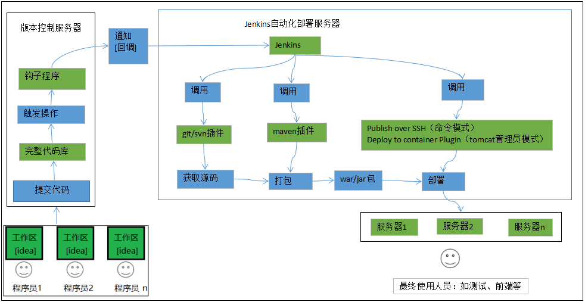

# Jenkins 部署

## 持续集成CI和持续部署CD

持续集成(CI)/持续交付(CD)管道是一系列步骤，其中包括从CI/CD流程开始的所有阶段，并负责创建自动化和无缝的软件交付。而使用CI/CD管道，软件发布工件可以从代码检入阶段到测试、构建、部署和生产阶段一直在管道中前进。这一概念之所以强大，是因为一旦指定了管道，就可以将其部分或全部实现自动化，从而加快了流程，并减少了错误。换句话说，CI/CD管道使组织每天更轻松地自动多次交付软件。

## Jenkins自动化部署实现原理



[https://baijiahao.baidu.com/s?id=1695709744830554078&amp;wfr=spider&amp;for=pc](https://baijiahao.baidu.com/s?id=1695709744830554078&wfr=spider&for=pc)

# Jenkins部署

在tomcat上部署Jenkins（通用）

* [[../../中间件/jdk/jdk]]]
* [[../../中间件/tomcat/tomcat 部署]]]
* 部署jenkins

  ```bash
  # 下载jenkins.war
  http://updates.jenkins-ci.org/download/war/
  # 放到~/tomcat/webapps/下
  # 启动tomcat
  ```

## 设置向导

浏览到`http://localhost:8080`（或您在安装 Jenkins 时为它配置的任何端口）并等待**解锁 Jenkins**页面出现。

后续步骤略过......

# Jenkins插件
