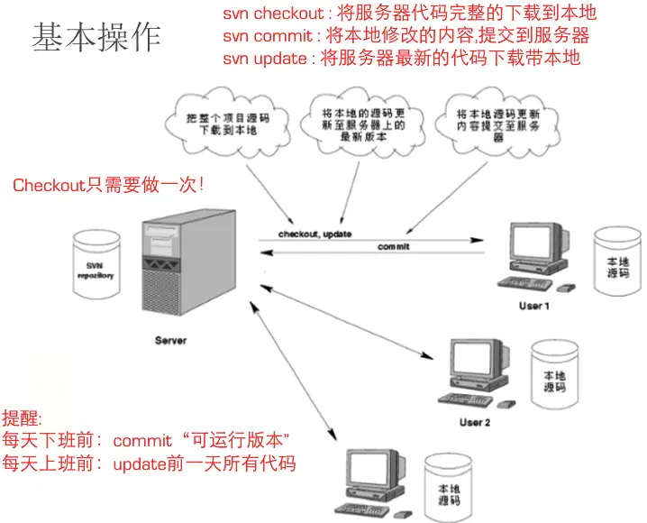
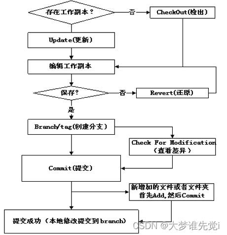

# svn

SVN全称Subversion，是一个开放源代码的版本控制系统，Subversion 在 2000 年由 CollabNet Inc 开发，现在发展成为 Apache 软件基金会的一个项目，同样是一个丰富的开发者和用户社区的一部分。

## 基本概念

- Repository（源代码库）：源代码统一存放的地方
- Checkout（提取）：当你手上没有源代码的时候，你需要从 repository checkout一份
- Commit（提交）：当你已经修改了代码，你就需要 Commit到repository
- Update（更新）：当你已经 Checkout了一份源代码， Update后就可以和 Repository上的源代码同步

## 工作流程



1. 从服务器下载项目组最新代码 （Checkout）
2. 如果已经 Checkout并且有人已 Commit了代码，你可以更新以获得最新代码 （Update）
3. 进入自己的分支，进行工作，每隔一个小时向服务器自己的分支提交一次代码（很多人都有这个习惯。因为有时候自己对代码改来改去，最后又想还原到前一个小时的版本，或者看看前一个小时自己修改了哪些代码，就需要这样做了）（Commit）
4. 下班时间快到了，把自己的分支合并到服务器主分支上，一天的工作完成，并反映给服务器 （Commit）

**注意**：如果两个程序员同时修改了同一个文件， SVN可以合并这两个程序员的改动，实际上SVN管理源代码是以行为单位的，就是说两个程序员只要不是修改了同一行程序，SVN都会自动合并两种修改。如果是同一行，SVN会提示文件Confict, 冲突，需要手动确认。



‍

## svn 服务端部署

### 部署svnserve访问SVN

#### 通过yum安装

```bash
yum install subversion
# svnserve --version 查看安装信息
svnserve --version 

# 创建目录和版本库
mkdir -p /home/svn
# 创建版本库
svnadmin create /home/svn/project
----------------------------------------------
root@devops project $ ll /home/svn/project/
总用量 8
drwxr-xr-x 2 root root  54 6月   7 15:50 conf    # SVN版本库的配置文件（版本库的访问账号、权限等）。
drwxr-sr-x 6 root root 233 6月   7 15:50 db      # 存放所有的版本控制数据文件。
-r--r--r-- 1 root root   2 6月   7 15:50 format  # 一个文本文件，文件中只包含一个整数，表示当前文件库配置的版本号。
drwxr-xr-x 2 root root 231 6月   7 15:50 hooks   # 放置hook脚本文件。
drwxr-xr-x 2 root root  41 6月   7 15:50 locks   # 用来追踪存取文件库的客户端。
-rw-r--r-- 1 root root 229 6月   7 15:50 README.txt
root@devops project $ 

root@devops project $ cd conf/
root@devops conf $ ll
总用量 12
-rw-r--r-- 1 root root 1080 6月   7 15:50 authz            # 配置用户、用户组读写权限
-rw-r--r-- 1 root root  309 6月   7 15:50 passwd           # 配置用户、用户组密码
-rw-r--r-- 1 root root 3090 6月   7 15:50 svnserve.conf    # 配置svn相关服务参数
root@devops conf $ 
```

#### SVN权限配置

配置svnserve.conf

```bash
### This file controls the configuration of the svnserve daemon, if you
### use it to allow access to this repository.  (If you only allow
### access through http: and/or file: URLs, then this file is
### irrelevant.)

### Visit http://subversion.apache.org/ for more information.

[general]
## 控制非鉴权用户访问版本库的权限。
## 取值范围为"write"、"read"和"none"。即"write"为可读可写，"read"为只读，"none"表示无访问权限。缺省值：read
anon-access = read
## 控制鉴权用户访问版本库的权限。
## 取值范围为"write"、"read"和"none"。即"write"为可读可写，"read"为只读，"none"表示无访问权限。缺省值：write
auth-access = write

## 指定用户名口令文件名。除非指定绝对路径，否则文件位置为相对conf目录的相对路径。缺省值：passwd
password-db = passwd

## 指定权限配置文件名，通过该文件可以实现以路径为基础的访问控制。除非指定绝对路径，否则文件位置为相对conf目录的相对路径。缺省值：authz
authz-db = authz

## 指定版本库的认证域，即在登录时提示的认证域名称。若两个版本库的认证域相同，建议使用相同的用户名口令数据文件。缺省值：一个UUID(Universal Unique IDentifier，全局唯一标示)。
realm = My First Repository
### The force-username-case option causes svnserve to case-normalize
### usernames before comparing them against the authorization rules in the
### authz-db file configured above.  Valid values are "upper" (to upper-
### case the usernames), "lower" (to lowercase the usernames), and
### "none" (to compare usernames as-is without case conversion, which
### is the default behavior).
# force-username-case = none

[sasl]
### This option specifies whether you want to use the Cyrus SASL
### library for authentication. Default is false.
### This section will be ignored if svnserve is not built with Cyrus
### SASL support; to check, run 'svnserve --version' and look for a line
### reading 'Cyrus SASL authentication is available.'
# use-sasl = true
### These options specify the desired strength of the security layer
### that you want SASL to provide. 0 means no encryption, 1 means
### integrity-checking only, values larger than 1 are correlated
### to the effective key length for encryption (e.g. 128 means 128-bit
### encryption). The values below are the defaults.
# min-encryption = 0
# max-encryption = 256
```

在passwd配置文件设置项目库人员的用户和密码

```bash
[root@SVN conf]# vi /svn/test/conf/passwd

[users]
#user=password
user1=123456
user2=123456
u1=123456
u2=123456
```

在authz配置文设置组和用户对应版本库的权限

```bash
[root@SVN conf]# vi /svn/test/conf/authz
-------------------------------------------
[groups]
tester = user1,user2  # 表示tester群组里的成员user1，user2
develop=u1,u2         # 表示develop群组里的成员u1，u2
[test:/]              # 这表示项目库权限设置
@tester= rw           # 表示test库tester群组用户具有读写权限
@develop = r          # 表示test库develop群组用户具有只读权限

```

#### 启动服务

```bash
svnserve -d -r /home/svn/project   # 启用svn的版本库
# -d                  # 守护进程，后台启动
# -r                  # svnserve 的根目录
# --listen-host       # svnserve 监听的HOST
# --listen-port=PORT  # 监听端口
# --pid-file FILENAME
# svnserve -d --listen-port 4690 -r /var/svn/project1 --log-file /var/svn/project1/logs/svn.log --pid-file /tmp/svn.pid
```

### 部署HTTP访问SVN

#### 配置 svnserve

首先按以上步骤安装 [部署svnserve访问SVN](#部署svnserve访问SVN)]

```bash
# 运行以下命令安装httpd。
yum install httpd -y
httpd -version

# 安装mod_dav_svn
yum install mod_dav_svn -y

# 运行以下命令修改SVN仓库的用户组为apache。
chown -R apache:apache /home/svn/project

# 运行以下命令增加SVN版本库的用户和密码。
# SVN默认使用明文密码，而HTTP并不支持明文密码，所以需要单独生成passwd文件。本示例中，增加用户`userTest`，密码设置为`passWDTest`。 请根据实际情况选择并运行以下命令：
#如果您第一次增加用户，运行命令时需要带上参数`-c`生成文件。
htpasswd -c /var/svn/svnrepos/conf/passwd userTest
#如果您已经增加过用户，当后续还需要增加用户时，请运行以下命令。
#htpasswd /var/svn/svnrepos/conf/passwd userTest
```

#### 配置 Apache

```bash
# 修改配置文件
vim /etc/httpd/conf.d/subversion.conf
-----------------------------------------

<Location /svn>
DAV svn
SVNParentPath /var/svn
AuthType Basic
AuthName "Authorization SVN"
AuthzSVNAccessFile /var/svn/svnrepos/conf/authz
AuthUserFile /var/svn/svnrepos/conf/passwd
Require valid-user
</Location>

------------------------------------------

systemctl start httpd.service


```

## svn 常用命令

SVN 的命令通常都很少用，在 windows 上，我们通常都是使用图形化的操作界面，例如 [TortoiseSVN](https://svnbucket.com/posts/svn-tutorial/)，提供了很好的图形化操作界面，上手简单方便。
但是有时候我们需要在服务器这类没有图形化操作界面的机器上使用 SVN，这时候我们就需要用到 SVN 的命令来操作了。
本篇给大家讲解一些 SVN 的常用命令，日常使用学会这些就足够了。

### 代码检出 checkout

```bash
## 这个命令会把 SVN 服务器上的代码下载到我们电脑上，checkout 也可以简写为 co
svn checkout svn://svnbucket.com/xxx/xxx
# 指定存储目录
svn checkout svn://svnbucket.com/xxx/xxx save-dir
# 指定用户名密码。
svn checkout svn://svnbucket.com/xxx/xxx --username xxxx --password xxx
```

### 提交代码 commit

```bash
# 此命令可以把我们本地的修改提交到 SVN 服务器，这样其他同事就能更新到我们的代码了。
# commit 可以简写为 ci，-m 参数后面跟的是本次提交的描述内容
# 描述是必须的，但是可以填写空字符串，不指定
svn commit -m "提交描述"
# 只提交指定文件或目录
svn commit /path/to/file-or-dir -m "提交指定文件"
# 指定后缀的所有文件
svn commit *.js -m "提交所有 js 文件"
```

### 更新代码 update

```bash
# 执行此命令后会把其他人提交的代码从 SVN 服务器更新到我们自己电脑上，update 也可以简写为 up
# 更新到最新
svn update
# 更新到指定版本的代码。特别是最新版本代码有问题时，我们可以用这个命令回到之前的版本
svn update -r xxx 
# 仅更新指定文件或者目录
svn up /path/to/file-or-dir
```

### 添加文件 add

```bash
# 新建的文件，我们需要用 add 命令把它们加入 SVN 的版本管理，然后我们才可以提交它。
# 注意：添加后还需要进行提交喔。
# 添加指定文件或目录
svn add /path/to/file-or-dir
# 添加当前目录下所有 php 文件
svn add *.php
```

### 删除文件 delete

```bash
# 此命令会从 SVN 移除版本控制，移除后你需要提交一下
svn delete /path/to/file-or-dir
# 删除版本控制，但是本地依旧保留文件
svn delete /path/to/file-or-dir --keep-local
```

### 查看日志 log

```bash
# 查看当前目录的日志
svn log
# 查看指定文件或目录的提交日志
svn log /path/to/file-or-dir
# 查看日志，并且输出变动的文件列表
svn log -v
# 限定只输出最新的 5 条日志
svn log -l 5
```

### 查看变动 diff

```bash
# 查看当前工作区的改动
svn diff
# 查看指定文件或目录的改动
svn diff /path/to/file-or-dir
# 本地文件跟指定版本号比较差异
svn diff /path/to/file-or-dir -r xxx
# 指定版本号比较差异
svn diff /path/to/file-or-dir -r 1:2 
```

### 撤销修改 revert

```bash
# 撤销文件的本地修改
svn revert test.php
# 递归撤销目录中的本地修改
svn revert -R /path/to/dir
```

### 添加忽略 ignore

```bash
# SVN 的忽略是通过设置目录的属性 prop 来实现的，添加后会有一个目录属性变动的修改需要提交，记得要提交一下喔，这样其他人也有了这个忽略配置。
# 忽略所有 log 文件。注意最后有个点号，表示在当前目录设置忽略属性。
svn propset svn:ignore "*.log" .
# 递归忽略 global-ignores
svn propset svn:global-ignores "*.log" .
# 从文件读取忽略规则，一行一个规则。
svn propset svn:ignore -F filename.txt .
# 打开编辑器修改忽略属性
svn propedit svn:ignore .
# 查看当前目录的属性配置
svn proplist . -v
# 删除当前目录的忽略设置
svn propdel svn:ignore .
# 忽略仅对还未添加到版本库的文件生效，已经在版本库里的文件，添加忽略后是不会自动删除的也不会忽略，需要手动 delete 命令删除下才行。
# TortoiseSVN 添加忽略会更加简单，也会自动执行删除命令。

```

### 查看状态 status

```bash
# 任何时候，你可以用下面的命令查看当前工作目录的 SVN 状态喔，会列出来哪些文件有变动。
svn status
svn status /path/to/file-or-dir
```

### 清理 cleanup

```bash
# 这个命令我们经常在 SVN 出现报错时可以执行一下，这样就会清理掉本地的一些缓存
svn cleanup
```

### 查看信息 info

```bash
svn info
```

### 查看文件列表 ls

```bash
svn ls 
# 指定版本号
svn ls -r 100
```

### 查看文件内容

```bash
# 查看指定版本的文件内容，不加版本号就是查看最新版本的
svn cat test.py -r 2
```

### 查看 blame

```bash
# 显示文件的每一行最后是谁修改的（出了BUG，经常用来查这段代码是谁改的）
svn blame filename.php
```

### 地址重定向

```bash
# 如果你的 SVN 地址变了，不需要重新 checkout 代码，只需要这样重定向一下就可以了。
svn switch --relocate 原 SVN 地址 新 SVN 地址
```

### 分支操作

```bash
# 创建分支，从主干 trunk 创建一个分支保存到 branches/online1.0
svn cp -m "描述内容" http://svnbucket.com/repos/trunk http://svnbucket.com/repos/branches/online1.0
# 合并主干上的最新代码到分支上
cd branches/online1.0
svn merge http://svnbucket.com/repos/trunk 
# 分支合并到主干
svn merge --reintegrate http://svnbucket.com/repos/branches/online1.0
# 切换分支
svn switch svn://svnbucket.com/test/branches/online1.0
# 删除分支
svn rm http://svnbucket.com/repos/branches/online1.0
```

### 帮助命令

```bash
# 查看SVN帮助
svn help
# 查看指定命令的帮助信息
svn help commit
```

‍
