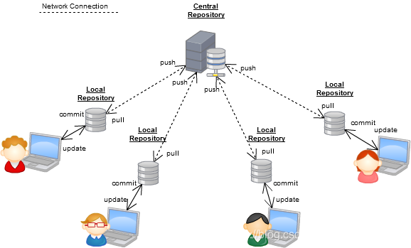

# git

版本控制系统（Version Control System，VCS）是指对软件开发过程中各种程序代码、配置文件及说明文档等文件变更的管理，是软件配置管理的核心思想之一，最主要的功能就是追踪文件的变更。

**Git**是一款免费、开源的分布式版本控制系统，用于敏捷高效地处理任何或小或大的项目。

‍

***本地版本控制系统***

第一代版本控制系统被称为**本地版本控制系统**。通过加锁将并发执行转换成顺序执行。 一次只能有一个人处理某个文件。具体流程如下：

1. 首先应该把文件放在一个服务器上，方便使用者上传或下载文件
2. 任何人想对某文件修改时，需要先把这个文件加锁，通过 `checkout`​ 指令，使得其他人无法修改
3. 当修改完成之后，需要释放锁，通过 `checkin`​ 指令，形成一个新的版本，存放到服务器端。

第一代版本控制系统主要有 RCS、SCCS

> **悲观锁**<br />每次获取数据的时候，都会担心数据被修改，所以每次获取数据的时候都会进行加锁，确保在自己使用的过程中数据不会被别人修改，使用完成后进行数据解锁。由于数据进行加锁，期间对该数据进行读写的其他线程都会进行等待。

‍

***集中式版本控制系统***

第二代版本控制系统被称为**集中式版本控制系统（Centralized Version Control Systems，CVCS）**，其对同步修改更加宽容，但有一个明显的限制，用户必须在允许提交之前将当前修订合并到他们的工作中。

​​

由上图可看到，在集中式版本控制系统中，如果服务器嗝屁了，那么所有的开发者就只能干瞪眼了！因为，SVN 对于项目的管理是依赖于服务器中的中心仓库的！我们的更改必须要提交到服务器中的中心仓库。

第二代版本控制系统主要有 CVS、SourceSafe、Subversion、Team Foundation Server、SVK。

> **乐观锁**<br />每次获取数据的时候，都不会担心数据被修改，所以每次获取数据的时候都不会进行加锁，但是在更新数据的时候需要判断该数据是否被别人修改过。如果数据被其他线程修改，则不进行数据更新，如果数据没有被其他线程修改，则进行数据更新。由于数据没有进行加锁，期间该数据可以被其他线程进行读写操作。<br />乐观锁一般会使用版本号机制或 CAS 算法实现。

‍

**分布式式版本控制系统**

第三代版本控制系统被称为**分布式式版本控制系统（Distributed Version Control Systems，DVCS）**，其允许合并和提交分开。在每个使用者电脑上就有一个完整的数据仓库，没有网络依然可以使用

​​

由上图可看到，分布式式版本控制系统也可以有个服务器端的仓库，用来同步各开发者的私有仓库！在分布式版本控制系统中，每个参与者的本地也会有一个完整的仓库。即使服务器端崩溃，我们仍然可以使用 Git（仅在本地仓库管理我们的代码），在网络具备时，再和服务器进行同步即可！

第三代版本控制系统主要有 Bazaar、Git、Mercurial、BitKeeper，、Monotone。目前，第三代版本控制系统已经大有一同江湖的趋势。

‍

## Git与SVN对比

​`SVN`​是集中式管理的版本控制器，而`Git`​是分布式管理的版本控制器，这是两者之间最核心的区别。  
​`SVN`​只有一个单一的集中管理的服务器，保存所有文件的修订版本，而协同工作的人们都通过客户端连到这台服务器，取出最新的文件或者提交更新。  
​`Git`​每一个终端都是一个仓库，客户端并不只提取最新版本的文件快照，而是把原始的代码仓库完整地镜像下来，每一次的提取操作，实际上都是一次对代码仓库的完整备份。  
相对来说分布式管理系统功能更强大一些，但同样的上手难度也就高一些，当然分布式代码版本管理系统并不一定适合所有团队，比如中小团队可能更关心的只是成本更低，简单易用，那么`SVN`​等这类集中式版本管理工具还是更为适合，但是不管团队最终选用什么代码版本管理工具，只要适合自己的团队的开发流程和工作方式，并且代码管理顺畅就可以了。

### 详细对比

|差异|SVN|Git|
| ----------| ------------------------------------------------------------------------------------------------------------------------------------------------------------------------------------------------------------| --------------------------------------------------------------------------------------------------------------------------------------------------------------------------------------------------------------------------|
|系统特点|1. 集中式版本控制系统，文档管理很方便。<br />2. 企业内部并行集中开发 <br />3. `windows`​系统上开发推荐使用 <br />4. 克隆慢<br />|1. 分布式系统，代码管理很方便。  <br />2. 开源项目开发。  <br />3. `Mac`​、`Linux`​系统上开发推荐使用。  <br />4. 克隆快<br />|
|灵活性|1. 搭载`SVN`​的服务器如果出现故障，就无法与之交互。<br />2. 所有的`SVN`​操作都需要中央仓库交互，例如拉分支，看日志等。<br /><br />|1. 可以单机操作，`Git`​服务器故障也可以在本地`Git`​仓库工作。<br />2. 除了push和pull或fetch操作，其他都可以在本地操作。<br />3. 根据自己开发任务任意在本地创建分支。<br />4. 日志都是在本地查看，效率较高。|
|安全性|较差，定期备份，并且是整个`SVN`​都得备份。|较高，每个开发者的本地就是一套完整版本库，记录着版本库的所有信息。|
|分支方面|1. 拉分支更像是`copy`​一个路径。<br />2. 可针对任何子目录进行`branch`​。<br />3. 拉分支的时间较慢，因为拉分支相当于`copy`​。<br />4. 创建完分支后，影响全部成员，每个人都会拥有这个分支。<br />5. 多分支并行开发较重，工作较多而且繁琐。|1. 我可以在`Git`​的任意一个提交点`commit point`​开启分支。<br />2. 拉分支时间较快，因为拉分支只是创建文件的指针和`HEAD`​。<br />3. 自己本地创建的分支不会影响其他人。<br />4. 比较适合多分支并行开发。<br />5. `Git checkout hash`​切回之前的版本，无需版本回退。<br />6. 强大的`cherry-pick`​。|
|工作流程|1. 每次更改文件之前都得`update`​操作，有的时候修改过程中这个文件有更新，`commit`​不会成功。<br />2. 有冲突，会打断提交动作，冲突解决是一个提交速度的竞赛：手快者，先提交，平安无事；手慢者，后提交，可能遇到麻烦的冲突解决。|1. 开始工作前进行`fetch`​操作，完成开发工作后`push`​操作，有冲突解决冲突。<br />2. `Git`​的提交过程不会被打断，有冲突会标记冲突文件。<br />3. `Gitflow`​经典流程。<br />|
|内容管理|​`SVN`​对中文支持好，操作简单。|对程序的源代码管理方便，代码库占用的空间少，易于分支化管理。|
|学习成本|使用起来更方便，`SVN`​对中文支持好，操作简单。|更在乎效率而不是易用性，成本较高，有很多独有的命令如`rebase`​、远程仓库交互的命令等等。|
|权限管理|​`SVN`​的权限管理相当严格，可以按组、个人针对某个子目录的权限控制，每个目录下都会有个`.SVN`​的隐藏文件。|​`Git`​没有严格的权限管理控制，只有账号角色划分。|
|管理平台|有功能非常完善的插件。|除功能插件外，还有`Gitlab`​、`Gerrit`​、`Github`​等。|

‍

## git ​**分布式式版本控制系统的流程**

‍

​                     ​

- workspace： 工作区
   直接写好的代码，以文件形式存在硬盘上的，其实就是保存在workspace工作区
- index/stage : 暂存区，`git add`之后会存入
  即是 .git 目录下的index 文件。暂存区会记录git add 添加文件的相关信息（文件名，大小，timestamp…）
  不保存文件实体，通过id指向每个文件实体。可以使用git status 查看暂存区的状态。暂存区标记了你当前工作区中，哪些内容是被git 管理的
- Repository ： 本地仓库，`git commit`之后会存入
  版本控制系统的仓库，存在于本地。当执行git commit命令后，会将暂存区内容提交到仓库之中。
- Remote ： 远程仓库，`git push` 之后会存入
   与本地仓库概念基本一致，不同之处在于一个存在远程，可用于远程协作，一个却是存在于本地。通过push/pull可实现本地与远程的交互；

---

git 远程仓库

> 远程仓库不一定非得是 `github`​ 那种专门的"中央服务器",甚至局域网的另外一台电脑也可以充当"中央服务器"的角色,因为它存在的最初目的只是方便大家**交换彼此的提交记录**而已!  
> 所以本地仓库和远程仓库的基本行为应该是一致的,约定俗成的规定是远程仓库一般不直接参与日常开发工作,主要作为项目托管中心.

‍

## git 服务端部署

或者参考gitlab部署

```bash
yum install git-core
#为 Git 创建一个用户
 useradd -d /home/git git
echo "Ninestar123" | passwd --stdin git

# 为了容易的访问服务器，我们设置一个免密 ssh 登录。首先在你本地电脑上创建一个 ssh 密钥：
ssh-keygen -t rsa -b 1024
# 现在您必须将这些密钥复制到服务器上，以便两台机器可以相互通信。在本地机器上运行以下命令：
cat ~/.ssh/id_rsa.pub | ssh git@remote-server "mkdir -p ~/.ssh && cat >> ~/.ssh/authorized_keys"
# 现在，用 ssh 登录进服务器并为 Git 创建一个项目路径。你可以为你的仓库设置一个你想要的目录。
mkdir   /home/git/project-1.git
# 初始化
cd  /home/git/project-1.git
git init --bare

==============================================
# 现在我们需要在本地机器上新建一个基于 Git 版本控制仓库：
mkdir -p /data/git/project.local
cd /data/git/project.local
# 现在在该目录中创建项目所需的文件。留在这个目录并启动 git：
git init
# 把所有文件添加到本地仓库中：
git add .
# 现在，每次添加文件或进行更改时，都必须运行上面的 add 命令。 您还需要为每个文件更改都写入提交消息。提交消息基本上说明了我们所做的更改。
git commit -m "message"  -a
#在这种情况下，我有一个名为 GoT（《权力的游戏》的点评）的文件，并且我做了一些更改，所以当我运行命令时，它指定对文件进行更改。 在上面的命令中 -a 选项意味着提交仓库中的所有文件。 如果您只更改了一个，则可以指定该文件的名称而不是使用 -a。
git commit -m "message"  GoT.txt
# 到现在为止，我们一直在本地服务器上工作。添加远程仓库，以便其他人通过互联网进行协作。
git remote add origin ssh://git@remote-server/home/git/project-1.git
# 现在，您可以使用 pull 或 push 选项在服务器和本地计算机之间推送或拉取：
git push origin master

======================================================
# 如果有其他团队成员想要使用该项目，则需要将远程服务器上的仓库克隆到其本地计算机上：
git clone git@remote-server:/home/git/project.git
# 现在他们可以编辑文件，写入提交更改信息，然后将它们推送到服务器：
git commit -m 'corrections in GoT.txt story' -a
# 然后推送改变：
git push origin master

```

‍

## git 常用命令

### 0. 配置

Git的设置文件为`.gitconfig`​，它可以在用户主目录下（全局配置），也可以在项目目录下（项目配置）。

```bash
# 显示当前的Git配置
git config --list

# 编辑Git配置文件
git config -e [--global]
# 设置提交代码时的用户信息
git config [--global] user.name "[name]"
git config [--global] user.email "[email address]"

```

‍

### 1. 获取与创建项目

> **简而言之**，用 `git init`​ 来在目录中创建新的 Git 仓库。使用 `git clone`​ 拷贝一个 Git 仓库到本地，让自己能够查看该项目，或者进行修改。

```bash
# 新建一个目录，将其初始化为Git代码库; 你可以在任何时候、任何目录中这么做，完全是本地化的。
git init [project-name] 
# 复制一个 Git 仓库;复制该项目的全部记录，让你本地拥有这些。并且该操作将拷贝该项目的主分支， 使你能够查看代码，或编辑、修改。
git clone git://github.com/schacon/simplegit.git
```

‍

### 2. 基本的快照

> **简而言之**，使用 `git add`​ 添加需要追踪的新文件和待提交的更改，然后使用 `git status`​ 和 `git diff`​ 查看有何改动，最后用 `git commit`​ 将你的快照记录。这就是你要用的基本流程，绝大部分时候都是这样的。执行 `git rm`​ 来删除 Git 追踪的文件。它还会删除你的工作目录中的相应文件。

```bash
git add .                # 添加文件到缓存,无论是修改过的还是新建的都需要添加到缓存

git status              # 查看你的文件在工作目录与缓存的状态
git status  -s         # 简短的输出

git diff                   # 显示暂存区和工作区的差异
git diff --stat         # 显示摘要而非整个 diff
git diff --cached   # 查看已缓存的改动


git commit  -m "xxx" -a   # 提交工作区自上次commit之后的变化，直接到仓库区 ;-v 提交时显示所有diff信息

git reset HEAD      # 取消缓存已缓存的内容
git rm                     # 将文件从缓存区移除
```

‍

### 3. 分支与合并

> **简而言之**，你可以执行 `git branch (branchname)`​ 来创建分支，使用 `git checkout (branchname)`​ 命令切换到该分支，在该分支的上下文环境中，提交快照等，之后可以很容易地来回切换。当你切换分支的时候，Git 会用该分支的最后提交的快照替换你的工作目录的内容，所以多个分支不需要多个目录。使用 `git merge`​ 来合并分支。你可以多次合并到统一分支，也可以选择在合并之后直接删除被并入的分支。使用 `git log`​ 列出促成当前分支目前的快照的提交历史记录。这使你能够看到项目是如何到达现在的状况的。

```bash
git branch                                      # 列出分支；-r 列出所有远程分支 -a 列出所有本地分支和远程分支
git branch (branchname)            # 新建本地分支
git branch -d (branchname)       # 删除分支
git branch -dr [remote/branch] # 删除远程分支
git checkout -b (branchname)   # 创建新分支，并立即切换到它
git merge                                       # 将分支合并到你的当前分支
git log    # 显示一个分支中提交的更改记录，--oneline 选项来查看历史记录的紧凑简洁的版本。 --graph 选项，查看历史中什么时候出现了分支、合并
git tag [tag] [commit]   # 给历史记录中的某个重要的一点打上标签,新建一个tag在指定commit

```

‍

### 4. 分享与更新项目

> **简而言之** 使用 `git fetch`​ 更新你的项目，使用 `git push`​ 分享你的改动。你可以用 `git remote`​ 管理你的远程仓库。

```bash
git remote            # 列出远端别名， -v 参数，你还可以看到每个别名的实际链接地址
git remote add [alias] [url]  # 为你的项目添加一个新的远端仓库
git remote rm      # 删除现存的某个别名

git fetch [alias]       # 从远端仓库下载新分支与数据 【从远程获取最新版本到本地，但不会自动merge】
git pull [alias]  [branch]     # 从远端仓库提取数据并尝试合并到当前分支【会获取所有远程索引并合并到本地分支中来】

git push [alias] [branch]    # 推送你的新分支与数据到某个远端仓库

```

‍

### 4. 检查与比较

> **简而言之** 执行 `git log`​ 找到你的项目历史中的特定提交 ——       按作者、日期、内容或者历史记录。执行 `git diff`​ 比较历史记录中的两个不同的点 ——       通常是为了看看两个分支有啥区别，或者从某个版本到另一个版本，你的软件都有啥变化。

```bash
# 显示有变更的文件
git status
# 显示当前分支的版本历史
 git log
# 显示commit历史，以及每次commit发生变更的文件
git log --stat
# 搜索提交历史，根据关键词
git log -S [keyword]
# 显示某个commit之后的所有变动，每个commit占据一行
git log [tag] HEAD --pretty=format:%s
# 显示某个commit之后的所有变动，其"提交说明"必须符合搜索条件
 git log [tag] HEAD --grep feature
# 显示某个文件的版本历史，包括文件改名
git log --follow [file]
git whatchanged [file]
# 显示指定文件相关的每一次
diffgit log -p [file]
# 显示过去5次提交
git log -5 --pretty --oneline
# 显示所有提交过的用户，按提交次数排序
git shortlog -sn
# 显示指定文件是什么人在什么时间修改过
git blame [file]
# 显示暂存区和工作区的差异
git diff
# 显示暂存区和上一个commit的差异
git diff --cached [file]
# 显示工作区与当前分支最新commit之间的差异
git diff HEAD
# 显示两次提交之间的差异
git diff [first-branch]...[second-branch]
# 显示今天你写了多少行代码
git diff --shortstat "@{0 day ago}"
# 显示某次提交的元数据和内容变化
git show [commit]
# 显示某次提交发生变化的文件
git show --name-only [commit]
# 显示某次提交时，某个文件的内容
git show [commit]:[filename]
# 显示当前分支的最近几次提交
git reflog
```
