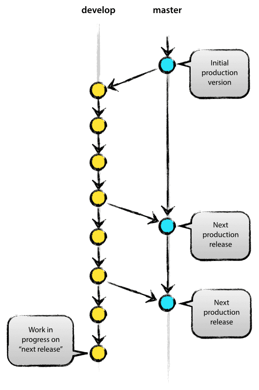

# git 分支模型

‍

Git分支模型(master/bugfix/hotfix/develop/feature/release)

1. master
2. master/develop
3. master/develop/feature
4. master/develop/feature/release
5. master/develop/feature/release/(bugfix/hotfix)

## 1.主要分支

​<br />在核心，开发模型受到现有模型的极大启发。中央仓库拥有两个主要分支，具有无限的生命周期：

* master
* develop

该master分支在origin应该存在于每一个用户的Git。另一个与master并行的分支是develop。

我们认为origin/master是主要分支，这个分支HEAD源码始终反映生产就绪状态 ，简单来说就是master分支上的代码与生产使用的代码始终保持一致。这样有个好处就是，当生产代码出现紧急bug的时候，可以快速从master上fork出一个hotfix分支用来修复bug并发布，而不会因为修复线上bug，影响正在开发过程中的下一个版本的代码

我们认为origin/develop是主要开发分支，其HEAD源码始终反映了下一版本中最新交付的开发更改的状态。有些人称之为“整合分支”。这是可以用来建立夜间自动构建的分支。如果我们对此非常严格的执行，从理论上讲，我们可以使用Git钩子脚本在每次提交时自动构建和推出我们的项目到我们的测试服务器。

当develop分支中的源代码到达稳定点并准备好发布时，所有更改都应以某种方式合并到master ，然后使用版本号进行标记。

因此，每次将更改合并回master时，根据我们的定义，这就是一个新的生产版本。

## 2.支持分支

除了两个主分支master和develop，我们的开发模型使用各种支持分支来帮助团队成员之间的并行开发，轻松跟踪功能，准备生产版本以及帮助快速修复实时生产问题。与主分支不同，这些分支的寿命有限，因为它们最终会被删除。

我们使用的不同类型的分支分别是：

* 功能分支 命名方式：feature-*
* 发布分支 命名方式：release-*
* 修补bug分支 命名方式：hotfix-*

这些分支中每一个都有特定的目的，并且有着严格的规则：从哪些分支中fork出来，又合并到那些分支中。

分支类型根据我们如何使用它们进行分类。

### 2.1.功能分支

​​

1. 分支出自：develop
2. 必须合并回：develop

分支命名约定：最好是 feature-[功能名]，当然如果是想自己定义其他名字只要不是master, develop, release-_, or hotfix-_ 就都可以

功能分支主要用于为下一个版本开发新功能。在开始开发功能时，此功能的发布版本可能在此处未知。功能分支的本质是，只要功能处于开发阶段，它就会存在，但最终会合并回develop（以便将新功能添加到即将发布的版本中）或丢弃（在产品经理放弃这个功能的时候）。

功能分支通常仅存在于开发人员本地存储库中，而不存在于origin。

step 1.创建功能分支<br />在开始处理新功能时，从develop分支分支。

```
$ git checkout -b myfeature develop
Switched to a new branch "myfeature"
```

step 2.在开发中加入完成的功能<br />完成的功能分支会合并到develop分支中，以确保将它们添加到即将发布的版本中：

```
$ git checkout develop
Switched to branch 'develop'
$ git merge --no-ff myfeature
Updating ea1b82a..05e9557
(Summary of changes)
$ git branch -d myfeature
Deleted branch myfeature (was 05e9557).
$ git push origin develop
```

该–no-ff参数使合并始终创建新的commit，最新版中git merge 默认的就是–no-ff。这样可以避免丢失功能分支的历史信息，并将所有添加功能的 commit 组合到一个commit中。对比：<br /><br />在后一种情况下，不可能从Git历史中看到哪些 commit 实现了一个功能 - 您必须手动读取所有日志消息。恢复整个功能（即一组提交）在后一种情况下也是比较头痛的，而如果使用该–no-ff标志则很容易完成 。<br />虽然它会创建一些（空的）commit，但增益远远大于成本。

### 2.2.发布分支

1. 分支出自：develop
2. 必须合并回：develop 和 master

分支命名约定：release-[版本号]

发布分支主要用来发布新的版本到生产。它可以用来修复最后一分钟的bug，当在发布的过程中发现了新的bug，可以直接在release分支中修改。develop 分支将接收下一个大版本的功能。

需要注意的是在develop上创建一个新的发布分支的时候，develop分支的代码应该是测试完毕后准备发布的代码，至少下一个版本所有的功能都已经合并到develop分支 。

当新建了发布分支分配新的版本号，从这个时候开始develop分支反映的将应该是下一个版本的代码。比如新建了release-1.6 后 1.6版本的代码将不再允许提交到develop分支中。

创建发布分支<br />发布分支是从develop分支创建的。例如，假设版本1.1.5是当前的生产版本，我们即将推出一个大版本。状态develop为“下一个版本”做好了准备，我们已经决定这将版本1.2（而不是1.1.6或2.0）。因此，我们分支并为发布分支提供反映新版本号的名称：

```
$ git checkout -b release-1.2 develop
Switched to a new branch "release-1.2"
$ ./bump-version.sh 1.2
Files modified successfully, version bumped to 1.2.
$ git commit -a -m "Bumped version number to 1.2"
[release-1.2 74d9424] Bumped version number to 1.2
1 files changed, 1 insertions(+), 1 deletions(-)
```

创建新分支并切换到它后，我们会更新版本号。这 bump-version.sh是一个虚构的shell脚本，它可以更改工作副本中的某些文件以反映新版本。（这当然可以是手动更改 - 关键是某些文件会发生变化。）然后提交了最新的版本号。

这个新分支可能存在一段时间，直到新版发布。在此期间，可以在此分支中修复bug（而不是在develop分支上）。严禁在此处添加大型新功能，新功能必须合并到develop等待下一个大版本。

### 2.3.完成发布分支

当release分支准备好真正发布的时候，需要执行一些操作。首先，release分支合并到 master（因为每次提交master都是按照定义的新版本）。接下来，master必须标记 (tag) 该提交，以便将来参考此历史版本。最后，需要将发布分支上的更改合并回来develop，以便将来的版本也包含这些错误修复。

Git中的前两个步骤：

```
$ git checkout master
Switched to branch 'master'
$ git merge --no-ff release-1.2
Merge made by recursive.
(Summary of changes)
$ git tag -a 1.2
```

该版本现已完成，并标记以供将来参考。

> 您可以使用-s或-u <key>标记以加密方式对您的标记进行签名。

为了保持release分支中所做的更改，我们需要将这些更改合并到develop。在Git中：

```
$ git checkout develop
Switched to branch 'develop'
$ git merge --no-ff release-1.2
Merge made by recursive.
(Summary of changes)
```

这一步很可能导致合并冲突（可能是因为我们已经更改了版本号）。如果是出现这种情况，请修复并提交。<br />现在我们已经完成了，这个时候我们可以删除发布分支，因为我们不再需要它了：

```
$ git branch -d release-1.2
Deleted branch release-1.2 (was ff452fe).
```

## 3.修补程序分支

​​

1. 分支出自：master
2. 必须合并回：develop 和 master
3. 分支命名约定：hotfix-*

hotfix 分支主要用来修复生产的紧急bug，比如当开发人员正在 feature、develop 分支 开发下一个版本的功能，而生产出现了紧急bug 必须立刻修复并发布。而你又不想把当前未完成的版本发布到生产，这个时候我们可以在 master 分支上 fork 一个新的 hotfix 分支用来修复bug，这样的话就不会影响到下一个版本的开发。

创建修补 Bug 分支<br />从master分支创建修复 bug 分支。例如，假设版本1.2是当前生产版本正在运行并且由于严重错误而影响生产正常使用。但是develop分支代码仍然不稳定。然后我们可以 fork hotfix分支并开始修复问题：

```
$ git checkout -b hotfix-1.2.1 master
Switched to a new branch "hotfix-1.2.1"
$ ./bump-version.sh 1.2.1
Files modified successfully, version bumped to 1.2.1.
$ git commit -a -m "Bumped version number to 1.2.1"
[hotfix-1.2.1 41e61bb] Bumped version number to 1.2.1
1 files changed, 1 insertions(+), 1 deletions(-)
```

新建分支后不要忘记标记小版本号！<br />然后，修复 bug 并提交一个或多个单独 commit。

```
$ git commit -m "Fixed severe production problem"
[hotfix-1.2.1 abbe5d6] Fixed severe production problem
5 files changed, 32 insertions(+), 17 deletions(-)
```

## 4.完成修补 Bug 分支

完成后，需要将hotfix分支合并回master，同时也需要合并回develop，以保证修复bug的代码也包含在下一个版本中。这与发布分支的完成方式相似。

首先，更新master并标记版本。

```
$ git checkout master
Switched to branch 'master'
$ git merge --no-ff hotfix-1.2.1
Merge made by recursive.
(Summary of changes)
$ git tag -a 1.2.1
```

接下来，合并hotfix 到 develop：

```
$ git checkout develop
Switched to branch 'develop'
$ git merge --no-ff hotfix-1.2.1
Merge made by recursive.
(Summary of changes)
```

此处有一个例外就是， 在当前release分支存在时，只需要将hotfix分支合并到该release分支中即可，而不是develop。将hotfix分支合并到release分支中，修复的代码最终也会在release分支完成时被合并到develop。（当然如果develop立刻需要此修复bug代码，不能等到release分支完成，您也可以直接地将hotfix合并到develop。）

最后，删除这个临时分支：

```
$ git branch -d hotfix-1.2.1
Deleted branch hotfix-1.2.1 (was abbe5d6).
```
