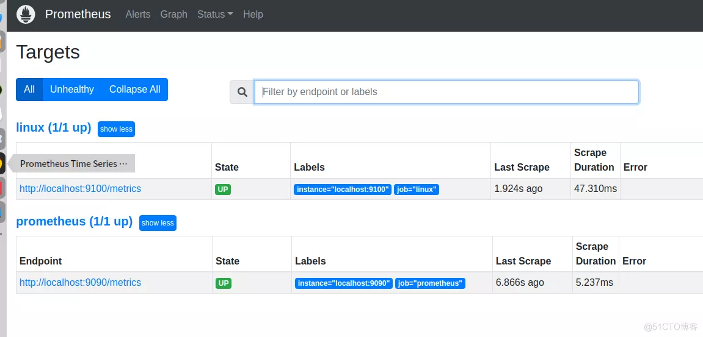

# 1.4 prometheus配置

‍

## prometheus启动参数

```bash
–version	                   显示应用程序版本。
–config.file="prometheus.yml"	   指定Prometheus配置文件路径。
–web.listen-address="0.0.0.0:9090" 地址监听UI、API和遥测。
–web.read-timeout=5m	           在超时读取请求和关闭空闲连接之前的最大持续时间。
–web.max-connections=512	   同时连接的最大数目。
–web.external-url=	           外部可访问的Prometheus的URL(例如，如果Prometheus通过反向代理提供服务)。用于生成返回的相对和绝对链接普罗米修斯本身。如果URL有路径部分，它将被用于为普罗米修斯服务的所有HTTP端点添加前缀。如果省略，相关的URL组件将被派生自动。
–web.route-prefix=	前缀用于web端点的内部路由。默认路径为——web.external-url。
–web.user-assets=	静态资产目录的路径，在/user处可用。
–web.enable-lifecycle	启用关闭和重新加载通过HTTP请求。
–web.enable-admin-api	为管理控制操作启用API端点。
–web.console.templates="consoles"  控制台模板目录的路径，在/控制台可用。
–web.console.libraries="console_librariess" 控制台库目录的路径。
–web.page-title="Prometheus时间序列采集和处理服务器" Prometheus实例的文件标题。
–web.cors.origin=".*"	正则表达式为CORS原点。它已完全锚定。例子:“https ?: / / (domain1 | domain2) \。com”
–storage.tsdb.path="data/"	指标存储的基本路径。
–storage.tsdb.retention=STORAGE.TSDB.RETENTION	样品保存的时间。此标志已被弃用，请使用“storage.tsdb.retention”。时间”。——storage.tsdb.retention。时间= STORAGE.TSDB.RETENTION。保存样品的时间。当设置此标志时，它将覆盖“storage.tsdb.retention”。如果既没有这个标志，也没有“storage.tsdb”。保留”也不“storage.tsdb.retention。设置大小，保留时间默 认为15d。支持单位:y, w, d, h, m, s, ms。
–storage.tsdb.retention.size=	STORAGE.TSDB.RETENTION。大小[实验]块可以存储的最大字节数。需要一个单位，支持单位:B, KB, MB, GB, TB, PB, EB。例:“512 mb”。这个标志是实验性的，可以在以后的版本中更改。——storage.tsdb。不要在数据目录中创建lockfile。
–storage.tsdb.allow-overlapping-blocks	允许重叠块，从而支持垂直压缩和垂直查询合并。
–storage.tsdb.wal-compression	压缩tsdb WAL。
–storage.remote.flush-deadline=	关闭或重新加载配置时需要等待多长时间刷新样例。
–storage.remote.read-sample-limit=5e7	在单个查询中通过远程读接口返回的最大样本总数。0意味着没有限制。对于流响应类型，此限制将被忽略。
–storage.remote.read-concurrent-limit=10	并发远程读调用的最大数量。0意味着没有限制。
–storage.remote.read-max-bytes-in-frame=1048576	在编组前流化远程读取响应类型的单个帧中的最大字节数。请注意，客户端可能也有帧大小的限制。默认情况下为1MB。
–rules.alert.for-outage-tolerance=1h	忍受普罗米修斯故障恢复“for”警报状态的最大时间。
–rules.alert.for-grace-period=10m	警报和恢复“for”状态之间的最小持续时间。仅对配置的“for”时间大于宽限期的警报进行维护。
–rules.alert.resend-delay=1m	在向Alertmanager重新发送警报之前等待的最短时间。
–alertmanager.notification-queue-capacity=10000	等待Alertmanager通知的队列容量。
–alertmanager.timeout=10s	向Alertmanager发送警报超时。
–query.lookback-delta=5m	表达式计算和联合期间检索指标的最大回退持续时间。
–query.timeout=2m	在中止查询之前可能花费的最大时间。
–query.max-concurrency=20	并发执行的最大查询数。
–query.max-samples=50000000	单个查询可以加载到内存中的最大样本数。注意，如果查询尝试将比这个更多的样本加载到内存中，那么查询将会失败，因此这也限制了查询可以返回的样本数量。
–log.level=info	只记录具有给定严重性或以上的消息。其中一个:[调试，信息，警告，错误]
–log.format=logfmt	日志消息的输出格式。其中一个:[logfmt, json]
```

## 配置文件详情

prometheus.yml配置了很多属性，主要分为默认，全局配置、告警配置、规则配置、数据拉取配置、远程可读存储、远程可写存储、服务发现

```yaml
global:
  #默认情况下抓取目标的频率.
  [ scrape_interval: duration | default = 1m ]

  # 抓取超时时间.
  [ scrape_timeout: duration | default = 10s ]

  # 评估规则的频率.
  [ evaluation_interval: duration | default = 1m ]

  # 与外部系统通信时添加到任何时间序列或警报的标签
  #（联合，远程存储，Alertma# nager）.
  external_labels:
    [ labelname: labelvalue ... ]

# 规则文件指定了一个globs列表. 
# 从所有匹配的文件中读取规则和警报.
rule_files:
  [ - filepath_glob ... ]

# 抓取配置列表.
scrape_configs:
  [ - scrape_config ... ]

# 警报指定与Alertmanager相关的设置.
alerting:
  alert_relabel_configs:
    [ - relabel_config ... ]
  alertmanagers:
    [ - alertmanager_config ... ]

# 与远程写入功能相关的设置.
remote_write:
  [ - remote_write ... ]

# 与远程读取功能相关的设置.
remote_read:
  [ - remote_read ... ]
```

> scrape_config配置  
> scrape_config 部分指定一组描述如果抓取他们的目标和参数，在一般情况情况下，一个scrape配置指定单个作业，在高级配置中，这个可能会改变。  
> 目标可以通过static_config参数**静态配置**，也可以使用其中一种支持的服务发现机制**动态发现**。  
> 其中job_name在所有的scrape配置中必须是唯一的。

## 默认配置相关参数

```yaml
# 默认分配给已抓取指标的job名称。
job_name: job_name

# 从job中抓取目标的频率.
[ scrape_interval: duration | default = global_config.scrape_interval ]

# 抓取此job时，每次抓取超时时间.
[ scrape_timeout: duration | default = global_config.scrape_timeout ]

# 从目标获取指标的HTTP资源路径.
[ metrics_path: path | default = /metrics ]

# honor_labels控制Prometheus如何处理已经存在于已抓取数据中的标签与Prometheus将附加服务器端的标签之间的冲突（"job"和"instance"标签，手动配置的目标标签以及服务发现实现生成的标签）。
# 
# 如果honor_labels设置为"true"，则通过保留已抓取数据的标签值并忽略冲突的服务器端标签来解决标签冲突。
#
# 如果honor_labels设置为"false"，则通过将已抓取数据中的冲突标签重命名为"exported_ original-label"（例如"exported_instance"，"exported_job"）然后附加服务器端标签来解决标签冲突。 这对于联合等用例很有用，其中应保留目标中指定的所有标签。
# 
# 请注意，任何全局配置的"external_labels"都不受此设置的影响。 在与外部系统通信时，它们始终仅在时间序列尚未具有给定标签时应用，否则将被忽略。
# 
[ honor_labels: boolean | default = false ]

# 配置用于请求的协议方案.
[ scheme: scheme | default = http ]

# 可选的HTTP URL参数.
params:
  [ string: [string, ...] ]

# 使用配置的用户名和密码在每个scrape请求上设置`Authorization`标头。 password和password_file是互斥的。
basic_auth:
  [ username: string ]
  [ password: secret ]
  [ password_file: string ]

# 使用配置的承载令牌在每个scrape请求上设置`Authorization`标头。 它`bearer_token_file`和是互斥的。
[ bearer_token: secret ]

# 使用配置的承载令牌在每个scrape请求上设置`Authorization`标头。 它`bearer_token`和是互斥的。
[ bearer_token_file: /path/to/bearer/token/file ]

# 配置scrape请求的TLS设置.
tls_config:
  [ tls_config ]

# 可选的代理URL.
[ proxy_url: string ]

# Azure服务发现配置列表.
azure_sd_configs:
  [ - azure_sd_config ... ]

# Consul服务发现配置列表.
consul_sd_configs:
  [ - consul_sd_config ... ]

# DNS服务发现配置列表。
dns_sd_configs:
  [ - dns_sd_config ... ]

# EC2服务发现配置列表。
ec2_sd_configs:
  [ - ec2_sd_config ... ]

# OpenStack服务发现配置列表。
openstack_sd_configs:
  [ - openstack_sd_config ... ]

# 文件服务发现配置列表。
file_sd_configs:
  [ - file_sd_config ... ]

# GCE服务发现配置列表。
gce_sd_configs:
  [ - gce_sd_config ... ]

# Kubernetes服务发现配置列表。
kubernetes_sd_configs:
  [ - kubernetes_sd_config ... ]

# Marathon服务发现配置列表。
marathon_sd_configs:
  [ - marathon_sd_config ... ]

# AirBnB的神经服务发现配置列表。
nerve_sd_configs:
  [ - nerve_sd_config ... ]

# Zookeeper Serverset服务发现配置列表。
serverset_sd_configs:
  [ - serverset_sd_config ... ]

# Triton服务发现配置列表。
triton_sd_configs:
  [ - triton_sd_config ... ]

# 此job的标记静态配置目标列表。
static_configs:
  [ - static_config ... ]

# 目标重新标记配置列表。
relabel_configs:
  [ - relabel_config ... ]

# 度量标准重新配置列表。
metric_relabel_configs:
  [ - relabel_config ... ]

# 对每个将被接受的样本数量的每次抓取限制。
# 如果在度量重新标记后存在超过此数量的样本，则整个抓取将被视为失败。 0表示没有限制。
[ sample_limit: int | default = 0 ]
```

## 静态配置scrape_configs

一般在服务器数量不是很多的场景下，使用用静态方式配置

```yaml
scrape_configs:

  - job_name: 'linux-bj'    #job名称
    static_configs:            #静态的形式
      - targets: ['10.10.2.99:9100']   #远程地址
        labels:             #标签
          idc: bj-jiuxianqiao  #机房标签

  - job_name: 'linux-gx'
    static_configs:
      - targets: ['10.10.2.62:9100','10.10.1.35:9100']
        labels:
          idc: gz-daxuecheng
```

可以在web console的查看服务的状态

​​

## 动态配置file_sd_config

基于文件的服务发现提供了一种静态目标的更通用的方法，并作用插入自定义服务的发现机制接口。它读取一组包含零个或者多个static_config的列表的文件，对所有已定义的文件更改将通过磁盘监视检测并立即应用，文件可以使用YAML或者JSON格式提供。

示例，增加一个主机配置文件，prometheus.yml中增加

```yaml
  #应用动态配置
  - job_name: "node-discovery" #发现规则名称
    file_sd_configs:           #选择适配器
      - files:
        - /usr/local/prometheus/*.json # 匹配文件
```

给主机添加监控项

```json
{
    "targets": [ "10.10.2.99:9100"],
    "labels": {
      "job": "linux-bj",
      "idc": "bj-jiuxianqiao"
    }
```

添加好主机之后，会自动发现相关配置信息，然后server去pull请求,更加详细的配置，具体见官网

[ https://prometheus.io/docs/prometheus/latest/configuration/configuration/](https://prometheus.io/docs/prometheus/latest/configuration/configuration/)

## 配置文件举例

```yaml
global:
  scrape_interval:     15s   # 多久 收集 一次数据
  evaluation_interval: 30s   # 多久评估一次 规则
  scrape_timeout:      10s   # 每次 收集数据的 超时时间

# Alertmanager configuration   #告警配置
alerting:
  alertmanagers:  
  - static_configs:  #告警规则，也可以基于动态的方式进行告警。
    - targets:   
      # - alertmanager:9093

# 规则文件, 可以使用通配符
rule_files:
- "/usr/local/prometheus/*.rule"

# 收集数据 配置 列表
scrape_configs:
- job_name: prometheus 

  honor_labels: true 
  metrics_path:     '/metrics'
  # scheme defaults to 'http'.

  # 文件服务发现配置 列表
  - job_name: 'node-discorvery'
    file_sd_configs:
      - files: 
        - /usr/local/prometheus/*.json

  # 使用job名作为label的 静态配置目录 的 列表
  static_configs:
  - targets: ['192.168.1.1:9090', '192.168.1.2:9191']
    labels:
      idc:   beijing
```
