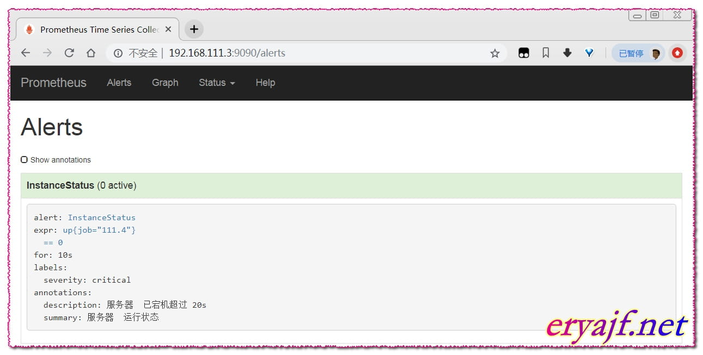
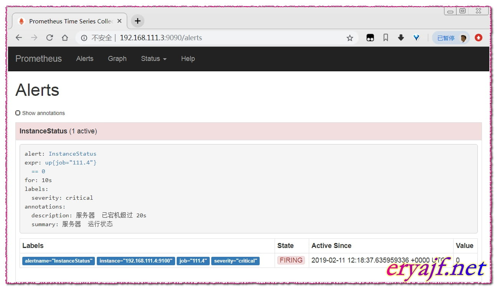
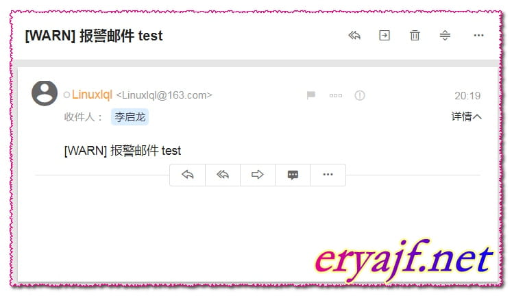

# Prometheus邮件报警

## 安装配置 Alertmanager

```bash
export V_ALERT=0.15.2
curl -OL https://github.com/prometheus/alertmanager/releases/download/v${V_ALERT}/alertmanager-${V_ALERT}.linux-amd64.tar.gz

tar xf alertmanager-${V_ALERT}.linux-amd64.tar.gz -C /usr/local/
mv alertmanager-${V_ALERT} alertmanager

cat <<EOF >> vim /usr/lib/systemd/system/alertmanager.service 
[Unit]
Description=alertmanager
Documentation=https://github.com/prometheus/alertmanager
After=network.target
[Service]
Type=simple
User=prometheus
ExecStart=/usr/local/alertmanager/alertmanager --config.file=/usr/local/alertmanager/alertmanager.yml
Restart=on-failure
[Install]
WantedBy=multi-user.target
EOF
```

Alertmanager 安装目录下默认有 alertmanager.yml 配置文件，可以创建新的配置文件，在启动时指定即可。

```yaml
global:
  smtp_smarthost: 'smtp.163.com:25'
  smtp_from: 'Linuxlql@163.com'
  smtp_auth_username: 'Linuxlql@163.com'
  smtp_auth_password: '123546' # 这里是邮箱的授权密码，不是登录密码
  smtp_require_tls: false
templates:
  - '/alertmanager/template/*.tmpl'
route:
  group_by: ['alertname', 'cluster', 'service']
  group_wait: 30s
  group_interval: 5m
  repeat_interval: 10m
  receiver: default-receiver
receivers:
- name: 'default-receiver'
  email_configs:
  - to: 'liqilong@edspay.com'
    html: ''
    headers: { Subject: "[WARN] 报警邮件 test" }

```

* smtp_smarthost：是用于发送邮件的邮箱的 SMTP 服务器地址 + 端口；
* smtp_auth_password：是发送邮箱的授权码而不是登录密码；
* smtp_require_tls：不设置的话默认为 true，当为 true 时会有 starttls 错误，为了简单这里设置为 false；
* templates：指出邮件的模板路径；
* receivers 下 html 指出邮件内容模板名，这里模板名为 “alert.html”，在模板路径中的某个文件中定义。
* headers：为邮件标题；

‍

## 配置告警规则

配置 rule.yml

```bash
$ cd /usr/local/prometheus
$ vim rule.yml
```

```yaml
groups:
- name: alert-rules.yml
  rules:
  - alert: InstanceStatus # alert 名字
    expr: up{job="linux-node01"} == 0 # 判断条件
    for: 10s # 条件保持 10s 才会发出 alter
    labels: # 设置 alert 的标签
      severity: "critical"
    annotations:  # alert 的其他标签，但不用于标识 alert
      description: 服务器  已当机超过 20s
      summary: 服务器  运行状态

```

在 prometheus.yml 中指定 rule.yml 的路径

```yaml
# my global config
global:
  scrape_interval:     15s # Set the scrape interval to every 15 seconds. Default is every 1 minute.
  evaluation_interval: 15s # Evaluate rules every 15 seconds. The default is every 1 minute.
  # scrape_timeout is set to the global default (10s).
# Alertmanager configuration
alerting:
  alertmanagers:
  - static_configs:
    - targets:
      - localhost:9093 # 这里修改为 localhost
# Load rules once and periodically evaluate them according to the global 'evaluation_interval'.
rule_files:
  # - "first_rules.yml"
  # - "second_rules.yml"
  - "/usr/local/prometheus/rule.yml"
# A scrape configuration containing exactly one endpoint to scrape:
# Here it's Prometheus itself.
scrape_configs:
  # The job name is added as a label `job=<job_name>` to any timeseries scraped from this config.
  - job_name: 'prometheus'
    # metrics_path defaults to '/metrics'
    # scheme defaults to 'http'.
    static_configs:
    - targets: ['localhost:9090','localhost:9100']
  - job_name: '111.4'
    scrape_interval: 5s
    static_configs:
    - targets: ['192.168.111.4:9100']

```

重启 Prometheus 服务：

```yaml
systemctl restart prometheus
```

‍

## 编写邮件模板

```bash
mkdir -pv /alertmanager/template/
# 注意：文件后缀为 tmpl
vim /alertmanager/template/alert.tmpl
--------------------------------------------------------
<table>
    <tr><td>报警名</td><td>开始时间</td></tr>
        <tr><td></td><td></td></tr>
</table>
----------------------------------------------------------
```

‍

## 启动 Alertmanager

```bash
chown -R prometheus.prometheus /usr/local/alertmanager
systemctl daemon-reload
systemctl start alertmanager.service
systemctl status alertmanager.service
ss -tnl|grep 9093
```

‍

## 验证效果

此时到管理界面可以看到如下信息：

​​

然后停止 111.4 节点上的 node_exporter 服务，然后再看效果。

​​

接着邮箱应该会收到邮件：

​​
