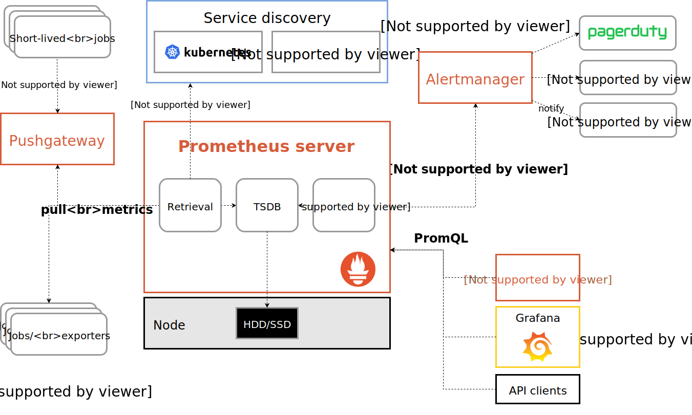

# prometheus简介

# prometheus 简介

[Prometheus](https://github.com/prometheus) 是由前 Google 工程师从 2012 年开始在 [Soundcloud](http://soundcloud.com/) 以开源软件的形式进行研发的系统监控和告警工具包，自此以后，许多公司和组织都采用了 Prometheus 作为监控告警工具。Prometheus 的开发者和用户社区非常活跃，它现在是一个独立的开源项目，可以独立于任何公司进行维护。为了证明这一点，Prometheus 于 2016 年 5 月加入 [CNCF](https://cncf.io/) 基金会，成为继 [Kubernetes](http://kubernetes.io/) 之后的第二个 CNCF 托管项目。[Prometheus](https://prometheus.io) 是由 SoundCloud 开源监控告警解决方案，从 2012 年开始编写代码，再到 2015 年 github 上开源以来，已经吸引了 9k+ 关注，以及很多大公司的使用；2016 年 Prometheus 成为继 k8s 后，第二名 CNCF([Cloud Native Computing Foundation](https://cncf.io/)) 成员。

## Prometheus 的主要优势

* 由指标名称和和键/值对标签标识的时间序列数据组成的多维数据模型。
* 强大的查询语言PromQL。
* 不依赖分布式存储；单个服务节点具有自治能力。
* 时间序列数据是服务端通过 HTTP 协议主动拉取获得的。
* 也可以通过中间网关来推送时间序列数据。
* 可以通过静态配置文件或服务发现来获取监控目标。
* 支持多种类型的图表和仪表盘。

‍

## Prometheus 的组件

* [Prometheus Server](https://github.com/prometheus/prometheus)， 主要用于抓取数据和存储时序数据，另外还提供查询和 Alert Rule 配置管理
* [client libraries](https://prometheus.io/docs/instrumenting/clientlibs/)，用于对接 Prometheus Server, 可以查询和上报数据
* [push gateway](https://github.com/prometheus/pushgateway) ，用于批量，短期的监控数据的汇总节点，主要用于业务数据汇报等
* 各种汇报数据的 [exporters](https://prometheus.io/docs/instrumenting/exporters/) ，例如汇报机器数据的 node_exporter,  汇报 MongoDB 信息的 [MongoDB exporter](https://github.com/dcu/mongodb_exporter) 等等
* 用于告警通知管理的 [alertmanager](https://github.com/prometheus/alertmanager)

‍

## Prometheus 的架构

Prometheus 的整体架构以及生态系统组件如下图所示：

​​

从这个架构图，也可以看出 Prometheus 的主要模块包含， Server,  Exporters, Pushgateway, PromQL, Alertmanager, WebUI 等。

它大致使用逻辑是这样：

1. Prometheus server 定期从静态配置的 targets 或者服务发现的 targets 拉取数据。
2. 当新拉取的数据大于配置内存缓存区的时候，Prometheus 会将数据持久化到磁盘（如果使用 remote storage 将持久化到云端）。
3. Prometheus 可以配置 rules，然后定时查询数据，当条件触发的时候，会将 alert 推送到配置的 Alertmanager。
4. Alertmanager 收到警告的时候，可以根据配置，聚合，去重，降噪，最后发送警告。
5. 可以使用 API， Prometheus Console 或者 Grafana 查询和聚合数据。

‍

## Prometheus vs Zabbix

* Zabbix 使用的是 C 和 PHP, Prometheus 使用 Golang, 整体而言 Prometheus 运行速度更快一点。
* Zabbix 属于传统主机监控，主要用于物理主机，交换机，网络等监控，Prometheus 不仅适用主机监控，还适用于 Cloud, SaaS, Openstack，Container 监控。
* Zabbix 在传统主机监控方面，有更丰富的插件。
* Zabbix 可以在 WebGui 中配置很多事情，但是 Prometheus 需要手动修改文件配置。

‍

## 注意

* Prometheus 的数据是基于时序的 float64 的值，如果你的数据值有更多类型，无法满足。
* Prometheus  不适合做审计计费，因为它的数据是按一定时间采集的，关注的更多是系统的运行瞬时状态以及趋势，即使有少量数据没有采集也能容忍，但是审计计费需要记录每个请求，并且数据长期存储，这个  Prometheus 无法满足，可能需要采用专门的审计系统。

‍

## 总结

* Prometheus 属于一站式监控告警平台，依赖少，功能齐全。
* Prometheus 支持对云或容器的监控，其他系统主要对主机监控。
* Prometheus 数据查询语句表现力更强大，内置更强大的统计函数。
* Prometheus 在数据存储扩展性以及持久性上没有 InfluxDB，OpenTSDB，Sensu 好。

‍

# 基础概念

### 数据模型

Prometheus 存储的是[时序数据](https://en.wikipedia.org/wiki/Time_series), 即按照相同时序(相同的名字和标签)，以时间维度存储连续的数据的集合。

#### 时序索引

时序(time series) 是由名字(Metric)，以及一组 key/value 标签定义的，具有相同的名字以及标签属于相同时序。

时序的名字由 ASCII 字符，数字，下划线，以及冒号组成，它必须满足正则表达式 `[a-zA-Z_:][a-zA-Z0-9_:]*`​, 其名字应该具有语义化，一般表示一个可以度量的指标，例如: `http_requests_total`​, 可以表示 http 请求的总数。

时序的标签可以使 Prometheus 的数据更加丰富，能够区分具体不同的实例，例如 `http_requests_total{method="POST"}`​ 可以表示所有 http 中的 POST 请求。

标签名称由 ASCII 字符，数字，以及下划线组成， 其中 `__`​ 开头属于 Prometheus 保留，标签的值可以是任何 Unicode 字符，支持中文。

#### 时序样本

按照某个时序以时间维度采集的数据，称之为样本，其值包含：

* 一个 float64 值
* 一个毫秒级的 unix 时间戳

#### 格式

Prometheus 时序格式与 [OpenTSDB](http://opentsdb.net/) 相似：

```
<metric name>{<label name>=<label value>, ...}
```

其中包含时序名字以及时序的标签。

‍

### 时序 4 种类型

Prometheus 时序数据分为 [Counter](https://prometheus.io/docs/concepts/metric_types/#counter), [Gauge](https://prometheus.io/docs/concepts/metric_types/#gauge), [Histogram](https://prometheus.io/docs/concepts/metric_types/#histogram), [Summary](https://prometheus.io/docs/concepts/metric_types/#summary) 四种类型。

#### Counter

Counter 表示收集的数据是按照某个趋势（增加／减少）一直变化的，我们往往用它记录服务请求总量、错误总数等。

例如 Prometheus server 中 `http_requests_total`​, 表示 Prometheus 处理的 http 请求总数，我们可以使用 `delta`​, 很容易得到任意区间数据的增量，这个会在 PromQL 一节中细讲。

#### Gauge

Gauge 表示搜集的数据是一个瞬时的值，与时间没有关系，可以任意变高变低，往往可以用来记录内存使用率、磁盘使用率等。

例如 Prometheus server 中 `go_goroutines`​, 表示 Prometheus 当前 goroutines 的数量。

#### Histogram

Histogram 由 `<basename>_bucket{le="<upper inclusive bound>"}`​，`<basename>_bucket{le="+Inf"}`​, `<basename>_sum`​，`<basename>_count`​ 组成，主要用于表示一段时间范围内对数据进行采样（通常是请求持续时间或响应大小），并能够对其指定区间以及总数进行统计，通常它采集的数据展示为直方图。

例如 Prometheus server 中 `prometheus_local_storage_series_chunks_persisted`​, 表示 Prometheus 中每个时序需要存储的 chunks 数量，我们可以用它计算待持久化的数据的分位数。

#### Summary

Summary 和 Histogram 类似，由 `<basename>{quantile="<φ>"}`​，`<basename>_sum`​，`<basename>_count`​ 组成，主要用于表示一段时间内数据采样结果（通常是请求持续时间或响应大小），它直接存储了 quantile 数据，而不是根据统计区间计算出来的。

例如 Prometheus server 中 `prometheus_target_interval_length_seconds`​。

#### Histogram vs Summary

* 都包含 `<basename>_sum`​，`<basename>_count`​
* Histogram 需要通过 `<basename>_bucket`​ 计算 quantile, 而 Summary 直接存储了 quantile 的值。

‍

‍

### 作业和实例

Prometheus 中，将任意一个独立的数据源（target）称之为实例（instance）。包含相同类型的实例的集合称之为作业（job）。 如下是一个含有四个重复实例的作业：

```
- job: api-server
    - instance 1: 1.2.3.4:5670
    - instance 2: 1.2.3.4:5671
    - instance 3: 5.6.7.8:5670
    - instance 4: 5.6.7.8:5671
```

#### 自生成标签和时序

Prometheus 在采集数据的同时，会自动在时序的基础上添加标签，作为数据源（target）的标识，以便区分：

```
job: The configured job name that the target belongs to.
instance: The <host>:<port> part of the target's URL that was scraped.
```

如果其中任一标签已经在此前采集的数据中存在，那么将会根据 `honor_labels`​ 设置选项来决定新标签。详见官网解释： [scrape configuration documentation](https://prometheus.io/docs/operating/configuration/#%3Cscrape_config%3E)

对每一个实例而言，Prometheus 按照以下时序来存储所采集的数据样本：

```pgsql
up{job="<job-name>", instance="<instance-id>"}: 1 表示该实例正常工作
up{job="<job-name>", instance="<instance-id>"}: 0 表示该实例故障

scrape_duration_seconds{job="<job-name>", instance="<instance-id>"} 表示拉取数据的时间间隔

scrape_samples_post_metric_relabeling{job="<job-name>", instance="<instance-id>"} 表示采用重定义标签（relabeling）操作后仍然剩余的样本数

scrape_samples_scraped{job="<job-name>", instance="<instance-id>"}  表示从该数据源获取的样本数
```

其中 `up`​ 时序可以有效应用于监控该实例是否正常工作。
