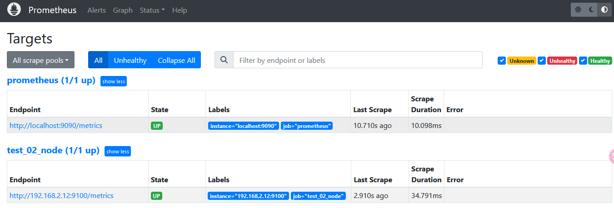

# prometheus部署

软件包下载地址：[https://prometheus.io/download/](https://prometheus.io/download/)

```bash
export V_PROME=2.46.0
export V_NODE=1.6.1

curl -LO https://github.com/prometheus/prometheus/releases/download/v${V_PROME}/prometheus-${V_PROME}.linux-amd64.tar.gz
curl -LO https://github.com/prometheus/node_exporter/releases/download/v${V_NODE}/node_exporter-${V_NODE}.linux-amd64.tar.gz
```

## 安装 Prometheus Server

```bash
# 创建用户和组，不自动创建家目录
useradd -MU -s /sbin/nologin prometheus
mkdir /data
tar -xf prometheus-${V_PROME}.linux-amd64.tar.gz -C /data
mv /data/prometheus-${V_PROME}.linux-amd64/ /data/prometheus
chown -R prometheus.prometheus prometheus/

cat <<EOF >>/usr/lib/systemd/system/prometheus.service
[Unit]
Description=prometheus
After=network.target
[Service]
Type=simple
User=prometheus
ExecStart=/data/prometheus/prometheus --config.file=/data/prometheus/prometheus.yml --storage.tsdb.path=/data/prometheus/data --storage.tsdb.retention=15d --log.level=info
Restart=on-failure
[Install]
WantedBy=multi-user.target
EOF

systemctl daemon-reload
systemctl enable prometheus 
systemctl start  prometheus 
systemctl status prometheus 
```

‍

## 安装 node_exporter

NodeExporter 是 Prometheus 提供的一个可以采集到主机信息的应用程序，它能采集到机器的 CPU、内存、磁盘等信息。

我们从 [https://prometheus.io/download/](https://prometheus.io/download/) 获取最新的 Node Exporter 版本的二进制包。

```bash
#注意：node_exporter 的运行用户也是 prometheus 用户需要在每台节点上都创建该用户。
useradd -MU -s /sbin/nologin prometheus
mkdir /data/prometheus
tar -xf node_exporter-${V_NODE}.linux-amd64.tar.gz -C /data/prometheus
mv /data/prometheus/node_exporter-${V_NODE}.linux-amd64/ /data/prometheus/node_exporter
chown -R prometheus.prometheus /data/prometheus/node_exporter

#创建 node_exporter 启动脚本
cat <<EOF >> /usr/lib/systemd/system/node_exporter.service 
[Unit]
Description=node_export
Documentation=https://github.com/prometheus/node_exporter/node_exporter
After=network.target
 
[Service]
Type=simple
User=prometheus
ExecStart=/data/prometheus/node_exporter
Restart=on-failure
[Install]
WantedBy=multi-user.target
EOF


systemctl daemon-reload
systemctl enable node_exporter
systemctl start  node_exporter
systemctl status node_exporter
ss -tnl | grep 9100
```

‍

## 配置 Prometheus 添加监控目标

现在我们运行了 Prometheus 服务器，也运行了业务数据源 NodeExporter。但此时 Prometheus 还获取不到任何数据，我们还需要配置下 prometheus.yml 文件，让其去拉取 Node Exporter 的数据。

我们配置一下 Prometheus 的配置文件，让 Prometheus 服务器定时去业务数据源拉取数据。编辑prometheus.yml 并在 scrape_configs 节点下添加以下内容:

```yml
scrape_configs:
  # The job name is added as a label `job=<job_name>` to any timeseries scraped from this config.
  - job_name: 'prometheus'
 
    # metrics_path defaults to '/metrics'
    # scheme defaults to 'http'.
 
    static_configs:
    - targets: ['localhost:9090','localhost:9100'] # 对本机node_exporter 监控
 
# 新添加的对其它node节点抓取数据
  - job_name: 'test_02'
    #重写了全局抓取间隔时间，由15秒重写成5秒。
    scrape_interval: 5s
    static_configs:
    - targets: ['192.168.2.12:9100']
```

重启Prometheus 服务：

```bash
systemctl restart prometheus.service
```

访问 Prometheus WEB 查看我们定义的目标主机：``​[](http://192.168.2.11:9090/targets)

​​​​

‍
