# 分析procmeminfo文件

/proc/meminfo是了解Linux系统内存使用状况的主要接口，我们最常用的”free”、”vmstat”等命令就是通过它获取数据的 ，/proc/meminfo所包含的信息比”free”等命令要丰富得多，然而真正理解它并不容易，比如我们知道”Cached”统计的是文件缓存页，manpage上说是“In-memory  cache  for  files read from the disk (the page cache)”，那为什么它不等于\[Active(file)+Inactive(file)\]？AnonHugePages与AnonPages、HugePages\_Total有什么联系和区别？很多细节在手册中并没有讲清楚，本文对此做了一点探究。

负责输出/proc/meminfo的源代码是：fs/proc/meminfo.c : meminfo\_proc\_show()

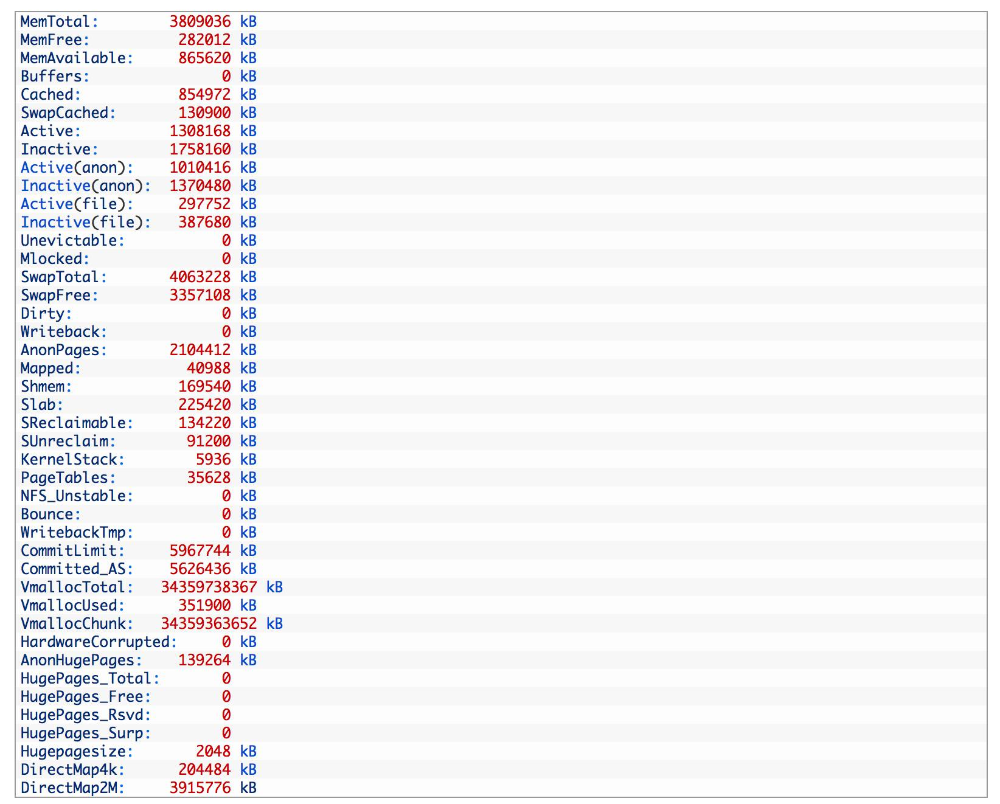

#### MemTotal

系统从加电开始到引导完成，firmware/BIOS要保留一些内存，kernel本身要占用一些内存，最后剩下可供kernel支配的内存就是MemTotal。这个值在系统运行期间一般是固定不变的。可参阅解读DMESG中的内存初始化信息。

#### MemFree

表示系统尚未使用的内存。\[MemTotal-MemFree\]就是已被用掉的内存。

#### MemAvailable

有些应用程序会根据系统的可用内存大小自动调整内存申请的多少，所以需要一个记录当前可用内存数量的统计值，MemFree并不适用，因为MemFree不能代表全部可用的内存，系统中有些内存虽然已被使用但是可以回收的，比如cache/buffer、slab都有一部分可以回收，所以这部分可回收的内存加上MemFree才是系统可用的内存，即MemAvailable。/proc/meminfo中的MemAvailable是内核使用特定的算法估算出来的，要注意这是一个估计值，并不精确。

#### 内存黑洞

追踪Linux系统的内存使用一直是个难题，很多人试着把能想到的各种内存消耗都加在一起，kernel text、kernel modules、buffer、cache、slab、page table、process RSS…等等，却总是与物理内存的大小对不上，这是为什么呢？因为Linux kernel并没有滴水不漏地统计所有的内存分配，kernel动态分配的内存中就有一部分没有计入/proc/meminfo中。

我们知道，Kernel的动态内存分配通过以下几种接口：

alloc\_pages/\_\_get\_free\_page: 以页为单位分配

vmalloc: 以字节为单位分配虚拟地址连续的内存块

slab allocator

kmalloc: 以字节为单位分配物理地址连续的内存块，它是以slab为基础的，使用slab层的general caches — 大小为2^n，名称是kmalloc-32、kmalloc-64等（在老kernel上的名称是size-32、size-64等）。

通过slab层分配的内存会被精确统计，可以参见/proc/meminfo中的slab/SReclaimable/SUnreclaim；

通过vmalloc分配的内存也有统计，参见/proc/meminfo中的VmallocUsed 和 /proc/vmallocinfo（下节中还有详述）；

而通过alloc\_pages分配的内存不会自动统计，除非调用alloc\_pages的内核模块或驱动程序主动进行统计，否则我们只能看到free memory减少了，但从/proc/meminfo中看不出它们具体用到哪里去了。比如在VMware guest上有一个常见问题，就是VMWare ESX宿主机会通过guest上的Balloon driver(vmware\_balloon module)占用guest的内存，有时占用得太多会导致guest无内存可用，这时去检查guest的/proc/meminfo只看见MemFree很少、但看不出内存的去向，原因就是Balloon driver通过alloc\_pages分配内存，没有在/proc/meminfo中留下统计值，所以很难追踪。

#### 内存都到哪里去了？

使用内存的，不是kernel就是用户进程，下面我们就分类讨论。

注：page cache比较特殊，很难区分是属于kernel还是属于进程，其中被进程mmap的页面自然是属于进程的了，而另一些页面没有被mapped到任何进程，那就只能算是属于kernel了。

#### 1\. 内核

内核所用内存的静态部分，比如内核代码、页描述符等数据在引导阶段就分配掉了，并不计入MemTotal里，而是算作Reserved(在dmesg中能看到)。而内核所用内存的动态部分，是通过上文提到的几个接口申请的，其中通过alloc\_pages申请的内存有可能未纳入统计，就像黑洞一样。

下面讨论的都是/proc/meminfo中所统计的部分。

#### 1.1 SLAB

通过slab分配的内存被统计在以下三个值中：

SReclaimable: slab中可回收的部分。调用kmem\_getpages()时加上SLAB\_RECLAIM\_ACCOUNT标记，表明是可回收的，计入SReclaimable，否则计入SUnreclaim。

SUnreclaim: slab中不可回收的部分。

Slab: slab中所有的内存，等于以上两者之和。

#### 1.2 VmallocUsed

通过vmalloc分配的内存都统计在/proc/meminfo的 VmallocUsed 值中，但是要注意这个值不止包括了分配的物理内存，还统计了VM\_IOREMAP、VM\_MAP等操作的值，譬如VM\_IOREMAP是把IO地址映射到内核空间、并未消耗物理内存，所以我们要把它们排除在外。从物理内存分配的角度，我们只关心VM\_ALLOC操作，这可以从/proc/vmallocinfo中的vmalloc记录看到：

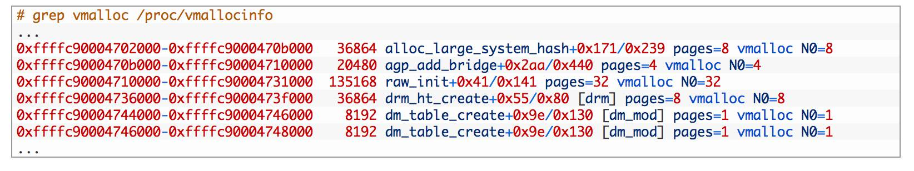

注：/proc/vmallocinfo中能看到vmalloc来自哪个调用者(caller)，那是vmalloc()记录下来的，相应的源代码可见：mm/vmalloc.c: vmalloc > \_\_vmalloc\_node\_flags > \_\_vmalloc\_node > \_\_vmalloc\_node\_range > \_\_get\_vm\_area\_node > setup\_vmalloc\_vm

通过vmalloc分配了多少内存，可以统计/proc/vmallocinfo中的vmalloc记录，例如：

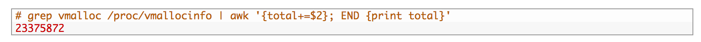

一些driver以及网络模块和文件系统模块可能会调用vmalloc，加载内核模块(kernel module)时也会用到，可参见 kernel/module.c。

#### 1.3 kernel modules (内核模块)

系统已经加载的内核模块可以用 lsmod 命令查看，注意第二列就是内核模块所占内存的大小，通过它可以统计内核模块所占用的内存大小，但这并不准，因为”lsmod”列出的是\[init\_size+core\_size\]，而实际给kernel module分配的内存是以page为单位的，不足 1 page的部分也会得到整个page，此外每个module还会分到一页额外的guard page。下文我们还会细说。

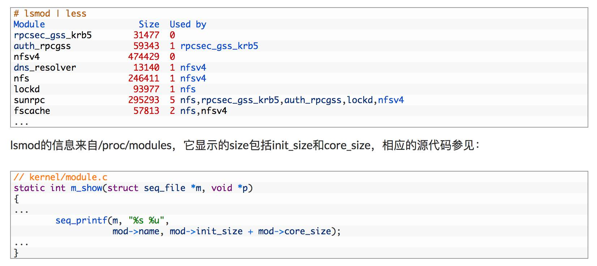

注：我们可以在 /sys/module// 目录下分别看到coresize和initsize的值。

kernel module的内存是通过vmalloc()分配的（参见下列源代码），所以在/proc/vmallocinfo中会有记录，也就是说我们可以不必通过”lsmod”命令来统计kernel module所占的内存大小，通过/proc/vmallocinfo就行了，而且还比lsmod更准确，为什么这么说呢？

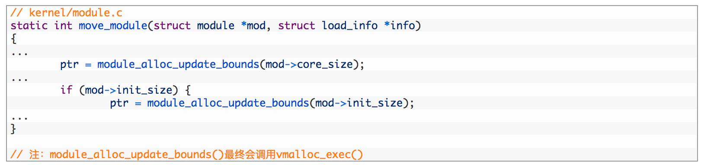

因为给kernel module分配内存是以page为单位的，不足 1 page的部分也会得到整个page，此外，每个module还会分到一页额外的guard page。

详见：mm/vmalloc.c: \_\_get\_vm\_area\_node()

而”lsmod”列出的是\[init\_size+core\_size\]，比实际分配给kernel module的内存小。我们做个实验来说明：

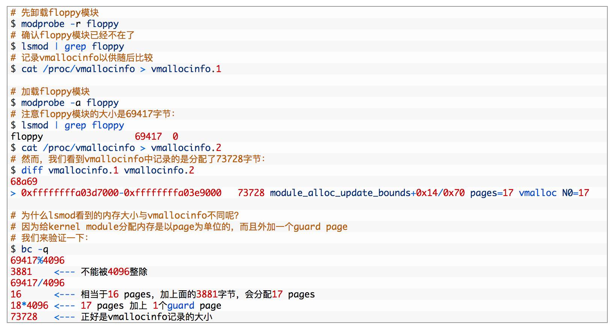

所以结论是kernel module所占用的内存包含在/proc/vmallocinfo的统计之中，不必再去计算”lsmod”的结果了，而且”lsmod”也不准。

#### 1.4 HardwareCorrupted

当系统检测到内存的硬件故障时，会把有问题的页面删除掉，不再使用，/proc/meminfo中的HardwareCorrupted统计了删除掉的内存页的总大小。相应的代码参见 mm/memory-failure.c: memory\_failure()。

#### 1.5 PageTables

Page Table用于将内存的虚拟地址翻译成物理地址，随着内存地址分配得越来越多，Page Table会增大，/proc/meminfo中的PageTables统计了Page Table所占用的内存大小。

注：请把Page Table与Page Frame（页帧）区分开，物理内存的最小单位是page frame，每个物理页对应一个描述符(struct page)，在内核的引导阶段就会分配好、保存在mem\_map\[\]数组中，mem\_map\[\]所占用的内存被统计在dmesg显示的reserved中，/proc/meminfo的MemTotal是不包含它们的。（在NUMA系统上可能会有多个mem\_map数组，在node\_data中或mem\_section中）。

而Page Table的用途是翻译虚拟地址和物理地址，它是会动态变化的，要从MemTotal中消耗内存。

#### 1.6 KernelStack

每一个用户线程都会分配一个kernel stack（内核栈），内核栈虽然属于线程，但用户态的代码不能访问，只有通过系统调用(syscall)、自陷(trap)或异常(exception)进入内核态的时候才会用到，也就是说内核栈是给kernel code使用的。在x86系统上Linux的内核栈大小是固定的8K或16K（可参阅我以前的文章：内核栈溢出）。

Kernel stack（内核栈）是常驻内存的，既不包括在LRU lists里，也不包括在进程的RSS/PSS内存里，所以我们认为它是kernel消耗的内存。统计值是/proc/meminfo的KernelStack。

#### 1.7 Bounce

有些老设备只能访问低端内存，比如16M以下的内存，当应用程序发出一个I/O 请求，DMA的目的地址却是高端内存时（比如在16M以上），内核将在低端内存中分配一个临时buffer作为跳转，把位于高端内存的缓存数据复制到此处。这种额外的数据拷贝被称为“bounce buffering”，会降低I/O 性能。大量分配的bounce buffers 也会占用额外的内存。

#### 2\. 用户进程

/proc/meminfo统计的是系统全局的内存使用状况，单个进程的情况要看/proc//下的smaps等等。

#### 2.1 Hugepages

Hugepages在/proc/meminfo中是被独立统计的，与其它统计项不重叠，既不计入进程的RSS/PSS中，又不计入LRU Active/Inactive，也不会计入cache/buffer。如果进程使用了Hugepages，它的RSS/PSS不会增加。

注：不要把 Transparent HugePages (THP)跟 Hugepages 搞混了，THP的统计值是/proc/meminfo中的”AnonHugePages”，在/proc//smaps中也有单个进程的统计，这个统计值与进程的RSS/PSS是有重叠的，如果用户进程用到了THP，进程的RSS/PSS也会相应增加，这与Hugepages是不同的。

在/proc/meminfo中与Hugepages有关的统计值如下：

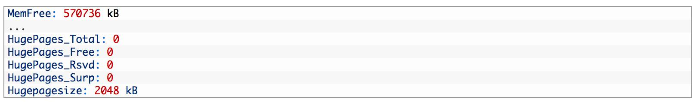

HugePages\_Total 对应内核参数 vm.nr\_hugepages，也可以在运行中的系统上直接修改 /proc/sys/vm/nr\_hugepages，修改的结果会立即影响空闲内存 MemFree的大小，因为HugePages在内核中独立管理，只要一经定义，无论是否被使用，都不再属于free memory。在下例中我们设置256MB(128页)Hugepages，可以立即看到Memfree立即减少了262144kB（即256MB）：

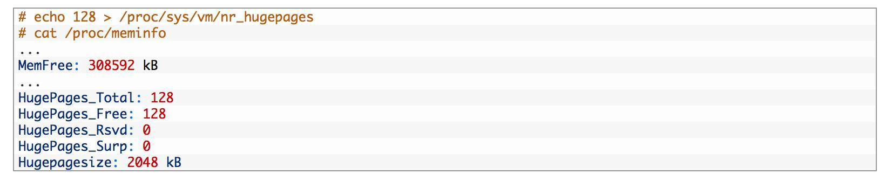

使用Hugepages有三种方式：(详见 [https://www.kernel.org/doc/Documentation/vm/hugetlbpage.txt](https://www.kernel.org/doc/Documentation/vm/hugetlbpage.txt))

mount一个特殊的 hugetlbfs 文件系统，在上面创建文件，然后用mmap() 进行访问，如果要用 read() 访问也是可以的，但是 write() 不行。

通过shmget/shmat也可以使用Hugepages，调用shmget申请共享内存时要加上 SHM\_HUGETLB 标志。

通过 mmap()，调用时指定MAP\_HUGETLB 标志也可以使用Huagepages。

用户程序在申请Hugepages的时候，其实是reserve了一块内存，并未真正使用，此时/proc/meminfo中的 HugePages\_Rsvd 会增加，而 HugePages\_Free 不会减少。

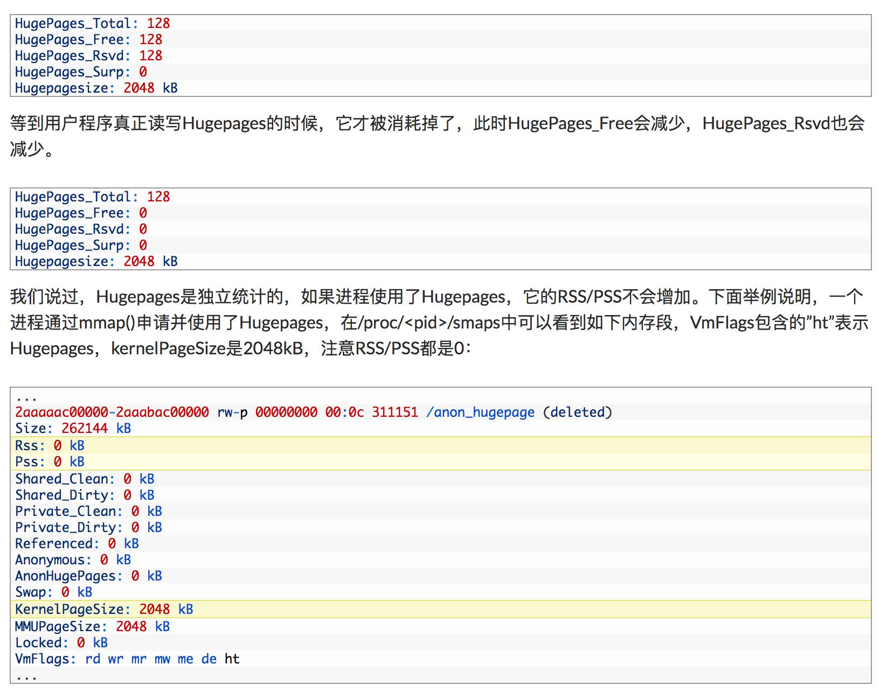

#### 2.2 AnonHugePages

AnonHugePages统计的是Transparent HugePages (THP)，THP与Hugepages不是一回事，区别很大。

上一节说过，Hugepages在/proc/meminfo中是被独立统计的，与其它统计项不重叠，既不计入进程的RSS/PSS中，又不计入LRU Active/Inactive，也不会计入cache/buffer。如果进程使用了Hugepages，它的RSS/PSS不会增加。

而AnonHugePages完全不同，它与/proc/meminfo的其他统计项有重叠，首先它被包含在AnonPages之中，而且在/proc//smaps中也有单个进程的统计，与进程的RSS/PSS是有重叠的，如果用户进程用到了THP，进程的RSS/PSS也会相应增加，这与Hugepages是不同的。下例截取自/proc//smaps中的一段：

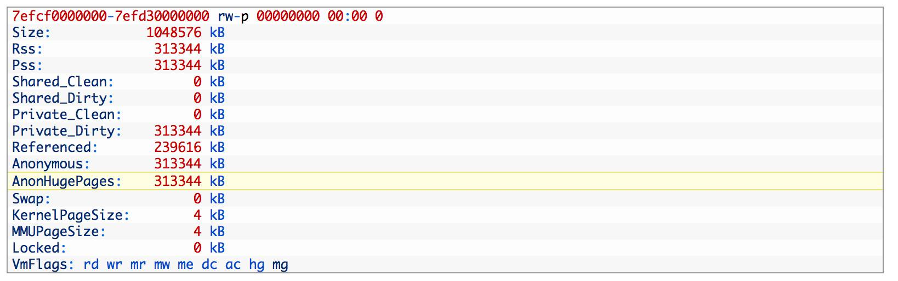

THP也可以用于shared memory和tmpfs，缺省是禁止的，打开的方法如下（详见 [https://www.kernel.org/doc/Documentation/vm/transhuge.txt）：](https://www.kernel.org/doc/Documentation/vm/transhuge.txt%EF%BC%89%EF%BC%9A)

mount时加上”huge=always”等选项

通过/sys/kernel/mm/transparent\_hugepage/shmem\_enabled来控制

因为缺省情况下shared memory和tmpfs不使用THP，所以进程之间不会共享AnonHugePages，于是就有以下等式：

【/proc/meminfo的AnonHugePages】==【所有进程的/proc//smaps中AnonHugePages之和】举例如下：

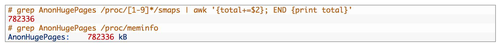

2.3 LRU

LRU是Kernel的页面回收算法(Page Frame Reclaiming)使用的数据结构，在解读vmstat中的Active/Inactive memory一文中有介绍。Page cache和所有用户进程的内存（kernel stack和huge pages除外）都在LRU lists上。

LRU lists包括如下几种，在/proc/meminfo中都有对应的统计值：

LRU\_INACTIVE\_ANON  –  对应 Inactive(anon)LRU\_ACTIVE\_ANON  –  对应 Active(anon)LRU\_INACTIVE\_FILE  –  对应 Inactive(file)LRU\_ACTIVE\_FILE  –  对应 Active(file)LRU\_UNEVICTABLE  –  对应 Unevictable

注：

Inactive list里的是长时间未被访问过的内存页，Active list里的是最近被访问过的内存页，LRU算法利用Inactive list和Active list可以判断哪些内存页可以被优先回收。

括号中的 anon 表示匿名页(anonymous pages)。用户进程的内存页分为两种：file-backed pages（与文件对应的内存页），和anonymous pages（匿名页），比如进程的代码、映射的文件都是file-backed，而进程的堆、栈都是不与文件相对应的、就属于匿名页。file-backed pages在内存不足的时候可以直接写回对应的硬盘文件里，称为page-out，不需要用到交换区(swap)；而anonymous pages在内存不足时就只能写到硬盘上的交换区(swap)里，称为swap-out。

括号中的 file 表示 file-backed pages（与文件对应的内存页）。

Unevictable LRU list上是不能pageout/swapout的内存页，包括VM\_LOCKED的内存页、SHM\_LOCK的共享内存页（又被统计在”Mlocked”中）、和ramfs。在unevictable list出现之前，这些内存页都在Active/Inactive lists上，vmscan每次都要扫过它们，但是又不能把它们pageout/swapout，这在大内存的系统上会严重影响性能，设计unevictable list的初衷就是避免这种情况，参见：[https://www.kernel.org/doc/Documentation/vm/unevictable-lru.txt](https://www.kernel.org/doc/Documentation/vm/unevictable-lru.txt)

LRU与/proc/meminfo中其他统计值的关系：

LRU中不包含HugePages\_\*。

LRU包含了 Cached 和 AnonPages。

#### 2.4 Shmem

/proc/meminfo中的Shmem统计的内容包括：

shared memory

tmpfs。

此处所讲的shared memory又包括：

SysV shared memory \[shmget etc.\]

POSIX shared memory \[shm\_open etc.\]

shared anonymous mmap \[ mmap(…MAP\_ANONYMOUS|MAP\_SHARED…)\]

因为shared memory在内核中都是基于tmpfs实现的，参见：[https://www.kernel.org/doc/Documentation/filesystems/tmpfs.txt也就是说它们被视为基于tmpfs文件系统的内存页，既然基于文件系统，就不算匿名页，所以不被计入/proc/meminfo中的AnonPages，而是被统计进了：](https://www.kernel.org/doc/Documentation/filesystems/tmpfs.txt%E4%B9%9F%E5%B0%B1%E6%98%AF%E8%AF%B4%E5%AE%83%E4%BB%AC%E8%A2%AB%E8%A7%86%E4%B8%BA%E5%9F%BA%E4%BA%8Etmpfs%E6%96%87%E4%BB%B6%E7%B3%BB%E7%BB%9F%E7%9A%84%E5%86%85%E5%AD%98%E9%A1%B5%EF%BC%8C%E6%97%A2%E7%84%B6%E5%9F%BA%E4%BA%8E%E6%96%87%E4%BB%B6%E7%B3%BB%E7%BB%9F%EF%BC%8C%E5%B0%B1%E4%B8%8D%E7%AE%97%E5%8C%BF%E5%90%8D%E9%A1%B5%EF%BC%8C%E6%89%80%E4%BB%A5%E4%B8%8D%E8%A2%AB%E8%AE%A1%E5%85%A5/proc/meminfo%E4%B8%AD%E7%9A%84AnonPages%EF%BC%8C%E8%80%8C%E6%98%AF%E8%A2%AB%E7%BB%9F%E8%AE%A1%E8%BF%9B%E4%BA%86%EF%BC%9A)

Cached (i.e. page cache)

Mapped (当shmem被attached时候)

然而它们背后并不存在真正的硬盘文件，一旦内存不足的时候，它们是需要交换区才能swap-out的，所以在LRU lists里，它们被放在：

Inactive(anon) 或 Active(anon)注：虽然它们在LRU中被放进了anon list，但是不会被计入 AnonPages。这是shared memory & tmpfs比较拧巴的一个地方，需要特别注意。

或 unevictable （如果被locked的话）

注意：当shmget/shm\_open/mmap创建共享内存时，物理内存尚未分配，要直到真正访问时才分配。/proc/meminfo中的 Shmem 统计的是已经分配的大小，而不是创建时申请的大小。

#### 2.5 AnonPages

前面提到用户进程的内存页分为两种：file-backed pages（与文件对应的内存页），和anonymous pages（匿名页）。Anonymous pages(匿名页)的数量统计在/proc/meminfo的AnonPages中。

以下是几个事实，有助于了解Anonymous Pages：

所有page cache里的页面(Cached)都是file-backed pages，不是Anonymous Pages。”Cached”与”AnoPages”之间没有重叠。注：shared memory 不属于 AnonPages，而是属于Cached，因为shared memory基于tmpfs，所以被视为file-backed、在page cache里，上一节解释过。

mmap private anonymous pages属于AnonPages(Anonymous Pages)，而mmap shared anonymous pages属于Cached(file-backed pages)，因为shared anonymous mmap也是基于tmpfs的，上一节解释过。

Anonymous Pages是与用户进程共存的，一旦进程退出，则Anonymous pages也释放，不像page cache即使文件与进程不关联了还可以缓存。

AnonPages统计值中包含了Transparent HugePages (THP)对应的 AnonHugePages 。参见：

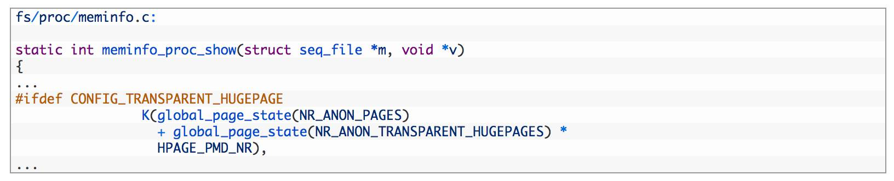

#### 2.6 Mapped

上面提到的用户进程的file-backed pages就对应着/proc/meminfo中的”Mapped”。Page cache中(“Cached”)包含了文件的缓存页，其中有些文件当前已不在使用，page cache仍然可能保留着它们的缓存页面；而另一些文件正被用户进程关联，比如shared libraries、可执行程序的文件、mmap的文件等，这些文件的缓存页就称为mapped。

/proc/meminfo中的”Mapped”就统计了page cache(“Cached”)中所有的mapped页面。”Mapped”是”Cached”的子集。

因为Linux系统上shared memory & tmpfs被计入page cache(“Cached”)，所以被attached的shared memory、以及tmpfs上被map的文件都算做”Mapped”。

进程所占的内存页分为anonymous pages和file-backed pages，理论上应该有：【所有进程的PSS之和】 == 【Mapped + AnonPages】。

然而我实际测试的结果，虽然两者很接近，却总是无法精确相等，我猜也许是因为进程始终在变化、采集的/proc/\[1-9\]\*/smaps以及/proc/meminfo其实不是来自同一个时间点的缘故。

#### 2.7 Cached

Page Cache里包括所有file-backed pages，统计在/proc/meminfo的”Cached”中。

Cached是”Mapped”的超集，就是说它不仅包括mapped，也包括unmapped的页面，当一个文件不再与进程关联之后，原来在page cache中的页面并不会立即回收，仍然被计入Cached，还留在LRU中，但是 Mapped 统计值会减小。【ummaped = (Cached – Mapped)】

Cached包含tmpfs中的文件，POSIX/SysV shared memory，以及shared anonymous mmap。注：POSIX/SysV shared memory和shared anonymous mmap在内核中都是基于tmpfs实现的，参见：[https://www.kernel.org/doc/Documentation/filesystems/tmpfs.txt](https://www.kernel.org/doc/Documentation/filesystems/tmpfs.txt)

“Cached”和”SwapCached”两个统计值是互不重叠的，源代码参见下一节。所以，Shared memory和tmpfs在不发生swap-out的时候属于”Cached”，而在swap-out/swap-in的过程中会被加进swap cache中、属于”SwapCached”，一旦进了”SwapCached”，就不再属于”Cached”了。

#### 2.8 SwapCached

我们说过，匿名页(anonymous pages)要用到交换区，而shared memory和tmpfs虽然未统计在AnonPages里，但它们背后没有硬盘文件，所以也是需要交换区的。也就是说需要用到交换区的内存包括：”AnonPages”和”Shmem”，我们姑且把它们统称为匿名页好了。

交换区可以包括一个或多个交换区设备（裸盘、逻辑卷、文件都可以充当交换区设备），每一个交换区设备都对应自己的swap cache，可以把swap cache理解为交换区设备的”page cache”：page cache对应的是一个个文件，swap cache对应的是一个个交换区设备，kernel管理swap cache与管理page cache一样，用的都是radix-tree，唯一的区别是：page cache与文件的对应关系在打开文件时就确定了，而一个匿名页只有在即将被swap-out的时候才决定它会被放到哪一个交换区设备，即匿名页与swap cache的对应关系在即将被swap-out时才确立。

并不是每一个匿名页都在swap cache中，只有以下情形之一的匿名页才在：

匿名页即将被swap-out时会先被放进swap cache，但通常只存在很短暂的时间，因为紧接着在pageout完成之后它就会从swap cache中删除，毕竟swap-out的目的就是为了腾出空闲内存；【注：参见mm/vmscan.c: shrink\_page\_list()，它调用的add\_to\_swap()会把swap cache页面标记成dirty，然后它调用try\_to\_unmap()将页面对应的page table mapping都删除，再调用pageout()回写dirty page，最后try\_to\_free\_swap()会把该页从swap cache中删除。】

曾经被swap-out现在又被swap-in的匿名页会在swap cache中，直到页面中的内容发生变化、或者原来用过的交换区空间被回收为止。【注：当匿名页的内容发生变化时会删除对应的swap cache，代码参见mm/swapfile.c: reuse\_swap\_page()。】

/proc/meminfo中的SwapCached背后的含义是：系统中有多少匿名页曾经被swap-out、现在又被swap-in并且swap-in之后页面中的内容一直没发生变化。也就是说，如果这些匿名页需要被swap-out的话，是无需进行I/O write操作的。

“SwapCached”不属于”Cached”，两者没有交叉。参见：

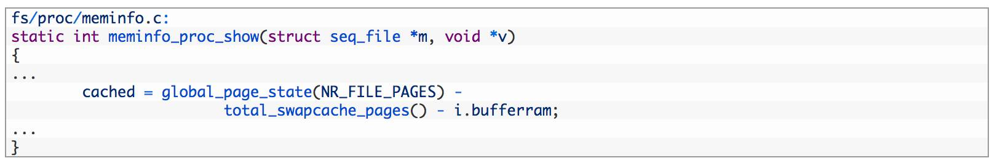

“SwapCached”内存同时也在LRU中，还在”AnonPages”或”Shmem”中，它本身并不占用额外的内存。

#### 2.9 Mlocked

“Mlocked”统计的是被mlock()系统调用锁定的内存大小。被锁定的内存因为不能pageout/swapout，会从Active/Inactive LRU list移到Unevictable LRU list上。也就是说，当”Mlocked”增加时，”Unevictable”也同步增加，而”Active”或”Inactive”同时减小；当”Mlocked”减小的时候，”Unevictable”也同步减小，而”Active”或”Inactive”同时增加。

“Mlocked”并不是独立的内存空间，它与以下统计项重叠：LRU Unevictable，AnonPages，Shmem，Mapped等。

#### 2.10 Buffers

“Buffers”表示块设备(block device)所占用的缓存页，包括：直接读写块设备、以及文件系统元数据(metadata)比如SuperBlock所使用的缓存页。它与“Cached”的区别在于，”Cached”表示普通文件所占用的缓存页。参见我的另一篇文章[http://linuxperf.com/?p=32](http://linuxperf.com/?p=32)

“Buffers”所占的内存同时也在LRU list中，被统计在Active(file)或Inactive(file)。

注：通过阅读源代码可知，块设备的读写操作涉及的缓存被纳入了LRU，以读操作为例，do\_generic\_file\_read()函数通过 mapping->a\_ops->readpage() 调用块设备底层的函数，并调用 add\_to\_page\_cache\_lru() 把缓存页加入到LRU list中。参见：filemap.c: do\_generic\_file\_read > add\_to\_page\_cache\_lru

#### 其它问题

#### DirectMap

/proc/meminfo中的DirectMap所统计的不是关于内存的使用，而是一个反映TLB效率的指标。TLB(Translation Lookaside Buffer)是位于CPU上的缓存，用于将内存的虚拟地址翻译成物理地址，由于TLB的大小有限，不能缓存的地址就需要访问内存里的page table来进行翻译，速度慢很多。为了尽可能地将地址放进TLB缓存，新的CPU硬件支持比4k更大的页面从而达到减少地址数量的目的， 比如2MB，4MB，甚至1GB的内存页，视不同的硬件而定。”DirectMap4k”表示映射为4kB的内存数量， “DirectMap2M”表示映射为2MB的内存数量，以此类推。所以DirectMap其实是一个反映TLB效率的指标。

#### Dirty pages到底有多少？

/proc/meminfo 中有一个Dirty统计值，但是它未能包括系统中全部的dirty pages，应该再加上另外两项：NFS\_Unstable 和 Writeback，NFS\_Unstable是发给NFS server但尚未写入硬盘的缓存页，Writeback是正准备回写硬盘的缓存页。即：

系统中全部dirty pages = ( Dirty + NFS\_Unstable + Writeback )

注1：NFS\_Unstable的内存被包含在Slab中，因为nfs request内存是调用kmem\_cache\_zalloc()申请的。

注2：anonymous pages不属于dirty pages。参见mm/vmscan.c: page\_check\_dirty\_writeback()“Anonymous pages are not handled by flushers and must be written from reclaim context.”

#### 为什么【Active(anon)+Inactive(anon)】不等于AnonPages？

因为Shmem(即Shared memory & tmpfs) 被计入LRU Active/Inactive(anon)，但未计入 AnonPages。所以一个更合理的等式是：

【Active(anon)+Inactive(anon)】 = 【AnonPages + Shmem】

但是这个等式在某些情况下也不一定成立，因为：

如果shmem或anonymous pages被mlock的话，就不在Active(non)或Inactive(anon)里了，而是到了Unevictable里，以上等式就不平衡了；

当anonymous pages准备被swap-out时，分几个步骤：先被加进swap cache，再离开AnonPages，然后离开LRU Inactive(anon)，最后从swap cache中删除，这几个步骤之间会有间隔，而且有可能离开AnonPages就因某些情况而结束了，所以在某些时刻以上等式会不平衡。【注：参见mm/vmscan.c: shrink\_page\_list()：它调用的add\_to\_swap()会把swap cache页面标记成dirty，然后调用try\_to\_unmap()将页面对应的page table mapping都删除，再调用pageout()回写dirty page，最后try\_to\_free\_swap()把该页从swap cache中删除。】

#### 为什么【Active(file)+Inactive(file)】不等于Mapped？

因为LRU Active(file)和Inactive(file)中不仅包含mapped页面，还包含unmapped页面；

Mapped中包含”Shmem”(即shared memory & tmpfs)，这部分内存被计入了LRU Active(anon)或Inactive(anon)、而不在Active(file)和Inactive(file)中。

#### 为什么【Active(file)+Inactive(file)】不等于 Cached？

因为”Shmem”(即shared memory & tmpfs)包含在Cached中，而不在Active(file)和Inactive(file)中；

Active(file)和Inactive(file)还包含Buffers。

如果不考虑mlock的话，一个更符合逻辑的等式是：【Active(file) + Inactive(file) + Shmem】== 【Cached + Buffers】

如果有mlock的话，等式应该如下（mlock包括file和anon两部分，/proc/meminfo中并未分开统计，下面的mlock\_file只是用来表意，实际并没有这个统计值）：【Active(file) + Inactive(file) + Shmem + mlock\_file】== 【Cached + Buffers】

注：测试的结果以上等式通常都成立，但内存发生交换的时候以上等式有时不平衡，我猜可能是因为有些属于Shmem的内存swap-out的过程中离开Cached进入了Swapcached，但没有立即从swap cache删除、仍算在Shmem中的缘故。

#### Linux的内存都用到哪里去了？

尽管不可能精确统计Linux系统的内存，但大体了解还是可以的。

#### kernel内存的统计方式应该比较明确，即

【Slab+ VmallocUsed + PageTables + KernelStack + HardwareCorrupted + Bounce + X】

注1：VmallocUsed其实不是我们感兴趣的，因为它还包括了VM\_IOREMAP等并未消耗物理内存的IO地址映射空间，我们只关心VM\_ALLOC操作，（参见1.2节），所以实际上应该统计/proc/vmallocinfo中的vmalloc记录，例如（此处单位是byte）：

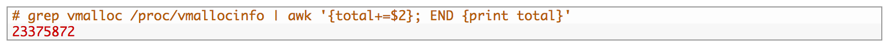

注2：kernel module的内存被包含在VmallocUsed中，见1.3节。

注3：X表示直接通过alloc\_pages/\_\_get\_free\_page分配的内存，没有在/proc/meminfo中统计，不知道有多少，就像个黑洞。

#### 用户进程的内存主要有三种统计口径：

围绕LRU进行统计【(Active + Inactive + Unevictable) + (HugePages\_Total \* Hugepagesize)】

围绕Page Cache进行统计当SwapCached为0的时候，用户进程的内存总计如下：【(Cached + AnonPages + Buffers) + (HugePages\_Total \* Hugepagesize)】当SwapCached不为0的时候，以上公式不成立，因为SwapCached可能会含有Shmem，而Shmem本来被含在Cached中，一旦swap-out就从Cached转移到了SwapCached，可是我们又不能把SwapCached加进上述公式中，因为SwapCached虽然不与Cached重叠却与AnonPages有重叠，它既可能含有Shared memory又可能含有Anonymous Pages。

围绕RSS/PSS进行统计把/proc/\[1-9\]\*/smaps 中的 Pss 累加起来就是所有用户进程占用的内存，但是还没有包括Page Cache中unmapped部分、以及HugePages，所以公式如下：ΣPss + (Cached – mapped) + Buffers + (HugePages\_Total \* Hugepagesize)

#### 所以系统内存的使用情况可以用以下公式表示：

MemTotal = MemFree +【Slab+ VmallocUsed + PageTables + KernelStack + HardwareCorrupted + Bounce + X】+【Active + Inactive + Unevictable + (HugePages\_Total \* Hugepagesize)】

MemTotal = MemFree +【Slab+ VmallocUsed + PageTables + KernelStack + HardwareCorrupted + Bounce + X】+【Cached + AnonPages + Buffers + (HugePages\_Total \* Hugepagesize)】

MemTotal = MemFree +【Slab+ VmallocUsed + PageTables + KernelStack + HardwareCorrupted + Bounce + X】+【ΣPss + (Cached – mapped) + Buffers + (HugePages\_Total \* Hugepagesize)】
