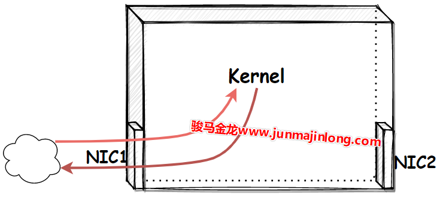
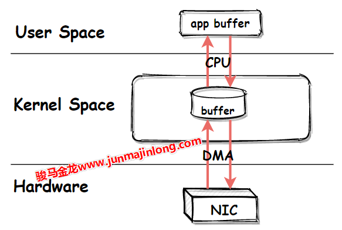
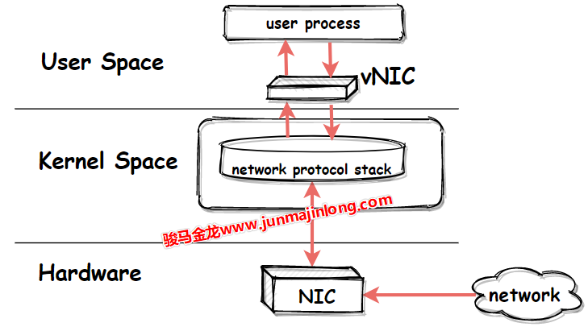
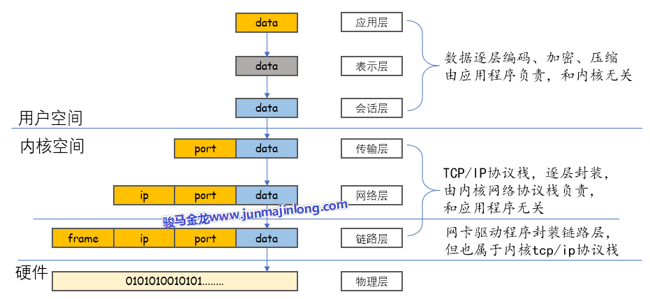
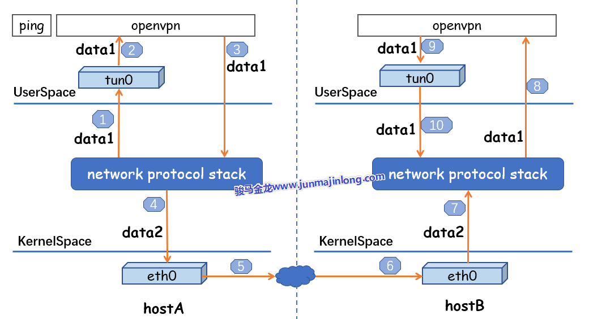
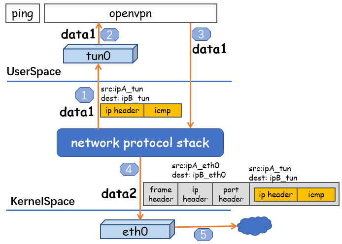
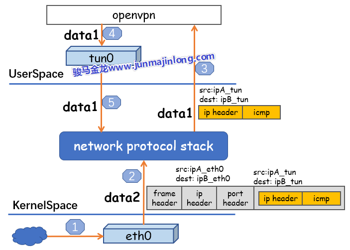
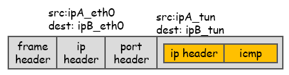

# tuntap

## 物理网卡收发数据的流程

　　物理网卡可以接收和发送数据：

* 收：外界向该物理网卡发送数据时，外界发送到网卡的数据最终会传输到内核空间的网络协议栈中
* 发：本机要从物理网卡发送数据时，数据将从内核的网络协议栈传输到网卡，网卡负责将数据发送出去
* 现在的网卡具备DMA能力，所以网卡和网络协议栈之间的数据传输由网卡负责，而非由内核亲自占用CPU来执行读和写

　　这里可以将内核看作是一个封闭的加工厂，将物理网卡看作是加工厂的一扇门，门的一端是加工厂，门的另一端是外界。物理网卡也一样，它的一端是内核空间的网络协议栈，另一端是外界网络，物理网卡就是这两者之间以比特流方式收发数据的硬件设备。

​​

　　一般来说，数据的起点和终点是用户程序，所以多数时候的数据需要在用户空间和内核空间(网络协议栈)再传输一次：

* 当用户进程的数据要发送出去时，数据从用户空间写入内核的网络协议栈，再从网络协议栈传输到网卡，最后发送出去
* 当用户进程等待外界响应数据时，数据从网卡流入，传输至内核的网络协议栈，最后数据写入用户空间被用户进程读取

　　在这些过程中，**内核和用户空间的数据传输由内核占用CPU来完成，内核和网卡之间的数据传输由网卡的DMA来完成**，不需要占用过多的CPU。

​​

## 虚拟网卡设备

　　物理网卡需要通过网卡驱动在内核中注册后才能工作，它在内核网络协议栈和外界网络之间传递数据，用户可以为物理网卡配置网卡接口属性，比如IP地址，这些属性都配置在内核的网络协议栈中。

　　内核也可以直接创建虚拟的网卡，只要为虚拟网卡提供网卡驱动程序，使其在内核中可以注册成为网卡设备，它就可以工作。

　　其实，从Linux内核3.x版本开始，物理网卡和虚拟网卡是平等的设备，它们都会在注册时创建net_device数据结构来保存(物理或虚拟)设备信息。

　　相比于物理网卡负责内核网络协议栈和外界网络之间的数据传输，虚拟网卡的两端则是**内核网络协议栈和用户空间**，它负责在内核网络协议栈和用户空间的程序之间传递数据：

* 发送到虚拟网卡的数据来自于用户空间，然后被内核读取到网络协议栈中
* 内核写入虚拟网卡准备通过该网卡发送的数据，目的地是用户空间

​​

## 虚拟网卡和物理网卡的对比

　　和物理网卡对比一下，物理网卡是硬件网卡，它位于硬件层，虚拟网卡则可以看作是用户空间的网卡，就像用户空间的文件系统(fuse)一样。

　　物理网卡和虚拟网卡唯一的不同点在于物理网卡本身的硬件功能：物理网卡以比特流的方式传输数据。

　　也就是说，内核会公平对待物理网卡和虚拟网卡，物理网卡能做的配置，虚拟网卡也能做。比如可以为虚拟网卡接口配置IP地址、设置子网掩码，可以将虚拟网卡接入网桥等等。

　　只有在数据流经物理网卡和虚拟网卡的那一刻，才会体现出它们的不同，即传输数据的方式不同：物理网卡以比特流的方式传输数据，虚拟网卡则直接在内存中拷贝数据(即，在内核之间和读写虚拟网卡的程序之间传输)。

　　正因为虚拟网卡不具备物理网卡以比特流方式传输数据的硬件功能，所以，**绝不可能通过虚拟网卡向外界发送数据，外界数据也不可能直接发送到虚拟网卡上**。能够直接收发外界数据的，只能是物理设备。

　　虽然虚拟网卡无法将数据传输到外界网络，但却：

* **可以将数据传输到本机的另一个网卡(虚拟网卡或物理网卡)或其它虚拟设备(如虚拟交换机)上**
* **可以在用户空间运行一个可读写虚拟网卡的程序，该程序可将流经虚拟网卡的数据包进行处理**，这个用户程序就像是物理网卡的硬件功能一样，可以收发数据(可将物理网卡的硬件功能看作是嵌入在网卡上的程序)，比如OpenVPN就是这样的工具

　　很多人会误解这样的用户空间程序，认为它们可以对数据进行封装。比如认为OpenVPN可以在数据包的基础上再封装一层隧道IP首部，但这种理解是错的。

　　一定请注意，**用户空间的程序是无法对数据包做任何封装和解封操作的，所有的封装和解封都只能由内核的网络协议栈来完成**。

​​

　　使用OpenVPN之所以可以对数据再封装一层隧道IP层，是因为OpenVPN可以读取已经封装过一次IP首部的数据，并将包含ip首部的数据作为普通数据通过虚拟网卡再次传输给内核。因为内核接收到的是来自虚拟网卡的数据，所以内核会将其当作普通数据从头开始封装(从四层封装到二层封装)。当数据从网络协议栈流出时，就有了两层IP首部的封装。

　　换句话说，每一次看似由用户空间程序进行的额外封装，都意味着数据要从内核空间到用户空间，再到内核空间。以OpenVPN为例：

```bash
tcp/ip stack --> tun --> OpenVPN --> tcp/ip stack --> Phyical NIC
```

　　其中tun是OpenVPN创建的一个三层虚拟网卡，tun设备在用户空间和内核空间之间传递数据。

　　具体的openvpn数据封装和数据流向的细节，参考更详细的[通过openvpn分析tun实现隧道的数据流程](https://www.junmajinlong.com/virtual/network/data_flow_about_openvpn)。

## 虚拟网卡设备tun/tap

　　tun、tap是Linux提供的两种可收发数据的虚拟网卡设备。

　　tun、tap作为虚拟网卡，除了不具备物理网卡的硬件功能外，它们和物理网卡的功能是一样的，此外**tun、tap负责在内核网络协议栈和用户空间之间传输数据**。

### tun或tap的区别

　　tun和tap都是虚拟网卡设备，但是：

* tun是三层设备，其封装的外层是IP头
* tap是二层设备，其封装的外层是以太网帧(frame)头
* tun是PPP点对点设备，没有MAC地址
* tap是以太网设备，有MAC地址
* tap比tun更接近于物理网卡，可以认为，tap设备等价于去掉了硬件功能的物理网卡

　　这意味着，如果提供了用户空间的程序去收发tun/tap虚拟网卡的数据，所收发的内容是不同的：

* **收发tun设备的用户程序，只能间接提供封装和解封数据包的IP头的功能**
* **收发tap设备的用户程序，只能间接提供封装和解封数据包的帧头的功能**
* 注意，此处用词是【收发数据】而非【处理数据】，是【间接提供】而非【直接提供】，因为在不绕过内核网络协议栈的情况下，读写虚拟网卡的用户程序是不能封装和解封数据的，只有内核的网络协议栈才能封装和解封数据。如果不理解，请看[通过openvpn分析tun实现隧道的数据流程](https://www.junmajinlong.com/virtual/network/data_flow_about_openvpn)

　　前面说过，虚拟网卡的两个主要功能是：

* 连接其它设备(虚拟网卡或物理网卡)和虚拟交换机(bridge)
* 提供用户空间程序去收发虚拟网卡上的数据

　　基于这两个功能，**tap设备通常用来连接其它网络设备(它更像网卡)，tun设备通常用来结合用户空间程序实现再次封装**。换句话说，tap设备通常接入到虚拟交换机(bridge)上作为局域网的一个节点，tun设备通常用来实现三层的ip隧道。

　　但tun/tap的用法是灵活的，只不过上面两种使用场景更为广泛。例如，除了可以使用tun设备来实现ip层隧道，使用tap设备实现二层隧道的场景也颇为常见。

## 创建并使用tun/tap设备

　　使用命令创建tun、tap设备的方式有多种，比如`openvpn --mktun`​、`ip tuntap`​、`tunctl`​等。

```bash
$ openvpn --mktun --dev tun0
$ openvpn --mktun --dev tap0

$ ip tuntap add dev tun0 mode tun
$ ip tuntap add dev tap0 mode tap

$ tunctl -t tap0      # 默认创建tap设备
$ tunctl -n -t tap0
```

　　可使用ifconfig等工具查看这些虚拟网络设备。

```bash
$ ifconfig -a
# 注意tap0是以太网设备，具有MAC地址
tap0: flags=4098<BROADCAST,MULTICAST>  mtu 1500
   ether 0e:38:5b:10:e9:1c  txqueuelen 1000  (Ethernet)
......

# 注意tun0是POINTOPOINT设备，没有MAC地址
tun0: flags=4241<UP,POINTOPOINT,NOARP,MULTICAST>  mtu 1500
   inet 10.10.10.10  netmask 255.255.255.255  destination 10.10.10.10
   unspec 00-00-00-00-00-00-00-00-00-00-00-00-00-00-00-00  txqueuelen 500  (UNSPEC)
......
```

　　可以为tun/tap分配IP地址或配置其它属性，例如：

```bash
ifconfig tun0 10.0.0.33 up

# 或者
ip link set tun0 up
ip addr add 10.0.0.33/24 dev tun0
```

## tun/tap的创建细节

　　下面介绍一些创建tun、tap的底层细节。

　　创建tun/tap设备时，内核会自动为tun、tap提供网卡驱动程序，使其能正常工作。此外，内核还会为tun、tap提供字符设备驱动，使其能够在用户空间和内核空间传递数据。

　　其实，tun和tap都是基于/dev/net/tun字符设备所创建(或称为克隆)的虚拟网络设备：

```bash
$ ls -l /dev/net/tun
crw-rw-rw-. 1 root root ... /dev/net/tun
```

　　Linux中创建tun、tap时，要求打开/dev/net/tun设备，打开后会返回一个文件描述符fd，再使用`ioctl()`​在此fd上注册tun或tap设备，注册后将自动创建tunX或tapX设备(这取决于ioctl()中注册的设备类型)，其中X是一个从0开始的正整数。创建成功后，在ifconfig等命令中就可以看到tunX或tapX。

　　在使用ioctl()注册时，还可以指定创建的tun/tap设备是否持久保留，如果不持久保留，那么程序退出或关闭fd，都会自动移除对应的tun/tap设备。比如tunctl、ip、openvpn等工具创建的都是持久化的tun/tap设备，即使这些程序退出了，虚拟网卡设备也仍然保留。

　　注册tun或tap之后，可使用fd来读写tunX或tapX设备文件。

　　用户程序读写tunX或tapX设备，即表示虚拟网卡收发数据(在用户空间和内核网络协议栈之间传输数据)：

* 读虚拟网卡表示从虚拟网卡收，即读取来自内核网络协议栈的数据，这些数据是内核决策后决定要从tun/tap设备发送出去的数据，**一般是已经被内核封装过的数据**
* 写虚拟网卡表示向虚拟网卡发，即用户空间程序将数据写入网卡tun/tap，内核网络协议栈将收到这些数据并**对数据进行解封**(就像外界数据经过物理网卡后进入内核协议栈一样)

　　程序从虚拟网卡中读数据没什么可讲的，但写虚拟网卡却有必要一提。

## 通过openvpn分析tun实现隧道的数据流程

　　公网上的两个主机节点A、B，物理网卡上配置的IP分别是ipA_eth0和ipB_eth0。

　　在A、B两个节点上分别运行openvpn的客户端和服务端，它们都会在自己的节点上创建tun设备，且都会读取或写入这个tun设备。

　　假设这两个tun设备配置的IP地址分别是ipA_tun和ipB_tun，再在A、B节点上分别配置到目标tun IP的路由走本机的tun接口，两者就成功建立了一条能互相通信的隧道。

　　这里详细分析一下隧道通信的数据流程。以`ping ipB_tun`​为例，其整体流程图如下：

​​

　　其中data1和data2是什么，下面会说明。

### 通过openvpn发送数据

　　当A节点数据要通过隧道发向B节点时：

* 用户空间执行`ping ipB_tun`​，ping程序会请求内核网络协议栈构建icmp协议请求数据
* 经过路由决策，该icmp协议数据要走tun0接口，于是内核将数据从网络协议栈写入tun0设备

  * 写入tun0设备之前，网络协议栈会对icmp请求数据进行封装，假设封装后的数据称为data1
  * tun是三层设备，所以data1中只封装IP头，不封装以太网帧头，其源和目标IP分别是ipA_tun、ipB_tun
  * 注意，data1中没有封装以太网帧头
* OpenVPN读取tun0设备数据，将读取到的data1数据当作普通数据发向B节点的eth0地址ipB_eth0，于是data1写入到网络协议栈

  * 用户程序OpenVPN从虚拟网卡读取的数据是原封不动地data1，其中包含了内核已经封装过的IP头，OpenVPN是无法对数据进行解封的
  * OpenVPN请求内核将data1作为普通数据发送出去，于是包含IP头的data1被写入内核网络协议栈
  * 内核经过路由决策，data1数据要从本机的eth0接口流出
  * 所以网络协议栈会对data1进行封装，假设封装后的数据称为data2
  * data2中封装的内容包括：

    * OpenVPN的源和目标端口(因为OpenVPN是用户服务程序)
    * 两个节点的eth0的IP地址
    * 以太网帧头(因为数据要从物理层的eth0设备出去，所以要从四层封装到二层)
  * 注意data2中有两层IP头，内层的IP头即data1中的IP头是tun设备的IP，外层的IP头是物理网卡eth0的IP
* data2最终通过A的物理网卡eth0发送出去到达B节点的物理网卡eth0

　　以上完整流程如下图：

​​

### 通过openvpn接收收据

　　A节点通过eth0发送的数据经由网络最终会到达B节点的eth0接口。

* 当B节点的物理网卡eth0收到数据后，对比特流进行解析，得到data2数据，写入内核网络协议栈：

  * 网络协议栈会对data2解封，将以太网帧头、外层IP头和端口层剥掉，最终得到data1
  * 因为目标端口号是OpenVPN程序所监听的，所以解封后的data1数据交给OpenVPN，即内核将data1拷贝到用户空间
  * 注意，data1中完整地包含了A、B两节点中两个tun设备的源和目标IP
* OpenVPN程序得到data1后，发现目标IP是tun0设备的(虽然openvpn无法解封数据，但却可以分析数据)，于是将data1数据从用户空间写入tun0设备(就像外界数据流入物理网卡一样)，data1最终传输到tun0的另一端即内核的网络协议栈中

　　以上完整流程如下图：

​​

* B节点的网络协议栈对data1数据解封得到最内层的ICMP协议请求数据，同时内核发现目的IP是配置在本机tun0设备上的地址，于是响应它而非丢弃该数据。B构建响应数据的过程类似于A节点构建ping请求时的流程

  * ICMP协议位于tcp/ip协议栈中，不涉及应用层，所以直接由内核构建ping的响应数据
  * 因为解封data1时的源IP是A节点的ipA_tun，所以构建的响应目标是ipA_tun
  * 经过路由决策，该响应数据要从tun0流出，tun0是3层设备，所以只封装IP头(源IP和目标IP分别是ipB_tun、ipA_tun)，而不封装帧头
* 内核将响应数据写入tun0后，openvpn从中读取，读取后将其作为普通数据发送给ipA_eth0，于是数据写入网络协议栈，内核协议栈再次对其封装，包括端口号、两个eth0的IP地址以及以太网帧头，最终通过物理网卡eth0发送出去到达A节点

　　‍

### 程序写入虚拟网卡时的注意事项

　　用户空间的程序不可随意向虚拟网卡写入数据，因为写入虚拟网卡的这些数据都会被内核网络协议栈进行解封处理，就像来自物理网卡的数据都会被解封一样。

　　因此，如果**用户空间程序要写tun/tap设备，所写入的数据需具有特殊结构**：

* 要么是已经封装了PORT的数据，即传输层的tcp数据段或udp数据报
* 要么是已经封装了IP+PORT的数据，即ip层数据包
* 要么是已经封装了IP+PORT+MAC的数据，即链路层数据帧
* 要么是其它符合tcp/ip协议栈的数据，比如二层的PPP点对点数据，比如三层的icmp协议数据

　　也就是说，程序只能向虚拟网卡写入已经封装过的数据。

　　由于网络数据的封装都由内核的网络协议栈负责，所以程序写入虚拟网卡的数据实际上都原封不动地来自于上一轮的网络协议栈，用户空间程序无法对这部分数据做任何修改。

　　也就是说，这时**写虚拟网卡的用户空间程序仅充当了一个特殊的【转发】程序：要么转发四层tcp/udp数据，要么转发三层数据包，要么转发二层数据帧**。

　　这一段话可能不好理解，下面给个简单的示例分析。

　　假如物理网卡eth0从外界网络接收了这么一段特殊的ping请求数据：

​​

　　这份数据会从物理网卡传输到内核网络协议栈，网络协议栈会对其解封，解封的内容只能是tcp/ip协议栈中的内容，即只能解封帧头部、IP头部以及端口头部，网络协议栈解封后还剩下一段包含了内层IP头部(tun的IP)以及icmp请求的数据。

　　内核会根据刚才解封的端口号找到对应的服务进程，并将解封剩下的数据传输给该进程，即传输给用户空间的程序。

　　用户空间的程序不做任何修改地将读取到的包含了内层IP头部和ICMP请求的数据原封不动地写入虚拟网卡设备，内核从虚拟网卡接收到数据后，将数据进行解封，解封得到最终的icmp请求数据，于是内核开始构建用于响应ping请求的数据。
