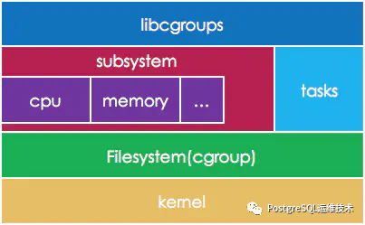
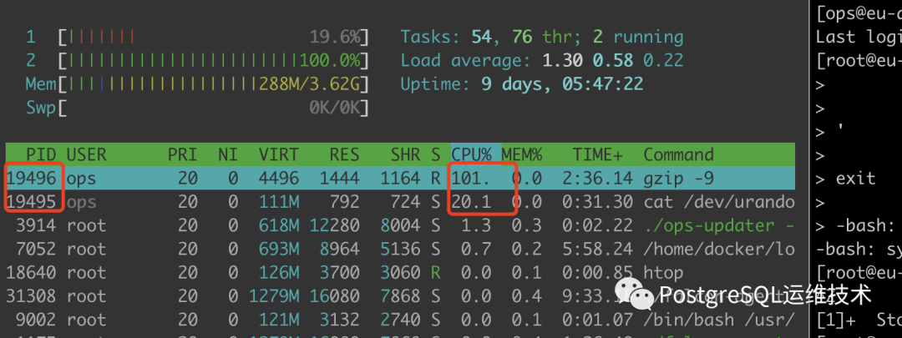
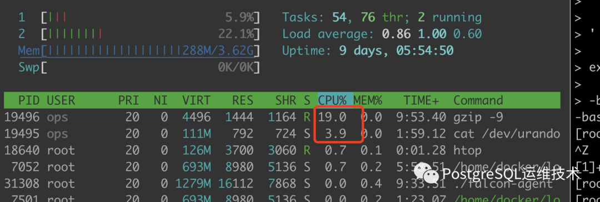

# cgroups

什么是cgroups?

cgroups, control groups（控制群组）的简写，是**linux内核**的一个功能，用来限制、控制与分离一个进程资源（如cpu、内存、磁盘等）。

那么linux又是如何让**用户态**的进程使用到cgroup(**内核态**)的功能呢？

答：**文件系统**，cgroup是一组通过cgroup文件系统限制的进程集合。

> A cgroup is a collection of processes that are bound to a set of limits or parameters defined via the cgroup filesystem.
>
> 来源：cgroups(7) — Linux manual page
> 注：关于用户态与内核态之间的转换可参考我之前的一篇文章linux之读写文件机制,cgroups内核功能比较特别的一点在于，它没有提供任何的系统调用接口，cgroups是直接通过vfs(虚拟文件系统）把功能暴露给用户态，cgroups和vfs之间的部分是cgroups 文件系统。

## rcgroup文件系统

Linux通过文件系统，将cgroups的功能和配置暴露给用户，文件系统上层还有一层虚拟文件系统（VFS）。VFS将具体文件系统的细节隐藏起来，给用户态提供一个统一的文件系统API接口。

文件本身是层级的，构成了hierarchery，这个层次结构是通过在cgroup文件系统中创建、删除和重命名子目录来定义。用户直接通过创建、读写和删除目录、文件来控制cgroups。



文件系统可以被linux操作系统使用，但是linux系统还找不到它，我们还需要把这个文件系统注册进linux操作系统中，即**挂载(mount)**

### 挂载cgroups文件系统

**查看cgroups挂载信息**

可以通过mount命令查看cgroups的挂载信息，如下所示，我的机器上，cgroups已经挂载了。

```bash
[ops@db-backup-001 ~]$  mount -t cgroup
cgroup on /sys/fs/cgroup/systemd type cgroup (rw,nosuid,nodev,noexec,relatime,xattr,release_agent=/usr/lib/systemd/systemd-cgroups-agent,name=systemd)
cgroup on /sys/fs/cgroup/blkio type cgroup (rw,nosuid,nodev,noexec,relatime,blkio)
cgroup on /sys/fs/cgroup/rdma type cgroup (rw,nosuid,nodev,noexec,relatime,rdma)
cgroup on /sys/fs/cgroup/cpu,cpuacct type cgroup (rw,nosuid,nodev,noexec,relatime,cpu,cpuacct)
cgroup on /sys/fs/cgroup/net_cls,net_prio type cgroup (rw,nosuid,nodev,noexec,relatime,net_cls,net_prio)
cgroup on /sys/fs/cgroup/memory type cgroup (rw,nosuid,nodev,noexec,relatime,memory)
cgroup on /sys/fs/cgroup/devices type cgroup (rw,nosuid,nodev,noexec,relatime,devices)
cgroup on /sys/fs/cgroup/cpuset type cgroup (rw,nosuid,nodev,noexec,relatime,cpuset)
cgroup on /sys/fs/cgroup/pids type cgroup (rw,nosuid,nodev,noexec,relatime,pids)
cgroup on /sys/fs/cgroup/hugetlb type cgroup (rw,nosuid,nodev,noexec,relatime,hugetlb)
cgroup on /sys/fs/cgroup/freezer type cgroup (rw,nosuid,nodev,noexec,relatime,freezer)
cgroup on /sys/fs/cgroup/perf_event type cgroup (rw,nosuid,nodev,noexec,relatime,perf_event)
```

如果没有的话，也可以通过以下命令来把想要的subsystem mount 到系统中：

```
$ mount -t cgroup -o cpu,cpuset,memory cpu_and_mem /cgroup/cpu_and_mem
```

这个命令就创建一个名为cpu\_and\_mem的层级，这个层级上附加了cpu,cpuset,memory三个子系统，并把层级挂载到了/cgroup/cpu\_and\_mem.

> 什么是子系统？
> cgroups支持的所有可配置的资源称为subsystem。例如cpu是一种subsystem，memory也是一种subsystem。linux内核在演进过程中subsystem是不断增加的。

**创建group**

创建cgroup，可以直接用mkdir 在对应的子资源中创建一个目录：

```bash
[root@db-backup-001 cpu]# mkdir /sys/fs/cgroup/cpu/mycgroup
[root@db-backup-001 cpu]# cd  /sys/fs/cgroup/cpu/mycgroup
[root@db-backup-001 mycgroup]# ls
cgroup.clone_children  cpuacct.usage_percpu_sys   cpu.rt_period_us
cgroup.procs           cpuacct.usage_percpu_user  cpu.rt_runtime_us
cpuacct.stat           cpuacct.usage_sys          cpu.shares
cpuacct.usage          cpuacct.usage_user         cpu.stat
cpuacct.usage_all      cpu.cfs_period_us          notify_on_release
cpuacct.usage_percpu   cpu.cfs_quota_us           tasks
```

上面的命令在cpu子系统中创建了mycgroup文件夹，该目录中会自动创建一些文件。

除了每个cgroup独特的资源控制文件，还有一些通用的文件。

- tasks：当前 cgroup 包含的任务（task）pid 列表，把某个进程的 pid 添加到这个文件中就等于把进程交由到该cgroup控制。
- cgroup.procs：使用逻辑和tasks相同。
- notify\_on\_release：0或者1，该文件的内容为1时，当cgroup退出时（不再包含任何进程和子cgroup），将调用release\_agent里面配置的命令。
- release\_agent：需要执行的命令。

**添加任务进程到cgroup**

```
echo PID > tasks
```

一次只能添加一个任务进程ID。如果有多个任务ID，需分多次添加。

cgroup各个子系统初始化时，默认把系统中所有进程都纳管了，将一个进程的pid添加到新建的cgroup tasks文件的操作，实际是从一个cgroup移入到另一个cgroup的操作。所以要将进程从某个cgroup中删除，只能通过将其移出到另一个cgroup来实现，或者将进程终止。

**删除 cgroup**

删除子资源，就是删除对应的目录：

```
rmdir /sys/fs/cgroup/cpu/mycgroup
```

## 限制cpu使用

跟cpu相关的子系统有cpu、cpuacct和cpuset。其中：

- cpuset主要用于设置cpu的亲和性，可以限制cgroup中的进程只能在指定的cpu上运行。
- cpuacct包含当前cgroup所使用的CPU的统计信息。
- cpu：限制cgroup的cpu使用上限。

此篇，我们主要看下cpu子系统的使用。

### cpu子系统

**1.限制进程可使用的CPU百分比。**

设置 CPU 数字的单位都是微秒，用us表示。

- cpu.cfs\_period\_us:时间周期长度，取值范围为1毫秒到1秒。
- cfs\_quota\_us：当前cgroup在设置的周期长度内所能使用的CPU时间。

两个文件配合起来设置CPU的使用上限。

示例：

1.限制只能使用1个CPU（每250ms能使用250ms的CPU时间）。

```
# echo 250000 > cpu.cfs_quota_us 
# echo 250000 > cpu.cfs_period_us 
```

2.限制使用2个CPU（内核）（每500ms能使用1000ms的CPU时间，即使用两个内核）

```
# echo 1000000 > cpu.cfs_quota_us
# echo 500000 > cpu.cfs_period_us
```

3.限制使用1个CPU的20%（每50ms能使用10ms的CPU时间，即使用一个CPU核心的20%）

```
# echo 10000 > cpu.cfs_quota_us
# echo 50000 > cpu.cfs_period_us
```

除了cpu.cfs\_quota\_us和cpu.cfs\_period\_us，

**2.cpu.shares**

用来设置CPU的相对值，并且是针对所有的CPU（内核），默认值是1024，假如系统中有两个cgroup，分别是A和B，A的shares值是1024，B的shares值是512，那么A将获得1024/(1204+512)=66%的CPU资源，而B将获得33%的CPU资源。

shares有两个特点:

- 如果A不忙，没有使用到66%的CPU时间，那么剩余的CPU时间将会被系统分配给B，即B的CPU使用率可以超过33%
- 如果添加了一个新的cgroup C，且它的shares值是1024，那么A的限额变成了1024/(1204+512+1024)=40%，B的变成了20%。

综上，我们看到shares是一个绝对值，需要和其他cgroup的值进行比较才能得到自己的相对限额。

### 模拟使用cgourp限制cpu的例子

1.使用如下命令模拟高cpu使用率。

```
cat /dev/urandom | gzip -9 > /dev/null
```

2.查看当前系统使用率。

​

可以看到pid为19496的进程的cpu使用率达到了100%。现在我们使用cgroups将它限制到20%。

3.在/sys/fs/cgroup/cpu/目录下创建mycgroup文件夹，并设置cpu.cfs\_quota\_us为10000，cpu.cfs\_period\_us为50000。将19496添加到tasks中。

```
# mkdir /sys/fs/cgroup/cpu/mycgroup
# cd /sys/fs/cgroup/cpu/mycgroup
# echo 10000 > cpu.cfs_quota_us
# echo 50000 > cpu.cfs_period_us
# echo 19496 > tasks
```

4.再次观察19496的cpu使用率，降到了20%。

​
