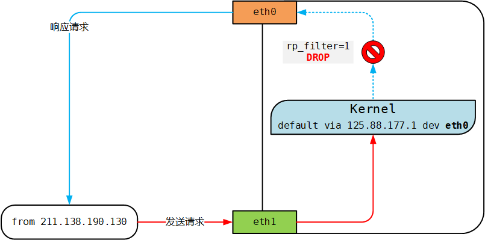

# rp_filter

# 说明

内核的 rp\_filter (Reverse Path Filtering 反向路径过滤)参数用于控制系统是否开启对数据包源地址的校验，Linux  [内核文档](https://www.baidu.com/link?url=2x1snmPs3FowXF4IgsntmrWh6TbFiojKKvF3lTRYe8K5oci44n83yIJvXRGJz-0V0rXxUhmqkaeWUBT7C_7AE7u-Vq2YlwBb-PkUhodVa5C&wd=&eqid=a1e7ed7e0000f7730000000359a423c3) 中的描述：

复制

```plain
rp_filter - INTEGER
0 - No source validation.
1 - Strict mode as defined in RFC3704 Strict Reverse Path
    Each incoming packet is tested against the FIB and if the interface
    is not the best reverse path the packet check will fail.
    By default failed packets are discarded.
2 - Loose mode as defined in RFC3704 Loose Reverse Path
    Each incoming packet's source address is also tested against the FIB
    and if the source address is not reachable via any interface
    the packet check will fail.

　　Current recommended practice in RFC3704 is to enable strict mode
to prevent IP spoofing from DDos attacks. If using asymmetric routing
or other complicated routing, then loose mode is recommended.
　　The max value from conf/{all,interface}/rp_filter is used
when doing source validation on the {interface}.
　　Default value is 0. Note that some distributions enable itin startup scripts.
```

rp\_filter 参数有三个值：

- 0：不开启源地址校验
- 1：开启严格的反向路径校验。对每个进来的数据包，校验其反向路径是否是最佳路径。如果反向路径不是最佳路径，则直接丢弃该数据包
- 2：开启松散的反向路径校验。对每个进来的数据包，校验其源地址是否可达，即反向路径是否能通（通过任意网口），如果反向路径不通，则直接丢弃该数据包

​`/etc/sysctl.conf`​ 中包含 all 和 eth/lo（具体网卡）的 rp\_filter 参数，取其中较大的值生效。

# 应用场景

假设一台 Linux 服务器在提供 Web 服务的同时又充当了路由器的功能，并且该服务器有多个网卡，配置的 IP 地址也不属于同一运营商。


如图所示，在服务器的 eth0 网卡上配置了电信 IP 125.88.177.76，在 eth1 网卡上配置了移动 IP 183.232.239.248。电信的网络质量比较好，通常配置默认网关为电信 IP 的网关。至于移动 IP 如何到达它的网关并访问互联网的，因为涉及到 Linux 的高级路由，这里不再讨论。

现在来自 IP 是 211.138.190.130 的客户端，向这台机器移动 IP 的 Web 服务发送请求，即 eth1 上的`183.232.239.248:80`​。系统 rp\_filter 参数的配置为：

复制

```plain
[root@m1 ~]# sysctl -p --pattern 'rp_filter'
net.ipv4.conf.default.rp_filter = 1
net.ipv4.conf.all.rp_filter = 1
[root@m1 ~]#
```



如上图红色箭头所示，客户端发送请求到服务器端的 eth1 网卡，服务器端收到请求开始进行对客户端 211.138.190.130 的响应，此时查看本机的路由表发现到客户端 211.138.190.130 是从 eth0 出去的，并且内核的参数 `rp_filter = 1`​，因此系统会严格校验数据包的反向路径，请求数据包入网卡和响应数据包出网卡不是同一个网卡，这时候系统会判断该反向路径不是最佳路径，而直接丢弃该请求数据包。

为了避免这种问题，配置 `/etc/sysctl.conf`​禁用 rp\_filter ，然后使用 `sysctl -p`​ 刷新到内存即可立即生效

复制

```bash
# Controls source route verification
net.ipv4.conf.default.rp_filter = 0
net.ipv4.conf.all.rp_filter = 0
```

或者，你还可以指定一条静态路由让响应数据包出网卡和请求数据包入网卡变成一样的，这样反向路径就是最佳路径了，内核不会丢弃。

复制

```bash
ip route add to 211.138.190.130 via 183.232.239.1 dev eth1
```

# 作用

启用了 rp\_filter 之后可以减少 DDoS 攻击：校验数据包的反向路径，如果反向路径不合适，则直接丢弃数据包，避免过多的无效连接消耗系统资源。

还可以防止 IP Spoofing：校验数据包的反向路径，如果客户端伪造的源 IP 地址对应的反向路径不在路由表中，或者反向路径不是最佳路径，则直接丢弃数据包，不会向伪造 IP 的客户端回复响应。
