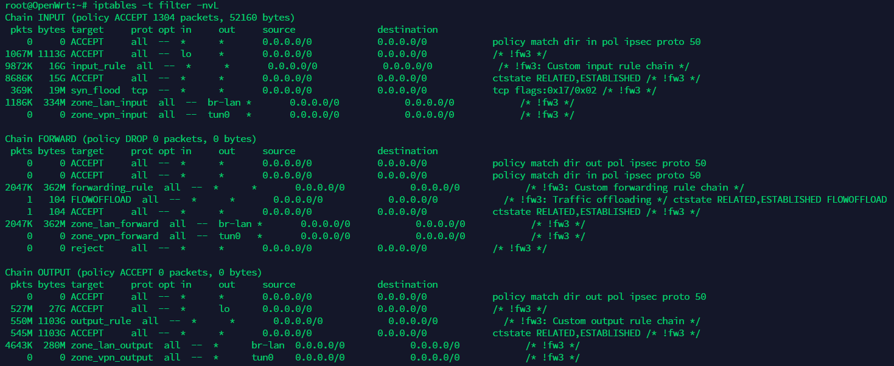

# 四表五链

## iptables流程图

　　首先我们来看一下下面的这张图了解一下iptables中的表和链的概念。图中使用箭头展示了用户访问使用了iptables的机器的过程，其中按照箭头的顺序我们就可以将其梳理为一条大的带有分支的链条，在每个需要进行操作的模块处都标有名称和相应的括号，括号内的就是iptables的四表，而每个模块都可以视为一个链。

​​

> CentOS7中的input链中还有nat表，但是在CentOS6中并没有。

　　之所以叫做链就是因为在访问该链的时候会按照每个链对应的表依次进行查询匹配执行的操作，如`PREROUTING`​链对应的就是(`raw`​->`mangle`​->`nat`​)，每个表按照优先级顺序进行连接，每个表中还可能有多个规则，因此最后看起来就像链一样，因此称为链。而`iptables`​的表中存储的就是对应的规则和需要执行的操作，这里以路由器为例查看其中`iptables`​的`filter`​表：

​​

　　注意每一个链对应的表都是不完全一样的，表和链之间是多对多的对应关系。但是不管一个链对应多少个表，它的表都是按照下面的优先顺序来进行查找匹配的。

　　**表的处理优先级：**​**​`raw`​**​ **&gt;**​**​`mangle`​**​ **&gt;**​**​`nat`​**​ **&gt;**​**​`filter`​**​ **。**

## 2.2 四表

　　​`iptables`​的四个表`iptable_filter`​，`iptable_mangle`​，`iptable_nat`​，`iptable_raw`​，默认表是`filter`​（没有指定表的时候就是filter表）。

* ​`filter 表`​：用来对数据包进行过滤，具体的规则要求决定如何处理一个数据包。  
  对应的内核模块为：`iptable_filter`​，其表内包括三个链：`input`​、`forward`​、`output`​;
* ​`nat 表`​：nat 全称：network address translation 网络地址转换，主要用来修改数据包的 IP 地址、端口号信息。  
  对应的内核模块为：`iptable_nat`​，其表内包括三个链：`prerouting`​、`postrouting`​、`output`​;
* ​`mangle 表`​：主要用来修改数据包的服务类型，生存周期，为数据包设置标记，实现流量整形、策略路由等。  
  对应的内核模块为：`iptable_mangle`​，其表内包括五个链：`prerouting`​、`postrouting`​、`input`​、`output`​、`forward`​;
* ​`raw 表`​：主要用来决定是否对数据包进行状态跟踪。  
  对应的内核模块为：`iptable_raw`​，其表内包括两个链：`output`​、`prerouting`​;

> raw表只使用在`PREROUTING`​链和`OUTPUT`​链上,因为优先级最高，从而可以对收到的数据包在系统进行ip_conntrack（连接跟踪）前进行处理。一但用户使用了raw表,在某个链上，raw表处理完后，将跳过NAT表和ip_conntrack处理，即不再做地址转换和数据包的链接跟踪处理了。RAW表可以应用在那些不需要做nat的情况下，以提高性能。

## 2.3 五链

　　​`iptables`​的五个链`PREROUTING`​，`INPUT`​，`FORWARD`​，`OUTPUT`​，`POSTROUTING`​。

* ​`input 链`​：当收到访问防火墙本机地址的数据包时，将应用此链中的规则；
* ​`output 链`​：当防火墙本机向外发送数据包时，将应用此链中的规则；
* ​`forward 链`​：当收到需要通过防火中转发给其他地址的数据包时，将应用此链中的规则，注意如果需要实现forward转发需要开启Linux内核中的ip_forward功能；
* ​`prerouting 链`​：在对数据包做路由选择之前，将应用此链中的规则；
* ​`postrouting 链`​：在对数据包做路由选择之后，将应用此链中的规则；

## 2.4 iptables的常见情况

　　下面我们利用上面的流程图来对几种常见的情况解析：**关键点在于发往iptables主机的数据包的目的地址是否是iptables主机本机**。如果是，那我们就可以理解为常见的开启了iptables防火墙的网站服务器主机；如果不是，那就是走ip_forward进行转发，比如我们常见的NAT路由器的NAT服务和策略路由等。如下图为开启了ip_forward功能的openwrt路由器。

```bash
email:/etc/wireguard# cat /proc/sys/net/ipv4/ip_forward
1
email:/etc/wireguard# 
```

　　‍
