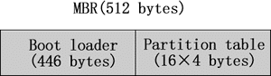

# Linux系统是如何识别硬盘设备和硬盘分区的

Linux 系统初始化时，会根据 MBR 来识别硬盘设备。

MBR，全称 Master Boot Record，可译为硬盘主引导记录，占据硬盘 0 磁道的第一个扇区。MBR 中，包括用来载入操作系统的可执行代码，实际上，此可执行代码就是 MBR 中前 446 个字节的 boot loader 程序（引导加载程序），而在 boot loader 程序之后的 64 个（16×4）字节的空间，就是存储的分区表（Partition table）相关信息。如图 1 所示。

在分区表（Partition table）中，主要存储的值息包括分区号（Partition id）、分区的起始磁柱和分区的磁柱数量。所以 Linux 操作系统在初始化时就可以根据分区表中以上 3 种信息来识别硬盘设备。其中，常见的分区号如下：

* 0x5（或 0xf）：可扩展分区（Extended partition）。
* 0x82：Linux 交换区（Swap partition）。
* 0x83：普通 Linux 分区（Linux partition）。
* 0x8e：Linux 逻辑卷管理分区（Linux LVM partition）。
* 0xfd：Linux 的 RAID 分区（Linux RAID auto partition）。

由于 MBR 留给分区表的磁盘空间只有 64 个字节，而每个分区表的大小为 16 个字节，所以在一个硬盘上最多可以划分出 4 个主分区。如果想要在一个硬盘上划分出 4 个以上的分区时，可以通过在硬盘上先划分出一个可扩展分区的方法来增加额外的分区。

不过，在 Linux 的 Kernel 中所支持的分区数量有如下限制：

* 一个 IDE 的硬盘最多可以使用 63 个分区；
* 一个 SCSI 的硬盘最多可以使用 15 个分区。

接下来的问题，就是为什么要将一个硬盘划分成多个分区，而不是直接使用整个硬盘呢？其主要有如下原因：

1. 方便管理和控制
    首先，可以将系统中的数据（也包括程序）按不同的应用分成几类，之后将这些不同类型的数据分别存放在不同的磁盘分区中。由于在每个分区上存放的都是类似的数据或程序，这样管理和维护就简单多了。
2. 提高系统的效率
    给硬盘分区，可以直接缩短系统读写磁盘时磁头移动的距离，也就是说，缩小了磁头搜寻的范围；反之，如果不使用分区，每次在硬盘上搜寻信息时可能要搜寻整个硬盘，所以速度会很慢。另外，硬盘分区也可以减轻碎片（文件不连续存放）所造成的系统效率下降的问题。
3. 使用磁盘配额的功能限制用户使用的磁盘量
    由于限制用户使用磁盘配额的功能，只能在分区一级上使用，所以，为了限制用户使用磁盘的总量，防止用户浪费磁盘空间（甚至将磁盘空间耗光），最好将磁盘先分区，然后在分配给一般用户。
4. 便于备份和恢复
    硬盘分区后，就可以只对所需的分区进行备份和恢复操作，这样的话，备份和恢复的数据量会大大地下降，而且也更简单和方便。
