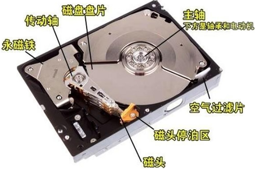
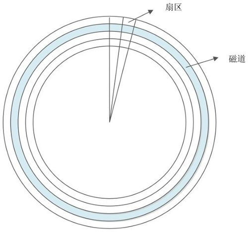
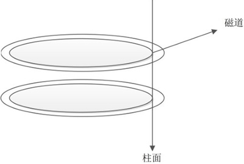

# 1. 硬盘结构（机械硬盘和固态硬盘）详解

在 Linux 系统中，文件系统是创建在硬盘上的，因此，要想彻底搞清楚文件系统的管理机制，就要从了解硬盘开始。

硬盘是计算机的主要外部存储设备。计算机中的存储设备种类非常多，常见的主要有光盘、硬盘、U 盘等，甚至还有网络存储设备 SAN、NAS 等，不过使用最多的还是硬盘。

如果从存储数据的介质上来区分，硬盘可分为机械硬盘（Hard Disk Drive, HDD）和固态硬盘（Solid State Disk, SSD），机械硬盘采用磁性碟片来存储数据，而固态硬盘通过闪存颗粒来存储数据。

## 机械硬盘(HDD)

我们先来看看最常见的机械硬盘。机械硬盘的外观大家可能都见过，那么机械硬盘拆开后是什么样子的呢？如图 1 所示。

​​

机械硬盘主要由磁盘盘片、磁头、主轴与传动轴等组成，数据就存放在磁盘盘片中。大家见过老式的留声机吗？留声机上使用的唱片和我们的磁盘盘片非常相似，只不过留声机只有一个磁头，而硬盘是上下双磁头，盘片在两个磁头中间高速旋转，类似图 2。

​​

也就是说，机械硬盘是上下盘面同时进数据读取的。而且机械硬盘的旋转速度要远高于唱片（目前机械硬盘的常见转速是 7200  r/min），所以机械硬盘在读取或写入数据时，非常害怕晃动和磕碰。另外，因为机械硬盘的超高转速，如果内部有灰尘，则会造成磁头或盘片的损坏，所以机械硬盘内部是封闭的，如果不是在无尘环境下，则禁止拆开机械硬盘。

#### 机械硬盘的逻辑结构

我们已经知道数据是写入磁盘盘片的，那么数据是按照什么结构写入的呢？机械硬盘的逻辑结构主要分为磁道、扇区和拄面。我们来看看图 3。

​​

什么是磁道呢？每个盘片都在逻辑上有很多的同心圆，最外面的同心圆就是 0  磁道。我们将每个同心圆称作磁道（注意，磁道只是逻辑结构，在盘面上并没有真正的同心圆）。硬盘的磁道密度非常高，通常一面上就有上千个磁道。但是相邻的磁道之间并不是紧挨着的，这是因为磁化单元相隔太近会相互产生影响。

那扇区又是十么呢？扇区其实是很形象的，大家都见过折叠的纸扇吧，纸扇打开后是半圆形或扇形的，不过这个扇形是由每个扇骨组合形成的。在磁盘上每个同心圆是磁道，从圆心向外呈放射状地产生分割线（扇骨），将每个磁道等分为若干弧段，每个弧段就是一个扇区。每个扇区的大小是固定的，为  512Byte。扇区也是磁盘的最小存储单位。

柱面又是什么呢？如果硬盘是由多个盘片组成的，每个盘面都被划分为数目相等的磁道，那么所有盘片都会从外向内进行磁道编号，最外侧的就是 0 磁道。具有相同编号的磁道会形成一个圆柱，这个圆柱就被称作磁盘的柱面，如图 4 所示。

​​

硬盘的大小是使用"磁头数 x 柱面数 x 扇区数 x  每个扇区的大小"这样的公式来计算的。其中，磁头数（Heads）表示硬盘共有几个磁头，也可以理解为硬盘有几个盘面，然后乘以  2；柱面数（Cylinders）表示硬盘每面盘片有几条磁道；扇区数（Sectors）表示每条磁道上有几个扇区；每个扇区的大小一般是  512Byte。

#### 硬盘的接口

机械硬盘通过接口与计算机主板进行连接。硬盘的读取和写入速度与接口有很大关系。大家都见过大礼堂吧，大礼堂中可以容纳很多人，但是如果只有一扇很小的门，那么人是很难进入或出来的，这样会造成拥堵，甚至会出现事故。机械硬盘的读取和写入也是一样的，如果接口的性能很差，则同样会影响机械硬盘的性能。

目前，常见的机械硬盘接口有以下几种：

* IDE 硬盘接口（Integrated Drive Eectronics，并口，即电子集成驱动器）也称作 "ATA硬盘" 或  "PATA硬盘"，是早期机械硬盘的主要接口，ATA133 硬盘的理论速度可以达到 133MB/s（此速度为理论平均值），IDE 硬盘接口如图 5  所示。

  ​​

* SATA 接口（Serial ATA，串口），是速度更高的硬盘标准，具备了更高的传输速度，并具备了更强的纠错能力。目前已经是 SATA 三代，理论传输速度达到 600MB/s（此速度为理论平均值），如图 6 所示。

  ​​

* SCSI 接口（Small Computer System Interface，小型计算机系统接口），广泛应用在服务器上，具有应用范围广、多任务、带宽大、CPU 占用率低及热插拔等优点，理论传输速度达到 320MB/s，如图 7 所示。  
  ​​

## 固态硬盘（SSD）

固态硬盘和传统的机械硬盘最大的区别就是不再采用盘片进行数据存储，而采用存储芯片进行数据存储。固态硬盘的存储芯片主要分为两种：一种是采用闪存作为存储介质的；另一种是采用DRAM作为存储介质的。目前使用较多的主要是采用闪存作为存储介质的固态硬盘，如图  8 所示。

​​

固态硬盘和机械硬盘对比主要有以下一些特点，如表 1 所示。

|对比项目|固态硬盘|机械硬盘|
| -----------| -----------------| ----------|
|容量|较小|大|
|读/写速度|极快|—般|
|写入次数|5000〜100000 次|没有限制|
|工作噪声|极低|有|
|工作温度|极低|较高|
|防震|很好|怕震动|
|重量|低|高|
|价格|高|低|

大家可以发现，固态硬盘因为丟弃了机械硬盘的物理结构，所以相比机械硬盘具有了低能耗、无噪声、抗震动、低散热、体积小和速度快的优势；不过价格相比机械硬盘更高，而且使用寿命有限。
