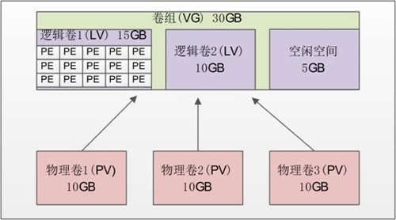

# 7. Linux LVM（逻辑卷管理）

我们在实际使用 Linux 服务器的时候，总会有一个让人头疼的问题，随着业务的增加，文件系统负载会越来越大，当到了空间不足的情况时，如果我们还在使用传统的分区方式管理硬盘，就不得不将现有的所有分区全部删除，并重新规划新的存储方案。

不仅如此，分区到底应该分多大呢？分得太大，会浪费硬盘空间；分得太小，又会面临不够使用的情况。如果在安装系统时规划不合理，这种困扰就会经常出现。如果真出现了分区不够用的情况，应该怎么解决呢？

在以往（2.4  内核以前）要想调整分区大小，要么先新建立一个更大的分区，然后复制旧分区中的内容到新分区，最后使用软链接来替代旧分区；要么使用调整分区大小的工具（如  parted），parted 虽然可以调整分区大小，但是它需要卸载分区之后才可以进行，也就是说需要停止服务。

其实，从一开始，我们就需要有一种管理机制来帮助我们动态地管理存储，LVM 就提供了这种功能。LVM 最大的好处就是可以随时调整分区的大小，分区中的现有数据不会丟失，并且不需要卸载分区、停止服务。

LVM 是 Logical Volume Manager 的简称，译为中文就是逻辑卷管理。它是 Linux 下对硬盘分区的一种管理机制。LVM 适合于管理大存储设备，并允许用户动态调整文件系统的大小。此外，LVM 的快照功能可以帮助我们快速备份数据。LVM 为我们提供了逻辑概念上的磁盘，使得文件系统不再关心底层物理磁盘的概念。

> Linux LVM 允许我们在逻辑卷在线的状态下将其复制到另一设备上，此成功被称为快照功能。快照允许我们在复制的同时，保证运行关键任务的 Web 服务器或数据库服务继续工作。

LVM 是在硬盘分区之上建立一个逻辑层，这个逻辑层让多个硬盘或分区看起来像一块逻辑硬盘，然后将这块逻辑硬盘分成逻辑卷之后使用，从而大大提高了分区的灵活性。我们把真实的物理硬盘或分区称作物理卷（PV）；由多个物理卷组成一块大的逻辑硬盘，叫作卷组（VG）；将卷组划分成多个可以使用的分区，叫作逻辑卷（LV）。而在 LVM 中最小的存储单位不再是 block，而是物理扩展块（Physical Extend，PE）。我们通过图 1 看看这些概念之间的联系。​

​​​

* 物理卷（Physical Volume，PV）：就是真正的物理硬盘或分区。
* 卷组（Volume Group，VG）：将多个物理卷合起来就组成了卷组。组成同一个卷组的物理卷可以是同一块硬盘的不同分区，也可以是不同硬盘上的不同分区。我们可以把卷组想象为一块逻辑硬盘。
* 逻辑卷（Logical Volume，LV）：卷组是一块逻辑硬盘，硬盘必须分区之后才能使用，我们把这个分区称作逻辑卷。逻辑卷可以被格式化和写入数据。我们可以把逻辑卷想象为分区。
* 物理扩展（Physical Extend，PE）：PE 是用来保存数据的最小单元，我们的数据实际上都是写入 PE 当中的。PE 的大小是可以配置的，默认是 4MB。

也就是说，我们在建立 LVM 的时候，需要按照以下步骤来进行： 

1. 把物理硬盘分成分区，当然也可以是整块物理硬盘；
2. 把物理分区建立为物理卷（PV），也可以直接把整块硬盘都建立为物理卷。
3. 把物理卷整合为卷组（VG）。卷组就已经可以动态地调整大小了，可以把物理分区加入卷组，也可以把物理分区从卷组中删除。
4. 把卷组再划分为逻辑卷（LV），当然逻辑卷也是可以直接调整大小的。我们说逻辑卷可以想象为分区，所以也需要格式化和挂载。

‍

---

## PV物理卷（创建、查看和删除）

第一步，就是要建立所需的物理分区，创建方式就是使用 fdisk 交互命令。需要注意的是，分区的系统 ID 不再是 Linux 默认的分区 ID 83，而要改成 LVM 的 ID 8e。在 /dev/sdb 硬盘中还有空闲空间，在这块硬盘中新建立 3 个分区，每 个分区的大小为 1GB。命令如下：

```bash
[root@localhost ~]# fdisk /dev/sdb #建立分区的命令省略
Command {m for help): p
Disk /dev/sdb: 21.5 GB, 21474836480 bytes 255 heads, 63 sectors/track, 2610 cylinders
Units = cylinders of 16065 * 512 = 8225280 bytes
Sector size (logical/physical): 512 bytes / 512 bytes
I/O size (minimum/optimal): 512 bytes / 512 bytes
Disk identifier: 0x00000ebd
Device Boot Start End Blocks Id System
/dev/sdbl 1 65 522081 83 Linux
/dev/sdb2 66 2610 20442712+ 5 Extended
/dev/sdb5 66 197 1060258+ 83 Linux
/dev/sdb6 198 329 1060258+ 83 Linux
/dev/sdb7 330 461 1060258+ 83 Linux
#建立了/dev/sdb5 ~ 7三个分区
Command (m for help): t
Partition number (1-7): 5
Hex code (type L to list codes): 8e
Changed system type of partition 5 to 8e (Linux LVM)
#把/dev/sdb5的分区ID改为8e，其他两个分区照做，改好后，查询结果如下：
Command (m for help): p
Disk /dev/sdb: 21.5 GB, 21474836480 bytes 255 heads, 63 sectors/track, 2610 cylinders
Units = cylinders of 16065 * 512 = 8225280 bytes
Sector size (logical/physical): 512 bytes / 512 bytes
I/O size (minimum/optimal): 512 bytes / 512 bytes Disk identifier: 0x00000ebd
Device Boot Start End Blocks Id System
/dev/sdb1 1 65 52.2081 83 Linux
/dev/sdb2 66 2610 20442712+ 5 Extended
/dev/sdb5 66 197 1060258+ 8e Linux LVM
/dev/sdb6 198 329 1060258+ 8e Linux LVM
/dev/sdb7 330 461 1060258+ 8e Linux LVM #保存退出
[root@localhost ~]# partprobe #记得重新读取分区表，否则重启系统
```

### 建立物理卷-pvcreate

建立物理卷的命令如下：

```bash
[root@localhost ~]# pvcreate [设备文件名]
```

在建立物理卷时，我们既可以把整块硬盘都建立成物理卷，也可以把某个分区建立成物理卷。如果要把整块硬盘都建立成物理卷，则命令如下：

‍

在建立物理卷时，我们既可以把整块硬盘都建立成物理卷，也可以把某个分区建立成物理卷。如果要把整块硬盘都建立成物理卷，则命令如下：  
 [root@localhost ~]# pvcreate /dev/sdb

```bash
[root@localhost ~]# pvcreate /dev/sdb
```

在我们的使用中要把分区建立成物理卷，所以执行以下命令：

```bash
[root@localhost ~]# pvcreate /dev/sdb5
Writing physical volume data to disk "/dev/sdb5" Physical volume "/dev/sdb5" successfully created
[root@localhost ~]# pvcreate /dev/sdb6
Writing physical volume data to disk "/dev/sdb6" Physical volume "/dev/sdb6" successfully created
[root@localhost ~]# pvcreate /dev/sdb7
Writing physical volume data to disk "/dev/sdb7" Physical volume 7dev/sdb7' successfully created
```

### 查看物理卷-pvscan

查看物理卷的命令有两个，第一个是 pvscan，用来查询系统中哪些硬盘或分区是物理卷。命令如下：

```bash
[root@localhost ~]# pvscan
PV /dev/sdb5 Ivm2 [1.01 GiB]
PV /dev/sdb6 Ivm2 [1.01 GiB]
PV /dev/sdb7 Ivm2 [1.01 GiB]
Total: 3 [3.03 GiB] /in no VG: 0 [0 ] / in no VG: 3 [3.03 GiB]
```

第二个查询命令是 pvdisplay，它可以查看到更详细的物理卷状态，命令如下：

```bash
[root@localhost ~]# pvdisplay
"/dev/sdb5" is a new physical volume of "1.01 GiB"
—NEW Physical volume 一
PV Name /dev/sdb5
#PV名
VG Name
#属于的VG名，还没有分配，所以空白
PV Size 1.01 GiB
#PV 的大小
Allocatable NO
#是否已经分配
PE Size 0
#PE大小，因为还没有分配，所以PE大小也没有指定
Total PE 0
#PE总数
Free PE 0
#空闲 PE数
Allocated PE 0
#可分配的PE数
PV UUID CEsVz3-t0sD-e1w0-wkHZ-iaLq-06aV-xtQNTB
#PV的UUID
…其它两个PV省略…
```

### 删除物理卷-pvremove

如果不再需要物理卷，则使用 pvremove 命令删除，命令如下：

```bash
 [root@localhost ~]# pvremove /dev/sdb7
 Labels on physical volume "/dev/sdb7" successfully wiped
```

在删除物理卷时，物理卷必须不属于任何卷组，也就是需要先将物理卷从卷组中删除，再删除物理卷。其实所有的删除就是把创建过程反过来，建立时不能少某个步骤，删除时也同样不能跳过某一步直接删除。

‍

---

## VG卷组（创建、激活、查看、扩容、减小及删除）

前面说过，可以把卷组想象成基本分区中的硬盘，是由多个物理卷组成的。卷组就已经可以动态地调整空间大小了，当卷组空间不足时，可以向卷组中添加新的物理卷。

### 建立卷组-vgcreate

建立卷组使用的命令是 vgcreate，具体命令格式如下：

```
 [root@localhost ~]# vgcreate [-s PE 大小] 卷组名 物理卷名
```

[-s PE 大小] 选项的含义是指定 PE 的大小，单位可以是 MB、GB、TB 等。如果不写，则默认 PE 大小是 4MB。这里的卷组名指的就是要创建的卷组的名称，而物理卷名则指的是希望添加到此卷组的所有硬盘区分或者整个硬盘。

我们有三个物理卷 /dev/sdb5~7，先把 /dev/sdb5 和 /dev/sdb6 加入卷组，命令如下：

```
 [root@localhost ~]# vgcreate -s 8MB scvg /dev/sdb5 /dev/sdb6
 Volume group "scvg" successfully created
 我们把/dev/sdb和/dev/sdb6两个物理卷加入了卷组scvg，并指定了PE的大小是8MB
```

### 激活卷组-vgchange

卷组创建完毕后，可以通过 vgchange 命令来激活卷组，而无法重启系统。

vgchange 命令的基本格式如下：

```bash
#激活卷组
[root@localhost ~]# vgchange -a y 卷组名
#停用卷组
[root@localhost ~]# vachange -a n 卷组名
```

### 查看卷组-vgscan

查看卷组的命令同样有两个：vgscan 命令主要用于查看系统中是否有卷组；而 vgdisplay 命令则用于查看卷组的详细状态。命令如下：

```bash
[root@1ocalhost ~]# vgscan
Reading all physical volumes. This may take a while...
Found volume group "scvg" using metadata type lvm2 #scvg卷组确实存在
[root@localhost ~]# vgdisplay
---Volume group ---
VG Name scvg 卷组名
System ID
Format lvm2
Metadata Areas 2
Metadata Sequence No 1
VG Access read/write
#卷组访问状态
VG Status resizable
#卷组状态
MAX LV 0
#最大逻辑卷数
Cur LV 0
Open LV 0
Max PV 0
#最大物理卷数
Cur PV 2
#当前物理卷数
Act PV 2
VG Size 2.02 GiB
#卷组大小
PE Size 8.00 MiB
#PE大小
Total PE 258
#PE总数
Alloc PE / Size 0/0
#已用 PE 数量/大小
Free PE / Size 258 / 2.02GiB
#空闲PE数量/大小
VG UUID Fs0dPf-LV7H-0Ir3-rthA-3UxC-LX5c-FLFriJ
```

### 增加卷组容量-vgexten

我们现在要把 /dev/sdb7 加入卷组，使用的命令是 vgextend。命令如下：

```bash
[root@localhost ~]# vgextend scvg /dev/sdb7
Volume group "scvg" successfully extended
#把/dev/sdb7物理卷也加入scvg卷组
[root@localhost ~]# vgdisplay
---Volume group ---
VG Name scvg
System ID
Format lvm2
Metadata Areas 3
Metadata Sequence No 2
VG Access read/write
VG Status resizable
MAX LV 0
Cur LV 0
Open LV 0
Max PV 0
Cur PV 3
Act PV 3
VG Size 3.02 GiB
#卷组容量增加
PE Size 8.00 MiB
Total PE 387
#PE 总数增加
Alloc PE / Size 0/0
Free PE / Size 387 / 3.02 GiB
VG UUID Fs0dPf-LV7H-0Ir3-rthA-3UxC-LX5c-FLFriJ
```

### 减少卷组容量-vgreduce

既然可以增加卷组容量，当然也可以减少卷组容量，我们使用 vgreduce 命令在卷组中删除物理卷。命令如下：

```
 [root@localhost ~]# vgreduce scvg /dev/sdb7
 Removed "/dev/sdb7" from volume group "scvg"
 <span data-type="tag">在卷组中删除/dev/sdb7物理卷 [root@localhost ~]</span> vgreduce -a
 #删除所有未使用的物理卷
```

### 删除卷组-vgremove

删除卷组的命令是 vgremove。命令如下：

```bash
[root@localhost ~]# vgremove scvg
Volume group "scvg" successfully removed
```

只有在删除卷组之后，才能删除物理卷。还要注意的是，scvg 卷组中还没有添加任何逻辑卷，如果拥有了逻辑卷，则记得先删除逻再删除卷组。再次强调，删除就是安装的反过程，每一步都不能跳过。

‍

---

## LV逻辑卷（创建、查看、调整大小及删除

### 建立逻辑卷-lvcreate

我们现在已经建立了 3GB 大小的卷组 scvg，接下来需要在卷组中建立逻辑卷。命令格式如下：

```bash
[root@localhost ~]# lvcreate [选项] [-n 逻辑卷名] 卷组名

选项：
-L 容量：指定逻辑卷大小，单位为 MB、GB、TB 等；
-l 个数：按照 PE 个数指定逻辑卷大小，这个参数需要换算容量，太麻烦；
-n 逻辑卷名：指定逻辑卷名；
```

我们建立一个 1.5GB 大小的 lamplv 逻辑卷，命令如下：

```bash
[root@localhost ~]# lvcreate -L 1.5G -n lamplv scvg
Logical volume "lamplv" created
#在scvg卷组中建立一个1.5GB大小的lamplv逻辑卷
```

立完逻辑卷，还要在格式化和挂载之后才能正常使用。格式化和挂载命令与操作普通分区时是一样的，不过需要注意的是，逻辑卷的设备文件名是"/dev/卷组名/逻辑卷名"，如逻辑卷 lamplv 的设备文件名就是"/dev/scvg/lamplv"。具体命令如下：

```bash
[root@localhost ~]# mkfs -t ext4 /dev/scvg/lamplv
#格式化
[root@localhost ~]# mkdir /disklvm
[root@localhost ~]# mount /dev/scvg/lamplv /disklvm/
#建立挂载点，并挂载
[root@localhost ~]# mount
…省略部分输出…
/dev/mapper/scvg-lamplv on /disklvm type ext4(rw)
#已经挂载了
```

当然，如果需要开机后自动挂载，则要修改 /etc/fstab 文件。

### 查看逻辑卷-lvscan

查看命令同样有两个，第一个命令 lvscan 只能看到系统中是否拥有逻辑卷，命令如下：

```bash
[root@localhost ~]# lvscan
ACTIVE '/dev/scvg/lamplv' [1.50 GiB] inherit
#能够看到激活的逻辑卷，大小是1.5GB
```

第二个命令 lvdisplay 可以看到逻辑卷的详细信息，命令如下：

```bash
[root@localhost ~]# lvdisplay
---Logical volume---
LV Path /dev/scvg/lamplv
逻辑卷的设备文件名
LV Name lamplv
#逻辑卷名
VG Name scvg
#所属的卷组名
LV UUID 2kyKmn-Nupd-CldB-8ngY-NsI3-b8hV-QeUuna
LV Write Access read/write
LV Creation host, time localhost, 2013-04-18 03:36:39 +0800
LV Status available
# open 1
LV Size 1.50 GiB
#逻辑卷大小
Current LE 192
Segments 2
Allocation inherit
Read ahead sectors auto
-currently set to 256
Block device 253:0
```

### 调整逻辑卷大小-lvresize-resize2fs

我们可以使用 lvresize 命令调整逻辑卷的大小，不过我们一般不推荐减少逻辑卷的空间，因为这非常容易导致逻辑卷中的文件系统的数据丟失。所以，除非我们已经备份了逻辑卷中的数据，否则不要减少逻辑卷的空间。

lvresize 命令格式如下：

```bash
[root@localhost ~]# lvresize [选项] 逻辑卷的设备文件名

选项：
-L 容量：安装容量调整大小，单位为 KB、GB、TB 等。使用 + 増加空间，- 代表减少空间。如果直接写容量，则代表设定逻辑卷大小为指定大小；
-l 个数：按照 PE 个数调整逻辑卷大小；
```

我们先在 /disklvm 分区中建立一些测试文件，一会儿调整完大小，再看看数据是否丟失了。

```bash
[root@localhost ~]# cd /disklvm/
[root@localhost disklvm]# touch testf
[root@localhost disklvm]# mkdir testd
[root@localhost disklvm]# ls
lost+found testd testf
```

lamplv 逻辑卷的大小是 1.5GB，而 scvg 卷组中还有 1.5GB 的空闲空间，那么增加 lamplv 逻辑卷的大小到 2.5GB。命令如下：

```bash
[root@localhost disklvm]# lvresize -L 2.5G /dev/scvg/lamplv
Extending logical volume lamplv to 2.50 GiB Logical volume lamplv successfully resized
#增加lamplv逻辑卷的大小到2. 5GB，当然命令也可以这样写
[roots localhost disklvm] # lvresize -L +1G /dev/scvg/lamplv
[root@localhost disklvm]# lvdisplay
---Logical volume ---
LV Path /dev/scvg/lamplv
LV Name lamplv
VG Name scvg
LV UUID 2kyKmn-Nupd-CldB-8ngY-Ns13-b8hV-QeUuna
LV Write Access read/write
LV Creation host, time localhost, 2013-04-18 03:36:39 +0800 LV Status available
# open 1
LV Size 2.50 GiB
#大小改变了
Current LE 320
Segments 3
Allocation inherit
Read ahead sectors auto
-currently set to 256
Block device 253:0
```

逻辑卷的大小已经改变了，但是好像有如下一些问题：

```bash
[root@localhost disklvm]# df -h /disklvm/
文件系统 容量 已用 可用 已用% ％挂载点
/dev/mapper/scvg-lamplv 1.5G 35M 1.4G 3%/ disklvm
```

怎么 /disklvm 分区的大小还是 1.5GB 啊？刚刚只是逻辑卷的大小改变了，如果要让分区使用这个新逻辑卷，则还要使用 resize2fs 命令来调整分区的大小。不过这里就体现出了 LVM 的优势：我们不需要卸载分区，直接就能调整分区的大小。

resize2fs命令的格式如下：

```bash
 [root@localhost ~]# resize2fs [选项] [设备文件名] [调整的大小]

选项：
 -f：强制调整；
设备文件名：指定调整哪个分区的大小；
调整的大小：指定把分区调整到多大，要加 M、G 等单位。如果不加大小，则会使用整个分区；
```

我们已经把逻辑卷调整到 2.5GB，这时就需要把整个逻辑卷都加入 /disklvm 分区中，命令如下：

```bash
[root@localhost ~]# resize2fs /dev/scvg/lamplv
resize2fs 1.41.12(17-May-2010)
Filesystem at /dev/scvg/lamplv is mounted on/ disklvm; on-line resizing required
old desc_blocks = 1, new_desc_blocks = 1
Performing an on-line resize of/dev/scvg/lamplv to 655360 (4k) blocks.
The filesystem on /dev/scvg/lamplv is now 655360 blocks long.
#已经调整了分区大小
[root@localhost ~]# df -h /disklvm/
文件系统 容量 已用 可用 已用% %挂载点
/dev/mapper/scvg-lamplv 2.5G 35M 2.4G 2% /disklvm
#分区大小已经是2.5GB 了
[root@localhost ~]# ls /disklvm/
lost+found testd testf
#而且数据并没有丟失
```

如果要减少逻辑卷的容量，则只需把增加步骤反过来再做一遍就可以了。不过我们并不推荐减少逻辑卷的容量，因为这有可能导致数据丟失。

### 删除逻辑卷-lvremove

删除了逻辑卷，其中的数据就会丟失，所以要确定你真的需要删除这个逻辑卷。命令格式如下：

```bash
[root@localhost ~]#lvremove 逻辑卷的设备文件名
```

我们删除 lamplv 逻辑卷，记得在删除时要先卸载。 命令如下：

```bash
[root@localhost ~]# umount /dev/scvg/lamplv
[root@localhost ~]# Ivremove /dev/scvg/lamplv
Do you really want to remove active logical volume lamplv? [y/n]: n
#如果这里选择y，就会执行删除操作，逻辑卷内的所有数据都会被清空
Logical volume lamplv not removed
```

‍

---

## **删除LVM**

如果要彻底的来移除LVM的话，需要把创建的步骤反过来操作。

1. **卸载文件系统**
2. **删除lv**
3. **删除vg**
4. **删除pv**

```
[root@localhost ~]# lvremove /dev/mapper/vgqjc-lvqjc 
Do you really want to remove active logical volume vgqjc/lvqjc? [y/n]: y
  Logical volume "lvqjc" successfully removed
[root@localhost ~]# vgremove /dev/mapper/vgqjc
  Volume group "vgqjc" successfully removed
[root@localhost ~]# pvremove /dev/sdl
  Labels on physical volume "/dev/sdl" successfully wiped.
[root@localhost ~]# 
```
