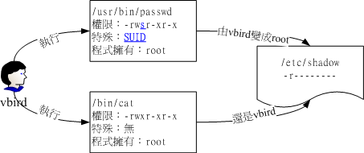

# 3. Linux 文件属性和权限详解

# Linux文件属性

## 文件属性解析

以root的身份登入Linux之后,在命令行中输入『 ls -al 』后可以看到：

```yaml
[root@www ~]# ls -al
total 156
drwxr-x--- 4 root root 4096 Sep 8 14:06 .
drwxr-xr-x 23 root root 4096 Sep 8 14:21 ..
-rw------- 1 root root 1474 Sep 4 18:27 anaconda-ks.cfg
-rw------- 1 root root 199 Sep 8 17:14 .bash_history
-rw-r--r-- 1 root root 24 Jan 6 2007 .bash_logout
-rw-r--r-- 1 root root 191 Jan 6 2007 .bash_profile
-rw-r--r-- 1 root root 176 Jan 6 2007 .bashrc
-rw-r--r-- 1 root root 100 Jan 6 2007 .cshrc
drwx------ 3 root root 4096 Sep 5 10:37 .gconf <=范例说明处
drwx------ 2 root root 4096 Sep 5 14:09 .gconfd
-rw-r--r-- 1 root root 42304 Sep 4 18:26 install.log <=范例说明处
-rw-r--r-- 1 root root 5661 Sep 4 18:25 install.log.syslog
[ 1 ][ 2 ][ 3 ][ 4 ][ 5 ][ 6 ] [ 7 ]
[ 权限 ] [连结][拥有者] [群组] [文件容量] [ 修改日期 ] [ 檔名 ] 
  
```

以其中install.log为范例说明:

​​

‍

**第一栏: 类型与权限(permission)**

​​

* 第一个字符代表这个文件的类型(如目录、文件或链接文件等等)：

  1. 当为[ d ]则是目录,例如上表档名为『.gconf』的那一行；
  2. 当为[ - ]则是文件,例如上表档名为『install.log』那一行；
  3. 若是[ l ]则表示为链接档(link file)；
  4. 若是[ b ]则表示为装置文件里面的可供储存的接口设备(可随机存取装置)；
  5. 若是[ c ]则表示为装置文件里面的串行端口设备,例如键盘、鼠标(一次性读取装置)
  6. 若是[ s ]则表示为
* 接下来的字符中,以三个为一组,且均为『rwx』 的三个参数的组合  
  < [ r ]代表可读(read)、[ w ]代表可写(write)、[ x ]代表可执行(execute) 要注意的是,这三个权限的位置不会改变,如果没有权限,就会出现减号[ - ]而已>

  1. 第一组为『文件拥有者的权限』,以『install.log』那个文件为例, 该文件的拥有者可以读写,但不可执行；
  2. 第二组为『同群组的权限』；
  3. 第三组为『其他非本群组的权限』.

## **特殊权限SUID, SGID, SBIT**

```
[root@www ~]# ls -ld /tmp ; ls -l /usr/bin/passwd /usr/bin/locate /var/lib/mlocate/mlocate.db
drwxrwxrwt 7 root root 4096 Sep 27 18:23 /tmp
-rwsr-xr-x 1 root root 22984 Jan 7 2007 /usr/bin/passwd
-rwx--s--x 1 root slocate 23856 Mar 15 2007 /usr/bin/locate
-rw-r----- 1 root slocate 3175776 Sep 28 04:02 /var/lib/mlocate/mlocate.db
```

### **Set UID**

当 s 这个标志出现在文件拥有者的 x 权限上时,如上 /usr/bin/passwd 这个文件的权限状态，此时就被称为 Set UID，简称为 SUID 的特殊权限。基本上SUID有这样的限制与功能：

* SUID 权限仅对二进位程序(binary program)有效(不能够用在 shell script 上面)
* 运行者对於该程序需要具有 x 的可运行权限
* 本权限仅在运行该程序的过程中有效 (run-time)
* 运行者将具有该程序拥有者 (owner) 的权限

**以passwd文件为例:**

vbird 对於 /usr/bin/passwd 这个程序来说是具有 x 权限的，表示 vbird 能运行 passwd；  
 passwd 的拥有者是 root 这个帐号；vbird 运行 passwd 的过程中，会『暂时』获得 root 的权限；  
 /etc/shadow 就可以被 vbird 所运行的 passwd 所修改。  
 但如果 vbird 使用 cat 去读取 /etc/shadow 时，他能够读取吗？因为 cat 不具有 SUID 的权限，所以 vbird 运行 『cat /etc/shadow』 时，是不能读取 /etc/shadow 的。我们用一张示意图来说明如下：  
 图4.4.1、SUID程序运行的过程示意图

​​

### **SGID**

与 SUID 不同的是，SGID 可以针对文件或目录来配置！

如果是对文件来说， SGID 有如下的功能：

* SGID 对二进位程序有用,程序运行者对於该程序来说，需具备 x 的权限
* 运行者在运行的过程中将会获得该程序群组的权限

如果针对的是目录,SGID 有如下的功能：

* 使用者若对於此目录具有 r 与 x 的权限时，该使用者能够进入此目录；
* 使用者在此目录下的有效群组(effective group)将会变成该目录的群组；

### **Sticky Bit**

这个 Sticky Bit, SBIT 目前只针对目录有效作用是：

* 当使用者对於此目录具有 w, x 权限，亦即具有写入的权限时；
* 当使用者在该目录下创建文件或目录时，仅有自己与 root 才有权力删除该文件

换句话说：当甲这个使用者於 A 目录是具有群组或其他人的身份，并且拥有该目录 w  的权限，  这表示『甲使用者对该目录内任何人创建的目录或文件均可进行 "删除/更名/搬移" 等动作。』 不过，如果将 A 目录加上了 SBIT   的权限项目时， 则甲只能够针对自己创建的文件或目录进行删除/更名/移动等动作，而无法删除他人的文件。

```yaml
[root@www tmp]# chmod 7666 test; ls -l test <==具有空的 SUID/SGID 权限
-rwSrwSrwT 1 root root 0 Sep 29 03:06 test
  
```

user, group 以及 others 都没有 x 这个可运行的标志( 因为 666 )，所以，这个 S, T 代表的就是『空的』

‍

**第二栏:多少档名连结到此节点(i-node)**

记录有多少不同的档名连结到相同的一个i-node(每个文件都会将他的权限与属性记录到文件系统的i-node中,不过,我们使用的目录树却是使用文件名来记录, 因此每个档名就会连结到一个i-node)

**第三栏:文件(或目录)的拥有者**

**第四栏:文件的所属群组**

在Linux系统下一个账号会附属于一个或多个的群组中(假设某个文件所属的群组为projecta,且该文件的权限如图所示(-rwxrwx---),   则class1, class2, class3三人对于该文件都具有可读、可写、可执行的权限(看群组权限).   但如果是不属于projecta的其他账号,对于此文件就不具有任何权限了)

**第五栏:文件的容量大小(默认单位为bytes)**

**第六栏:文件的建档日期或者是最近的修改日期**

这一栏的内容分别为日期(月/日)及时间.如果这个文件被修改的时间距离现在太久了,那么时间部分会仅显示年份而已. 如下所示：

```yaml
[root@www ~]# ls -l /etc/termcap /root/install.log

-rw-r--r-- 1 root root 807103 Jan 7 2007 /etc/termcap
-rw-r--r-- 1 root root 42304 Sep 4 18:26 /root/install.log
# 如上所示,/etc/termcap 为 2007 年所修改过的文件,离现在太远之故；
# 至于 install.log 是今年 (2009) 所建立的,所以就显示完整的时间了. 
  
```

**第七栏:文件的全路径及其文件名**

这个字段就是档名了. 比较特殊的是：如果档名之前多一个『 . 』,则代表这个文件为『隐藏档』,在上表中的.gconf那一行,该文件就是隐藏档. 你可以使用『ls』及『ls -a』显示隐藏文档

# 目录与文件之权限意义

## 权限对文件的意义

* r (read)：可读取此一文件的实际内容,如读取文本文件的文字内容等；
* w (write)：可以编辑、新增或者是修改该文件的内容(但不含删除该文件)；
* x (execute)：该文件具有可以被系统执行的权限.

  ```
  在Windows底下一个文件是否具有执行的能力是藉由『 扩展名 』来判断的, 例如：.exe, .bat, .com 等等
  在Linux底下,我们的文件是否能被执行,则是藉由是否具有『x』这个权限来决定的！跟档名是没有绝对的关系的
  ```

## 权限对目录的意义

* r (read contents in directory)：  
  　　表示具有读取目录结构列表的权限,所以当你具有读取(r)一个目录的权限时,表示你可以查询该目录下的文件名数据. 所以你就可以利用 ls 这个指令将该目录的内容列表显示出来！
* w (modify contents of directory)：

  1. 建立新的文件与目录；
  2. 删除已经存在的文件与目录(不论该文件的权限为何！)
  3. 将已存在的文件或目录进行更名；
  4. 搬移该目录内的文件、目录位置.
* x (access directory)：  
  　　用户具备进入该目录成为工作目录的权限

由此可以看出,如果一个人要想进入目录必须对目录具有 x 这个权限,但是只具备 x 这个进入目录的权限是没有什么意义的,因为你无法读取目录下的文件.所以你想要让以个人进入该目录并可以读取目录下的文件结构必须具备 x 与 r 这两个权限

---

# Linux chmod命令：修改文件或目录的权限

既然我们已经知道文件权限对于一个系统的重要性，也知道每个文件都设定了针对不同用户的访问权限，那么，是否可以手动修改文件的访问权限呢？

可以，通过 chmod 命令即可。chmod 命令设定文件权限的方式有 2 种，分别可以使用数字或者符号来进行权限的变更。

## chmod命令使用数字修改文件权限

 Linux 系统中，文件的基本权限由 9 个字符组成，以 rwxrw-r-x 为例，我们可以使用数字来代表各个权限，各个权限与数字的对应关系如下：

```bash
r --> 4
w --> 2
x --> 1
```

由于这 9 个字符分属 3 类用户，因此每种用户身份包含 3 个权限（r、w、x），通过将 3 个权限对应的数字累加，最终得到的值即可作为每种用户所具有的权限。

拿 rwxrw-r-x 来说，所有者、所属组和其他人分别对应的权限值为：

```bash
所有者 = rwx = 4+2+1 = 7
所属组 = rw- = 4+2 = 6
其他人 = r-x = 4+1 = 5
```

所以，此权限对应的权限值就是 765。

使用数字修改文件权限的 chmod 命令基本格式为：

```bash
[root@localhost ~]# chmod [-R] 权限值 文件名
```

-R（注意是大写）选项表示连同子目录中的所有文件，也都修改设定的权限。

例如，使用如下命令，即可完成对 .bashrc 目录文件的权限修改：

```bash
[root@localhost ~]# ls -al .bashrc
-rw-r--r--. 1 root root 176 Sep 22 2004 .bashrc
[root@localhost ~]# chmod 777 .bashrc
[root@localhost ~]# ls -al .bashrc
-rwxrwxrwx. 1 root root 176 Sep 22 2004 .bashrc
```

再举个例子，通常我们以 Vim 编辑 Shell 文件批处理文件后，文件权限通常是 rw-rw-r--（644），那么，如果要将该文件变成可执行文件，并且不让其他人修改此文件，则只需将此文件的权限该为 rwxr-xr-x（755）即可。

## chmod命令使用字母修改文件权限

 既然文件的基本权限就是 3 种用户身份（所有者、所属组和其他人）搭配 3 种权限（rwx），chmod 命令中用 u、g、o 分别代表 3  种身份，还用 a 表示全部的身份（all 的缩写）。另外，chmod 命令仍使用 r、w、x 分别表示读、写、执行权限。

使用字母修改文件权限的 chmod 命令，其基本格式如图 1 所示。

​​

例如，如果我们要设定 .bashrc 文件的权限为 rwxr-xr-x，则可执行如下命令：

```bash
[root@localhost ~]# chmod u=rwx,go=rx .bashrc
[root@localhost ~]# ls -al .bashrc
-rwxr-xr-x. 1 root root 176 Sep 22 2004 .bashrc
```

再举个例子，如果想要增加 .bashrc 文件的每种用户都可做写操作的权限，可以使用如下命令：

```bash
[root@localhost ~]# ls -al .bashrc
-rwxr-xr-x. 1 root root 176 Sep 22 2004 .bashrc
[root@localhost ~]# chmod a+w .bashrc
[root@localhost ~]# ls -al .bashrc
-rwxrwxrwx. 1 root root 176 Sep 22 2004 .bashrc
```

‍

‍
