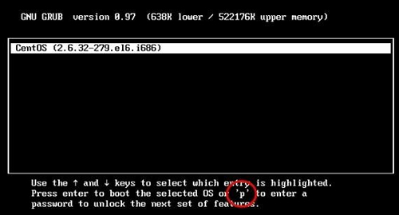

# 14. Linux GRUB加密方法详解（2种加密方式）

Linux 在启动时，在 GRUB 管理界面中是可以通过按"e"键进入编辑模式，修改启动选项的。

​​

如图 1 所示，每个启动选项都支持按"e"键进入编辑模式。在编辑模式中可以修改启动模式，比如进入单用户模式（单用户模式主要用于破解密码，我们将在后续章节中讲 解）。

但是有时候，我们不想让用户进入编辑模式，就需要给 GRUB 菜单加密。那么，如何生成加密的密码串呢？可以通过命令 grub-md5-crypt 来实现。命令如下：

```bash
[root@localhost ~]# grub-md5-crypt
Password:
Retype password:
#输入两次密码
$1$Y84LB1$8tMY2PibScmuOCc8z8U35/
#生成加密的密码串
```

这样就可以生成加密的密码串，这个字符串是采用 MD5 加密的，我们会利用这个加密的密码串来加密 GRUB 配置文件。

 GRUB 的加密有两种模式： 

* 给每个启动菜单加密，如果不输入正确的密码，则系统不能正常启动；

* 给 GRUB 菜单整体加密，如果想进入编辑模式，则必须输入正确的密码；

## 给每个启动菜单加密

如果给每个启动菜单加密，那么系统在启动时进入相应的启动菜单，必须输入正确的密码，否则系统不能启动。具体的方法如下：

```bash
[root@localhost ~]# vi /boot/grub/grub.conf
default=0
timeout=5
splashimage=(hd0,0)/grub/splash.xpm.gz
hiddenmenu
title CentOS (2.6.32-279.el6.i686)
password --md5 $l$Y84LBl$8tHY2PibScmuOCc8z8D35/
#加入password选项，密码串是通过grub-md5-crypt命令生成的
root(hd0,0)
kernel /vmlinuz-2.6.32-279.el6•i686 ro root=UUID=b9a7ala8-767f-4a87-8a2b-a535edb362c9 rd_NO_LUKS KEYBOARDTYPE=pc KEYTABLE=us rd_N0_MD crashkernel=auto LANG=zh_CN.UTF-8 rd_N0_LVM rd_NO_DM rhgb quiet
initrd /initramfs-2.6.32-279.el6.i686.img
```

这样就能加密 CentOS 启动菜单了，在启动时如果不输入正确的密码，是不能启动系统的。需要注意的是，password 选项一定要在 title 下面第一行。

## 给GRUB菜单整体加密

如果只是加密单个启动菜单，那么 GRUB 的编辑模式是不能被锁定的，仍然可以按"e"键进入编辑模式。而且在进入编辑模式后，是可以删除  password 字段的，再按"b"（boot启动）键就可以不用密码直接进入系统。这时就需要给 GRUB 菜单整体加密。在整体加密后，如果想进入  GRUB 编辑界面，则必须输入正确的密码。加密方法其实只是把 password 字段换一个位置而已，具体方法如下：

```bash
[root@localhost ~]# vi /boot/grub/grub.conf
default=0
timeout=5
password --md5 $l$Y84LBl$8tMY2PibScmuOCc8z8U35/
#将password选项放在整体设置处
splashimage=(hd0,0)/grub/splash.xpm.gz
hiddenmenu
title CentOS (2.6.32-279.el6.i686)
root (hd0,0)
kernel /vmlinuz-2.6.32-279.el6.i686 ro root=UUID=b9a7ala8-767f-4a87-8a2b-a535edb362c9 rd_NO_LUKS KEYBOARDTYPE=pc KEYTABLE=us rd_NO_MD crashkernel=auto LANG=zh_CN.UTF-8 rd_NO_LVM rd_NO_DM rhgb quiet
initrd /initramfs-2.6.32-279.el6.i686.img
```

这样就会把 GRUB 界面整体加密，要想进入 GRUB 的编辑界面，必须先输入正确的密码，如图 2 所示。

​​

注意到了吗？在 GRUB 界面中已经看不到"e"键了，必须输入"p"键，并输入正确的密码才能进入编辑界面。但是这样加密，在启动 CentOS 时，是不需要密码就能正常启动的。如果既需要 GRUB 的整体加密，又需要系统启动时输入正确的密码，应该怎么做呢？

很简单，方法如下：

```bash
default=0
timeout=5
password --md5 $l$Y84LBl$8tHY2PibScmuOCc8z8U35/
splashimage=(hdO,0)/grub/splash.xpm.gz hiddenmenu
title CentOS (2.6.32-279.el6.i686) lock
#在title字段下加入lock选项,代表锁死,如果不输入正确的GRUB密码,则不能启动root(hd0,0)
kernel /vmlinuz-2.6.32-279.el6.i686 ro root=UUID=b9a7ala8-767f-4a87-8a2b-a535edb362c9 rd_NO_LUKS KEYBOARDTYPE=pc KEYTABLE=us rd_NO_MD crashkernel=auto LANG=zh_CN.UTF-8 rd_NO_LVM rd_NO_DM rhgb quiet
initrd / initramf s-2.6.32-27.9 .el6.i686. img
```

只要在 GRUB 整体配置中加入 password 选项，在 title 中加入 lock 选项，就可以既加密 GRUB 编辑界面，又加密系统启动过程了。是不是很简单？
