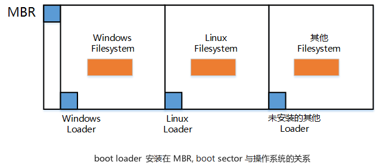
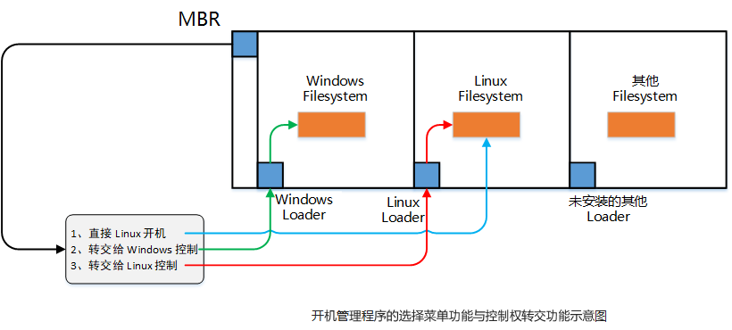
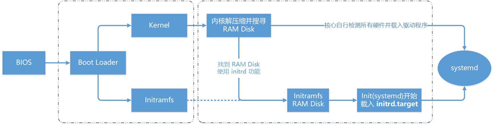

# CentOS7系统启动流程分析

在开机的过程中，要用到开机管理程序（Bootl Loader）。目前各大主流的 Linux 发行版使用的是 grub2，但是在早期  Linux 预设的是 grub1 或者 LILO。以 Linux 主机为例，按下电源后计算机的硬件会主动读取 BIOS 或 UEFI BIOS  来加载硬件信息以及进行硬件系统的自我检测，之后系统会主动读取第一个可开机的装置（由 BIOS 决定），此时就可以读入开机管理程序了。

开机管理程序可以指定使用哪个内核文件来开机，并实际加载内核到内存当中解压缩与执行， 此时内核就能够开始在内存中活动，并侦测所有硬件信息、加载适当的驱动程序来使整个主机开始运作， 等到内核侦测硬件并加载完驱动程序之后，操作系统就跑起来了。

系统开始运行后，此时 Linux 才会呼叫外部程序开始准备软件执行的环境，并且加载系统运行所需要的软件程序。 最后系统就会开始等待用户的登录和操作了。

简单来说，系统开机的经过可以总结为下面的流程：

* 首先，加载 BIOS 的硬件信息与进行自我检测，并依据设定取得第一个可开机的装置；
* 其次，读取并执行第一个开机装置内 MBR 的 Boot Loader (也就是 grub2, spfdisk 等程序)；
* 然后，根据 Boot Loader 的设定加载 Kernel ，Kernel 会开始侦测硬件并加载驱动程序；
* 在硬件驱动成功后，Kernel 会主动呼叫 systemd 程序，并以 default.target 流程开机；

  * systemd 执行 sysinit.target 初始化系统及 basic.target 准备操作系统；
  * systemd 启动 multi-user.target 下的各种服务；
  * systemd 执行 multi-user.target 下的 `/etc/rc.d/rc.local`​ 文件
  * systemd 执行 multi-user.target 下的 getty.target 及登入服务；
  * systemd 执行 graphical 需要的服务

下面简单说一下对于每一步操作，具体都做了什么。

# BIOS, Boot Loader 与 Kernel 的载入

## BIOS, 开机自我检测与 MBR/GPT

在个人计算机上，要想启动整个操作系统首先就要让机器加载  BIOS (Basic Input Output System)，并通过 BIOS 程序去加载 CMOS 的信息，并且由 CMOS  内的设定值取得主机的各项硬件配置， 例如 CPU 与接口设备的沟通频率、 开机装置的搜寻顺序、硬盘的大小与类型、 系统时间、各周边总线的是否启动  Plug and Play (PnP, 即插即用装置) 、 各接口设备的 I/O 地址、以及与 CPU 沟通的 IRQ 中断等信息。

在取得这些信息后，BIOS 还会进行开机自我检测 (Power-on Self Test, POST) 。 然后开始执行硬件侦测的初始化，并设定 PnP 装置，之后再定义出可开机的装置顺序，接下来就会开始进行开机装置的数据读取了。

由于我们的系统软件大多放置到硬盘中，所以 BIOS 会指定开机的装置好让我们可以读取磁盘中的操作系统核心文件。  但由于不同的操作系统的文件系统格式不相同，因此我们必须要以一个开机管理程序来处理核心文件加载 (load) 的问题，  因此这个开机管理程序就被称为 Boot Loader 了。 Boot Loader 程序安装在开机装置的第一个扇区 (sector) 内，也就是  MBR (Master Boot Record, 主引导启动记录区)。

 BIOS 是通过硬件的 INT 13 中断功能来读取 MBR 的，也就是说，只要 BIOS 能够侦测的到磁盘 (不论该磁盘是 SATA  还是 SAS 接口)，那它就有办法通过 INT 13 这条信道来读取该磁盘的第一个扇区内的 MBR 软件，这样以来 Boot Loader  也就能够被执行了。

## Boot Loader 的功能

Boot Loader 的最主要功能是要认识操作系统的文件格式并加载核心到主存储器中去执行。  由于不同操作系统的文件格式不一致，因此每种操作系统都有自己的 Boot Loader。但是对于一个多系统的主机来说，必须要使用每个操作系统自己的  Boot Loader 才能够加载属于自己的操作系统核心，而系统的 MBR 只有一个，那么如何同时在一个主机上安装 Windows 与  Linux 呢？

其实每个文件系统 (filesystem, 或者是 partition) 都会保留一块启动扇区 (boot sector)  提供操作系统安装 Boot Loader， 而通常操作系统默认都会安装一份 Boot Loader 到他根目录所在的文件系统的 boot  sector 上。如果我们在一个主机上面安装 Windows 与 Linux 后，该 boot sector, boot loader 与  MBR 的相关性会有点像下图所示：

​​

如上图所示，每个操作系统默认是会安装一套 Boot loader 到他自己的文件系统中 (就是每个 filesystem  左下角的方框)，而在 Linux 系统安装时，可以选择将 boot loader 安装到 MBR 去，也可以选择不安装。 如果选择安装到 MBR  的话，那理论上在 MBR 与 boot sector 都会保有一份 boot loader 程序。 至于 Windows  安装时，他预设会主动的将 MBR 与 boot sector 都装上一份 Boot loader。所以在安装多操作系统时，MBR  常常会被不同的操作系统的 Boot Loader 所覆盖。

虽然各个操作系统都可以安装一份 Boot loader 到他们的 boot sector 中， 这样操作系统可以通过自己的 Boot  Loader 来加载内核了。而问题在于，系统的 MBR 只有一个，应该如何去执行 boot sector 里面的 loader 呢？Boot  Loader 主要的功能如下：

* **提供选择菜单**：用户可以选择不同的开机项目，这也是多重引导的重要功能。
* **载入核心文件**：直接指向可开机的程序区段来开启操作系统；
* **转交其他 loader**：将开机管理功能转交给其他 loader 负责。

由于具有选择菜单功能，因此可以选择不同的核心来开机。而由于具有控制权转交的功能，因此就可以加载其他 boot sector 内的  loader 了。不过 Windows 的 loader 预设不具有控制权转交的功能， 因此不能使用 Windows 的 loader 来加载  Linux 的 loader 。这也是为什么在多重引导时，强调先装 Windows 再装 Linux 的缘故。

​​

如上图所示，笔者的 MBR 使用 Linux 的 grub2 这个开机管理程序，并且里面假设已经有了三个选单， 第一个选单可以直接指向  Linux 的核心文件并且直接加载内核来开机；第二个选单可以将开机管理程控权交给 Windows 来管理，此时 Windows 的 loader  会接管开机流程，这个时候他就能够启动 windows 了。第三个选单则是使用 Linux 在 boot sector  内的开机管理程序，此时就会跳出另一个 grub2 的选择菜单了。

* 菜单一：MBR(grub2) ==> kernel file ==> booting
* 菜单二：MBR(grub2) ==> boot sector(Windows loader) ==> Windows kernel ==> booting
* 菜单三：MBR(grub2) ==> boot sector(grub2) ==> kernel file ==> booting

而最终 boot loader 的功能就是 **加载 kernel 文件** 。

## 加载 Kernel、侦测硬件、 initramfs 的功能

由  Boot Loader 的管理程序开始读取核心文件后，接下来 Linux 就会将核心文件解压缩到主存储器当中，  并且利用内核的功能，开始测试与驱动各个周边装置，包括储存装置、CPU、网卡、声卡等等。 此时内核会以自己的功能重新侦测一次硬件，但是不一定会使用  BIOS 侦测到的硬件信息。也就是说，内核此时才开始接管 BIOS 后的工作了。

核心文件一般来会被放置到 `/boot`​ 里面，并且取名为 `/boot/vmlinuz`​ 。

```bash
[root@localhost ~]$ ls -F --format=single-column  /boot
config-3.10.0-1062.el7.x86_64                               # <== 此版本 Kernel 被编译时选择的功能与模块配置文件
grub/                                                       # <== 旧版 grub1 ，可以忽略不看
grub2/                                                      # <== 开机管理程序(Boot Loader) grub2 相关数据目录
initramfs-0-rescue-e5279c0ecc4740cbb7b4e6dcc22ddc9e.img     # <== 当前目录下存放了几个虚拟文件, 这一个虚拟文件是用来救援的
initramfs-3.10.0-1062.el7.x86_64.img                        # <== 正常开机会用到的虚拟文件系统
initramfs-3.10.0-1062.el7.x86_64kdump.img                   # <== 核心出问题时会用到的虚拟文件系统
System.map-3.10.0-1062.el7.x86_64                           # <== 核心功能放置到内存地址的对应表 
vmlinuz-0-rescue-e5279c0ecc4740cbb7b4e6dcc22ddc9e*          # <== 救援模式要用到的核心文件
vmlinuz-3.10.0-1062.el7.x86_64*                             # <== 核心文件,非常重要！
[root@localhost ~]$
```

从上述命令的结果中，我们可以知道当前的 CentOS 7 的 Linux 内核为 3.10.0-1062.el7.x86_64 这个版本！  为了硬件开发商与其他核心功能开发者的便利， 因此 Linux 内核是可以通过态加载核心模块的 (可以把它理解为驱动程序)，这些核心模块就放置在  `/lib/modules/`​ 目录内。 由于模块放在了到根目录内 (注意：`/lib`​ 不可以与 `/`​ 分别放在不同的分区 )， 因此，在开机的过程中内核必须要挂载根目录才能够读取核心模块提供加载驱动程序的功能。 而且为了担心影响到磁盘内的文件系统，开机过程中根目录是以只读的方式来挂载的。

一般来说，非必要的功能且可以编译成为模块，目前的 Linux 发行版都会将其编译成模块。 因此 USB, SATA, SCSI…  等磁盘设备的驱动程序通常都是以模块的方式来存在的。 现在我们来思考一种情况，假设 linux 是安装在 SATA 磁盘上面的，可以通过 BIOS  的 INT 13 取得 Boot Loader 与 Kernel 文件来开机，然后 Kernel  会开始接管系统并且侦测硬件及尝试挂载根目录来取得额外的驱动程序。

问题是，Kernel 根本不认识 SATA 磁盘，所以需要先挂载 SATA 磁盘的驱动程序， 否则根本就无法挂载根目录。但是 SATA 的驱动程序在 `/lib/modules`​ 内，根本无法挂载根目录，又怎么读取到 `/lib/modules/`​ 内的驱动程序？实际上，这个问题可以通过虚拟文件系统来处理。

虚拟文件系统 (Initial RAM Disk 或 Initial RAM Filesystem) 一般使用的文件名为 `/boot/initrd`​ 或 `/boot/initramfs`​  ，这个文件的特色是，它也能够通过 Boot Loader 来加载到内存中，然后这个文件会被解压缩且在内存当中仿真成一个根目录，  这个仿真目录在内存当中的文件系统能够提供一个可执行的程序，通过该程序来加载开机过程中所最需要的核心模块， 通常这些模块就是 USB, RAID,  LVM, SCSI 等文件系统与磁盘接口的驱动程序。等到载入完成后， 会帮助 Kernel 重新呼叫 systemd  来开始后续的正常开机流程。

​​

如上图所示，Boot Loader 可以加载 Kernel 与 initramfs ，然后在内存中让 initramfs  解压缩成为根目录， Kernel  就能够以此来加载适当的驱动程序，最终释放虚拟文件系统，并挂载实际的根目录文件系统，就能够开始后续的正常开机流程。 更详细的 initramfs  说明，可以使用 `man initrd`​ 查阅。

使用 lsinitrd 命令来看一下 initramfs 里面的内容包含了哪些数据：

```bash
[root@localhost ~]# lsinitrd /boot/initramfs-3.10.0-1062.el7.x86_64.img 
# 首先会呼叫出 initramfs 最前面文件头的许多数据介绍，这部份会占用一些空间
Image: /boot/initramfs-3.10.0-1062.el7.x86_64.img: 19M
========================================================================
Early CPIO image
========================================================================
drwxr-xr-x   3 root     root            0 Oct 18 17:41 .
-rw-r--r--   1 root     root            2 Oct 18 17:41 early_cpio
drwxr-xr-x   3 root     root            0 Oct 18 17:41 kernel
drwxr-xr-x   3 root     root            0 Oct 18 17:41 kernel/x86
drwxr-xr-x   2 root     root            0 Oct 18 17:41 kernel/x86/microcode
-rw-r--r--   1 root     root        23552 Oct 18 17:41 kernel/x86/microcode/GenuineIntel.bin
========================================================================
Version: dracut-033-564.el7

Arguments: -f

dracut modules:    # 开始一堆模块的加载行为
bash
nss-softokn
i18n
network
ifcfg
drm
plymouth
kernel-modules
# ..... 中间内容省略 ......
========================================================================
drwxr-xr-x  12 root     root            0 Oct 18 17:41 .
crw-r--r--   1 root     root       5,   1 Oct 18 17:41 dev/console
crw-r--r--   1 root     root       1,  11 Oct 18 17:41 dev/kmsg
crw-r--r--   1 root     root       1,   3 Oct 18 17:41 dev/null
# ..... 中间内容省略 ......
lrwxrwxrwx   1 root     root           22 Oct 18 17:41 usr/sbin/init -> ../lib/systemd/systemd
# ..... 中间内容省略 ......
drwxr-xr-x   2 root     root            0 Oct 18 17:41 var
lrwxrwxrwx   1 root     root           11 Oct 18 17:41 var/lock -> ../run/lock
lrwxrwxrwx   1 root     root            6 Oct 18 17:41 var/run -> ../run
========================================================================
# 最后则会列出这个 initramfs 里头的所有文件！也就是说，这个 initramfs 文件大概存着两部份，
# 先是首部声明的许多文件部份，再来才是真的会被核心取用的全部附加的文件数据！
```

从上面可以知道， 在 initramfs 文件当中含有两大区块，一个是事先声明的一些数据，包括 `kernel/x86/microcode/GenuineIntel.bin`​ 。 在这些数据后面，才是内核真正会去读取的重要文件，如果仔细看一下文件的内容，会看到 init 程序已经被 systemd 所取代了。

CentOS7 内核默认的 initramfs 与原生 Linux 不一致，包含一个 cpio 格式的 ealry_cpio 头，和一个  gzip 压缩的 cpio 格式的 initramfs rootfs。前面的 ealry_cpio 头就是 CentOS7 内核独有的。使用 `file`​ 命令查看 `/boot/`​ 目录下的 img 文件，如果显示 ASCII cpio archive 就代表是 CentOS7 原生内核的格式，如果显示 gzip compressed data 就代表是 linux 内核不带 ealry_cpio 头的标准 gzip 压缩的格式。

```bash
[root@localhost ~]# file /boot/initramfs-$(uname -r).img
/boot/initramfs-3.10.0-1062.el7.x86_64.img: ASCII cpio archive (SVR4 with no CRC)
```

如果想要进一步将这个文件解开的话，需要这样进行：

```bash
[root@localhost rootfs_cpio]# initramfs=$(cd /boot;ls initramfs-$(uname -r).img)
[root@localhost rootfs_cpio]# mkdir -pv /tmp/initramfs/{early,rootfs}_cpio
mkdir: created directory ‘/tmp/initramfs’
mkdir: created directory ‘/tmp/initramfs/early_cpio’
mkdir: created directory ‘/tmp/initramfs/rootfs_cpio’
[root@localhost ~]# cp /boot/${initramfs} /tmp/initramfs/
[root@localhost ~]# cd /tmp/initramfs/early_cpio/
[root@localhost early_cpio]# cpio -idm < ../${initramfs}
48 blocks
[root@localhost early_cpio]# cd /tmp/initramfs/rootfs_cpio/
[root@localhost rootfs_cpio]# /usr/lib/dracut/skipcpio ../${initramfs} | zcat | cpio -id
76361 blocks
[root@localhost rootfs_cpio]#
```

这样就把 CentOS7 原生内核的 initramfs 解包成了两个文件夹，early_cpio 和 rootfs_cpio。在 rootfs_cpio 目录下就是实际的虚拟文件系统了：

```bash
[root@localhost rootfs_cpio]# ll
total 8
lrwxrwxrwx.  1 root root    7 Oct 20 17:49 bin -> usr/bin
drwxr-xr-x.  2 root root   45 Oct 20 17:49 dev
drwxr-xr-x. 11 root root 4096 Oct 20 17:49 etc
lrwxrwxrwx.  1 root root   23 Oct 20 17:49 init -> usr/lib/systemd/systemd
lrwxrwxrwx.  1 root root    7 Oct 20 17:49 lib -> usr/lib
lrwxrwxrwx.  1 root root    9 Oct 20 17:49 lib64 -> usr/lib64
drwxr-xr-x.  2 root root    6 Oct 20 17:49 proc
drwxr-xr-x.  2 root root    6 Oct 20 17:49 root
drwxr-xr-x.  2 root root    6 Oct 20 17:49 run
lrwxrwxrwx.  1 root root    8 Oct 20 17:49 sbin -> usr/sbin
-rwxr-xr-x.  1 root root 3117 Oct 20 17:49 shutdown
drwxr-xr-x.  2 root root    6 Oct 20 17:49 sys
drwxr-xr-x.  2 root root    6 Oct 20 17:49 sysroot
drwxr-xr-x.  2 root root    6 Oct 20 17:49 tmp
drwxr-xr-x.  7 root root   66 Oct 20 17:49 usr
drwxr-xr-x.  2 root root   29 Oct 20 17:49 var
[root@localhost rootfs_cpio]#
```

上面的命令结果几乎就像是一个小型的文件系统根目录，这样就能让 kernel 去挂载了。那么这个小型的文件系统中，systemd 是要以哪个 target 来执行开机呢？

```bash
[root@localhost rootfs_cpio]# ll usr/lib/systemd/system/default.target 
lrwxrwxrwx. 1 root root 13 Oct 20 17:49 usr/lib/systemd/system/default.target -> initrd.target
[root@localhost rootfs_cpio]# systemctl list-dependencies initrd.target 
initrd.target
● ├─dracut-cmdline.service
● ├─dracut-initqueue.service
● ├─dracut-mount.service
● ├─dracut-pre-mount.service
# ..... 中间内容省略 ......
● │ │ ├─sys-kernel-config.mount
● │ │ ├─sys-kernel-debug.mount
● │ │ ├─systemd-ask-password-console.path
```

通过上面解开 initramfs 的结果，我们已经知道其实 initramfs 就是一个小型的根目录，这个小型根目录里面也是通过  systemd 来进行管理，同时观察 default.target 的链接，会发现其实这个小型系统就是通过 initrd.target  来开机，而 initrd.target 也是需要读入一堆例如 basic.target, sysinit.target  等等的硬件侦测、核心功能启用的流程， 然后开始让系统顺利运作。最终才又卸除 initramfs 的小型文件系统，然后去挂载系统实际的根目录。

另外，需要注意的是 initramfs 并没有囊括了所有东西，它仅仅包含了是开机过程会用到的核心模块而已。所以如果在 initramfs  里面去找 modules 这个关键词的话， 就可以发现主要的核心模块大概就是 SCSI、virtio 、 RAID  等等跟磁盘相关性比较高的模块。现在由于磁盘大部分都是使用 SATA ， 并没有 IDE 的格式了，所以没有 initramfs 就无法顺利启动  Linux 系统，除非是将 SATA 的模块直接编译到内核。

在内核完成加载后，主机就开始正确地运行了，接下来就要开始执行系统的第一个程序，也就是 systemd。

```bash
[root@centos6 ~]# pstree
init─┬─anacron
     ├─auditd───{auditd}
     ├─crond
     ├─metricbeat-god───metricbeat───10*[{metricbeat}]
     ├─6*[mingetty]
     ├─nat_log
     ├─4*[netpas_relay]
     ├─nperfping───11*[{nperfping}]
     ├─nrpe
     ├─ntpd
     ├─portreserve
     ├─rsyslogd───3*[{rsyslogd}]
     ├─snmpd
     ├─sshd───sshd───bash───pstree
     └─udevd───2*[udevd]
```

对比 CentOS6 和 CentOS7 的 `pstree`​ 命令的结果：

```bash
[root@localhost ~]# pstree
systemd─┬─NetworkManager───2*[{NetworkManager}]
        ├─VGAuthService
        ├─agetty
        ├─auditd───{auditd}
        ├─crond
        ├─dbus-daemon───{dbus-daemon}
        ├─firewalld───{firewalld}
        ├─master─┬─pickup
        │        └─qmgr
        ├─polkitd───6*[{polkitd}]
        ├─rsyslogd───2*[{rsyslogd}]
        ├─sshd───sshd─┬─bash───pstree
        │             └─2*[bash]
        ├─systemd-journal
        ├─systemd-logind
        ├─systemd-udevd
        ├─tuned───4*[{tuned}]
        └─vmtoolsd───{vmtoolsd}
```

上面的命令结果我们可以看到 systemd 已经完全替代了 init 。实际上在不同版本 Linux 上的 init 各不相同：

* CentOS 5: SysV init
* CentOS 6: Upstart
* CentOS 7: Systemd

# systemd 及使用 default.target 进入开机程序分析

systemd 最主要的功能就是准备软件执行的环境，包括系统的主机名、网络设定、语系处理、文件系统格式及其他服务的启动等。 而所有的动作都会通过 systemd 的默认启动服务集合，也就是是 `/etc/systemd/system/default.target`​ 来规划 。另外， systemd 已经舍弃沿用多年的 system V 的 runlevel 。

## 常见的操作环境 target 与兼容于 runlevel 的等级

可以作为预设的操作环境  (default.target) 的主要项目有： multi-user.target 以及 graphical.target  这两个。当然还有某些比较特殊的操作环境， 包括 rescue.target, emergency.target, shutdown.target  等等，以及在 initramfs 里面谈到的 initrd.target 。

过去的 systemV 使用的是一个称为 runlevel (执行等级) 的概念来启动系统的，systemd 为了兼容于旧式的 systemV 操作行为， 所以也将 runlevel 与操作环境做了结合。如下所示：

```bash
[root@localhost ~]# ll -d /usr/lib/systemd/system/runlevel*.target
lrwxrwxrwx. 1 root root 15 Oct 18 17:37 /usr/lib/systemd/system/runlevel0.target -> poweroff.target
lrwxrwxrwx. 1 root root 13 Oct 18 17:37 /usr/lib/systemd/system/runlevel1.target -> rescue.target
lrwxrwxrwx. 1 root root 17 Oct 18 17:37 /usr/lib/systemd/system/runlevel2.target -> multi-user.target
lrwxrwxrwx. 1 root root 17 Oct 18 17:37 /usr/lib/systemd/system/runlevel3.target -> multi-user.target
lrwxrwxrwx. 1 root root 17 Oct 18 17:37 /usr/lib/systemd/system/runlevel4.target -> multi-user.target
lrwxrwxrwx. 1 root root 16 Oct 18 17:37 /usr/lib/systemd/system/runlevel5.target -> graphical.target
lrwxrwxrwx. 1 root root 13 Oct 18 17:37 /usr/lib/systemd/system/runlevel6.target -> reboot.target
[root@localhost ~]#
```

使用过 systemV 的方式来管理系统，我们知道知道切换执行等级可以使用`init 3`​ 转成文字界面，`init 5`​  转成图形界面。 这个 init 程序依旧是保留下来的，只是 `init 3`​ 会相当于执行 `systemctl isolate multi-user.target`​ 。

```bash
[root@localhost ~]# file /usr/sbin/init 
/usr/sbin/init: symbolic link to `../lib/systemd/systemd'
```

如果做个完整的迭代，这两个东西的对应关系为：

|SystemV|systemd|
| ---------| -------------------------------------|
|init 0|systemctl poweroff|
|init 1|systemctl rescue|
|init 2|systemctl isolate multi-user.target|
|init 3|systemctl isolate multi-user.target|
|init 4|systemctl isolate multi-user.target|
|init 5|systemctl isolate graphical.target|
|init 6|systemctl reboot|

## systemd 的处理流程

当进行了 `/etc/systemd/system/default.target`​ 这一个预设操作的设定之后，接下来系统做了什么呢？ 首先，它会链接到 `/usr/lib/systemd/system/`​ 这个目录下去取得 `multi-user.target`​ 或 `graphical.target`​ 这两个其中的一。假设使用的是 graphical.target ，接下来 systemd 会去找两个地方的设定：

* ​`/etc/systemd/system/graphical.target.wants/`​：使用者设定加载的 unit
* ​`/usr/lib/systemd/system/graphical.target.wants/`​：系统默认加载的 unit

使用 `systemctl cat graphical.target`​ 命令查看对应的配置文件：

```bash
 # /usr/lib/systemd/system/graphical.target
#  This file is part of systemd.
#
#  systemd is free software; you can redistribute it and/or modify it
#  under the terms of the GNU Lesser General Public License as published by
#  the Free Software Foundation; either version 2.1 of the License, or
#  (at your option) any later version.

[Unit]
Description=Graphical Interface
Documentation=man:systemd.special(7)
Requires=multi-user.target
Wants=display-manager.service
Conflicts=rescue.service rescue.target
After=multi-user.target rescue.service rescue.target display-manager.service
AllowIsolate=yes
[root@localhost ~]#
```

这表示 graphical.target 必须要完成 multi-user.target 之后才能够进行，而进行完 graphical.target 之后，还需要启动 display-manager.service 。

再查看 multi-user.target  的配置文件：

```bash
[root@localhost ~]# systemctl cat multi-user.target 
# /lib/systemd/system/multi-user.target
#  This file is part of systemd.
#
#  systemd is free software; you can redistribute it and/or modify it
#  under the terms of the GNU Lesser General Public License as published by
#  the Free Software Foundation; either version 2.1 of the License, or
#  (at your option) any later version.

[Unit]
Description=Multi-User System
Documentation=man:systemd.special(7)
Requires=basic.target
Conflicts=rescue.service rescue.target
After=basic.target rescue.service rescue.target
AllowIsolate=yes
```

查看系统默认要加载的 unit

```bash
[root@localhost ~]# ls /usr/lib/systemd/system/multi-user.target.wants/
dbus.service           plymouth-quit-wait.service      systemd-update-utmp-runlevel.service
getty.target           systemd-ask-password-wall.path  systemd-user-sessions.service
plymouth-quit.service  systemd-logind.service
[root@localhost ~]#
```

使用者自定义要加载的 unit 又有哪些呢

```bash
[root@localhost ~]# ls /etc/systemd/system/multi-user.target.wants/
auditd.service     irqbalance.service      postfix.service         rsyslog.service  vmtoolsd.service
crond.service      kdump.service           remote-fs.target        sshd.service
firewalld.service  NetworkManager.service  rhel-configure.service  tuned.service
```

通过上面的结果，我们知道 multi-usre.target 需要在 basic.target 运作完成后才能够载入上述的许多 unit 。然后再去 basic.target 里头寻找数据， 最终这些数据就可以通过 `systemctl list-dependencies graphical.target`​ 命令来列出所有的相关性的服务。这就是 systemd 呼叫所需要的服务的流程。

要想知道系统服务的启动流程，最简单的办法就是通过 `systemctl list-dependencies graphical.target`​ 命令。如果想要知道想要知道对应的配置文件意义， 应该分别去查看 `/etc/systemd/system/`​ 与 `/usr/lib/systemd/system/`​ 目录下的 `graphical.target.wants/`​ 目录下的配置文件数据。当然，配置文件脚本里面的 Requires 这个设定值所代表的服务， 也需要先加载。

粗略分析一下 `systemctl list-dependencies graphical.target`​ 所输出的想依赖的服务，基本上 CentOS 7.x 的 systemd 开机流程大约是这样：

1、local-fs.target + swap.target：这两个 target 主要在挂载本机 `/etc/fstab`​ 里面所规范的文件系统与相关的内存交换空间。  
2、sysinit.target：这个 target 主要在侦测硬件，加载所需要的核心模块（驱动程序）等动作。  
3、basic.target：加载主要的外围硬件驱动程序与防火墙相关任务  
4、multi-user.target 其它一般系统或网络服务的加载  
5、图形界面相关服务的加载

下图是 systemd 大致的开机工作流程图：

​​

除了第一步 local-fs.target, swap.target 是通过 `/etc/fstab`​ 来进行挂载的行为之外，那其他的 target 做了什么动作呢？

# systemd 执行 sysinit.target 初始化系统、basic.target 准备系统

使用 `systemctl list-dependencies sysinit.target`​ 会看到很多相依赖的服务，这些服务如果一个一个去查询脚本设定的内容， 就能够大致理解每个服务的意义。基本上，可以将这些服务归类成几个大项：

* 特殊文件系统装置的挂载：包括 dev-hugepages.mount、 dev-mqueue.mount 等挂载服务，主要挂载 巨量内存分页 与 消息队列 的功能。 挂载成功后，会在 `/dev`​ 下建立 `/dev/hugepages/`​, `/dev/mqueue/`​ 等目录；
* 特殊文件系统的启用：包括磁盘阵列、网络驱动器 (iscsi)、LVM 文件系统、文件系统对照服务 (multipath) 等等，也会在这里被侦测与使用到。
* 开机过程的信息传递与动画执行：使用 plymouthd 服务搭配 plymouth 指令来传递动画与信息。
* 日志式登录文件的使用：也就是 systemd-journald 这个服务的启用。
* 加载额外的核心模块：通过 `/etc/modules-load.d/*.conf`​ 文件的设定，让内核额外加载管理员所需要的核心模块。
* 加载额外的核心参数设定：包括 `/etc/sysctl.conf`​ 以及 `/etc/sysctl.d/*.conf`​ 内的参数设置。
* 启动系统的随机数生成器：随机数生成器可以帮助系统进行一些密码加密演算的功能
* 设定控制台 (console) 字形
* 启动动态设备管理器：也就是 udevd 。用在动态对应实际装置存取与装置文件名对应的一个服务。

不论即将使用哪种操作环境来使用系统，这个 sysinit.target 几乎都是必要的工作！从上面也可以看出，基本的核心功能、文件系统、文件系统装置的驱动等等， 都在这个时刻处理完的。所以，sysinit.target 的阶段是至关重要的！

执行完 sysinit.target 之后，再来则是 basic.target 了。  basic.target 的阶段主要启动的服务大概有这些：

* 加载 alsa 音效驱动程序：alsa 是个音效相关的驱动程序，会让系统有音效产生；
* 载入 firewalld 防火墙：CentOS 7.x 以后使用 firewalld 取代 iptables 的防火墙设定，虽然最终都是使用 iptables 的架构， 不过在设定上面差很多。
* 加载 CPU 的微指令功能；
* 启动与设定 SELinux 的安全本文：如果由 disable 的状态改成 enable 的状态，或者是管理员设定强制重新设定一次 SELinux 的安全本文， 也在这个阶段处理。
* 将目前的开机过程所产生的开机信息写入到 `/var/log/dmesg`​ 当中。
* 由 `/etc/sysconfig/modules/*.modules`​ 及 `/etc/rc.modules`​ 加载管理员指定的模块。
* 加载 systemd 支持的 timer 功能；

在这个阶段完成之后，系统就可以正常运行了。但是还差一些所需要的登入服务、网络服务、本机认证服务等类似的 service ，于是就进入下个服务启动的阶段了。

# systemd 启动 multi-user.target 下的服务

在加载核心驱动硬件后，经过  sysinit.target 的初始化流程让系统可以存取之后，加上 basic.target 让系统成为操作系统的基础，  之后就是服务器要顺利运作时，需要的各种主机服务以及提供服务器功能的网络服务的启动了。这些服务的启动则大多是附挂在  multi-user.target 这个操作环境底下， 可以在 `/etc/systemd/system/multi-user.target.wants/`​ 里看到预设要被启动的服务。

也就是说，一般来说服务的启动脚本设定都是放在下面的目录内：

* /usr/lib/systemd/system (系统默认的服务启动脚本设定)
* /etc/systemd/system (管理员自己开发与设定的脚本设定)

而用户想要让主机的本地服务和网络服务的各项 unit 开机自启的话，其实就是将它在 `/etc/systemd/system/multi-user.target.wants/`​ 这个目录底下做个链接：

```bash
[root@localhost ~]# systemctl disable postfix
Removed symlink /etc/systemd/system/multi-user.target.wants/postfix.service.
[root@localhost ~]# 
[root@localhost ~]# 
[root@localhost ~]# systemctl enable postfix 
Created symlink from /etc/systemd/system/multi-user.target.wants/postfix.service to /usr/lib/systemd/system/postfix.service.
[root@localhost ~]#
```

另外， 这些程序如果在脚本设定里面原本就有规范服务的相互依赖关系， 服务就会有顺序地启动。但是大多数的服务不会设定依赖关系，所以会同时启动，这就是 systemd 的多任务。

## 相兼容的 SystemV 的 rc-local.service

对于 SystemV 的系统，在完成开机后要想让系统额外执行某些程序的话，可以将该程序指令或脚本的绝对路径名称写入到 `/etc/rc.d/rc.local`​ 文件中。而在新的 systemd 机制中，它建议直接写一个 systemd 的启动脚本配置文件到 `/etc/systemd/system/`​ 目录下，然后使用 `systemctl enable`​ 的方式来设定启用它，而不是直接使用 rc.local 这个文件。

如果是处于运维的习惯，就想要将开机后要立刻执行的许多管理员自己的脚本，将它写入到 `/etc/rc.d/rc.local`​，新版的 systemd 对此也有支持。 它使用 rc-local.service 这个服务，并且这个服务并不需要启动，它会自己判断 `/etc/rc.d/rc.local`​ 是否具有可执行的权限，然后来判断要不要启动这个服务。可以通过如下方法来检查：

1、查看 `/etc/rc.d/rc.local`​ 是否有可执行权限

```bash
[root@localhost ~]# ll /etc/rc.d/rc.local 
-rw-r--r--. 1 root root 473 Aug  8 19:58 /etc/rc.d/rc.local
```

2、查看 rc-local.service 的服务状态

```bash
[root@localhost ~]# systemctl status rc-local.service 
● rc-local.service - /etc/rc.d/rc.local Compatibility
   Loaded: loaded (/usr/lib/systemd/system/rc-local.service; static; vendor preset: disabled)
   Active: inactive (dead)
```

3、查看 multi-user.target 下是否有这个服务。

```bash
[root@localhost ~]# systemctl status rc-local.service 
● rc-local.service - /etc/rc.d/rc.local Compatibility
   Loaded: loaded (/usr/lib/systemd/system/rc-local.service; static; vendor preset: disabled)
   Active: inactive (dead)
```

4、加入可执行权限，再次查看 rc-local.service 是否可被启用。

```bash
[root@localhost ~]# chmod a+x /etc/rc.d/rc.local 
[root@localhost ~]# systemctl daemon-reload 
[root@localhost ~]# systemctl list-dependencies multi-user.target | grep rc-local
● ├─rc-local.service
[root@localhost ~]#  # 这个服务确实被记录到启动的环境下了
```

通过 `chmod a+x /etc/rc.d/rc.local`​ 的步骤，就可以将许多脚本就可以放在 `/etc/rc.d/rc.local`​ 这个文件内， 系统在每次开机都会去执行这文件内的指令。

## 提供 tty 界面与登录的服务

在  multi-user.target 下还有个 getty.target 的操作界面项目。能不能提供适当的登录服务也是  multi-user.target 底下的内容！ 包括 systemd-logind.service,  systemd-user-sessions.service 等服务。

由于服务都是同步启动，所以不能确定哪个服务先启动完成。如果 getty 服务先启动完成时，会发现有可用的终端机尝试让我们登录系统。 而如果  systemd-logind.service 或 systemd-user-sessions.service  服务尚未启动完成的话，还是无法登录到系统的。

# 开机过程会用到的主要配置文件

基本上， systemd 有自己的配置文件处理方式，不过为了兼容于 systemV ，其实很多的服务脚本设定还是会读取位于 `/etc/sysconfig/`​ 目录下的环境配置文件。

## 自定义模块相关的配置

在 sysinit.target 系统初始化的过程中会加载用户自定义模块，有两个地方可以处理模块加载的问题，包括：

* ​`/etc/modprobe.d/*.conf`​ ：单纯要让内核从哪些位置加载模块
* ​`/etc/modules-load.d/*.conf`​：对内核模块做参数设置

基本上 systemd 已经将开机会用到的驱动程序全部加载了，因此，在一般情况下，这个部份应该无需变动。不过， 如果有某些特定的参数要处理时，就可以在这里做配置。比如，我们要做网络链接追踪，就需要在开机启动流程中加载相对应的内核模块：

```bash
[root@localhost ~]# vim /etc/modules-load.d/netfilter.conf 
# Load nf_conntrack.ko at boot
nf_conntrack
nf_conntrack_ipv4
nf_defrag_ipv4
```

再比如自定义了 vsftpd 服务的监听端口为 555，这时就需要修改防火墙设定，其中一个针对 FTP 很重要的防火墙模块为 nf_conntrack_ftp， 因此可以将这个模块写入到系统开机流程中：

```bash
[root@localhost ~]# vim /etc/modules-load.d/vbird.conf
nf_conntrack_ftp
[root@localhost ~]#
```

按照配置标准，应该一个模块 (驱动程序) 写一行。如果要对这些内核模块做参数设定，应该在 `/etc/modules-load.d/`​ 目录下做配置。比如要对链接追踪模块的哈希表做参数设置：

```
[root@localhost ~]# vim /etc/modprobe.d/netfilter.conf 
options nf_conntrack hashsize=65536
```

当然，如果只是让内核加载模块，没有指定自己定义的参数，就会以默认值加载并运行。所以对于修改了服务端口的 vsftpd 来说，如果不设置参数，模块就默认处理 21 号端口，这时候我们需要将其调整到自定义的 555 号端口才能正常工作：

```bash
[root@localhost ~]# vim /etc/modprobe.d/vbird.conf
options nf_conntrack_ftp ports=555
```

之后重新启动就能够顺利的载入并且处理好些模块了。如果不想重启，可以使用下面的方式来处理：

```bash
[root@localhost ~]# lsmod | grep nf_conntrack_ftp
[root@localhost ~]# # 因为没有加载这个模块，所以不会有任何信息输出
[root@localhost ~]# 
[root@localhost ~]# systemctl restart systemd-modules-load.service 
[root@localhost ~]# 
[root@localhost ~]# lsmod | grep nf_conntrack_ftp                
nf_conntrack_ftp       18478  0 
nf_conntrack          139224  7 nf_nat,nf_nat_ipv4,nf_nat_ipv6,xt_conntrack,nf_conntrack_ftp,nf_conntrack_ipv4,nf_conntrack_ipv6
[root@localhost ~]#
```

通过上述的方式，就可以在开机的时候将所需要的驱动程序加载或者是调整这些模块的外加参数了。

## /etc/sysconfig/

在 `/etc/sysconfig/`​ 目录下有很多常见的环境配置文件，下面列举几个比较重要的：

* **authconfig**：这个文件主要在规范使用者的身份认证的机制，包括是否使用本机的 `/etc/passwd`​， `/etc/shadow`​ 等， 以及 `/etc/shadow`​ 密码记录使用哪种加密算法，还有是否使用外部密码服务器提供的账号验证 (NIS, LDAP) 等。 系统默认使用 SHA512 加密算法，并且不使用外部的身份验证机制；另外，不建议手动修改这个文件，建议最好是使用 `authconfig-tui`​ 命令来做这方面的配置指令。
* **cpupower**：如果系统中有启动 cpupower.service  服务时，它就会读取这个配置文件。主要是用来配置 Linux 内核如何操作 CPU 的。 一般来说，启动 cpupower.service  之后，系统会让 CPU 以最大效能的方式来运作，否则预设就是用多少算多少的模式来处理的。
* **firewalld, iptables-config, iptables-config, ebtables-config**：与防火墙服务的启动外带的参数有关
* **network-scripts/** ：这个目录下面的文件，则是主要用在设定网络卡，配置 IP 地址的方式等。
