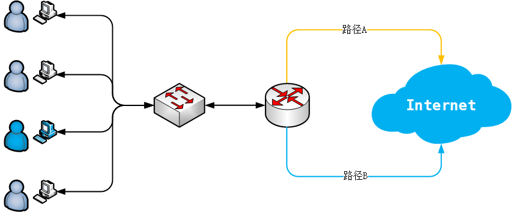

# linux 策略路由

## 策略路由

　　**策略路由**

　　策略是指对于 IP 包的路由是以我们根据需要而定下的一些策略为主要依据进行路由的。例如我们可以有这样的策略：“所有来直自网A的包，选择X路径；其他选择Y路径”，或者是“所有TOS为A的包选择路径F；其他选者路径K”。

　　Cisco 的网络操作系统 (Cisco IOS) 从11.0开始就采用新的策略路由机制。而 Linux 是在内核 2.1 开始采用策略路由机制的。策略路由机制与传统的路由算法相比主要是引入了多路由表以及规则的概念。

　　**多路由表（multiple Routing Tables）**

　　传统的路由算法是仅使用一张路由表的。但是在有些情形底下，我们是需要使用多路由表的。

​​

　　如图所示，一个局域网通过路由器与互联网相连，路由器与互联网有两条线路相连，其中路径B的速度比较快，路径A的速度比较慢。对于局域网内的大多数用户来说对速度并没有特殊的要求，所以可以让他们用比较慢的路由；但是还有一些特殊的用户却是对速度的要求比较苛刻，所以他们需要使用速度比较快的路由。如果使用一张路由表上是没有办法实现这种要求的，如果根据源地址或其它参数，对不同的用户使用不同的路由表，这样就可以大大提高路由器的性能。

　　**规则（rule）**

　　我们可以用自然语言这样描述规则：

* 规则一：“所有来自 192.16.152.24 的 IP 包，使用路由表 10， 本规则的优先级是 990”
* 规则三：“所有到 192.168.127.127 的 IP 包，使用路由表 11，本规则的优先级是 991”
* 规则二：“所有的包，使用路由表 253，本规则的优先级是 32767”

　　我们可以看到，规则包含 3 个要素：

* 什么样的包，将应用本规则（所谓的SELECTOR，可能是filter更能反映其作用）；
* 符合本规则的包将对其采取什么动作（ACTION），例如：使用哪个路由个表；
* 本规则的优先级。优先级别越高的规则越先匹配（数值越小优先级别越高）。

## 策略性路由的配置方法

　　传统的 Linux 下配置路由的工具是 `route`​，而实现策略路由配置的工具是 `iproute2`​ 工具包。策略路由的配置主要包括接口地址的配置、路由的配置、规则的配置。

## 接口地址的配置 IP Addr

　　使用 `ip addr`​ 来实现接口地址的配置

```bash
[root@m5 ~]# ip addr add 192.168.127.136/24 brd 192.168.127.255 dev eth0
[root@m5 ~]# ip addr add 192.168.127.137/24 brd 192.168.127.255 dev eth0
```

　　这样就在 `eth0`​ 网卡添加了两个 IP 地址，其中 24 表示子网掩码（掩码中 1 的个数），`brd`​ 是 `broadcast`​ 的简写，说明了广播地址是 `192.168.127.255`​

　　当然你也可以从网卡上删除无用的 IP 地址

```bash
[root@m5 ~]# ip addr del 192.168.127.137/24 brd 192.168.127.255 dev eth0
```

　　如果清空某个网卡上的所有 IP 地址，则使用 `flush`​，切记一定要指定网卡名，否则会清空本机所有网卡的所有 IP，导致机器失联。

```bash
[root@m5 ~]# ip addr flush dev eth1
[root@m5 ~]# ip addr show dev eth1
3: eth1: <BROADCAST,MULTICAST,UP,LOWER_UP> mtu 1500 qdisc pfifo_fast state UP group default qlen 1000
    link/ether 00:0c:29:23:43:aa brd ff:ff:ff:ff:ff:ff
[root@m5 ~]#
```

## 路由的配置 IP Route

　　使用 `ip route`​ 进行路由的配置

　　Linux 最多可以支持 255 张路由表，其中有 3 张表是内置的：

* 表255 本地路由表（Local table）本地接口地址，广播地址，已及 NAT 地址都放在这个表。该路由表由系统自动维护，管理员不能直接修改。
* 表254 主路由表（Main table）如果没有指明路由所属的表，所有的路由都默认都放在这个表里，一般来说，旧的路由工具（如route）所添加的路由都会加到这个表。一般是普通的路由。
* 表253 默认路由表 （Default table）一般来说默认的路由都放在这张表，但是如果特别指明放的也可以是所有的网关路由。

　　还有一张表 `0`​ 是保留的，在文件 `/etc/iproute2/rt_tables`​ 可以查看和配置路由表的 `TABLE_ID`​ 及路由表名称。

　　路由配置命令的格式如下：

```bash
Usage: ip route { list | flush } SELECTOR
       ip route { add | del | change | append | replace } ROUTE
```

　　使用 `show`​ 或 `list`​ 子命令可以查看路由表的内容

```bash
[root@m5 ~]# ip route list table main 
default via 192.168.127.2 dev eth0 
192.168.1.0/24 dev eth1 proto kernel scope link src 192.168.1.130 
192.168.127.0/24 dev eth0 proto kernel scope link src 192.168.127.135 

[root@m5 ~]# ip route show table main     
default via 192.168.127.2 dev eth0 
192.168.1.0/24 dev eth1 proto kernel scope link src 192.168.1.130 
192.168.127.0/24 dev eth0 proto kernel scope link src 192.168.127.135 

[root@m5 ~]# ip route show dev eth0 table main
default via 192.168.127.2 
192.168.127.0/24 proto kernel scope link src 192.168.127.135
```

　　如果不指定 `TABLE_ID`​ 或路由表名称，则会查看默认的路由表， `TABLE_ID`​ 为 254，即 main 表。

```bash
[root@m5 ~]# ip route show 
default via 192.168.127.2 dev eth0 
192.168.1.0/24 dev eth1 proto kernel scope link src 192.168.1.130 
192.168.127.0/24 dev eth0 proto kernel scope link src 192.168.127.135 

[root@m5 ~]# ip route show table 254
default via 192.168.127.2 dev eth0 
192.168.1.0/24 dev eth1 proto kernel scope link src 192.168.1.130 
192.168.127.0/24 dev eth0 proto kernel scope link src 192.168.127.135 
[root@m5 ~]#
```

　　使用 `add`​ 子命令添加路由。

```bash
[root@m5 ~]# ip route add to 0/0 via 192.168.127.2 dev eth0 table 110
[root@m5 ~]# ip route add to 8.8.8.0/24 via 192.168.127.2 dev eth0 table 110
[root@m5 ~]# ip route show table 110
default via 192.168.127.2 dev eth0 
8.8.8.0/24 via 192.168.127.2 dev eth0 
[root@m5 ~]#
```

　　第一条命令是向路由表 （`TABLE_ID`​） 110 中添加一条路由，路由的内容是设置 `192.168.127.2`​ 为表 110 的默认网关，其中 `0/0`​ 也可以写为 `default`​。即：目标网络是所有（0/0，即默认），经过（via）本机的网关（下一跳） `192.168.127.2`​ ，从 `eth0`​ 网卡出去。

　　第二条命令是向路由表 （`TABLE_ID`​） 110 中添加一条路由，到目标网络 `8.8.8.0/24`​，经过（via）本机的网关 `192.168.127.2`​ （下一跳）从 `eth0`​ 网卡出去。

　　一旦不小心加错了路由，可以使用 `del`​ 删除。

```bash
[root@m5 ~]# ip route add 1.2.3.0/24 via 192.168.127.2 dev eth0 table 110

[root@m5 ~]# ip route show table 110
default via 192.168.127.2 dev eth0 
1.2.3.0/24 via 192.168.127.2 dev eth0 
8.8.8.0/24 via 192.168.127.2 dev eth0 

[root@m5 ~]# ip route del 1.2.3.0/24 via 192.168.127.2 dev eth0 table 110

[root@m5 ~]# ip route show table 110
default via 192.168.127.2 dev eth0 
8.8.8.0/24 via 192.168.127.2 dev eth0
```

　　对于错误的路由还可以使用 `replace`​ 或 `change`​ 来直接修改。

```bash
[root@m5 ~]# ip route show table 110
default via 192.168.127.2 dev eth0 
1.2.3.0/24 via 192.168.127.2 dev eth0 
8.8.8.0/24 via 192.168.127.2 dev eth0 

[root@m5 ~]# ip route change 1.2.3.0/24 via 192.168.1.129 dev eth1 table 110

[root@m5 ~]# ip route show table 110
default via 192.168.127.2 dev eth0 
1.2.3.0/24 via 192.168.1.129 dev eth1 
8.8.8.0/24 via 192.168.127.2 dev eth0 

[root@m5 ~]# ip route replace 1.2.3.0/24 via 192.168.127.2 dev eth0 table 110

[root@m5 ~]# ip route show table 110
default via 192.168.127.2 dev eth0 
1.2.3.0/24 via 192.168.127.2 dev eth0 
8.8.8.0/24 via 192.168.127.2 dev eth0
```

　　对于路由条目比较多的情况，可以使用 `show match`​ 来匹配包含或等于指定网段的路由。

```
[root@m5 ~]# ip route show match 1.2.3.0/24 table 110
default via 192.168.127.2 dev eth0 
1.2.3.0/24 via 192.168.1.129 dev eth1 

[root@m5 ~]# ip route show match 1.2.3.1 table 110  
default via 192.168.127.2 dev eth0 
1.2.3.0/24 via 192.168.1.129 dev eth1
```

　　使用 `show root`​ 可以查看在指定的网段内的路由条目。

```bash
[root@m5 ~]# ip route show root 1.2.0.0/16 table 110
1.2.3.0/24 via 192.168.1.129 dev eth1 

[root@m5 ~]# ip route show root 1.0.0.0/1 table 110   
1.2.3.0/24 via 192.168.1.129 dev eth1 
8.8.8.0/24 via 192.168.127.2 dev eth0 

[root@m5 ~]# ip route add 1.2.1.0/24 via 192.168.1.129 dev eth1  table 110
[root@m5 ~]# ip route show root 1.2.0.0/16 table 110                                     
1.2.1.0/24 via 192.168.1.129 dev eth1 
1.2.3.0/24 via 192.168.1.129 dev eth1
```

　　使用 `flush`​ 将会清空指定的路由表中的所有条目，请注意一定要指定路由表，否则会清空本机默认路由表 main 表中的所有条目，导致机器失联。

```bash
[root@m5 ~]# ip route show table 110
default via 192.168.127.2 dev eth0 
1.2.3.0/24 via 192.168.127.2 dev eth0 
8.8.8.0/24 via 192.168.127.2 dev eth0 

[root@m5 ~]# ip route flush table 110
[root@m5 ~]# ip route show table 110
```

　　在多路由表的路由体系里，所有的路由的操作，例如往路由表中添加路由，或者在路由表里寻找特定的路由，需要指明要操作的路由表，所有没有指明路由表，默认是对主路由表 main（表254）进行操作。

```bash
[root@m5 ~]# ip route show match 1.2.1.0/24
default via 192.168.127.2 dev eth0 

[root@m5 ~]# ip route show root 1.2.0.0/16
[root@m5 ~]# ip route add 1.2.5.0/24 via 192.168.1.129 dev eth1 

[root@m5 ~]# ip route show 
default via 192.168.127.2 dev eth0 
1.2.5.0/24 via 192.168.1.129 dev eth1 
192.168.1.0/24 dev eth1 proto kernel scope link src 192.168.1.130 
192.168.127.0/24 dev eth0 proto kernel scope link src 192.168.127.135 

[root@m5 ~]# ip route show dev eth0
default via 192.168.127.2 
192.168.127.0/24 proto kernel scope link src 192.168.127.135 

[root@m5 ~]# ip route show dev eth1
1.2.5.0/24 via 192.168.1.129 
192.168.1.0/24 proto kernel scope link src 192.168.1.130 

[root@m5 ~]# ip route show match 1.2.5.3
default via 192.168.127.2 dev eth0 
1.2.5.0/24 via 192.168.1.129 dev eth1 

[root@m5 ~]# ip route show root 1.2.0.0/16
1.2.5.0/24 via 192.168.1.129 dev eth1
```

　　请注意，上面的几条命令都没有指明要操作哪张路由表，默认就操作的是主路由表 main（表254）。

## 规则的配置 IP Rule

　　在 Linux 里，总共可以定义 232 个优先级的规则，一个优先级只能有一条规则。有 3 个规则是默认的。

```bash
Usage: ip rule { add | del } SELECTOR ACTION
       ip rule { flush | save | restore }
       ip rule [ list [ SELECTOR ]]
SELECTOR := [ not ] [ from PREFIX ] [ to PREFIX ] [ tos TOS ] [ fwmark FWMARK[/MASK] ] [ pref NUMBER ] 
ACTION := [ table TABLE_ID ]
          [ nat ADDRESS ]
          [ realms [SRCREALM/]DSTREALM ]
          [ goto NUMBER ]
TABLE_ID := [ local | main | default | NUMBER ]
```

　　首先我们可以看看路由表默认的所有规则：

```bash
[root@m5 ~]# ip rule list
0:      from all lookup local 
32766:  from all lookup main 
32767:  from all lookup default 
[root@m5 ~]#
```

* 优先级 0，优先级别最高的规则，规则规定所有的包，都必须首先使用 local 表（255）进行路由。本规则不能被更改和删除。
* 优先级 32766，规定所有的包，使用表 main 进行路由。本规则可以被更改和删除。
* 优先级 32767，规定所有的包，使用表 default 进行路由。本规则可以被更改和删除。

　　在默认情况下进行路由时，首先会根据规则 0 在本地路由表 `local`​ 里寻找路由，如果目的地址是本网络，或是广播地址的话，在这里就可以找到合适的路由；如果路由失败，就会匹配下一个不空的规则，默认情况的下一条规则是 32766 规则，在这里将会在主路由表里寻找路由；如果失败，就会匹配 32767 规则，即寻找默认路由表。如果失败，路由将失败。从这里可以看出，策略路由是往前兼容的。

　　除了默认的规则之外，还可以添加自定义的规则。

```bash
[root@m5 ~]# ip rule add from 0/0 table 110 pref 32800 
[root@m5 ~]# ip rule show
0:      from all lookup local 
32766:  from all lookup main 
32767:  from all lookup default 
32800:  from all lookup 110 
[root@m5 ~]#
```

　　这一条命令将向规则链增加一条规则，规则匹配的对象是所有的数据包，动作是选用策略路由表 `110`​ 里的路由，这条规则的优先级是 32800。其中 `from 0/0`​ 也可以写成 `from all`​，或者直接省略不写也是可行的。

```bash
[root@m5 ~]# ip rule add from 192.168.1.112/32 tos 0x10 table 2 pref 1500 prohibit
[root@m5 ~]# ip rule
0:      from all lookup local 
1500:   from 192.168.1.112 tos lowdelay lookup 2 prohibit
32766:  from all lookup main 
32767:  from all lookup default 
32800:  from all lookup 110 
[root@m5 ~]#
```

　　这一条命令将向规则链增加一条规则，规则匹配的对象是来源 IP 为 192.168.3.112，tos 等于0x10 的包，使用策略路由表 2 里的路由，这条规则的优先级是 1500。

　　上面的规则是以源地址为关键字，作为是否匹配的依据的。除了源地址外，还可以用以下的信息：

* from 匹配来源地址
* to 匹配目的地址
* tos 匹配 IP 包头的TOS（type of sevice）域
* dev 匹配物理接口
* fwmark 匹配防火墙 MARK 标记

　　采取的动作除了指定表，还可以指定下面的动作：

* table 指明所使用的表，也可使用 lookup
* nat 透明网关
* prohibit 丢弃该包，并发送 COMM.ADM.PROHIITED 的 ICMP 信息
* reject 单纯丢弃该包
* unreachable 丢弃该包， 并发送 NET UNREACHABLE 的 ICMP 信息

　　如果想删除添加的自定义路由，将添加命令中的 `add`​ 改为 `del`​ 即可。

　　‍

## 策略路由的应用

### 场景一 多网卡多运营商线路多 IP 地址的配置

　　‍

​​

　　如上图所示，在传统的 IDC 机房中，会有很多不同客户托管的服务器，它们一般都是一台机器配置一个公网 IP。

　　现在，假设我们需要电信、网通、移动三个运营商的多个 IP 资源，如果托管三台机器到此机房不仅增加硬件成本，还容易会造成维护混乱。因此我们将多运营商线路的 IP 都配置到一台服务器的多个网卡上，结合策略路由就能很好的解决这个问题。

​​

　　如图所示，电信、网通、移动各使用两个公网 IP，要求电信 IP 走电信网关，网通 IP 走网通网关，移动 IP 走移动网关，互不干扰。

　　为了方便配置，我们将电信的第一个 IP 配置在 eth0 网卡上

```bat
[root@m5 ~]# cat /etc/sysconfig/network-scripts/ifcfg-eth0
TYPE=Ethernet
NAME=eth0
DEVICE=eth0
BOOTPROTO=static
ONBOOT=yes
IPADDR=61.132.229.25
NETMASK=255.255.255.224
PREFIX=27
BROADCAST=61.132.229.31
NETWORK=61.132.229.0
GATEWAY=61.132.229.1
```

　　网通的第一个 IP 配置在 eth1 网卡上

```bat
[root@m5 ~]# cat /etc/sysconfig/network-scripts/ifcfg-eth1
TYPE=Ethernet
NAME=eth1
DEVICE=eth1
BOOTPROTO=static
ONBOOT=yes
IPADDR=103.214.48.3
NETMASK=255.255.255.0
PREFIX=24
BROADCAST=103.214.48.255
NETWORK=103.214.48.0
# GATEWAY=103.214.48.1
```

　　移动的第一个 IP 配置在 eth2 网卡上

```bat
[root@m5 ~]# cat /etc/sysconfig/network-scripts/ifcfg-eth2
TYPE=Ethernet
NAME=eth2
DEVICE=eth2
BOOTPROTO=static
ONBOOT=yes
IPADDR=112.29.175.205
NETMASK=255.255.255.0
PREFIX=24
BROADCAST=112.29.175.255
NETWORK=112.29.175.0
# GATEWAY=112.29.175.1
```

　　注释掉网通和移动的 `GATEWAY`​ 指令是因为在同一优先级下只能有一个默认网关，我们选择电信的网关作为本机的默认网关。然后使用 `ip addr`​ 命令将各运营商的第二个 IP 地址配置在对应的网卡上。

```bat
[root@m5 ~]# ip addr add 61.132.229.26/27  brd 61.132.229.31  dev eth0
[root@m5 ~]# ip addr add 103.214.48.4/24   brd 103.214.48.255 dev eth1
[root@m5 ~]# ip addr add 112.29.175.206/24 brd 112.29.175.255 dev eth2
```

　　再创建各个运营商线路对应的策略路由表。

```bat
[root@m5 ~]# echo '10 tel' >> /etc/iproute2/rt_tables
[root@m5 ~]# echo '11 cnc' >> /etc/iproute2/rt_tables  
[root@m5 ~]# echo '12 cm'  >> /etc/iproute2/rt_tables
```

　　为不同策略路由表添加对应的默认网关和直连路由。

```bat
[root@m5 ~]# ip route add default via 61.132.229.1 dev eth0 table tel
[root@m5 ~]# ip route add $(ip route show dev eth0 scope link | head -1 | /bin/cut -d "p" -f 1) dev eth0 table tel

[root@m5 ~]# ip route add default via 103.214.48.1 dev eth1 table cnc
[root@m5 ~]# ip route add $(ip route show dev eth1 scope link | head -1 | /bin/cut -d "p" -f 1) dev eth1 table cnc

[root@m5 ~]# ip route add default via 112.29.175.1 dev eth2 table cm
[root@m5 ~]# ip route add $(ip route show dev eth2 scope link | head -1 | /bin/cut -d "p" -f 1) dev eth2 table cm
```

　　为各个网卡上的 IP 地址做来源匹配规则，即：来自电信的 IP 去看电信的策略路由表，来自网通的 IP 去看网通的策略路由表，来自移动的 IP 去看移动的策略路由表。

```bat
[root@m5 ~]# ip rule add from 61.132.229.25/32 lookup tel pref 1000
[root@m5 ~]# ip rule add from 61.132.229.26/32 lookup tel pref 1001

[root@m5 ~]# ip rule add from 103.214.48.3/32 lookup cnc pref 1002
[root@m5 ~]# ip rule add from 103.214.48.4/32 lookup cnc pref 1003

[root@m5 ~]# ip rule add from 112.29.175.205/32 lookup cm pref 1004
[root@m5 ~]# ip rule add from 112.29.175.206/32 lookup cm pref 1005
```

　　各个策略路由表中已经实现创建了对应的默认网关和直连路由，由此一来就完成了 Linux 下的多网卡多运营商线路多 IP 地址的配置。

　　‍

　　‍

### 场景二 给指定网段分别设置网关

　　这种方法使用的是默认路由表，增加到指定网段的路由。

```bash
# 推荐使用 replace 指令
$ ip route replace  192.168.100.0/24 via 192.168.100.1 dev enp0s5 onlink
$ ip route replace  192.168.110.0/24 via 192.168.110.1 dev enp0s6 onlink
$ ip route replace  192.168.120.0/24 via 192.168.120.1 dev enp0s7 onlink

# 直接使用 add 指令，会报 RTNETLINK answers: File exists 错。如果要使用 add 指令，可先删除原默认的路由规则后再增加。 
$ ip route del 192.168.100.0/24
$ ip route add 192.168.100.0/24 via 192.168.100.1 dev enp0s5 onlink
```

> 注意：一块网卡只能设置一个网关，多个网关会发生冲突而无法成功配置。

　　如需增加默认路由，可使用以下指令：

```bash
$ ip route add  default via 192.168.100.1 dev enp0s5
```

　　如有多余的配置，可使用下面的命令进行删除路由。

```
$ ip route del 192.168.100.0/24
```

　　‍

### 场景一衍生 单网卡多ip优先级

```bat


```
