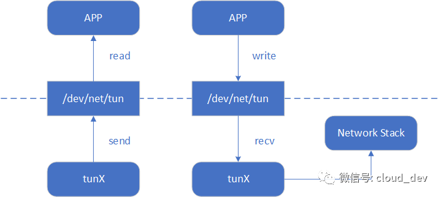
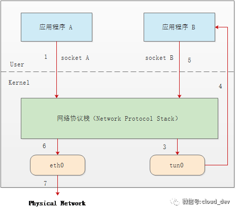

# Linux 虚拟网络设备之 tuntap

## 用户空间与内核空间的数据传输

在 Linux 中，用户空间和内核空间的数据传输有多种方式，字符设备就是其中的一种。tap/tun 通过驱动程序和一个与之关联的字符设备，来实现用户空间和内核空间的通信接口。

在 Linux 内核 2.6.x 之后的版本中，tap/tun 对应的字符设备文件分别为：

* tap：/dev/tap0
* tun：/dev/net/tun

设备文件即充当了用户空间和内核空间通信的接口。当应用程序打开设备文件时，驱动程序就会创建并注册相应的虚拟设备接口，一般以 `tunX`​ 或 `tapX`​ 命名。当应用程序关闭文件时，驱动也会自动删除 `tunX`​ 和 `tapX`​ 设备，还会删除已经建立起来的路由等信息。

tap/tun 设备文件就像一个管道，一端连接着用户空间，一端连接着内核空间。当用户程序向文件 `/dev/net/tun`​ 或 `/dev/tap0`​ 写数据时，内核就可以从对应的 `tunX`​ 或 `tapX`​ 接口读到数据，反之，内核可以通过相反的方式向用户程序发送数据。



‍

## tap/tun 和网络协议栈的数据传输

tap/tun 通过实现相应的网卡驱动程序来和网络协议栈通信。一般的流程和物理网卡和协议栈的交互流程是一样的，不同的是物理网卡一端是连接物理网络，而 tap/tun 虚拟网卡一般连接到用户空间。

如下图的示意图，我们有两个应用程序 A、B，物理网卡 `eth0`​ 和虚拟网卡 `tun0`​ 分别配置 IP：`10.1.1.11`​ 和 `192.168.1.11`​，程序 A 希望构造数据包发往 `192.168.1.0/24`​ 网段的主机 `192.168.1.1`​。



基于上图，我们看看数据包的流程：

1. 应用程序 A 构造数据包，目的 IP 是 `192.168.1.1`​，通过 `socket A`​ 将这个数据包发给协议栈。
2. 协议栈根据数据包的目的 IP 地址，匹配路由规则，发现要从 `tun0`​ 出去。
3. ​`tun0`​ 发现自己的另一端被应用程序 B 打开了，于是将数据发给程序 B.
4. 程序 B 收到数据后，做一些跟业务相关的操作，然后构造一个新的数据包，源 IP 是 `eth0`​ 的 IP，目的 IP 是 `10.1.1.0/24`​ 的网关 `10.1.1.1`​，封装原来的数据的数据包，重新发给协议栈。
5. 协议栈再根据本地路由，将这个数据包从 `eth0`​ 发出。

后续步骤，当 `10.1.1.1`​ 收到数据包后，会进行解封装，读取里面的原始数据包，继而转发给本地的主机 `192.168.1.1`​。当接收回包时，也遵循同样的流程。

在这个流程中，应用程序 B 的作用其实是利用 `tun0`​ 对数据包做了一层隧道封装。其实 `tun`​ 设备的最大用途就是用于隧道通信的。

‍

## tap/tun 的区别

tun/tap 虽然工作原理一致，但是工作的层次不一样。

tun是三层网络设备，收发的是IP层数据包，无法处理以太网数据帧，例如OpenVPN的路由模式就是使用了tun网络设备，OpenVPN Server重新规划了一个网段，所有的客户端都会获取到该网段下的一个IP，并且会添加对应的路由规则，而客户端与目标机器产生的数据报文都要经过OpenVPN网关才能转发。

tap是二层网络设备，收发以太网数据帧，拥有MAC层的功能，可以和物理网卡通过网桥相连，组成一个二层网络。例如OpenVPN的桥接模式可以从外部打一条隧道到本地网络。进来的机器就像本地的机器一样参与通讯，丝毫看不出这些机器是在远程。如果你有使用过虚拟机的经验，桥接模式也是一种十分常见的网络方案，虚拟机会分配到和宿主机器同网段的IP，其他同网段的机器也可以通过网络访问到这台虚拟机。

## tap/tun 的应用

从上面的数据流程中可以看到，`tun`​ 设备充当了一层隧道，所以，tap/tun 最常见的应用也就是用于隧道通信，比如 VPN，包括 tunnel 和应用层的 IPsec 等，其中比较有名的两个开源项目是 [openvpn](http://openvpn.sourceforge.net/) 和 [VTun](http://vtun.sourceforge.net/)。

‍

Linux 提供了一些命令行程序方便我们来创建持久化的tun/tap设备，但是如果没有应用程序打开对应的文件描述符，tun/tap的状态一直会是DOWN，还好的是这并不会影响我们把它当作普通网卡去使用。

使用`ip tuntap help`​查看使用帮助

```bash
Usage: ip tuntap { add | del | show | list | lst | help } [ dev PHYS_DEV ]
	[ mode { tun | tap } ] [ user USER ] [ group GROUP ]
	[ one_queue ] [ pi ] [ vnet_hdr ] [ multi_queue ] [ name NAME ]

Where:	USER  := { STRING | NUMBER }
	GROUP := { STRING | NUMBER }
```

```bash
# 创建 tap 
ip tuntap add dev tap0 mode tap 
# 创建 tun
ip tuntap add dev tun0 mode tun 

# 删除 tap
ip tuntap del dev tap0 mode tap
# 删除 tun
ip tuntap del dev tun0 mode tun 
```

tun/tap 设备创建成功后可以当作普通的网卡一样使用，因此我们也可以通过`ip link`​命令来操作它。

```bash
# 例如使用ip link命令也可以删除tun/tap设备 
ip link del tap0 
ip link del tun0
```

‍

### ip tuntap实战

‍
