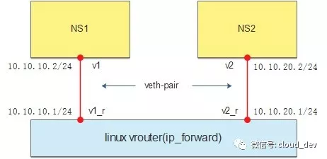

# Linux 虚拟网络设备之 vRouter

　　‍

## Linux 本身就是一台路由器

　　前面的文章我们学习了多种虚拟的网络设备，包括网卡、交换机等，也了解了怎么用工具来操作这些设备，那么，回到今天的主题，路由器有没有对应的虚拟设备，能不能也用相关工具来操作呢，这个答案如果要深究的话，也是有的，比如 OpenStack 的 DVR、一些开源的虚拟路由器实现等等。

　　不过我们不做那么深究的讨论，简化问题，Linux 系统实际上没有实现相关的虚拟路由器设备，自然也没有工具可以操作路由器，因为 **Linux 本身就是一台路由器**。

　　Linux 提供一个开关来操作路由功能，就是 `/proc/sys/net/ipv4/ip_forward`​，默认这个开关是关的，打开只需：

```
echo 1 > /proc/sys/net/ipv4/ip_forward
```

　　但这种打开方式只是临时的，如果要一劳永逸，可以修改配置文件 `/etc/sysctl.conf`​，添加或修改项 `net.ipv4.ip_forward`​ 为：

```
net.ipv4.ip_forward = 1
```

　　‍

## 实践

　　为了降低大家实践的难度，我们就不创建虚拟机了，直接使用 namespace，一条 `ip`​ 命令就可以搞定所有的操作。

　　我们按照下面的图示进行操作（NS1 和 NS2 分布在不同网段）：

​​

　　创建两个 namespace：

```
ip netns add ns1
ip netns add ns2
```

　　创建两对 veth-pair，一端分别挂在两个 namespace 中：

```
ip link add v1 type veth peer name v1_r
ip link add v2 type veth peer name v2_r

ip link set v1 netns ns1
ip link set v2 netns ns2
```

　　分别给两对 veth-pair 端点配上 IP 并启用：

```
ip a a 10.10.10.1/24 dev v1_r
ip l s v1_r up
ip a a 10.10.20.1/24 dev v2_r
ip l s v2_r up

ip netns exec ns1 ip a a 10.10.10.2/24 dev v1
ip netns exec ns1 ip l s v1 up
ip netns exec ns2 ip a a 10.10.20.2/24 dev v2
ip netns exec ns2 ip l s v2 up
```

　　验证一下： v1 ping v2，结果不通。

```bash
 ip netns exec ns1 ping 10.10.20.2
```

　　看下 `ip_forward`​ 的值：

```
[root@by ~]# cat /proc/sys/net/ipv4/ip_forward
0
```

　　没开路由怎么通，改为 1 再试，还是不通。

　　看下 ns1 的路由表：

```
[root@by ~]# ip netns exec ns1 route -n
Kernel IP routing table
Destination     Gateway         Genmask         Flags Metric Ref    Use Iface
10.10.10.0      0.0.0.0         255.255.255.0   U     0      0        0 v1
```

　　只有一条直连路由，没有去往 `10.10.20.0/24`​ 网段的路由，怎么通？那就给它配一条：

```
[root@by ~]# ip netns exec ns1 route add -net 10.10.20.0 netmask 255.255.255.0 gw 10.10.10.1

[root@by ~]# ip netns exec ns1 route -n
Kernel IP routing table
Destination     Gateway         Genmask         Flags Metric Ref    Use Iface
10.10.10.0      0.0.0.0         255.255.255.0   U     0      0        0 v1
10.10.20.0      10.10.10.1      255.255.255.0   UG    0      0        0 v1
```

　　同理也给 ns2 配上去往 `10.10.10.0/24`​ 网段的路由。

　　最后再 ping，成功了！

```
[root@by ~]# ip netns exec ns1 ping 10.10.20.2
PING 10.10.20.2 (10.10.20.2) 56(84) bytes of data.
64 bytes from 10.10.20.2: icmp_seq=1 ttl=63 time=0.071 ms
64 bytes from 10.10.20.2: icmp_seq=2 ttl=63 time=0.070 ms
^C
--- 10.10.20.2 ping statistics ---
2 packets transmitted, 2 received, 0% packet loss, time 1000ms
rtt min/avg/max/mdev = 0.070/0.070/0.071/0.008 ms
```
