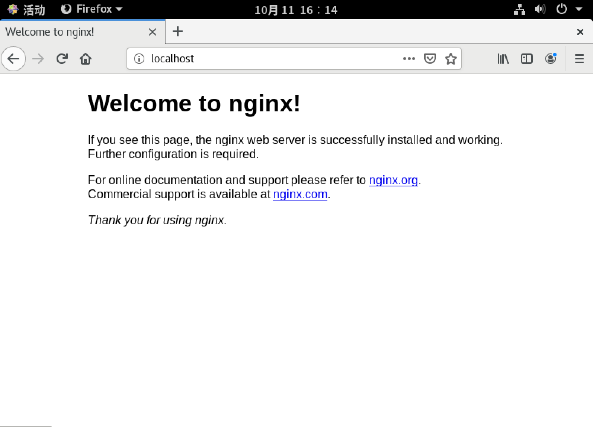

# linux 软件包管理

在linux系统中我们经常涉及到软件包的删除和添加，那一起来看下在linux系统中软件包的管理方式都有哪些

* rpm软件
* yum软件仓库
* 源码软件

yum  dnf  apt-get  zypper

dpkg 

## 一、rpm软件包

前面的课程我们提到过源码包安装需要解决系统环境、权限等等，这些对于初学者而言都是噩梦一般的存在，所以linux厂商推出了一种类似windows系统中的安装方式，有开发者直接在已知的系统中编译好，使用者可以直接下载并进行安装，升级，卸载等操作。在linux中能够提供这些功能的软件有两种，rpm和dpkg，而在CentOS中使用的是RPM

rpm最早是由redhat开发出来，由于很好用，所以很多发行版也利用rpm来进行软件包的管理。RPM全名RedHat Package Manager，最大的特点就是把需要安装的软件提前编译，打包，然后在rpm包里面存放了用以记录软件依赖关系的相关数据，当用户安装时，优先查看这些数据，如果系统满足数据要求就安装软件包，否则不能安装，安装完成后，将软件包相关信息记录到rpm自己的数据库中，便于查询和卸载等。所以说rpm的优点是方便安装，卸载，查询，缺点就是只能在指定的操作系统上使用，所以不同厂商的rpm包，甚至同一厂商不同版本操作系统的rpm包都不通用。

**rpm包的命名**

```
dhcp-server-	4.3.6		-30			.el8		.x86_64		.rpm
软件名称		版本		编译次数	         适用的系统	     适用的平台	   后缀名

软件名	 就是软件包的名称
版本	 每次更新版本号都会改变，用来帮助用户判断软件包新旧的
编译次数	 也是帮助用户判断软件包新旧的
适用的系统 在哪个系统上可以安装，CentOS和rhel的多数软件包都是通用的
适用的平台 指的是硬件平台，比如如果你是32位的CPU就无法安装这个软件包
```

### rpm的使用

rpm包的相关文件一般都会放在对应的目录中，比如rpm包安装后，配置文件会放在/etc下，执行文件会放在/usr/bin下，链接库文件会放在/usr/lib下，帮助与说明文档会放在/usr/share/man和/usr/share/doc目录下

**安装**

```
[root@zutuanxue Packages]# rpm -ivh dhcp-server-4.3.6-30.el8.x86_64.rpm 
-i					安装
-v					显示详细信息
-h					显示安装进度
-e					卸载
-U					升级，如果系统中有低版本的就会升级，如果系统没有安装相应的包，则安装
-F					有条件的升级，会检测用户指定的软件包是否已安装到linux中
--nodeps			忽略软件包之间的依赖关系
--replacefiles		覆盖文件
--replacepkgs		修复
--force				强制
--test				测试
-q					查询指定的软件包是否安装
-qi					查看指定的软件包的信息，包括开发商，版本，说明
-ql					查看指定软件包中所包含的文件列表
-qc					查看指定软件包的配置文件
-qa					查看本机安装的所有包
-qf					查看一个文件归属于哪个已安装的软件包
```

rpm的内容我们就介绍到这里，接下来我们看下一个yum

## 二、yum软件仓库

YUM（*Yellow dog Updater, Modified*）是一个基于rpm却更胜于rpm的管理工具，让你可以更轻松的管理Red Hat Enterprise Linux系统中的软件。你可以使用YUM来安装或卸载软件、也可以利用YUM来更新你的系统，更可以利用YUM来搜索一个尚未安装的软件。不管是安装、更新或者删除，YUM都会自动的帮你解决软件间的依赖性问题。通过YUM会比单纯使用rpm来得更加方便。

YUM包含下列几项组件：

- YUM下载源：如果把所有RPM文件放在某一个目录中，这个目录就可称为“YUM下载源（*YUM Repository*）”。你也可以把YUM下载源，通过HTTP、FTP等方式分享给其他计算机使用；当然，你也可以直接使用别人建好的YUM下载源来取得需安装的软件。
- YUM工具：YUM提供了一个名为yum的命令，你可以使用yum来使用YUM提供的众多功能。
- YUM插件：YUM还允许第三方厂商（*3rd Party*）开发YUM的插件（*Plug-in*），让用户可以任意的扩充YUM的功能，比如说有的插件可以帮助选择最快的yum源
- YUM缓存：YUM运行时，会从YUM下载源获得软件信息与文件，并且暂存于本机的硬盘上。这个暂存的目录，称为“YUM缓存（*YUM cache*）”。缓存目录为/var/cache/yum

‍

‍

## 三、源码包的安装

在linux系统中，很多新版本的软件包的更新都会优先提供tar包版本的，然后各linux厂商拿到这个tar包之后再给自己的操作系统提供官方的rpm或者dpkg类型的软件包，而这种tar工具打包的软件包我们一般称之为源码包，在这些源码包中一般包含有，程序源代码文件，配置文件（configure），安装使用说明（INSTALL,HOWTO,README）

那这种tar包源码包如何安装呢？简单的流程就是

- 获取软件包
- 解压文件
- 检查当前系统是否满足软件包安装需求
- 使用gcc进行编译，生成主要的二进制文件
- 将二进制文件安装到主机

这些步骤看起来很简单，但是在使用过程中有很多问题需要解决，比如说需要解决系统环境，权限问题等等，不同类型的软件在安装方法上会有差异，但是整体步骤就是我们上面所提到的。接下来我们通过一个案例来学习源码安装软件。

**案例：源码安装一个nginx软件**

### 获取软件包

软件包获取的方式有很多，最常见的就是拷贝或者下载这两种方式，拷贝咱们就不说了，因为用的太多了；接下来我给大家说一下如何从网络下载软件包。

- wget命令：文本界面的下载命令

```
[root@zutuanxue ~]# wget http://nginx.org/download/nginx-1.19.3.tar.gz
--2020-10-11 15:59:45--  http://nginx.org/download/nginx-1.19.3.tar.gz
正在解析主机 nginx.org (nginx.org)... 3.125.197.172, 52.58.199.22, 2a05:d014:edb:5704::6, ...
正在连接 nginx.org (nginx.org)|3.125.197.172|:80... 已连接。
已发出 HTTP 请求，正在等待回应... 200 OK
长度：1052581 (1.0M) [application/octet-stream]
正在保存至: “nginx-1.19.3.tar.gz”

nginx-1.19.3.tar.gz 100%[===================>]   1.00M  21.4KB/s  用时 43s     

2020-10-11 16:00:28 (24.1 KB/s) - 已保存 “nginx-1.19.3.tar.gz” [1052581/1052581])
```

- 解压软件包

```
[root@zutuanxue ~]# tar xf nginx-1.19.3.tar.gz

[root@zutuanxue ~]# ls
公共  视频  文档  音乐  anaconda-ks.cfg       nginx-1.19.3
模板  图片  下载  桌面  initial-setup-ks.cfg  nginx-1.19.3.tar.gz
```

- configure命令：检查当前系统是否满足软件包安装需求,这步的主要目的：
  – 检查环境 是否 满足安装条件 依赖解决
  – 指定安装方式 配置文件 命令文件 各种文件放哪里 开启模块功能【内置模块 三方模块】
  – 指定软件安装在那里

```
- 安装GCC编译软件 以及nginx依赖，有人问我为啥要安装pcre-devel zlib-devel这两个包，因为你不了解，如果你自己安装过一次就知道在检查当前系统的时候会报错，说没有这两个软件，这里我就直接装上了。大家学习的时候可以试试，是不是我说的这样。
[root@zutuanxue ~]# yum -y install gcc pcre-devel zlib-devel

- 检查系统是否满足安装需求
[root@zutuanxue ~]# cd nginx-1.19.3/
[root@zutuanxue nginx-1.19.3]# ./configure --prefix=/usr/local/nginx
checking for OS
 + Linux 4.18.0-193.el8.x86_64 x86_64
checking for C compiler ... found
 + using GNU C compiler
 + gcc version: 8.3.1 20191121 (Red Hat 8.3.1-5) (GCC) 
checking for gcc -pipe switch ... found
checking for -Wl,-E switch ... found
checking for gcc builtin atomic operations ... found
checking for C99 variadic macros ... found
checking for gcc variadic macros ... found

.........此处省略10000个字

Configuration summary
  + using system PCRE library
  + OpenSSL library is not used
  + using system zlib library

  nginx path prefix: "/usr/local/nginx"
  nginx binary file: "/usr/local/nginx/sbin/nginx"
  nginx modules path: "/usr/local/nginx/modules"
  nginx configuration prefix: "/usr/local/nginx/conf"
  nginx configuration file: "/usr/local/nginx/conf/nginx.conf"
  nginx pid file: "/usr/local/nginx/logs/nginx.pid"
  nginx error log file: "/usr/local/nginx/logs/error.log"
  nginx http access log file: "/usr/local/nginx/logs/access.log"
  nginx http client request body temporary files: "client_body_temp"
  nginx http proxy temporary files: "proxy_temp"
  nginx http fastcgi temporary files: "fastcgi_temp"
  nginx http uwsgi temporary files: "uwsgi_temp"
  nginx http scgi temporary files: "scgi_temp"


备注：
/configure --prefix=/usr/local/nginx
--prefix=   指定软件安装到哪个目录
```

- make命令：使用gcc进行编译，生成主要的二进制文件

```
[root@zutuanxue nginx-1.19.3]# make -j4
make -f objs/Makefile
make[1]: 进入目录“/root/nginx-1.19.3”
cc -c -pipe  -O -W -Wall -Wpointer-arith -Wno-unused-parameter -Werror -g  -I src/core -I src/event -I src/event/modules -I src/os/unix -I objs \
	-o objs/src/core/ngx_inet.o \
	src/core/ngx_inet.c
           ...........省略过程

-ldl -lpthread -lcrypt -lpcre -lz \
-Wl,-E
make[1]: 离开目录“/root/nginx-1.19.3”


备注： make -j4
-j 指定几个cpu一起编译    -j4  那就是4个一起干活，默认一个干活，这样速度更快
```

- make install 命令将二进制文件安装到主机

```
[root@zutuanxue nginx-1.19.3]# make install
make -f objs/Makefile install
make[1]: 进入目录“/root/nginx-1.19.3”
test -d '/usr/local/nginx' || mkdir -p '/usr/local/nginx'
test -d '/usr/local/nginx/sbin' \
	|| mkdir -p '/usr/local/nginx/sbin'
test ! -f '/usr/local/nginx/sbin/nginx' \
	|| mv '/usr/local/nginx/sbin/nginx' \
		'/usr/local/nginx/sbin/nginx.old'
cp objs/nginx '/usr/local/nginx/sbin/nginx'
test -d '/usr/local/nginx/conf' \
	|| mkdir -p '/usr/local/nginx/conf'
cp conf/koi-win '/usr/local/nginx/conf'
cp conf/koi-utf '/usr/local/nginx/conf'
cp conf/win-utf '/usr/local/nginx/conf'
test -f '/usr/local/nginx/conf/mime.types' \
	|| cp conf/mime.types '/usr/local/nginx/conf'
cp conf/mime.types '/usr/local/nginx/conf/mime.types.default'
test -f '/usr/local/nginx/conf/fastcgi_params' \
	|| cp conf/fastcgi_params '/usr/local/nginx/conf'
cp conf/fastcgi_params \
	'/usr/local/nginx/conf/fastcgi_params.default'
test -f '/usr/local/nginx/conf/fastcgi.conf' \
	|| cp conf/fastcgi.conf '/usr/local/nginx/conf'
cp conf/fastcgi.conf '/usr/local/nginx/conf/fastcgi.conf.default'
test -f '/usr/local/nginx/conf/uwsgi_params' \
	|| cp conf/uwsgi_params '/usr/local/nginx/conf'
cp conf/uwsgi_params \
	'/usr/local/nginx/conf/uwsgi_params.default'
test -f '/usr/local/nginx/conf/scgi_params' \
	|| cp conf/scgi_params '/usr/local/nginx/conf'
cp conf/scgi_params \
	'/usr/local/nginx/conf/scgi_params.default'
test -f '/usr/local/nginx/conf/nginx.conf' \
	|| cp conf/nginx.conf '/usr/local/nginx/conf/nginx.conf'
cp conf/nginx.conf '/usr/local/nginx/conf/nginx.conf.default'
test -d '/usr/local/nginx/logs' \
	|| mkdir -p '/usr/local/nginx/logs'
test -d '/usr/local/nginx/logs' \
	|| mkdir -p '/usr/local/nginx/logs'
test -d '/usr/local/nginx/html' \
	|| cp -R html '/usr/local/nginx'
test -d '/usr/local/nginx/logs' \
	|| mkdir -p '/usr/local/nginx/logs'
make[1]: 离开目录“/root/nginx-1.19.3”
```

到此我们就把nginx安装到/usr/local目录下了,可以使用ls命令看看有没有东西

```
[root@zutuanxue nginx-1.19.3]# ls /usr/local/nginx/
conf  html  logs  sbin
```

- 验证安装
  软件已经安装了，我们看看结果吧！

```
启动软件
[root@zutuanxue nginx-1.19.3]# /usr/local/nginx/sbin/nginx
```

打开虚拟机浏览器输入:http://localhost回车

​​

‍
