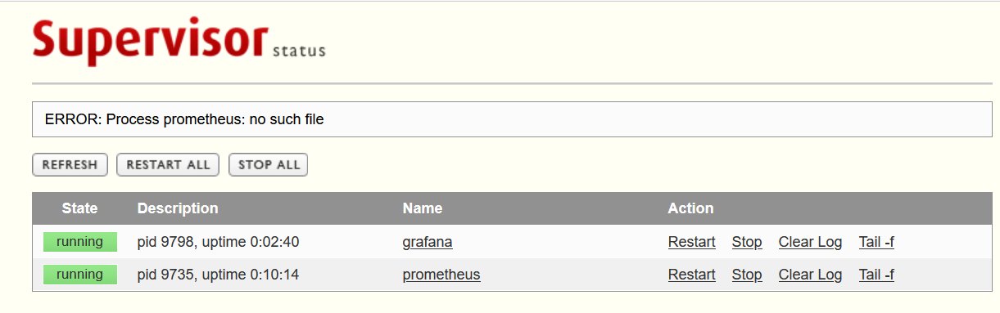

# supervisord

Supervisor是用Python开发的一套通用的进程管理程序，能将一个普通的命令行进程变为后台daemon，并监控进程状态，异常退出时能自动重启。它是通过fork/exec的方式把这些被管理的进程当作supervisor的子进程来启动，这样只要在supervisor的配置文件中，把要管理的进程的可执行文件的路径写进去即可。也实现当子进程挂掉的时候，父进程可以准确获取子进程挂掉的信息的，可以选择是否自己启动和报警。supervisor还提供了一个功能，可以为supervisord或者每个子进程，设置一个非root的user，这个user就可以管理它对应的进程

**Supervisord VS Systemd**

* Systemd

  * 稳定可靠
  * 支持 Before/After 依赖机制
  * 支持 Notify 机制
  * 支持基于 cgroup 的资源限制
* Supervisord

  * 支持通过 priority 配置进程启动顺序
  * 日志友好方便查阅
  * 跨平台使用
  * 扩展开发友好

## 安装 Supervisord

```bash
### pip安装
pip install supervisor
#安装supervisor默认是没有生成配置文件的，生成配置文件
echo_supervisord_conf > /etc/supervisord.conf
#另外如果你想把配置文件放在其他地方，则可以自己指定地址，只是在启动 supervisord 时加-c显式指定配置文件地址supervisord -c supervisord.conf

### 使用yum安装supervisor
yum install supervisor
systemctl start     supervisord.service  
systemctl enable supervisord.service  
#安装生成配置文件，路径 /etc/supervisord.conf
```

### 配置文件参数详解

```ini

[unix_http_server]    
file=/tmp/supervisor.sock   ; socket文件的路径，supervisorctl用XML_RPC和supervisord通信就是通过它进行的。如果不设置的话，supervisorctl也就不能用了    
;chmod=0700                 ; 修改上面的那个socket文件的权限为0700,默认为0700
;chown=nobody:nogroup       ; 修改上面的那个socket文件的属组为user.group,默认为启动supervisord进程的用户及属组
;username=user              ; 使用supervisorctl连接的时候，认证的用户,默认为不需要用户
;password=123               ; 和上面的用户名对应的密码，可以直接使用明码，也可以使用SHA加密,如：{SHA}82ab88d
[inet_http_server]         ; 侦听在TCP上的socket，Web Server和远程的supervisorctl都要用到他默认为不开启
;port=127.0.0.1:9001        ; 这个是侦听的IP和端口
;username=user              ; 这个和上面的uinx_http_server一个样
;password=123               ; 这个也一个样

[supervisord]                ;这个主要是定义supervisord这个服务端进程的一些参数
logfile=/tmp/supervisord.log ; 这个是supervisord这个主进程的日志路径，注意和子进程的日志不搭嘎。默认路径$CWD/supervisord.log，$CWD是当前目录
logfile_maxbytes=50MB        ; 这个是上面那个日志文件的最大的大小，当超过50M的时候，会生成一个新的日志文件。当设置为0时，表示不限制文件大小,默认值是50M，非必须设置。          
logfile_backups=10           ; 日志文件保持的数量，上面的日志文件大于50M时，就会生成一个新文件。文件数量大于10时，最初的老文件被新文件覆盖，文件数量将保持为10,当设置为0时，表示不限制文件的数量。
loglevel=info                ; 日志级别，有critical, error, warn, info, debug, trace, or blather等
pidfile=/tmp/supervisord.pid ; supervisord的pid文件路径。默认为$CWD/supervisord.pid
nodaemon=false               ; 如果是true，supervisord进程将在前台运行
minfds=1024                  ; 这个是最少系统空闲的文件描述符，低于这个值supervisor将不会启动。系统的文件描述符在这里设置cat /proc/sys/fs/file-max,默认情况下为1024
minprocs=200                 ; 最小可用的进程描述符，低于这个值supervisor也将不会正常启动。ulimit  -u这个命令，可以查看linux下面用户的最大进程数,默认为200
;umask=022                   ; 进程创建文件的掩码,默认为022
;user=chrism                 ; 这个参数可以设置一个非root用户，当我们以root用户启动supervisord之后。我这里面设置的这个用户，也可以对supervisord进行管理
;identifier=supervisor       ; 这个参数是supervisord的标识符，主要是给XML_RPC用的。当你有多个supervisor的时候，而且想调用XML_RPC统一管理，就需要为每个supervisor设置不同的标识符了
;directory=/tmp              ; 这个参数是当supervisord作为守护进程运行的时候，设置这个参数的话，启动supervisord进程之前，会先切换到这个目录
;nocleanup=true              ; 这个参数当为false的时候，会在supervisord进程启动的时候，把以前子进程产生的日志文件(路径为AUTO的情况下)清除掉。有时候咱们想要看历史日志，当然不想日志被清除了。所以可以设置为true
;childlogdir=/tmp            ; 当子进程日志路径为AUTO的时候，子进程日志文件的存放路径。默认路径是这个东西，执行下面的这个命令看看就OK了，处理的东西就默认路径python -c "import tempfile;print tempfile.gettempdir()"
;environment=KEY="value"     ; 这个是用来设置环境变量的，supervisord在linux中启动默认继承了linux的环境变量，在这里可以设置supervisord进程特有的其他环境变量。supervisord启动子进程时，子进程会拷贝父进程的内存空间内容。 所以设置的这些环境变量也会被子进程继承。小例子：environment=name="haha",age="hehe"
;strip_ansi=false            ; 这个选项如果设置为true，会清除子进程日志中的所有ANSI 序列。什么是ANSI序列呢？就是我们的\n,\t这些东西。
; the below section must remain in the config file for RPC
; (supervisorctl/web interface) to work, additional interfaces may be
; added by defining them in separate rpcinterface: sections
[rpcinterface:supervisor]    ;这个选项是给XML_RPC用的，当然你如果想使用supervisord或者web server 这个选项必须要开启的
supervisor.rpcinterface_factory = supervisor.rpcinterface:make_main_rpcinterface 

[supervisorctl]              ;这个主要是针对supervisorctl的一些配置  
serverurl=unix:///tmp/supervisor.sock ; 这个是supervisorctl本地连接supervisord的时候，本地UNIX socket路径，注意这个是和前面的[unix_http_server]对应的,默认值就是unix:///tmp/supervisor.sock
;serverurl=http://127.0.0.1:9001 ; 这个是supervisorctl远程连接supervisord的时候，用到的TCP socket路径注意这个和前面的[inet_http_server]对应,默认就是http://127.0.0.1:9001
                       
;username=chris              ; 用户名
;password=123                ; 密码
;prompt=mysupervisor         ; 输入用户名密码时候的提示符,默认supervisor
;history_file=~/.sc_history  ; 这个参数和shell中的history类似，我们可以用上下键来查找前面执行过的命令,默认是no file的。。所以我们想要有这种功能，必须指定一个文件

; The below sample program section shows all possible program subsection values,
; create one or more 'real' program: sections to be able to control them under
; supervisor.

[program:theprogramname]      ;这个就是咱们要管理的子进程了，":"后面的是名字，最好别乱写和实际进程有点关联最好。这样的program我们可以设置一个或多个，一个program就是要被管理的一个进程
;command=/bin/cat              ; 绝对路径！这个就是我们的要启动进程的命令路径了，可以带参数例子：/home/test.py -a 'hehe',有一点需要注意的是，我们的command只能是那种在终端运行的进程，不能是守护进程。这个想想也知道了，比如说command=service httpd start。httpd这个进程被linux的service管理了，我们的supervisor再去启动这个命令,这已经不是严格意义的子进程了。

;process_name=%(program_name)s ; 这个是进程名，如果我们下面的numprocs参数为1的话，就不用管这个参数了，它默认值%(program_name)s也就是上面的那个program冒号后面的名字，但是如果numprocs为多个的话，那就不能这么干了。
   
;numprocs=1                    ; 启动进程的数目。当不为1时，就是进程池的概念，注意process_name的设置
;directory=/tmp                ; 进程运行前，会前切换到这个目录
;umask=022                     ; 进程掩码，默认none，非必须
;priority=999                  ; 子进程启动关闭优先级，优先级低的，最先启动，关闭的时候最后关闭
;autostart=true                ; 如果是true的话，子进程将在supervisord启动后被自动启动
;autorestart=unexpected        ; 这个是设置子进程挂掉后自动重启的情况，有三个选项，false,unexpected和true。如果为false的时候，无论什么情况下，都不会被重新启动，如果为unexpected，只有当进程的退出码不在下面的exitcodes里面定义的退出码的时候，才会被自动重启。当为true的时候，只要子进程挂掉，将会被无条件的重启
;startsecs=1                   ; 这个选项是子进程启动多少秒之后，此时状态如果是running，则我们认为启动成功了
;startretries=3                ; 当进程启动失败后，最大尝试启动的次数。。当超过3次后，supervisor将把此进程的状态置为FAIL
;exitcodes=0,2                 ; 注意和上面的的autorestart=unexpected对应。。exitcodes里面的定义的退出码是expected的。
;stopsignal=QUIT               ; 进程停止信号，可以为TERM, HUP, INT, QUIT, KILL, USR1, or USR2等信号,默认为TERM 

;stopwaitsecs=10               ; 这个是当我们向子进程发送stopsignal信号后，到系统返回信息给supervisord，所等待的最大时间。 超过这个时间，supervisord会向该子进程发送一个强制kill的信号。

;stopasgroup=false             ; 这个东西主要用于，supervisord管理的子进程，这个子进程本身还有子进程。那么我们如果仅仅干掉supervisord的子进程的话，子进程的子进程有可能会变成孤儿进程。所以咱们可以设置可个选项，把整个该子进程的整个进程组都干掉。 设置为true的话，一般killasgroup也会被设置为true。需要注意的是，该选项发送的是stop信号
。
;killasgroup=false             ; 这个和上面的stopasgroup类似，不过发送的是kill信号
;user=chrism                   ; 如果supervisord是root启动，我们在这里设置这个非root用户，可以用来管理该program
;redirect_stderr=true          ; 如果为true，则stderr的日志会被写入stdout日志文件中
;stdout_logfile=/a/path        ; 子进程的stdout的日志路径，可以指定路径，AUTO，none等三个选项。设置为none的话，将没有日志产生。设置为AUTO的话，将随机找一个地方生成日志文件，而且当supervisord重新启动的时候，以前的日志文件会被清空。当 redirect_stderr=true的时候，sterr也会写进这个日志文件
;stdout_logfile_maxbytes=1MB   ; 日志文件最大大小，和[supervisord]中定义的一样。默认为50
;stdout_logfile_backups=10     ; 和[supervisord]定义的一样。默认10
;stdout_capture_maxbytes=1MB   ; 这个东西是设定capture管道的大小，当值不为0的时候，子进程可以从stdout发送信息，而supervisor可以根据信息，发送相应的event。

;stdout_events_enabled=false   ; 当设置为ture的时候，当子进程由stdout向文件描述符中写日志的时候，将触发supervisord发送PROCESS_LOG_STDOUT类型的event

;stderr_logfile=/a/path        ; 这个东西是设置stderr写的日志路径，当redirect_stderr=true。这个就不用设置了，设置了也是白搭。因为它会被写入stdout_logfile的同一个文件中,默认为AUTO，也就是随便找个地存，supervisord重启被清空
;stderr_logfile_maxbytes=1MB   ; 这个出现好几次了，就不重复了
;stderr_logfile_backups=10     ; 这个也是
;stderr_capture_maxbytes=1MB   ; 这个一样，和stdout_capture一样。 默认为0，关闭状态
;stderr_events_enabled=false   ; 这个也是一样，默认为false
;environment=A="1",B="2"       ; 这个是该子进程的环境变量，和别的子进程是不共享的
;serverurl=AUTO                ; 

; The below sample eventlistener section shows all possible
; eventlistener subsection values, create one or more 'real'
; eventlistener: sections to be able to handle event notifications
; sent by supervisor.

[eventlistener:theeventlistenername] ;这个东西其实和program的地位是一样的，也是suopervisor启动的子进程，不过它干的活是订阅supervisord发送的event。他的名字就叫listener了。我们可以在listener里面做一系列处理，比如报警等等

;command=/bin/eventlistener    ; 这个和上面的program一样，表示listener的可执行文件的路径
;process_name=%(program_name)s ; 这个也一样，进程名，当下面的numprocs为多个的时候，才需要。否则默认就OK了
;numprocs=1                    ; 相同的listener启动的个数
;events=EVENT                  ; event事件的类型，也就是说，只有写在这个地方的事件类型。才会被发送
              
                         
;buffer_size=10                ; 这个是event队列缓存大小，单位不太清楚，楼主猜测应该是个吧。当buffer超过10的时候，最旧的event将会被清除，并把新的event放进去。默认值为10
;directory=/tmp                ; 进程执行前，会切换到这个目录下执行
;umask=022                     ; 淹没，默认为none，不说了
;priority=-1                   ; 启动优先级，默认-1，也不扯了
;autostart=true                ; 是否随supervisord启动一起启动，默认true
;autorestart=unexpected        ; 是否自动重启，和program一个样，分true,false,unexpected等，注意unexpected和exitcodes的关系
;startsecs=1                   ; 也是一样，进程启动后跑了几秒钟，才被认定为成功启动，默认1
;startretries=3                ; 失败最大尝试次数，默认3
;exitcodes=0,2                 ; 期望或者说预料中的进程退出码，
;stopsignal=QUIT               ; 干掉进程的信号，默认为TERM，比如设置为QUIT，那么如果QUIT来干这个进程那么会被认为是正常维护，退出码也被认为是expected中的
;stopwaitsecs=10               ; max num secs to wait b4 SIGKILL (default 10)
;stopasgroup=false             ; send stop signal to the UNIX process group (default false)
;killasgroup=false             ; SIGKILL the UNIX process group (def false)
;user=chrism                   ;设置普通用户，可以用来管理该listener进程。
;redirect_stderr=true          ; 为true的话，stderr的log会并入stdout的log里面
;stdout_logfile=/a/path        ; 这个不说了，好几遍了
;stdout_logfile_maxbytes=1MB   ; 这个也是
;stdout_logfile_backups=10     ; 这个也是
;stdout_events_enabled=false   ; 这个其实是错的，listener是不能发送event
;stderr_logfile=/a/path        ; 这个也是
;stderr_logfile_maxbytes=1MB   ; 这个也是
;stderr_logfile_backups        ; 这个不说了
;stderr_events_enabled=false   ; 这个也是错的，listener不能发送event
;environment=A="1",B="2"       ; 这个是该子进程的环境变量
;serverurl=AUTO                ; override serverurl computation (childutils)

; The below sample group section shows all possible group values,
; create one or more 'real' group: sections to create "heterogeneous"
; process groups.

[group:thegroupname]  ;这个东西就是给programs分组，划分到组里面的program。我们就不用一个一个去操作了,我们可以对组名进行统一的操作。 注意：program被划分到组里面之后，就相当于原来的配置从supervisor的配置文件里消失了。supervisor只会对组进行管理，而不再会对组里面的单个program进行管理了
;programs=progname1,progname2  ; 组成员，用逗号分开
;priority=999                  ; 优先级，相对于组和组之间说的

; The [include] section can just contain the "files" setting.  This
; setting can list multiple files (separated by whitespace or
; newlines).  It can also contain wildcards.  The filenames are
; interpreted as relative to this file.  Included files *cannot*
; include files themselves.

[include]                         ;这个东西挺有用的，当我们要管理的进程很多的时候，写在一个文件里面就有点大了。我们可以把配置信息写到多个文件中，然后include过来
;files = relative/directory/*.ini
```

### program 配置实例

面我们已经把 supervisrod 运行起来了，现在可以添加我们要管理的进程的配置文件。这些配置可以都写到 supervisord.conf 文件里，如果应用程序很多，最好通过 include 的方式把不同的程序（组）写到不同的配置文件里。

为了举例，我们新建一个目录 `/etc/supervisord.d`​​用于存放这些配置文件，相应的，把 /etc/supervisord.conf 里 include 部分的的配置修改一下：

```ini
[include]
files = /etc/supervisord.d
```

​`vim /etc/supervisord.d/prometheus`​

```ini
[program:prometheus]
directory = /data/prometheus
command = /data/prometheus/prometheus  --config.file=/data/prometheus/prometheus.yml 
autostart = false
startsecs = 5 
user = prometheus
redirect_stderr = true 
stdout_logfile_maxbytes = 50MB
stdout_logfile_backups = 20
stdout_logfile = /data/prometheus/prometheus.log

[program:grafana]
directory = /data/grafana
command = /data/grafana/bin/grafana-server web
autostart = false
startsecs = 5 
user = prometheus
redirect_stderr = true 
stdout_logfile_maxbytes = 50MB
stdout_logfile_backups = 20
stdout_logfile = /data/grafana/grafana.log
```

```ini
supervisorctl update
supervisorctl start prometheus
supervisorctl start grafana
```

### 配置 http 服务

supervisord 可以开启 http 服务，通过 web 页面来查看和管理任务。  
如果需要开启，可以打开`inet_http_server`​配置，大概在39行。

```bash
[inet_http_server]       ; inet (TCP) server disabled by default
port=0.0.0.0:9001        ; ip_address:port specifier, *:port for all iface
;username=admin          ; default is no username (open server)
;password=thepassword    ; default is no password (open server)
```

​​

## supervisorctl 操作

supervisorctl 是 supervisord 的命令行客户端工具，使用的配置和 supervisord 一样，这里就不再说了。下面，主要介绍 supervisorctl 操作的常用命令：

```ini
status    ;查看程序状态
stop     program_name   ;关闭 program_name 程序
start    program_name   ;启动 program_name 程序
restart  program_name   ;重启 program_name 程序
reread    ;读取有更新（增加）的配置文件，不会启动新添加的程序，也不会重启任何程序
reload    ;载入最新的配置文件，停止原有的进程并按照新的配置启动
update    ;重启配置文件修改过的程序，配置没有改动的进程不会收到影响而重启
```

‍
