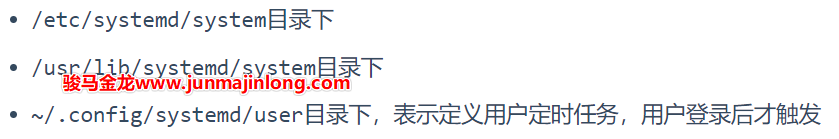
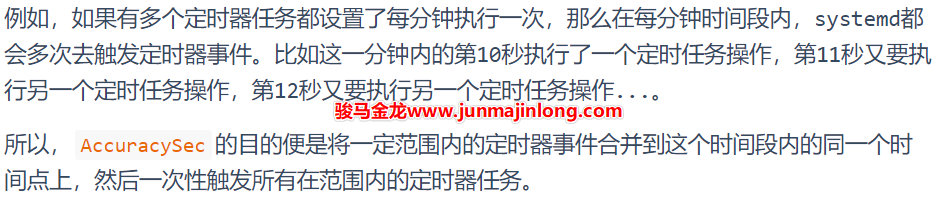

# systemd timer 取代cron和at的定时任务

## cron和systemd timer实现定时任务的比较

Linux环境下，cron是使用最广泛的定时任务工具，但它有一些不方便的地方。比如它默认：

* 只支持分钟级别精度的定时任务
* 定时规则太死板
* 当调度到本次任务时，如果上次调度的任务仍在执行，无法阻止本次任务重复执行(需结合flock)
* 无法对定时任务可能消耗的大量资源做出限制
* 不支持只执行一次的定时点的计划任务
* 日志不直观，不方便调试任务

因为cron不原生支持以上功能，所以当有以上相关需求时，只能在要调度的命令层次上寻找解决方案。

systemd系统中包含了timer计时器组件，timer可以完全替代cron+at，它具有以下特性：

* 可精确到微妙级别，其支持的时间单位包括：

  * us(微秒)、ms(毫秒)、s(秒)、m(分)、h(时)、d(日)、w(周)
  * 类似cron定义时间的方式(某年某月某日某时某分某秒以及时间段)
* 可对定时任务做资源限制
* 可替代cron和at工具，且支持比cron更加灵活丰富的定时规则
* 不会重复执行定时任务

  * 如果触发定时任务时发现上次触发的任务还未执行完，那么本次触发的任务不会执行
  * 而且systemd启动服务的操作具有幂等性，如果服务正在运行，启动操作将不做任何事，所以，甚至可以疯狂到每秒或每几秒启动一次服务，免去判断进程是否存在的过程
* 集成到journal日志，方便调试任务，方便查看任务调度情况
* …

但systemd timer相比cron也有不足支持：

* 定义定时任务的步骤稍微多一些，甚至要求用户对systemd有基本的掌握，所以使用它会有一些门槛
* cron中MAILTO环境变量可以非常方便地将所有输出或有标准错误输出时通过邮件发送给管理员，但是systemd timer没有原生支持发送邮件的功能，虽然借助一些额外的配置也能实现邮件发送，但步骤稍多

## systemd timer入门示例：每3秒运行一次

使用systemd timer定时任务时，需要同时编写两个文件：

* 编写一个以`.timer`​为后缀的Systemd Unit，该文件描述定时任务如何定时
* 编写一个以`.service`​为后缀的Systemd Service Unit，该文件描述定时任务要执行的操作

这两个文件名称通常保持一致(除了后缀部分)，它们可以放在：

​​

例如：

```bash
/usr/lib/systemd/system/foo.service
/usr/lib/systemd/system/foo.timer

/etc/systemd/system/foo.service
/etc/systemd/system/foo.timer

~/.config/systemd/user/foo.timer
~/.config/systemd/user/foo.service

```

假设定义一个每3秒执行一次的任务，该任务用于检测页面是否正常，对应命令为`curl -s -o /dev/null -w '%{http_code}' https://www.junmajinlong.com'`​，其结果为访问页面时响应的HTTP状态码。

先编写对应服务配置文件：

```bash
$ cat /usr/lib/systemd/system/page_test.service
[Unit]
Description = "test page: https://www.junmajinlong.com"

[Service]
ExecStart = /usr/bin/curl -s -o /dev/null -w '%{http_code}' 'https://www.junmajinlong.com'

```

因为命令每次调用都只执行一次且快速退出，所以Service中使用了默认的`Type=simple`​。当然，也可以使用`Type=oneshot`​。

再编写定时器配置文件：

```bash
$ cat /usr/lib/systemd/system/page_test.timer
[Unit]
Description = "test page: https://www.junmajinlong.com every 3 seconds"

[Timer]
OnActiveSec = 1s
OnUnitInactiveSec = 3s
AccuracySec = 1us
RandomizedDelaySec = 0

[Install]
WantedBy = timers.target

```

再执行如下命令即可让定时器生效：

```bash
systemctl daemon-reload
systemctl start page_test.timer  # 启动定时器

```

显然，还支持如下命令来管理定时器：

```bash
systemctl status xxx.timer
systemctl stop xxx.timer
systemctl restart xxx.timer

# 和WantedBy的值有关，若WantedBy=timers.target，则本命令多余
systemctl enable xxx.timer

```

回头来分析一下定时器配置文件中涉及到的指令。

首先是该文件`[Install]`​段中的最后一行`WantedBy=timers.target`​，它表示在开机时会自动启动该定时器，之所以会开机自动执行这些timers定时计划，是因为在basic.target中定义了timer.target依赖。

```bash
$ systemctl list-dependencies --reverse timers.target | head -2
timers.target
● └─basic.target

```

再看`Timer`​段中定义定时器属性的指令。

​`OnActiveSec`​表示从该定时器启动(即`systemctl start xxx.timer`​)之后，多长时间触发定时器对应的任务，即执行对应的Service服务。本例是启动定时器后1秒，开始第一次执行任务单元page_test.service。

​`OnUnitInactiveSec`​表示从上一次任务单元退出后，多长时间再次触发定时器对应的任务。比如在本例中，表示的含义是每次page_test.service执行完成(即页面检测完成后退出)后3秒，再次触发该任务。

剩余两个指令AccuracySec和RandomizedDelaySec，稍后再详细解释。因为在解释它们之前，需要学会观察定时任务的执行情况。

## 观察定时任务的执行时间点

使用`systemctl list-timers`​可以列出当前已经生效的定时器(即如果不停止它，则迟早会触发对应的定时任务)。它会按照下次要执行的时间点先后进行排序，最快要执行的任务在最前面。

```bash
$ systemctl list-timers --no-pager
NEXT                         LEFT     LAST                         PASSED       UNIT                         ACTIVATES
Sat 2020-07-04 18:43:34 CST  20s ago  Sat 2020-07-04 18:43:34 CST  20s ago      page_test.timer              page_test.service
Sun 2020-07-05 07:03:39 CST  12h left Fri 2020-07-03 17:27:44 CST  1 day 1h ago systemd-tmpfiles-clean.timer systemd-tmpfiles-clean.service

```

其中：

* ​`NEXT`​表示下一次要触发定时任务的时间点
* ​`LEFT`​表示现在距离下次执行任务还剩多长时间(已经确定了下一次执行的时间点)，或者显示最近一次执行任务已经过去了多长时间(还不确定下一次执行的时间点)，稍后解释了AccuracySec和RandomizedDelaySec就知道为什么会有这两种表示方式
* ​`LAST`​表示上次触发定时任务的时间点
* ​`PASSED`​表示距离上一次执行任务已经过去多久
* ​`UNIT`​表示是哪个定时器
* ​`ACTIVATES`​表示该定时器所触发的任务

虽然上面的含义都比较清晰，但是想要理解透彻，还真不容易。

不过，还有其它观察定时任务执行情况的方式。由于systemd service默认集成了journald日志系统，命令的标准输出和标准错误都会输出到journal日志中。

比如，可以使用`systemctl status xxx.service`​观察定时器对应任务的执行状况，即每次执行任务的时间点以及定时任务执行过程中的标准输出、标准错误信息。

```bash
$ systemctl status page_test.service   # 注意是.service不是.timer
● page_test.service - "test page: https://www.junmajinlong.com"
   Loaded: loaded
   Active: inactive (dead) since Sat 2020-07-04 18:36:56 CST; 2s ago
  Process: 22316 ExecStart=/usr/bin/curl ... (code=exited, status=0/SUCCESS)
 Main PID: 22316 (code=exited, status=0/SUCCESS)

Jul 04 18:36:54 host.junmajinlong.com systemd[1]: Started "test page:....
Jul 04 18:36:56 host.junmajinlong.com curl[22316]: 200
Hint: Some lines were ellipsized, use -l to show in full.

```

上面的结果表明，最近一次test_page定时任务是在18:36:54开始执行的，18:36:56执行完成并返回执行结果，即HTTP响应状态码200，这个200是来自于curl的输出。

还可以使用journalctl工具来查看定时任务的日志信息：

```bash
# 查看指定服务的所有journal日志信息
# xxx.service是定时任务的名称
journalctl -u xxx.service

# 实时监控尾部日志，类似tail -f
journalctl -f -u xxx.service

# 显示指定时间段内的日志
# --since：从指定时间点内开始的日志
# --until：到指定时间点为止的日志
journalctl -u xxx.service --since="2020-07-04 19:06:23"
journalctl -u xxx.service --since="60s ago"
journalctl -u xxx.service --since="1min ago"
journalctl -u page_test.service --since="-60s"

```

例如：

```bash
$ journalctl -u page_test.service --since="-30s"
-- Logs begin at Tue 2020-06-30 14:34:48 CST, end at Sat 2020-07-04 19:13:57 CST. --
Jul 04 19:13:32 host.junmajinlong.com curl[23592]: 200
Jul 04 19:13:35 host.junmajinlong.com systemd[1]: Started "test page: https://www.junmajinlong.com".
Jul 04 19:13:43 host.junmajinlong.com curl[23602]: 200
Jul 04 19:13:46 host.junmajinlong.com systemd[1]: Started "test page: https://www.junmajinlong.com".
Jul 04 19:13:57 host.junmajinlong.com curl[23605]: 200

```

从结果可以看出，在19:13:35、19:13:46都执行了page_test任务。

## 精确触发任务：理解AccuracySec和RandomizedDelaySec

​`AccuracySec`​表示任务推迟执行的延迟范围，即从每次指定要执行任务的精确时间点到延迟时间段内的一个随机时间点启动任务。使用这种延迟，主要是为了避免systemd频繁触发定时器事件从而频繁唤醒CPU，从而让一定时间段内附近的定时任务可以集中在这个时间段内启动。

​[https://www.junmajinlong.com/img/linux/1593997723555.png](https://www.junmajinlong.com/img/linux/1593997723555.png)

例如：

```bash
# 定时器启动后，再过10分钟第一次触发定时任务
OnActiveSec=10m
# 每次执行完任务后，再过15分钟后再次触发定时任务
OnUnitInactiveSec=15m
# 触发事件后，允许推迟0-10分钟再执行被触发的任务
AccuracySec=10m

```

所以，以上指令的效果是：

* 启动定时器后的10m-20m内的任一时间点触发第一次定时任务
* 之后每隔15m-25m再次触发定时任务

​`AccuracySec`​的默认值为1分钟，所以如果不定义AccuracySec的话，即使用户期待的是每秒触发一次定时任务，但事实却是会在1s-61s时间段内的一个随机时间点触发一次定时任务。(可以自己去观察一下定时任务执行情况)

但是，**触发定时任务的时间点并不表示这是执行任务的时间点**。触发了定时任务，还需要根据RandomizedDelaySec的值来决定何时执行定时任务。

RandomizedDelaySec指定触发定时任务后还需延迟一个指定范围内的随机时长才执行任务。该指令默认值为0，表示触发后立即执行任务。

使用RandomizedDelaySec，主要是为了在一个时间范围内分散大量被同时触发的定时任务，从而避免这些定时任务集中在同一时间点执行而CPU争抢。

可见，`AccuracySec`​和`RandomizedDelaySec`​的目的是相反的：

* 前者让指定范围内的定时器集中在同一个时间点一次性触发它们的定时任务
* 后者让触发的、将要被执行的任务均匀分散在一个时间段范围内

根据以上描述，如果用户想要让定时任务非常精确度地执行，需要将它们设置的足够小。例如：

```bash
AccuracySec = 1ms        # 定时器到点就触发定时任务
RandomizedDelaySec = 0   # 定时任务一触发就立刻执行任务

```

## systemd timer支持的单调定时规则

除了上面介绍的两个OnxxxSec类定时规则外，systemd timer还支持几种其它的定时器规则。

|定时器指令|含义|
| -------------------| -----------------------------------------------------------------------------------------------------------------------------------------------------------------------------------------------------------------------------------------------------------------------------------------------------------------------------------------|
|OnBootSec|从开机启动后，即从内核开始运行算起，多长时间触发定时器对应任务|
|OnStartupSec|从systemd启动后，即内核启动init进程算起，多长时间触发定时器对应任务|
|OnActiveSec|从该定时器启动后，多长时间触发定时器对应的任务|
|OnUnitInactiveSec|从上次任务单元退出后，多长时间再次触发定时器对应的任务|
|OnUnitActiveSec|从上次触发的任务开始执行(状态达到active)算起，多长时间再次触发定时器对应的任务<br />注:(1)当Service文件中Type=oneshot，这类任务不会出现active状态，除非配置了RemainAfterExit指令(参考`man systemd.service`​)<br />(2)这个定时器用的不如OnUnitInactiveSec多，因为这个定时器是以启动时间为基准的，有可能下次触发任务时，上次任务还没有执行完成，systemd会忽略下次任务|

其中`OnBootSec`​和`OnStartupSec`​比较特殊，因为定时器自身的启动比这两个时间点要晚，如果定时器配置文件中以这两个指令为定时任务的触发基准，可能会出现超期现象。比如某定时器设置OnBootSec=1s，但如果从启动内核到启动定时器已经过了2s，那么这个定时任务就超期了。好在，systemd会对这两个特殊的指令特殊对待，如果这类定时任务超期了，将立即执行定时任务实现补救。

但对其它三个指令定义的定时器，超期了就超期了，不会再尝试去补救。

也就是说，即使过了有效期，这两类定时任务还是有效的，而其它定时任务则失效。

事实上，这几个定时器指令都是单调定时器，即：这些任务的触发时机，总是以某个时间点为基准单调增加的。

## 更为灵活的定时规则：OnCalendar

cron定时任务支持`* * * * *`​来定义定时任务，这5个位置分别表示`分 时 日 月 周`​。

前面已经介绍的systemd timer的定时规则已经能够实现只执行一次和每隔多久执行一次的定时规则。下面要介绍的`OnCalendar`​基于日历的定时规则完全可以胜任cron的定时规则。

例如：

```bash
OnCalendar = Thu,Fri 2012-*-1,5 11:12:13
```

这表示2012年每个月的1或5号的11点12分13秒，同时要求是周四或周五。

OnCalendar支持的时间格式很灵活，所以下面介绍它的内容也稍多，请慢慢享用。

systemd timer可识别的时间单位包括以下几种：

* 微秒级单位：usec, us, µs
* 毫秒级单位：msec, ms
* 秒级单位(省略单位时的默认单位)：seconds, second, sec, s
* 分钟级单位：minutes, minute, min, m
* 小时级单位：hours, hour, hr, h
* 天的单位：days, day, d
* 周的单位：weeks, week, w

  * 使用周单位时，必须使用三字母表示法或英文全称，如Fri、Sun、Monday
* 月的单位：months, month, M
* 年的单位(一年以365.25天算)：years, year, y

多个时间单位可结合使用，且时间的出现顺序无关。

例如下面的时间单位都是有效的：

```bash
2 h              --> 2小时
2hours           --> 2小时
48hr             --> 48小时
1y 12month       --> 1年12个月，即2年
55s500ms         --> 55秒+500毫秒
300ms20s 5day    --> 5天+20秒+300毫秒，顺序无关

```

在定时器里，还会经常用到表示某年某月某日、某时某分某秒的时间戳格式。systemd内部的标准时间戳格式为：

```bash
Fri 2012-11-23 11:12:13
Fri 2012-11-23 11:12:13 UTC

```

对于时区而言，如果要加时区，则**必须只能加UTC**三个字符，否则只能省略，此时表示本地时区(注：此处表述是不对的，因为还支持其他更复杂的格式，但时区相关的内容太多，这里略去)。

最前面的周几可以省略，如非需要周几符号，强烈建议省略它。但如果不省略，则必须只能使用三字母表示法或英文全称，即合理的周几符号包括：

```bash
Monday      Mon
Tuesday     Tue
Wednesday   Wed
Thursday    Thu
Friday      Fri
Saturday    Sat
Sunday      Sun

```

​`年-月-日`​与`时:分:秒`​二者可省其一，但不可全省。若省前者，则表示使用当前日期，若省后者则表示使用`00:00:00`​。

​`时:分:秒`​可以省略`:秒`​，相当于使用`:00`​。

​`年-月-日`​中的`年`​可以省略为2位数字表示，相当于`20xx`​，但强烈建议不要使用这种方式。

如果指定的`星期`​与`年-月-日`​(即使此部分已被省略)与实际不相符，那么该时间戳无效。

还可以使用一些时间戳关键字：`now`​,`today`​,`yesterday`​,`tomorrow`​。

还可以使用一些相对时间表示法：时长加上`+`​前缀或者`' left'`​后缀(注意有空格)，表示以此时间为基准向未来前进指定的时长，时长加上`-`​前缀或者`' ago'`​后缀(注意有空格)，表示以此时间为基准向过去倒退指定的时长。

最后，时长加上`@`​前缀表示相对于UNIX时间原点(1970-01-01 00:00:00 UTC)之后多长时间。

以下都是有效时间：

```bash
# 假如今日是2012-11-23
  Fri 2012-11-23 11:12:13 → Fri 2012-11-23 11:12:13
      2012-11-23 11:12:13 → Fri 2012-11-23 11:12:13
  2012-11-23 11:12:13 UTC → Fri 2012-11-23 19:12:13
               2012-11-23 → Fri 2012-11-23 00:00:00
                 12-11-23 → Fri 2012-11-23 00:00:00
                 11:12:13 → Fri 2012-11-23 11:12:13
                    11:12 → Fri 2012-11-23 11:12:00
                      now → Fri 2012-11-23 18:15:22
                    today → Fri 2012-11-23 00:00:00
                today UTC → Fri 2012-11-23 16:00:00
                yesterday → Fri 2012-11-22 00:00:00
                 tomorrow → Fri 2012-11-24 00:00:00
                 +3h30min → Fri 2012-11-23 21:45:22
                      -5s → Fri 2012-11-23 18:15:17
                11min ago → Fri 2012-11-23 18:04:22
      2 months 5 days ago
              @1395716396 → Tue 2014-03-25 03:59:56

```

OnCalendar指令使用基于日历的定时规则，基于日历的格式是对systemd标准时间戳的扩展：在标准时间戳的基础上，可以使用一些额外的语法。

这些额外的语法包括：

* 可使用`,`​列出离散值，可使用`..`​表示一个范围
* 对于`年-月-日`​和`时:分:秒`​这两部分的每个子部分：

  * 可使用`*`​表示匹配任意值
  * 可使用`/N`​(N是整数)后缀表示每隔N个单位，特别地`/1`​表示每次增加一个单位
* 对于`年-月-日`​部分，可使用`月~日`​替代`月-日`​表示一个月中的倒数第N天
* 对于`秒`​，可使用小数表示更高精度，最高精度为6位小数
* 还支持如下表示：

  * minutely：每分钟
  * hourly：每小时
  * daily：每天
  * monthly：每月
  * weekly：每周
  * yearly：每年
  * quarterly：每季度
  * semiannually：每半年

例如：

```bash
Sat,Mon..Wed   -> 周一、二、三、四
*:00           -> 每小时，省略秒位
*:*            -> 每分钟，省略秒位
*:*:*          -> 每秒
*-*-01 00:00   -> 每月一号，省略秒位
*-02~03        -> 表示2月的倒数第三天  
*-05~07/1      -> 表示5月最后7天中的每一天
*-05~1..7      -> 同上
Mon *-05~07/1  -> 表示5月最后一个星期一
*:*:3.33/10.05 -> 小数表示秒。3.33,13.38,23.43,33.48,43.53
9..17/2:00     -> 从上午9点开始每隔两小时，直到下午5点
12..14:10,20   -> 12到14点的第10分钟和第20分钟，即1[234]:[12]0:00

```

当不明确一个基于日历表示法的时间时，可使用神器`systemd-analyize calendar`​命令来分析(早期systemd版本不支持calendar子命令)。

例如：

```bash
$ systemd-analyze calendar Sat,Mon..Wed
  Original form: Sat,Mon..Wed
Normalized form: Mon..Wed,Sat *-*-* 00:00:00
    Next elapse: Mon 2020-07-06 00:00:00 CST
       (in UTC): Sun 2020-07-05 16:00:00 UTC
       From now: 18h left

$ systemd-analyze calendar "*-05~07/1"  
  Original form: *-05~07/1
Normalized form: *-05~07/1 00:00:00
    Next elapse: Tue 2021-05-25 00:00:00 CST
       (in UTC): Mon 2021-05-24 16:00:00 UTC
       From now: 10 months 19 days left
     
$ systemd-analyze calendar "Mon *-05~07/1"
  Original form: Mon *-05~07/1
Normalized form: Mon *-05~07/1 00:00:00
    Next elapse: Mon 2021-05-31 00:00:00 CST
       (in UTC): Sun 2021-05-30 16:00:00 UTC
       From now: 10 months 25 days left

```

请分析`man systemd.time`​中给出的以下示例：

```bash
  Sat,Thu,Mon..Wed,Sat..Sun → Mon..Thu,Sat,Sun *-*-* 00:00:00
      Mon,Sun 12-*-* 2,1:23 → Mon,Sun 2012-*-* 01,02:23:00
                    Wed *-1 → Wed *-*-01 00:00:00
           Wed..Wed,Wed *-1 → Wed *-*-01 00:00:00
                 Wed, 17:48 → Wed *-*-* 17:48:00
Wed..Sat,Tue 12-10-15 1:2:3 → Tue..Sat 2012-10-15 01:02:03
                *-*-7 0:0:0 → *-*-07 00:00:00
                      10-15 → *-10-15 00:00:00
        monday *-12-* 17:00 → Mon *-12-* 17:00:00
  Mon,Fri *-*-3,1,2 *:30:45 → Mon,Fri *-*-01,02,03 *:30:45
       12,14,13,12:20,10,30 → *-*-* 12,13,14:10,20,30:00
            12..14:10,20,30 → *-*-* 12..14:10,20,30:00
  mon,fri *-1/2-1,3 *:30:45 → Mon,Fri *-01/2-01,03 *:30:45
             03-05 08:05:40 → *-03-05 08:05:40
                   08:05:40 → *-*-* 08:05:40
                      05:40 → *-*-* 05:40:00
     Sat,Sun 12-05 08:05:40 → Sat,Sun *-12-05 08:05:40
           Sat,Sun 08:05:40 → Sat,Sun *-*-* 08:05:40
           2003-03-05 05:40 → 2003-03-05 05:40:00
 05:40:23.4200004/3.1700005 → *-*-* 05:40:23.420000/3.170001
             2003-02..04-05 → 2003-02..04-05 00:00:00
       2003-03-05 05:40 UTC → 2003-03-05 05:40:00 UTC
                 2003-03-05 → 2003-03-05 00:00:00
                      03-05 → *-03-05 00:00:00
                     hourly → *-*-* *:00:00
                      daily → *-*-* 00:00:00
                  daily UTC → *-*-* 00:00:00 UTC
                    monthly → *-*-01 00:00:00
                     weekly → Mon *-*-* 00:00:00
    weekly Pacific/Auckland → Mon *-*-* 00:00:00 Pacific/Auckland
                     yearly → *-01-01 00:00:00
                   annually → *-01-01 00:00:00
                      *:2/3 → *-*-* *:02/3:00

```

## 其它选项：Unit和Persistent

​`[Timer]`​段中还可以使用`Unit`​指令和`Persistent`​指令。

* ​`Unit=xxx.service`​：默认情况下，a.timer对应要执行的任务文件是a.service，使用Unit指令可以明确指定触发定时任务事件时要执行的文件
* ​`Persistent=yes/no`​：只在使用了OnCalendar时有效，默认值no。设置yes时，会将上次执行任务的时间点保存在磁盘上，使得定时器再次被启动时，可以立即判断是否要执行丢失的任务

  * 以空文件方式保存，以该空文件的atime/mtime/ctime信息记录执行任务的时间点
  * 文件保存路径：`/var/lib/systemd/timers`​，或`~/.local/share/systemd/`​(用户级定时器保存路径)
  * 可删除这些时间戳文件，使得不会立即触发丢失的任务

比如下面的定时任务表示每天凌晨执行任务。

```bash
OnCalendar = 00:00
Persistent = yes

```

因为使用了`Persistent`​，所以每次执行完任务后都会将本次执行的时间点记录在磁盘文件中，如果在23:59:50时遇到一次重启耽搁1分钟，那么在重启成功后会立即执行该任务。如果`Persistent=no`​，则在重启后不会立即执行任务，而是等到下一个凌晨才执行任务。

## systemd timer定义用户级定时任务

用户级定时器在用户登录后开始启动，用户退出时(所有使用该用户启动的终端的会话都断开)停止。

用户级定时器要求将`.timer`​和对应的`.service`​定义在`~/.config/systemd/user/`​目录下。如果使用了`OnCalendar`​和`Persisten`​指令，时间戳文件保存在`~/.local/share/systemd/`​目录下。

例如：

```bash
$ mkdir -p ~/.config/systemd/user
$ cat ~/.config/systemd/user/test.service
[Unit]
Description = current time when task is been executed

[Service]
ExecStart = /bin/bash -c '/usr/bin/date +"%%T" >>/tmp/a.log'

$ cat ~/.config/systemd/user/test.timer
[Unit]
Description = user login timer

[Timer]
AccuracySec = 1ms
RandomizedDelaySec = 0
OnCalendar = *:*:*

[Install]
WantedBy = timer.target

```

再启动用户定时器：

```bash
systemctl --user daemon-reload
systemctl --user start test.timer
systemctl --user list-timers

```

查看定时器触发的任务状态：

```bash
systemctl --user status test.service

```

停止定时器：

```bash
systemctl --user stop test.timer

```

## systemd临时定时任务

​`systemd-run`​命令支持定时器类选项，所以通过`systemd-run`​可以启动临时的定时任务。

systemd-run支持的定时器选项有：

* –on-boot
* –on-startup
* –on-unit-active
* –on-unit-inactive
* –on-active
* –on-calendar

此外还支持`--timer-property`​选项定义`[Timer]`​中的指令。

例如：

```bash
# 执行完该命令后，再过30秒执行touch，不精确触发
$ systemd-run --on-active=30 /bin/touch /tmp/foo

# 执行完该命令后，每两秒touch一次/tmp/foo，且精确触发
$ systemd-run \
  --on-calendar="*:*:1/2" \
  --timer-property="AccuracySec=1us" \
  --timer-property="RandomizedDelaySec=0" \
  /bin/touch /tmp/foo
Running timer as unit: run-r5eda49cf458447f38a7d48a2ab0f33c6.timer
Will run service as unit: run-r5eda49cf458447f38a7d48a2ab0f33c6.service

```

执行完成后，会报告所执行的timer unit和service unit，可通过这个值来查看状态或管理它们。例如，停止这个临时定时器：

```bash
$ systemctl stop run-r5eda49cf458447f38a7d48a2ab0f33c6.timer

```

## 限制定时任务的资源使用量

有些定时任务可能会消耗大量资源，比如执行rsync的定时任务、执行数据库备份的定时任务，等等，它们可能会消耗网络带宽，消耗IO带宽，消耗CPU等资源。

想要控制这些定时任务的资源使用量也非常简单，因为真正执行任务的是`.service`​，而Service配置文件中可以轻松地配置一些资源控制指令或直接使用Slice定义的CGroup。这些资源控制类的指令可参考`man systemd.resource-control`​。

例如，直接在`[Service]`​中定义资源控制指令：

```bash
[Service]
Type=simple
MemoryLimit=20M
ExecStart=/usr/bin/backup.sh

```

又或者让Service使用定义好的Slice：

```bash
[Service]
ExecStart=/usr/bin/backup.sh
Slice=backup.slice

```

其中backup.slice的内容为：

```bash
$ cat /usr/lib/systemd/system/backup.slice
[Unit]
Description=Limited resources Slice
DefaultDependencies=no
Before=slices.target

[Slice]
CPUQuota=50%
MemoryLimit=20M

```

‍
