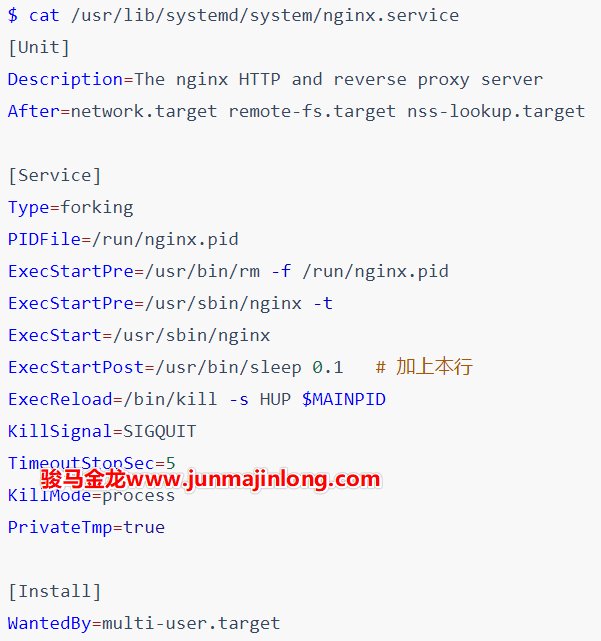
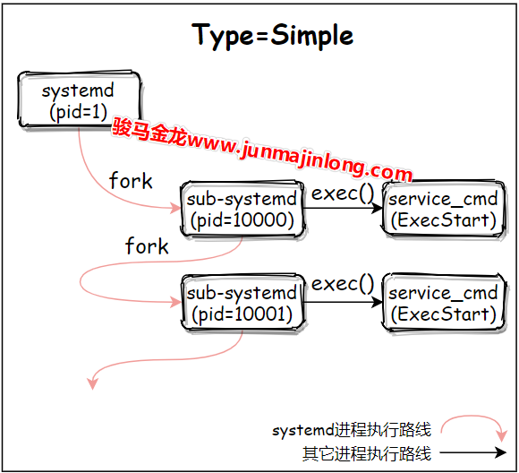
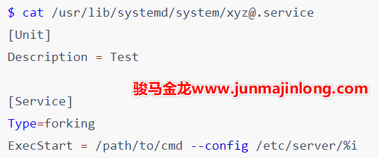

# systemd 服务配置文件编写(2)

## systemd service：Type=forking

当使用systemd去管理一个长久运行的服务进程时，最常用的Type是forking类型。

**使用Type=forking时，要求ExecStart启动的命令自身就是以daemon模式运行的**。而以daemon模式运行的进程都有一个特性：总是会有一个瞬间退出的中间父进程.

例如，nginx命令默认以daemon模式运行，所以可直接将其配置为forking类型：

```bash
$ cat test.service 
[Unit]
Description = Test

[Service]
Type = forking
ExecStart = /usr/sbin/nginx

$ systemctl daemon-reload
$ systemctl start test
$ systemctl status test
● test.service - Test
   Loaded: loaded
   Active: active (running)
  Process: 7912 ExecStart=/usr/sbin/nginx (code=exited, status=0/SUCCESS)
 Main PID: 7913 (nginx)
    Tasks: 5
   Memory: 4.6M
   CGroup: /system.slice/test.service
           ├─7913 nginx: master process /usr/sbin/nginx
           ├─7914 nginx: worker process
           ├─7915 nginx: worker process
           ├─7916 nginx: worker process
           └─7917 nginx: worker process

```

注意上面status报告的信息中，ExecStart启动的nginx的进程PID=7912，且该进程的状态是已退出，退出状态码为0，这个进程是daemon类进程创建过程中瞬间退出的中间父进程。在forking类型中，该进程称为初始化进程。同时还有一行`Main PID: 7913 (nginx)`​，这是systemd真正监控的nginx服务主进程，其PID=7913，是PID=7912进程的子进程。

​`Type=forking`​类型代表什么呢？要解释清楚该type，需从进程创建开始说起。

​​

对于Type=forking来说，pid=1的systemd进程fork出来的子进程正是瞬间退出的中间父进程，且systemd会在中间父进程退出后就认为服务启动成功，此时systemd可以立即去启动后续需要启动的服务。

如果Type=forking服务中的启动命令是一个前台命令会如何呢？比如将sleep配置为forking模式，将nginx daemon off配置为forking模式等。

答案是systemd会一直等待中间ExecStart启动的进程作为中间父进程退出，在等待过程中，systemctl start会一直卡住，直到等待超时而失败，在此阶段中，systemctl status将会查看到服务处于activating状态。

```bash
$ cat test.service 
[Unit]
Description = Test

[Service]
Type = forking
ExecStart = /usr/sbin/nginx -g 'daemon off;'

$ systemctl daemon-reload
$ systemctl start test    # 卡住
$ systemctl status test   # 另一个窗口查看
● test.service - Test
   Loaded: loaded
   Active: activating (start)
  Control: 9227 (nginx)
    Tasks: 1
   Memory: 2.0M
   CGroup: /system.slice/test.service
           └─9227 /usr/sbin/nginx -g daemon off;

```

回到forking类型的服务。由于daemon类的进程会有一个瞬间退出的中间父进程(如上面PID=7913的nginx进程)，systemd是如何知道哪个进程是应该被监控的服务主进程(Main PID)呢？

答案是靠猜。没错，systemd真的就是靠猜的。当设置Type=forking时，有一个`GuessMainPID`​指令其默认值为yes，它表示systemd会通过一些算法去猜测Main   PID。当systemd的猜测无法确定哪个为主进程时，后果是严重的：systemd将不可靠。因为systemd无法正确探测服务是否真的失败，当systemd误认为服务失败时，如果本服务配置了自动重启(配置了Restart指令)，重启服务时可能会和当前正在运行但是systemd误认为失败的服务冲突(比如出现端口已被占用问题)。

多数情况下的猜测过程很简单，systemd只需去找目前存活的属于本服务的leader进程即可。但有些服务(少数)情况可能比较复杂，在多进程之间做简单的猜测并非总是可靠。

好在，Type=forking时的systemd提供了PIDFile指令(Type=forking通常都会结合PIDFile指令)，systemd会从PIDFile指令所指定的PID文件中获取服务的主进程PID。

例如，编写一个nginx的服务配置文件：

```bash
$ cat test.service 
[Unit]
Description = Test

[Service]
Type = forking
PIDFile = /run/nginx.pid
ExecStartPre = /usr/bin/rm -f /run/nginx.pid
ExecStart = /usr/sbin/nginx
ExecStartPost = /usr/bin/sleep 0.1

```

### Type=forking时PIDFile指令的坑

关于PIDFile，有必要去了解一些注意事项，否则它们可能就会成为你的坑。

首先，PIDFile只适合在Type=forking模式下使用，其它时候没必要使用，因为其它类型的Service主进程的PID都是确定的。systemd推荐PIDFile指定的PID文件在/run目录下，所以，可能需要修改服务程序的配置文件，将其PID文件路径修改为/run目录之下，当然这并非必须。

但有一点必须注意，**PIDFile指令的值要和服务程序的PID文件路径保持一致**。

例如nginx的相关配置：

```bash
$ grep -i 'pid' /etc/nginx/nginx.conf  
pid /run/nginx.pid;

$ cat /usr/lib/systemd/system/nginx.service
[Unit]
Description=The nginx HTTP and reverse proxy server
After=network.target remote-fs.target nss-lookup.target

[Service]
Type=forking
PIDFile=/run/nginx.pid    # 路径和nginx.conf中保持一致
ExecStartPre=/usr/bin/rm -f /run/nginx.pid
ExecStartPre=/usr/sbin/nginx -t
ExecStart=/usr/sbin/nginx
ExecReload=/bin/kill -s HUP $MAINPID
KillSignal=SIGQUIT
TimeoutStopSec=5
KillMode=process
PrivateTmp=true

[Install]
WantedBy=multi-user.target

```

其次，**systemd会在中间父进程退出后立即读取这个PID文件，读取成功后就认为该服务已经启动成功**。但是，systemd读取PIDFile的时候，服务主进程**可能**还未将PID写入到PID文件中，这时systemd将出现问题。所以，对于服务程序的开发人员来说，应尽早将主进程写入到PID文件中，比如可以在中间父进程fork完之后立即写入PID文件，然后再退出，而不是在fork出来的服务主进程内部由主进程负责写入。

上面的nginx服务配置文件是某个nginx版本yum包提供的，但却是有问题的，我曾经踩过这个坑，网上甚至将其报告为一个Bug。

上面的nginx.service文件可以正常启动服务，但无法`systemctl reload`​，只要reload就报错，而且报错时提示kill命令语法错误。kill语法错误显然是因为没有获取到`$MAINPID`​变量的值，而这正是因为systemd在nginx写入PID文件之前先去读取了PID文件，因为没有读取到内容，所以`$MAINPID`​变量为空值。

解决办法是使用`ExecStartPost=/usr/bin/sleep 0.1`​，让systemd在初始化进程(即中间父进程)退出之后耽搁0.1秒再继续向下执行，即推迟了systemd读取PID的过程，保证能让systemd从PID文件中读取到值。

​​

最后，systemd只会读PIDFile文件而不会写，也不会创建它。但是，在停止服务的时候，systemd会尝试删除PID文件。因为服务进程可能会异常终止，导致已终止的服务进程的PID文件仍然保留着，所以在使用PIDFile指令时，通常还会使用`ExecStartPre`​指令来删除可能已经存在的PID文件。正如上面给出的nginx配置文件一样。

## systemd service：Type=simple

​`Type=simple`​是一种最常见的通过systemd服务系统运行用户自定义命令的类型，也是省略Type指令时的默认类型。

​`Type=simple`​类型的服务**只适合那些在shell下运行在前台的命令**。也就是说，当一个命令本身会以daemon模式运行时，将不能使用simple，而应该使用`Type=forking`​。比如ls命令、sleep命令、非daemon模式运行的nginx进程以及那些以前台调试模式运行的进程，在理论上都可以定义为simple类型的服务。至于为何有如此规则，稍后会解释的明明白白。

例如，编写一个/usr/lib/systemd/system/test.service运行sleep进程：

```bash
[Unit]
Description = test

[Service]
Type = simple
ExecStart = /usr/bin/sleep 10  # 命令必须使用绝对路径

```

使用daemon-reload重载并启动该服务进程：

```bash
$ systemctl daemon-reload
$ systemctl start test
$ systemctl status test
● test.service - Test
   Loaded: loaded
   Active: active (running)
 Main PID: 6902 (sleep)
    Tasks: 1
   Memory: 96.0K
   CGroup: /system.slice/test.service
           └─6902 /usr/bin/sleep 10

```

10秒内，sleep进程以daemon模式运行在后台，就像一个服务进程一样。10秒之后，sleep退出，于是systemd将该进程从监控队列中踢出。再次查看进程的状态将是inactive：

```bash
$ systemctl status test
● test.service - Test
   Loaded: loaded
   Active: inactive (dead)

```

再来分析上面的服务配置文件中的指令。

​`ExecStart`​指令指定启动本服务时执行的命令，即启动一个**本该前台运行的**sleep进程作为服务进程在后台运行。

> 需注意，systemd service的命令行中必须使用绝对路径，且只能编写单条命令(Type=oneshot时除外)，如果要命令续行，可在尾部使用反斜线符号`\`​等。
>
> 此外，命令行中支持部分类似Shell的特殊符号，但不支持重定向`> >> << <`​、管道`|`​、后台符号`&`​，具体可参考`man systemd.service`​中command line段落的解释说明。

对于`Type=simple`​来说，systemd系统在fork出子systemd进程后就认为服务已经启动完成了，所以systemd可以紧跟着启动排在该服务之后启动的服务。它的伪代码模型大概是这样的：

```bash
# pid = 1: systemd

# start service1 with Type=simple
pid=fork()
if(pid=0){
  # Child Process: sub systemd process
  exec(<Service_Cmd>)
}

# start other services after service1
...

```

例如，先后连续启动两个Type=simple的服务，进程流程图大概如下：

​​

换句话说，**当Type=simple时，systemd只在乎fork阶段是否成功，只要fork子进程成功，这个子进程就受systemd监管，systemd就认为该Unit已经启动**。

因为子进程已成功被systemd监控，无论子进程是否启动成功，**在子进程退出时，systemd都会将其从监控队列中踢掉，同时杀掉所有附属进程**(默认行为是如此，杀进程的方式由systemd.kill中的KillMode指令控制)。所以，查看服务的状态将是`inactive(dead)`​。

例如，下面的配置种，睡眠1秒后，该服务的状态将变为`inactive(dead)`​。

```bash
[Service]
ExecStart = /usr/bin/sleep 1

```

这没什么疑问。但考虑一下，如果simple类型下ExecStart启动的命令本身就是以daemon模式运行的呢？其结果是**systemd默认会立刻杀掉所有属于服务的进程**。

原因也很简单，daemon类进程总是会有一个瞬间退出的中间父进程，而在simple类型下，systemd所fork出来的子进程正是这个中间父进程，所以systemd会立即发现这个中间父进程的退出，于是杀掉其它所有服务进程。

例如，以运行`bash -c '(sleep 3000 &)'`​的simple类型的服务，被systemd监控的bash进程会在启动sleep后立即退出，于是systemd会立即杀掉属于该服务的sleep进程。

```bash
$ cat test.service  
[Unit]
Description = Test

[Service]
ExecStart = bash -c '( sleep 3000 & )'

$ systemctl daemon-reload
$ systemctl start test
$ systemctl status test
● test.service - Test
   Loaded: loaded
   Active: inactive (dead)

```

再例如，nginx命令默认是以daemon模式运行的，simple类型下直接使用nginx命令启动服务，systemd会立刻杀掉所有nginx，即nginx无法启动成功。

```bash
$ cat test.service  
[Unit]
Description = Test

[Service]
ExecStart = /usr/sbin/nginx

$ systemctl daemon-reload
$ systemctl start test
$ systemctl status test
● test.service - Test
   Loaded: loaded
   Active: inactive (dead)

```

但如果将nginx进程以非daemon模式运行，simple类型的nginx服务将正常启动：

```bash
$ cat test.service 
[Unit]
Description = Test

[Service]
ExecStart = /usr/sbin/nginx -g 'daemon off;'

$ systemctl daemon-reload
$ systemctl start test
$ systemctl status test
● test.service - Test
   Loaded: loaded
   Active: active (running)
 Main PID: 7607 (nginx)
    Tasks: 5
   Memory: 4.6M
   CGroup: /system.slice/test.service
           ├─7607 nginx: master process /usr/sbin/nginx -g daemon off;
           ├─7608 nginx: worker process
           ├─7609 nginx: worker process
           ├─7610 nginx: worker process
           └─7611 nginx: worker process

```

## Systemd Service：其它Type类型

除了simple和forking类型，还有exec、oneshot、idle、notify和dbus类型，这里不考虑notify和dbus，剩下的exec、oneshot和idle都类似于simple类型。

* simple：在fork出子systemd进程后，systemd就认为该服务启动成功了
* exec：在fork出子systemd进程且子systemd进程exec()调用ExecStart命令成功后，systemd认为该服务启动成功
* oneshot：在ExecStart命令执行完成退出后，systemd才认为该服务启动成功

  * 因为服务进程退出后systemd才继续工作，所以在未配置RemainAfterExit指令时，oneshot类型的服务永远无法出现active状态，它直接从启动状态到activating到deactivating再到dead状态
  * 当结合RemainAfterExit指令时，在服务进程退出后，systemd会继续监控该Unit，所以服务的状态为`active(exited)`​，通过这个状态可以让用户知道，该服务曾经已经运行成功，而不是从未运行过
  * 通常来说，对于那些执行单次但无需长久运行的进程来说，可以采用type=oneshot，比如启动iptables，挂载文件系统的操作、关机或重启的服务等
* idle：无需考虑这种类型

## 模板型服务配置文件

systemd service支持简单的模板型Unit配置文件，在Unit配置文件中可以使用`%n %N %p %i...`​等特殊符号进行占位，在systemd读取配置文件时会将这些特殊符号解析并替换成对应的值。

这些特殊符号的含义可参见`man systemd.unit`​。通常情况下只会使用到`%i`​或`%I`​，其它特殊符号用到的机会较少。

使用`%i %I`​这两个特殊符号时，要求Unit的文件名以`@`​为后缀，即文件名格式为`Service_Name@.service`​。当使用systemctl管理这类服务时，`@`​符号后面的字符会传递到Unit模板文件中的`%i`​或`%I`​。

例如，执行下面这些命令时，会使用`abc`​替换`service_name@.service`​文件中的`%i`​或`%I`​。

```bash
systemctl start service_name@abc
systemctl status service_name@abc
systemctl stop service_name@abc
systemctl enable service_name@abc
systemctl disable service_name@abc

```

有时候这是很实用的。比如有些程序即是服务端程序又是客户端程序，区分客户端和服务端的方式是使用不同配置文件。

假设用户想在一个机器上同时运行xyz程序的服务端和客户端，可编写如下Unit服务配置文件：

​​

现在用户可以在/etc/server目录下同时提供服务程序的服务端配置文件和客户端配置文件。

```bash
/etc/server/server.conf
/etc/server/client.conf

```

如果要管理该主机上的服务端：

```bash
systemctl start xyz@server
systemctl status xyz@server
systemctl stop xyz@server
systemctl enable xyz@server
systemctl disable xyz@server
```

如果要管理该主机上的客户端：

```bash
systemctl start xyz@client
systemctl status xyz@client
systemctl stop xyz@client
systemctl enable xyz@client
systemctl disable xyz@client
```

## 使用target组合多个服务

有些时候，一个大型服务可能由多个小服务组成。

比如c服务由a.service和b.service组成，因为组合了两个服务，所以c服务可以定义为c.target。

a.service内容：

```bash
[Unit]
Description = a.service
PartOf = c.target
Before = c.target

[Install]
ExecStart = /path/to/a.cmd

```

b.service内容：

```bash
[Unit]
Description = b.service
PartOf = c.target
Before = c.target

[Install]
ExecStart = /path/to/b.cmd

```

c.target内容：

```bash
[Unit]
Description = c.service, consists of a.service and b.service
After = a.service b.service
Wants = a.service b.service

```

c中配置Wants表示a和b先启动，但启动失败不会影响c的启动。如果要求c.target和a.service、b.service的启动状态一致，可将Wants替换成Requires或BindsTo指令。

PartOf指令表明a.service和b.service是c.target的一部分，停止或重启c.target的同时，也会停止或重启a和b。再加上c.target中配置了Wants指令(也可以改成Requires或BindsTo)，使得启动c的时候，a和b也已经启动完成。

但是要注意，PartOf是单向的，停止和重启a或b的时候不会影响c。

‍
