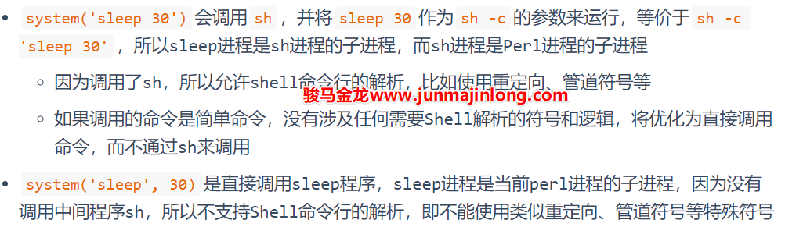
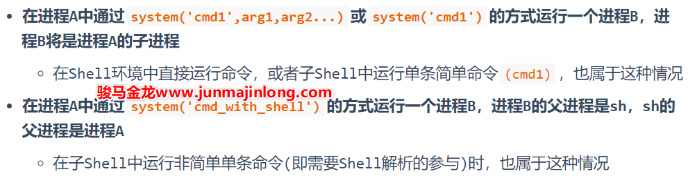

# 前后台进程、孤儿进程和daemon类进程的父子关系

## 前台进程、后台进程和进程父子关系

前台进程是占用当前终端的进程，只有该进程执行完成或被终止之后，才会释放终端并将终端交还给shell进程。

例如：

```bash
$ sleep 30
```

执行该命令后，将创建sleep进程，sleep进程是当前bash进程(假如当前的shell为bash)的子进程：

```bash
$ pstree -p | grep sleep
     |-bash(31207)---sleep(31800)
```

在30秒内，**sleep进程将占用终端**，所以此时的sleep称为前台进程。当睡眠30秒之后，前台进程sleep退出，**终端控制权交还给当前shell进程**，shell进程可继续向下运行命令或等待用户输入新命令。

如果给命令加上一个`&`​符号，该命令将在后台运行。

```bash
$ sleep 30 &
```

此时，sleep仍然是当前bash的子进程，但是它不会占用终端，而是在后台默默地运行，并且在30秒之后默默的退出。

如果是在一个子Shell环境中运行一个前台进程呢？例如：

```bash
$ ( sleep 30 )
```

执行这个命令时，小括号会开启一个子Shell环境，这相当于当前的bash进程隔离了一个bash运行时环境。sleep进程将在这个新的子Shell环境中运行，sleep仍然是当前bash的子进程。由于它会占用当前的终端，所以它是前台进程。

30秒之后，sleep进程退出，它将释放终端，与此同时，子Shell环境也会随着sleep进程的终止而关闭。

如果不了解子Shell，也可以通过shell脚本来理解，或程序内部使用system()来理解，它们都是提供了一种执行外部命令的运行环境。

例如`bash -c 'sleep 30'`​，sleep进程将在该bash进程提供的环境下运行，它是该bash进程的子进程。

再例如shell脚本：

```bash
#!/bin/bash

sleep 30
```

sleep将在这个bash脚本进程提供的环境下运行，它是该脚本进程的子进程。

再例如Perl脚本：

```bash
#!/bin/perl

system('sleep 30')
```

sleep将在这个Perl脚本进程提供的环境下运行。

需注意，编程语言(如Perl)可能提供多种调用外部程序的方式，比如`system('sleep 30')`​和`system('sleep',30)`​，这两种方式有区别：

​​

举几个例子帮助理解，假设有Perl脚本a.pl，其内三行内容为：

```bash
system('sleep',30);               #(1)
system('sleep 30 ; echo hhh');    #(2)
system('sleep 30');               #(3)
```

对于(1)，命令和参数分开，perl将直接调用sleep程序，这时的sleep进程是perl进程a.pl的子进程，且不支持使用管道`|`​、重定向`> < >>`​、`&&`​等等属于Shell支持的符号。

```bash

$ pstree -p | grep sleep
     |    `-bash(31696)---a.pl(32707)---sleep(32708)
```

对于(2)，perl将调用sh，并将参数`sleep 30; echo hhh`​作为`sh -c`​的参数运行，等价于`sh -c 'sleep 30; echo hhh'`​，所以sh进程将是perl进程的子进程，sleep进程将是sh进程的子进程。

```bash
$ pstree -p | grep sleep
     |    `-bash(31696)---a.pl(32747)---sh(32748)---sleep(32749)
```

另外需要注意的是，(2)中的命令是多条命令，而不是简简单单的单条命令，因为识别多条命令并运行它们的能力是Shell解析提供的，所以上面涉及了Shell的解析过程。由于会调用sh命令，所以允许命令中使用Shell特殊符号，比如管道符号。

对于(3)，perl本该调用sh，并将`sleep 30`​作为`sh -c`​的参数运行。但此处是一个简单命令，不涉及任何Shell解析过程，所以会优化为等价于`system('sleep', 30)`​的方式，即不再调用sh，而是直接调用sleep，也即sleep不再是sh的子进程，而是perl进程的子进程：

```bash
$ pstree -p | grep sleep
     |      `-bash(31696)---a.pl(32798)---sleep(32799)
```

其实子shell中运行命令和system()运行命令的行为是类似的：

```bash
# sleep进程是当前shell进程的子进程
$ (sleep 30)

# 当前shell进程会创建一个子bash进程
# sleep进程和echo进程是该子bash进程的子进程
$ (sleep 30 ; echo hhh)
```

了解以上插曲后，想必能清晰地理解如下结论：

​​

## 孤儿进程和Daemon类进程

**如果在进程B退出前，父进程先退出了呢？这时进程B将成为孤儿进程，因为它的父进程已经死了**。

孤儿进程会被PID=1的systemd进程收养，所以进程B的父进程PPID会从原来的进程A变为PID=1的systemd进程。

注意，孤儿进程会继续保持运行，而不会随父进程退出而终止，只不过其父进程发生了改变。

例如，在子Shell中运行后台命令：

```bash
$ (sleep 30 &)
```

因为后台符号`&`​是属于Shell的，所以涉及到shell的解析过程，所以当前bash进程会创建一个子bash进程来解析命令并提供sleep进程的运行环境。

sleep进程将在这个子bash进程环境中运行，但因为它是一个后台命令，所以sleep进程创建成功之后立即返回，由于小括号内已经没有其它命令，子bash进程会立即终止。这意味着sleep将成为孤儿进程：

```bash
$ ps -o pid,ppid,cmd $(pgrep sleep) 
   PID   PPID CMD
 32843      1 sleep 30
```

再比如，Shell脚本内部运行一个后台命令，并且让Shell脚本在后台命令退出前先退出。

```bash
#!/bin/bash

sleep 300 &
echo over
```

当上述脚本运行时，sleep在后台运行并立即返回，于是立即执行echo进程，echo执行完成后脚本进程退出。

脚本进程退出前，sleep进程的父进程为脚本进程，脚本进程退出后，sleep进程成为孤儿进程继续运行，它会被systemd进程收养，其父进程变成PID=1。

**当一个进程脱离了Shell环境后，它就可以被称为后台服务类进程，即Daemon类守护进程，显然Daemon类进程的PPID=1。当某进程脱离Shell的控制，也意味着它脱离了终端：当终端断开连接时，不会影响这些进程**。

需特别关注的是**创建Daemon类进程的流程：先有一个父进程，父进程在某个时间点fork出一个子进程继续运行代码逻辑，父进程立即终止，该子进程成为孤儿进程，即Daemon类进程**。当然，要创建一个完善的Daemon类进程还需考虑其它一些事情，比如要独立一个会话和进程组，要关闭stdin/stdout/stderr，要chdir到/下防止文件系统错误导致进程异常，等等。不过最关键的特性仍在于其脱离Shell、脱离终端。

> **为什么要fork一个子进程作为Daemon进程？为什么父进程要立即退出**？
>
> 所有的Daemon类进程都要脱离Shell脱离终端，才能不受终端不受用户影响，从而保持长久运行。
>
> 在代码层面上，脱离Shell脱离终端是通过setsid()创建一个独立的Session实现的，而进程组的首进程(pg leader)不允许创建新的Session自立山头，只有进程组中的非首进程(比如进程组首进程的子进程)才能创建会话，从而脱离原会话。
>
> 而Shell命令行下运行的命令，总是会创建一个新的进程组并成为leader进程，所以要让该程序成为长久运行的Daemon进程，只能创建一个新的子进程来创建新的session脱离当前的Shell。
>
> 另外，父进程立即退出的原因是可以立即将终端控制权交还给当前的Shell进程。但这不是必须的，比如可以让子进程成为Daemon进程后，父进程继续运行并占用终端，只不过这种代码不友好罢了。

换句话说，**当用户运行一个Daemon类程序时，总是会有一个瞬间消失的父进程**。

前面演示的几个孤儿进程示例已经说明了这一点。为了更接近实际环境，这里再用nginx来论证这个现象。

默认配置下，nginx以daemon方式运行，所以nginx启动时会有一个瞬间消失的父进程。

```bash
$ ps -o pid,ppid,comm; nginx; ps -o pid,ppid,comm $(pgrep nginx)
   PID   PPID COMMAND
 34126  34124 bash
 34194  34126 ps
   PID   PPID COMMAND
 34196      1 nginx
 34197  34196 nginx
 34198  34196 nginx
 34200  34196 nginx
 34201  34196 nginx

```

第一个ps命令查看到当前分配到的PID值为34194，下一个进程的PID应该分配为34195，但是第二个ps查看到nginx的main进程PID为34196，中间消失的就是nginx main进程的父进程。

可以修改配置文件使得nginx以非daemon方式运行，即在前台运行，这样nginx将占用终端，且没有中间的父进程，占用终端的进程就是main进程。

```bash
$ ps -o pid,ppid,comm; nginx -g 'daemon off;' &
   PID   PPID COMMAND
 34126  34124 bash
 34439  34126 ps     #--> ps PID=34439
[1] 34440            #--> NGINX PID=34440

[~]->$ ps -o pid,ppid,comm $(pgrep nginx)
   PID   PPID COMMAND
 34440  34126 nginx
 34445  34440 nginx
 34446  34440 nginx
 34447  34440 nginx
 34448  34440 nginx

```

最后，需要区分后台进程和Daemon类进程，它们都在后台运行。但普通的后台进程仍然受shell进程的监督和管理，用户可以将其从后台调度到前台运行，即让其再次获得终端控制权。而Daemon类进程脱离了终端、脱离了Shell，它们不再受Shell的监督和管理，而是接受pid=1的systemd进程的管理。
