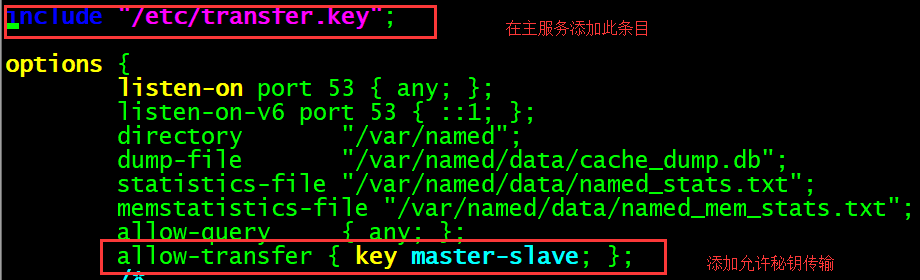

# DNS

* 📄 DNS服务器搭建与配置
* 📄 DNS概念和原理

　　‍

　　进入bind服务程序用于保存配置文件的目录，把刚刚生成的密钥名称、加密算法和私钥加密字符串按照下面格式写入到tansfer.key传输配置文件中。为了安全起见，我们需要将文件的所属组修改成named，并将文件权限设置得要小一点，然后把该文件做一个硬链接到/etc目录中。

```bash
[root@localhost ~]# vim /var/named/chroot/etc/transfer.key

key "master-slave" {
algorithm hmac-md5;
secret "9+m1PlQOAF7xnMLClzNmXw==";
};
[root@localhost ~]# chown root:named/var/named/chroot/etc/transfer.key
[root@localhost ~]# ln /var/named/chroot/etc/transfer.key /etc/transfer.key
```

　　**第三步：开启主服务器密钥验证功能：**

　　开启并加载Bind服务的密钥验证功能。首先需要在主服务器的主配置文件中加载密钥验证文件，然后进行设置，使得只允许带有master-slave密钥认证的DNS服务器同步数据配置文件：



```bash
include "/etc/transfer.key";             //在主服务器中添加此条
options {
        listen-on port 53 { any; };
        listen-on-v6 port 53 { ::1; };
        directory       "/var/named";
        dump-file       "/var/named/data/cache_dump.db";
        statistics-file "/var/named/data/named_stats.txt";
        memstatistics-file "/var/named/data/named_mem_stats.txt";
        allow-query     { any; };
        allow-transfer  { key master-slave; };
```

　　至此，DNS主服务器的TSIG密钥加密传输功能就已经配置完成。此时清空DNS从服务器同步目录中所有的数据配置文件，然后再次重启bind服务程序，这时就已经获取不到主服务器的配置文件了。

　　**第四步：配置从服务器支持秘钥验证：**

```bash
[root@localhost ~]# scp /var/named/chroot/etc/transfer.key root@192.168.245.128:/var/named/chroot/etc/transfer.key
root@192.168.245.128's password: 
transfer.key                    100%   79     0.1KB/s   00:00 
[root@localhost ~]# chown root:named /var/named/chroot/etc/transfer.key
[root@localhost ~]# ln /var/named/chroot/etc/transfer.key /etc/transfer.key
```

　　**第五步：配置从服务器配置文件：**

```bash
[root@localhost ~]# vi /etc/named.conf 

include "/etc/transfer.key"; #在此添加秘钥文件

options {
        listen-on port 53 { any; };
        listen-on-v6 port 53 { ::1; };
        directory       "/var/named";
        dump-file       "/var/named/data/cache_dump.db";
        statistics-file "/var/named/data/named_stats.txt";
        memstatistics-file "/var/named/data/named_mem_stats.txt";
        allow-query     { any; };

        /* 
           recursion. 
           reduce such attack surface 
        */
        recursion yes;

        dnssec-enable yes;
        dnssec-validation yes;

        /* Path to ISC DLV key */
        bindkeys-file "/etc/named.iscdlv.key";

        managed-keys-directory "/var/named/dynamic";

        pid-file "/run/named/named.pid";
        session-keyfile "/run/named/session.key";
};

#在此添加主服务器地址，位置不能太靠前，否则bind服务程序会因为没有加载完预设参数而报错：
server 192.168.245.128 {
        keys { master-slave; };
};

logging {
        channel default_debug {
                file "data/named.run";
                severity dynamic;
        };
};

zone "." IN {
        type hint;
        file "named.ca";
};

include "/etc/named.rfc1912.zones";
include "/etc/named.root.key";
```

　　至此，主从服务器配置完成，重启服务后，可在/var/named/slaves/目录下看到同步过来的文件。

```bash
[root@localhost ~]# systemctl restart named
[root@localhost ~]# ls /var/named/slaves/
245.168.192.arpa  example.com.zone
```

### 5. 配置DNS缓存服务器：

　　DNS缓存服务器（Caching DNS Server）是一种不负责域名数据维护的DNS服务器。简单来说，缓存服务器就是把用户经常使用到的域名与IP地址的解析记录保存在主机本地，从而提升下次解析的效率。DNS缓存服务器一般用于经常访问某些固定站点而且对这些网站的访问速度有较高要求的企业内网中，但实际的应用并不广泛。而且，缓存服务器是否可以成功解析还与指定的上级DNS服务器的允许策略有关。

```bash
[root@localhost ~]# vim /etc/named.conf
options {
 listen-on port 53 { any; };
 listen-on-v6 port 53 { ::1; };
 directory "/var/named";
 dump-file "/var/named/data/cache_dump.db";
 statistics-file "/var/named/data/named_stats.txt";
 memstatistics-file "/var/named/data/named_mem_stats.txt";
 allow-query { any; };
 forwarders { 目标地址; }; #在此处添加转发地址即可
```
