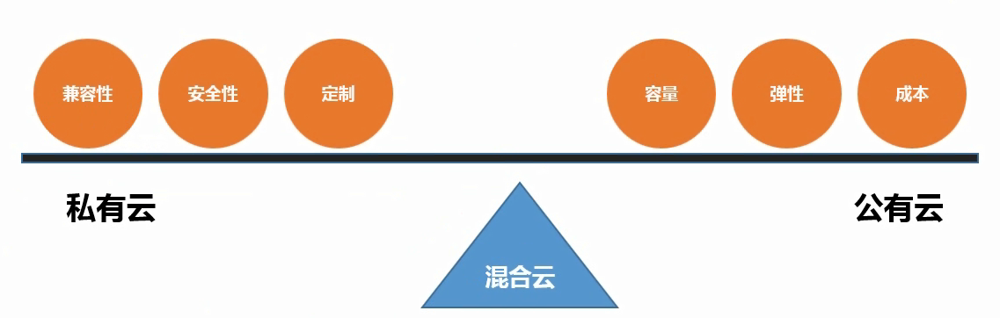
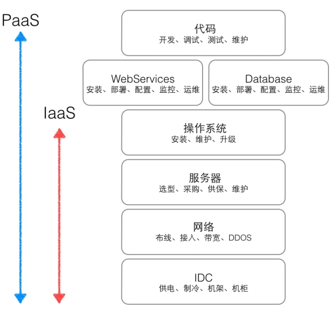
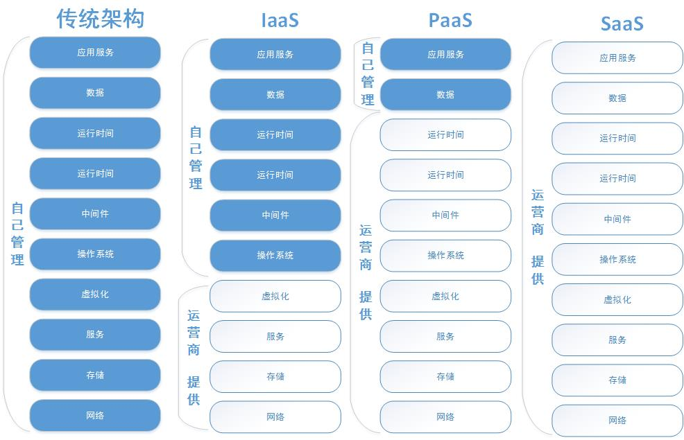
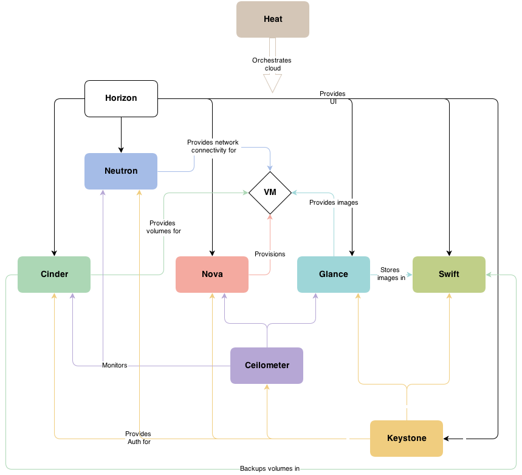
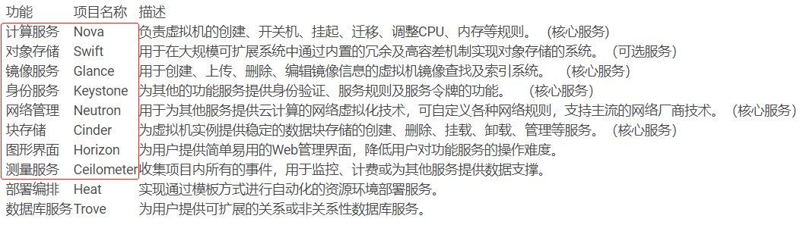

# 1.openstack 概述

# 云计算

云计算是一种按使用量付费的模式，这种模式提供可用的，便捷的，按需的网络访问，通过互联网进入可配置的计算资源共享池（资源包括，计算，存储，应用软件和服务），这些资源能够被快速提供，只需很少的管理工作。

物理机（资源浪费）→虚拟机（提高资源使用率）→云计算（将大量物理机集中形成虚拟池，并统一管理）

*云的愿景：使用计算资源、网络资源像使用自来水一样自由按需付费*

> **云计算分类**

---

**私有云（Private Cloud）：企业的另一面考量**

> 是为一个客户单独使用而构建的，因而提供对数据、安全性和服务质量的最有效控制。该公司拥有基础设施，并可以控制在此基础设施上部署应用程序的方式。私有云可部署在企业数据中心的防火墙内，也可以将它们部署在一个安全的主机托管场所，私有云的核心属性是专有资源。

优点：可控，数据安全（银行必然使用私有云)

---

**混合云（Hybrid Cloud）**

> 混合云融合了公有云和私有云，是近年来云计算的主要模式和发展方向。我们已经知道私企业主要是面向企业用户，出于安全考虑，企业更愿意将数据存放在私有云中，但是同时又希望可以获得公有云的计算资源，在这种情况下混合云被越来越多的采用，它将公有云和私有云进行混合和匹配，以获得最佳的效果，这种个性化的解决方案，达到了既省钱又安全的目的，例如在一次活动中，只需要暂时几台机器，在私有云存在的情况，考虑混合云的使用，是最合理化的。

优点：集合的使用方式更完美，可扩展，更节省

---

**公有云（Public Cloud）：SaaS、PaaS和IaaS**

> 通常指第三方提供商为用户提供的能够使用的云，公有云一般可通过 Internet 使用，可能是免费或成本低廉的，公有云的核心属性是共享资源服务。这种云有许多实例，可在当今整个开放的公有网络中提供服务。例如：aws，阿里云，青云，百度云，腾讯云。

优点：价格低廉，使用方便

**包括以下三个类别：**

* **IaaS：基础设施即服务 (Infrastructure as a Service) —把硬件设备作为一种服务**

把计算基础(服务器、网络技术、存储和数据中心空间)作为一项服务提供给客户。它也包括提供操作系统和虚拟化技术、来管理资源。消费者通过Internet可以从完善的计算机基础设施获得服务。

* **PaaS：平台即服务(Platform as a Service）—把平台作为一种服务:CloudFoundry**

PaaS实际上是指将软件研发的平台作为一种服务，供应商提供超过基础设施的服务，一个作为软件开发和运行环境的整套解决方案，即以SaaS的模式提交给用户。因此，PaaS也是SaaS模式的一种应用。但是，PaaS的出现可以加快SaaS的发展，尤其是加快SaaS应用的开发速度。

* **SaaS：软件即服务 (Software as a Service) —把在线软件作为一种服务:office365 B/S**

SaaS是一种交付模式，其中应用作为一项服务托管，通过Internet提供给用户;帮助客户更好地管理它们的IT项目和服务、确保它们IT应用的质量和性能，监控它们的在线业务。

---

## OpenStack

是由Rackspace和NASA共同开发的云计算平台，是一个开源的 IaaS（基础设施及服务）云计算平台，让任何人都可以自行建立和提供云端运算服务，每半年发布一次，用Python语言编写。

Open是开放，Stack则是堆砌之意，合起来就是将众多的功能服务堆积起来的集合，让人们通过Openstack云计算项目，能够将诸如计算能力、存储、网络和软件等资源抽象成服务，以便让用户可以通过互联网远程来享用，付费的形式也变得因需而定，调整方便，拥有极强的虚拟可扩展性，是公共和私有云的建设与管理软件中的优秀开源项目。

## OpenStack核心组件

