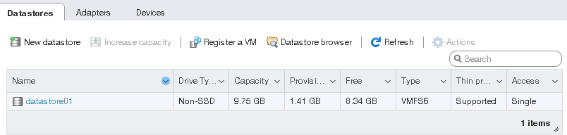

# VCSA 7.0 安装部署

　　下载地址：  
[https://customerconnect.vmware.com/cn/downloads/get-download?downloadGroup=VC670](https://customerconnect.vmware.com/cn/downloads/get-download?downloadGroup=VC670)  
[https://customerconnect.vmware.com/cn/downloads/get-download?downloadGroup=VC70U3](https://customerconnect.vmware.com/cn/downloads/get-download?downloadGroup=VC70U3)  

　　VMware vCenter Server 是 VMware vSphere 平台的组成之一，是管理 ESXi 宿主机的重要工具。自 6.x 版本来，VMware 已经开始放弃过去基于 Windows 的 vCenter Server 程序，而将单点登录、资产管理和管理网页客户端集成至单一的主机中。近期，我正在升级家中 ESXi 主机配置，将这一部分内容记录下来当作笔记。

　　‍

　　**vSphere 的两个核心组件是 ESXi和vCenter Server。** ESXi是用于创建并运行虚拟机和虚拟设备的虚拟化平台。vCenter Server是一项服务，用于管理网络中连接的多个主机，并将主机资源池化。

　　​​

## 1. 部署准备

* 在 ESXi 中安装Windows Server 2012虚拟机（分配好固定IP地址，网络能通就行）
* 下载 VMware vCenter Server 安装包

## 2. 安装 vCenter Server

### 自动部署部分

* 在 [VMware 官网](https://customerconnect.vmware.com/en/downloads/info/slug/datacenter_cloud_infrastructure/vmware_vsphere/7_0)登录并下载最新的 vCenter Server ISO 镜像
* 在本地解压 ISO 镜像
* 运行 `/vcsa-ui-installer/win32/installer.exe`​ 安装程序
* 选择 `Install`​ 进入部署步骤
* 接受用户协议
* 输入你的 ESXi 地址，帐号和密码
  ​

  * 部署程序将使用该 ESXi 服务器创建 vCenter Server 虚拟机
* 修改或保持 vCenter Server 虚拟机名，并设置 root 密码
  ​
* 根据你的需求选择虚拟机配置
* 选择用于部署的储存分区
  ​

  * 如果你的磁盘空间有限，可以勾选 `Enable Thin Disk Mode`​，这将使虚拟机不立刻占用全部的储存空间
* 设置虚拟机网络，这里我直接改成了 `DHCP`​
* 点击下一步，安装程序将开始部署 vCenter Server 虚拟机
  ​

### 自动设置部分

## 3.配置 vCenter Server

* 使用访问你的 vCenter Server 管理页面，选择 HTML5 控制台
* 使用单点登录帐号登录以进入 vSphere Client
  ​

### 添加许可证

* 进入 vCenter Server 的设置，点击 `Licenses`​ 菜单中的 `Assets`​ 标签
* 选择你的 vCenter Server 主机，点击 `Assign License`​
  ​
* 输入你的许可证，并确认

### 添加 ESXi 服务器

* 在 vSphere Client 的主页，选择你的 vCenter Server 主机
* 为该主机创建一个 Datacenter
* 在该 Datacenter 下选择添加主机
* 输入你的 ESXi 主机的 IP 或者 hostname，下一步
* 输入登录该 ESXi 主机的登录名和密码
* 保持对 `Lockdown mode`​ 的默认禁用  
  ​​
* 完成配置
* 至此，你就可以在 vSphere Client 中看到你的 ESXi 主机并可以对其进行管理了  
  ​​

　　‍

### 从 VMware ESXi 访问 iSCSI 目标

1. 在导航器中，转至**存储** > **适配器**选项卡，并单击**配置 iSCSI**。

    ​​
2. 在**配置 iSCSI** 窗口中，在**静态目标**部分中单击**添加静态目标**，填写目标 IQN、IP 地址和端口。单击**保存配置**。

    ​​
3. 继续到**设备**选项卡，并单击**刷新**。新添加的磁盘将显示在设备列表中。

    ​​
4. 选择磁盘并单击**新数据存储**。在显示的向导中，输入数据存储的名称并选择分区选项。单击 **完成** 以对磁盘进行实际的分区。

　　可以使用的磁盘将显示在数据存储的列表中。现在可以使用数据存储浏览器查看其目录并将其提供给 VM。

​​

　　‍
