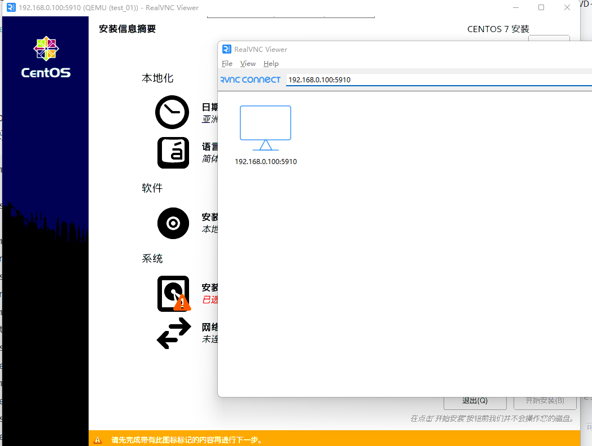

# KVM 部署及使用

　　QEMU/KVM 是目前最流行的虚拟化技术，它基于 Linux 内核提供的 kvm 模块，结构精简，性能损失小，而且开源免费（对比收费的 vmware），因此成了大部分企业的首选虚拟化方案。

　　目前各大云厂商的虚拟化方案，新的服务器实例基本都是用的 KVM 技术。即使是起步最早，一直重度使用 Xen 的 AWS，从 EC2 C5 开始就改用了基于 KVM 定制的 Nitro 虚拟化技术。

　　但是 KVM 作为一个企业级的底层虚拟化技术，却没有对桌面使用做深入的优化，因此如果想把它当成桌面虚拟化软件来使用，替代掉 VirtualBox/VMware，有一定难度。

　　‍

## 一、安装 QUEU/KVM

　　QEMU/KVM 环境需要安装很多的组件，它们各司其职：

1. qemu: 模拟各类输入输出设备（网卡、磁盘、USB端口等）

    * qemu 底层使用 kvm 模拟 CPU 和 RAM，比软件模拟的方式快很多。
2. libvirt: 提供简单且统一的工具和 API，用于管理虚拟机，屏蔽了底层的复杂结构。（支持 qemu-kvm/virtualbox/vmware）
3. ovmf: 为虚拟机启用 UEFI 支持
4. virt-manager: 用于管理虚拟机的 GUI 界面（可以管理远程 kvm 主机）。
5. virt-viewer: 通过 GUI 界面直接与虚拟机交互（可以管理远程 kvm 主机）。
6. dnsmasq vde2 bridge-utils openbsd-netcat: 网络相关组件，提供了以太网虚拟化、网络桥接、NAT网络等虚拟网络功能。

    * dnsmasq 提供了 NAT 虚拟网络的 DHCP 及 DNS 解析功能。
    * vde2: 以太网虚拟化
    * bridge-utils: 顾名思义，提供网络桥接相关的工具。
    * openbsd-netcat: TCP/IP 的瑞士军刀，详见 [socat &amp; netcat](https://thiscute.world/posts/socat-netcat/)，这里不清楚是哪个网络组件会用到它。

　　安装命令：

```bash
# archlinux/manjaro
sudo pacman -S qemu virt-manager virt-viewer dnsmasq vde2 bridge-utils openbsd-netcat

# ubuntu
sudo apt install qemu-kvm libvirt-daemon-system virt-manager virt-viewer virtinst bridge-utils

# debian
sudo apt -y install qemu-kvm libvirt-daemon-system libvirt-daemon  bridge-utils libguestfs-tools libosinfo-bin  qemu-system virt-manager

# centos
yum -y install kvm python-virtinst libvirt  bridge-utils virt-manager qemu-kvm-tools  virt-viewer  virt-v2v libguestfs-tools-c

# openSUSE
#sudo zypper up
sudo zypper install virt-*  libvirt  bridge-utils qemu-kvm  qemu-img  libvirt-client libvirt-devel
```

　　‍

### 1. libguestfs - 虚拟机磁盘映像处理工具

　　[libguestfs](https://libguestfs.org/) 是一个虚拟机磁盘映像处理工具，可用于直接修改/查看/虚拟机映像、转换映像格式等。

　　它提供的命令列表如下：

1. ​`virt-df centos.img`​: 查看硬盘使用情况
2. ​`virt-ls centos.img /`​: 列出目录文件
3. ​`virt-copy-out -d domain /etc/passwd /tmp`​：在虚拟映像中执行文件复制
4. ​`virt-list-filesystems /file/xx.img`​：查看文件系统信息
5. ​`virt-list-partitions /file/xx.img`​：查看分区信息
6. ​`guestmount -a /file/xx.qcow2(raw/qcow2都支持) -m /dev/VolGroup/lv_root --rw /mnt`​：直接将分区挂载到宿主机
7. ​`guestfish`​: 交互式 shell，可运行上述所有命令。
8. ​`virt-v2v`​: 将其他格式的虚拟机(比如 ova) 转换成 kvm 虚拟机。
9. ​`virt-p2v`​: 将一台物理机转换成虚拟机。

　　学习过程中可能会使用到上述命令，提前安装好总不会有错，安装命令如下：

```bash
# opensuse
sudo zypper install libguestfs

# archlinux/manjaro，目前缺少 virt-v2v/virt-p2v 组件
sudo pacman -S libguestfs

# ubuntu
sudo apt install libguestfs-tools

# centos
sudo yum install libguestfs-tools

```

### 2. 启动 QEMU/KVM

　　通过 systemd 启动 libvirtd 后台服务：

```shell
sudo systemctl enable libvirtd.service
sudo systemctl start  libvirtd.service
```

### 3. 让非 root 用户能正常使用 kvm

　　qumu/kvm 装好后，默认情况下需要 root 权限才能正常使用它。 为了方便使用，首先编辑文件 `/etc/libvirt/libvirtd.conf`​:

1. ​`unix_sock_group = "libvirt"`​，取消这一行的注释，使 `libvirt`​ 用户组能使用 unix 套接字。
2. ​`unix_sock_rw_perms = "0770"`​，取消这一行的注释，使用户能读写 unix 套接字。

　　然后新建 libvirt 用户组，将当前用户加入该组：

```shell
newgrp libvirt
sudo usermod -aG libvirt $USER 
```

　　最后重启 libvirtd 服务，应该就能正常使用了：

```shell
sudo systemctl restart libvirtd.service 
```

### 4. 启用嵌套虚拟化

　　如果你需要**在虚拟机中运行虚拟机**（比如在虚拟机里测试 katacontainers 等安全容器技术），那就需要启用内核模块 kvm_intel 实现嵌套虚拟化。

```shell
# 临时启用 kvm_intel 嵌套虚拟化
sudo modprobe -r kvm_intel
sudo modprobe kvm_intel nested=1
# 修改配置，永久启用嵌套虚拟化
echo "options kvm-intel nested=1" | sudo tee /etc/modprobe.d/kvm-intel.conf

```

　　验证嵌套虚拟化已经启用：

```shell
$ cat /sys/module/kvm_intel/parameters/nested 
Y
```

　　至此，KVM 的安装就大功告成啦，现在应该可以在系统中找到 virt-manager 的图标，进去就可以使用了。 virt-manager 的使用方法和 virtualbox/vmware workstation 大同小异，这里就不详细介绍了，自己摸索摸索应该就会了。

---

> 如下内容是进阶篇，主要介绍如何通过命令行来管理虚拟机磁盘，以及 KVM。 如果你还是 kvm 新手，建议先通过图形界面 virt-manager 熟悉熟悉，再往下继续读。

## [二、虚拟机磁盘映像管理](https://github.com/0voice/kernel_awsome_feature/blob/main/QEMU-KVM%20%E8%99%9A%E6%8B%9F%E5%8C%96%E7%8E%AF%E5%A2%83%E7%9A%84%E6%90%AD%E5%BB%BA%E4%B8%8E%E4%BD%BF%E7%94%A8.md#%E4%BA%8C%E8%99%9A%E6%8B%9F%E6%9C%BA%E7%A3%81%E7%9B%98%E6%98%A0%E5%83%8F%E7%AE%A1%E7%90%86)

　　**raw** ：裸格式，创建时就需要指定存储容量，占用全部容量，不支持动态扩容，不支持快照，性能好。

　　**qcow2**：quickcopyonwrite2,写时复制，开始只占用少许容量，支持动态扩容，支持压缩，支持AES加密，支持快照，性能较好。

　　这需要用到两个工具：

1. libguestfs-tool : 虚拟机磁盘映像管理工具，前面介绍过了
2. qemu-img: qemu 的磁盘映像管理工具，用于创建磁盘、扩缩容磁盘、生成磁盘快照、查看磁盘信息、转换磁盘格式等等。

```shell
# 创建磁盘
qemu-img create -f qcow2 -o cluster_size=128K virt_disk.qcow2 20G

# 扩容磁盘
qemu-img resize ubuntu-server-cloudimg-amd64.img 30G

# 查看磁盘信息
qemu-img info ubuntu-server-cloudimg-amd64.img

# 转换磁盘格式
qemu-img convert -f raw -O qcow2 vm01.img vm01.qcow2  # raw => qcow2
qemu-img convert -f qcow2 -O raw vm01.qcow2 vm01.img  # qcow2 => raw

```

### [1. 导入 vmware 镜像](https://github.com/0voice/kernel_awsome_feature/blob/main/QEMU-KVM%20%E8%99%9A%E6%8B%9F%E5%8C%96%E7%8E%AF%E5%A2%83%E7%9A%84%E6%90%AD%E5%BB%BA%E4%B8%8E%E4%BD%BF%E7%94%A8.md#1-%E5%AF%BC%E5%85%A5-vmware-%E9%95%9C%E5%83%8F)

　　直接从 vmware ova 文件导入 kvm，这种方式转换得到的镜像应该能直接用（网卡需要重新配置）：

```shell
virt-v2v -i ova centos7-test01.ova -o local -os /vmhost/centos7-01  -of qcow2
```

　　也可以先从 ova 中解压出 vmdk 磁盘映像，将 vmware 的 vmdk 文件转换成 qcow2 格式，然后再导入 kvm（网卡需要重新配置）：

```shell
# 转换映像格式
qemu-img convert -p -f vmdk -O qcow2 centos7-test01-disk1.vmdk centos7-test01.qcow2
# 查看转换后的映像信息
qemu-img info centos7-test01.qcow2

```

　　直接转换 vmdk 文件得到的 qcow2 镜像，启会报错，比如「磁盘无法挂载」。 根据 [Importing Virtual Machines and disk images - ProxmoxVE Docs](https://pve.proxmox.com/pve-docs/chapter-qm.html#_importing_virtual_machines_and_disk_images) 文档所言，需要在网上下载安装 MergeIDE.zip 组件， 另外启动虚拟机前，需要将硬盘类型改为 IDE，才能解决这个问题。

### 2. 导入 img 镜像

　　img 镜像文件，就是所谓的 raw 格式镜像，也被称为裸镜像，IO 速度比 qcow2 快，但是体积大，而且不支持快照等高级特性。 如果不追求 IO 性能的话，建议将它转换成 qcow2 再使用。

```shell
qemu-img convert -f raw -O qcow2 vm01.img vm01.qcow2 
```

## 三、虚拟机管理

　　虚拟机管理可以使用命令行工具 `virsh`​/`virt-install`​，也可以使用 GUI 工具 `virt-manager`​.

　　GUI 很傻瓜式，就不介绍了，这里主要介绍命令行工具 `virsh`​/`virt-install`​

　　先介绍下 libvirt 中的几个概念：

1. Domain: 指代运行在虚拟机器上的操作系统的实例 - 一个虚拟机，或者用于启动虚拟机的配置。
2. Guest OS: 运行在 domain 中的虚拟操作系统。

　　大部分情况下，你都可以把下面命令中涉及到的 `domain`​ 理解成虚拟机。

### 0. 设置默认 URI

　　​`virsh`​/`virt-install`​/`virt-viewer`​ 等一系列 libvirt 命令，sudo virsh net-list –all 默认情况下会使用 `qemu:///session`​ 作为 URI 去连接 QEMU/KVM，只有 root 账号才会默认使用 `qemu:///system`​.

　　另一方面 `virt-manager`​ 这个 GUI 工具，默认也会使用 `qemu:///system`​ 去连接 QEMU/KVM（和 root 账号一致）

　　​`qemu:///system`​ 是系统全局的 qemu 环境，而 `qemu:///session`​ 的环境是按用户隔离的。 另外 `qemu:///session`​ 没有默认的 `network`​，创建虚拟机时会出毛病。。。

　　因此，你需要将默认的 URI 改为 `qemu:///system`​，否则绝对会被坑:

```shell
echo 'export LIBVIRT_DEFAULT_URI="qemu:///system"' >> ~/.bashrc 
```

### 1. 虚拟机网络

　　qemu-kvm 安装完成后，`qemu:///system`​ 环境中默认会创建一个 `default`​ 网络，而 `qemu:///session`​ 不提供默认的网络，需要手动创建。

　　我们通常使用 `qemu:///system`​ 环境就好，可以使用如下方法查看并启动 default 网络，这样后面创建虚拟机时才有网络可用。

```shell
# 列出所有虚拟机网络
$ sudo virsh net-list --all
 Name      State      Autostart   Persistent
----------------------------------------------
 default   inactive   no          yes

# 启动默认网络
$ virsh net-start default
Network default started

# 将 default 网络设为自启动
$ virsh net-autostart --network default
Network default marked as autostarted

# 再次检查网络状况，已经是 active 了
$ sudo virsh net-list --all
 Name      State    Autostart   Persistent
--------------------------------------------
 default   active   yes         yes

```

　　也可以创建新的虚拟机网络，这需要手动编写网络的 xml 配置，然后通过 `virsh net-define --file my-network.xml`​ 创建，这里就不详细介绍了，因为暂时用不到…

### 2. virt-intall-创建虚拟机 

#### 2.1 使用vnc图形界面

```bash
virt-install 
--virt-type kvm         # 指定安装的类型无论是centos和window都一样
--name window10         # 指定安装的虚拟机名称，只要便于识别就好
--ram 2048              # 指定分配给虚拟机的内存大小
--cdrom=/opt/cn_windows_10_enterprise_x64_dvd_6846957.iso   # 指定安装需要镜像的路径
--boot cdrom            # 指出从哪里进行启动，这里指定从硬盘进行启动
--cpu core2duo          # 指定所需的cpu型号，这个需要根据自己的物理机的CPU型号来进行调整。
--network bridge=br0,model='e1000' # 网络的连接模式，注意安装虚拟机的前提是必须配置好br0桥接的模式，否则无法安装。网卡类型选择千兆虚拟网卡
--graphics vnc,listen=0.0.0.0      # 设置vnc，默认端口5900
--disk path=/opt/kvm.raw,bus='ide' # 指定硬盘位置，硬盘类型为IDE
--noautoconsole
--os-type=windows


# windows7x86
virt-install --name win7_test --ram 4096 --vcpus 2 --disk path=/data/virhost/win7.qcow2,size=40,format=qcow2 --cdrom=/data/archive/iso/cn_windows_7_professional_with_sp1_vl_build_x86_dvd_u_677939.iso --boot=cdrom --graphics vnc,listen=0.0.0.0   --virt-type=kvm --hvm --network network=default

# windwos10
virt-install --name win10-test --memory 4096 --vcpus 4 --disk path=/data/virhost/win10-test.qcow2,size=60,format=qcow2 --os-variant=win10 --cdrom /data/archive/iso/Win10_22H2_Chinese_Simplified_x64v1.iso  --network network=default --graphics vnc,listen=0.0.0.0 --noautoconsole


```

　　再通过VNC客户端连接

​​

#### 2.2 使用conlsole命令行

```bash
virt-install \
--name=CentOS7.9_templ \
--ram 8192 \
--vcpus 2 \
--disk path=/data/application/virhost/CentOS7.9_templ.qcow2,size=60,format=qcow2 \
--location /data/archive/iso/CentOS-7-x86_64-DVD-2207-02.iso \
--nographics \
--extra-args='console=tty0 console=ttyS0,115200n8 serial' \
--virt-type=kvm \
--hvm \
--network bridge=br0,model=virtio \
#--network network=default \
#--osinfo detect=on,name=centos
```

　　‍

​​

#### 2.3 参数说明

```bash
-n NAME, --name=NAME：虚拟机名称，需全局惟一； 
-r MEMORY, --ram=MEMORY：虚拟机内在大小，单位为MB； 
--vcpus=VCPUS[,maxvcpus=MAX][,sockets=#][,cores=#][,threads=#]：VCPU个数及相关配置；
 --cpu=CPU：CPU模式及特性，如coreduo等；可以使用qemu-kvm -cpu ?来获取支持的CPU模式；
-c CDROM, --cdrom=CDROM：光盘安装介质；
 -l LOCATION, --location=LOCATION：安装源URL，支持FTP、HTTP及NFS等，如ftp://172.16.0.1/pub； 
--pxe：基于PXE完成安装； --livecd: 把光盘当作LiveCD； 
--os-type=DISTRO_TYPE：操作系统类型，如Linux、unix或windows等； 
--os-variant=DISTRO_VARIANT：某类型操作系统的变体，如rhel5、fedora8等； 
-x EXTRA, --extra-args=EXTRA：根据--location指定的方式安装GuestOS时，用于传递给内核的额外选项，例如指定kickstart文件的位置，
--extra-args "ks=http://172.16.0.1/class.cfg" 
--boot=BOOTOPTS：指定安装过程完成后的配置选项，如指定引导设备次序、使用指定的而非安装的kernel/initrd来引导系统启动等 ；例如： --boot cdrom,hd,network：指定引导次序； 
--boot kernel=KERNEL,initrd=INITRD,kernel_args=”console=/dev/ttyS0”：指定启动系统的内核及initrd文件；


################## 磁盘选项  #######################
--disk=DISKOPTS  # 指定存储设备及其属性；格式为--disk /some/storage/path,opt1=val1,opt2=val2等；
#常用的选项有： 
  # path    指定磁盘路径，包括磁盘文件的名字
  # device  设备类型，如cdrom、disk或floppy等，默认为disk； 
  # bus     磁盘总结类型，其值可以为ide、scsi、usb、virtio或xen； 
  # perms   访问权限，如rw、ro或sh（共享的可读写），默认为rw； 
  # size    新建磁盘映像的大小，单位为GB； 
  # cache   缓存模型，其值有none、writethrouth（缓存读）及writeback（缓存读写）； 
  # format  磁盘映像格式，如raw、qcow2、vmdk等； 
  # sparse  磁盘映像使用稀疏格式，即不立即分配指定大小的空间；
--nodisks     # 不使用本地磁盘，在LiveCD模式中常用；
--import      # 导入虚拟磁盘文件

################## 网络选项  #######################
--network=NETWORK,opt1=val1,opt2=val2 # 将虚拟机连入宿主机的网络中，其中NETWORK可以为： 
#bridge=BRIDGE  连接至名为“BRIDEG”的桥设备； 
#network=NAME   连接至名为“NAME”的网络；
--nonetworks    # 虚拟机不使用网络功能；


################## 其他高级选项  #######################
--virt-type   # 使用的hypervisor，如kvm、qemu、xen等；所有可用值可以使用’virsh capabilities’命令获取；
--autostart   # 指定虚拟机是否在物理启动后自动启动；
--print-xml   # 如果虚拟机不需要安装过程(--import、--boot)，则显示生成的XML而不是创建此虚拟机；默认情况下，此选项仍会创建磁盘映像；
--force       # 禁止命令进入交互式模式，如果有需要回答yes或no选项，则自动回答为yes；
--dry-run     # 执行创建虚拟机的整个过程，但不真正创建虚拟机、改变主机上的设备配置信息及将其创建的需求通知给libvirt；
--debug       # 显示debug信息；

--pxe         # 基于PXE完成安装； 
--livecd      # 把光盘当作LiveCD； 
--os-type=DISTRO_TYPE # 操作系统类型，如Linux、unix或windows等； 
--os-variant=DISTRO_VARIANT # 某类型操作系统的变体，如rhel5、fedora8等； 
--boot cdrom,hd,networ  # 指定引导次序；
--hvm        # 当物理机同时支持完全虚拟化和半虚拟化时，指定使用完全虚拟化；
--paravirt   # 指定使用半虚拟化；
--graphics TYPE,opt1=val1,opt2=val2 # 指定图形显示相关的配置，此选项不会配置任何显示硬件（如显卡），而是仅指定虚拟机启动后对其进行访问的接口； 
#TYPE：指定显示类型，可以为vnc、sdl、spice或none等，默认为vnc； #port：TYPE为vnc或spice时其监听的端口； 
#listen：TYPE为vnc或spice时所监听的IP地址，默认为127.0.0.1，可以通过修改/etc/libvirt/qemu.conf定义新的默认值； 
#password：TYPE为vnc或spice时，为远程访问监听的服务进指定认证密码； 
--extra-args='console=tty0 console=ttyS0,115200n8 serial' 
    # - 额外参数，主要是指定`console`，如果没有`console`，那么后面安装会卡住，进不了终端
    # - 注意指定了该参数，前面指定系统镜像时就必须使用`--location`，而不能使用`--cdrom`
--noautoconsole # 禁止自动连接至虚拟机的控制台；
--osinfo detect=off,name=OSNAME   #virt-install --osinfo list
```

### 3. virsh-虚拟机管理 

#### 3.1 虚拟机开关机

```bash
# 查看正在运行的虚拟机
virsh list
# 查看所有虚拟机，包括 inactive 的虚拟机
virsh list --all
# 启动、关闭、暂停(休眠)、重启虚拟机：
virsh start opensuse15
virsh suuspend opensuse15
virsh resume opensuse15
virsh reboot opensuse15
# 优雅关机
virsh shutdown opensuse15
# 强制关机
virsh destroy opensuse15
# 启用自动开机
virsh autostart opensuse15
# 禁用自动开机
virsh autostart --disable opensuse15
```

#### 3.2 迁移虚拟机

```shell
# 迁移虚拟机：
# 使用默认参数进行离线迁移，将已关机的服务器迁移到另一个 qemu 实例
virsh migrate 37 qemu+ssh://tux@jupiter.example.com/system
# 还支持在线实时迁移，待续
```

#### 3.3 查看虚拟机信息

```bash

# 查看虚拟机网卡信息  
virsh domiflist    test_01
#arp -a | grep  52:54:00:c3:48:3b 查看虚拟机ip地址 
# 查看虚拟机硬盘信息
virsh domblklist   test_01
```

#### 3.4 虚拟机快照

```bash
# 虚拟机快照管理：
# 列出一个虚拟机的所有快照
virsh snapshot-list --domain opensuse15
# 给某个虚拟机生成一个新快照
virsh snapshot-create <domain>
# 使用快照将虚拟机还原
virsh snapshot-restore <domain> <snapshotname>
# 删除快照
virsh snapshot-delete <domain> <snapshotname>
```

　　‍

#### 3.5 cpu/内存修改

```shell
# 改成 4 核
virsh setvcpus opensuse15 4
# 改成 4G
virsh setmem opensuse15 4096
```

#### 3.6 添加删除设备

```bash
# 添加新设备
virsh attach-device
virsh attach-disk
# virsh attach-disk test_01 /data/archive/iso/CentOS-7-x86_64-DVD-2207-02.iso vdb

virsh attach-interface
# 删除设备
virsh detach-disk
# virsh detach-disk test_01 vdb
virsh detach-device
virsh detach-interface

# 挂载win镜像
virsh change-media njvm2k8  hdb /usr/share/virtio-win/virtio-win.iso
```

#### 3.7 彻底删除一个虚拟机

```bash
# 检查虚拟机使用的磁盘文件
virsh dumpxml test_01 # vm-name是你要删除的虚拟机名称
# 关闭虚拟机
virsh shutdown test_01
# 删除快照（如果有）
virsh snapshot-list --domain test_01
virsh snapshot-delete --domain test_01 --snapshotname 3sep2016u1
# 删除虚拟机
virsh undefine test_01
# 删除磁盘文件
rm -f /var/lib/libvirt/images/vm-name.img   # 虚拟机磁盘文件默认的存放位置，如果修改了地址，按照自己安装的地址来

```

#### 3.8 连接虚拟机方式

```bash
## 通过宿主机连接虚拟机
# 连接虚拟机，虚拟机需要开启serial [systemctl start serial-getty@ttyS0.service]
virsh console      test_01
# 使用 virt-viewer`以 vnc 协议登入虚拟机终端：
## 使用虚拟机 ID 连接
virt-viewer 8
## 使用虚拟机名称连接，并且等待虚拟机启动
virt-viewer --wait opensuse15
```

　　‍

　　‍

### 4. virsh-manager-图形界面管理虚拟机

　　‍

　　‍
