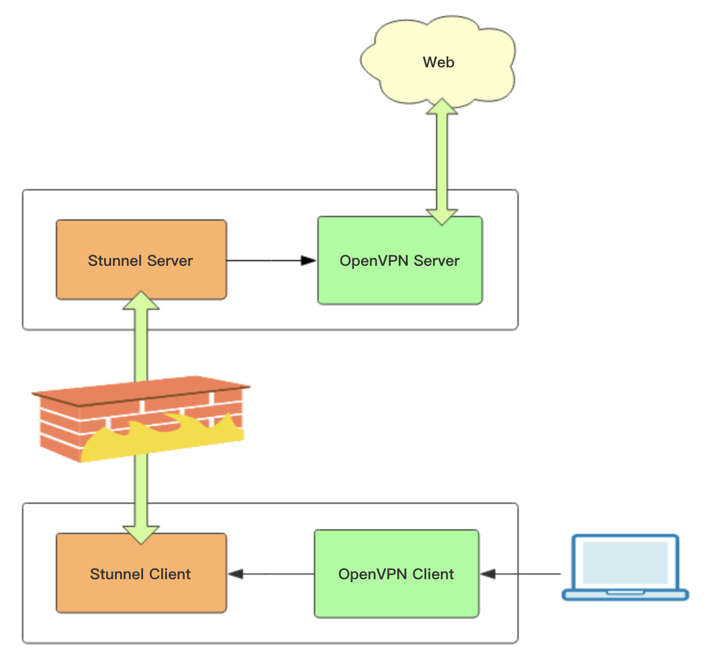

# 5. Stunnel隐藏OpenVPN流量 (Duplicated 2024-12-16 16:07:59)

　　众所周知的原因，在海外直接搭建 [OpenVPN](https://openvpn.net/) 根本无法使用（TCP 模式），或者用段时间就被墙了（UDP 模式）。本文主要介绍如何通过 [Stunnel](https://www.stunnel.org/) 隐藏 OpenVPN 流量，使其看起来像普通的 SSL 协议传输，从而绕过 gfw。

　　Stunnel 分为客户端和服务端，客户端负责接收用户 OpenVPN 客户端流量并转化成 SSL 协议加密数据包，然后转发给 Stunnel 服务端，实现  SSL 协议数据传输，服务端然后将流量转化成 OpenVPN 流量传输给 OpenVPN 服务端。因此我们可以在国内搭 Stunnel  客户端，国外搭 Stunnel 服务端。OpenVPN + Stunnel 整体架构如下：

​​

### 1. 搭建 OpenVPN 服务端

　　这里要说明的是，Stunnel 不支持 udp 流量转换，所以  OpenVPN 需要以 TCP 模式运行。

　　openVPN

### 2. Stunnel 服务端安装配置

　　安装Stunnel 服务端，执行以下命令：

```bash
yum -y install stunnel
cd /etc/stunnel
openssl req -new -x509 -days 3650 -nodes -out stunnel.pem -keyout stunnel.pem
chmod 600 /etc/stunnel/stunnel.pem
```

　　修改Stunnel 服务端的配置文件 stunnel.conf，执行以下命令：

```bash
vim stunnel.conf   # 编辑配置文件stunnel.conf
-------------------------------------------------

#stunnel.conf 填入如下内容:
pid = /var/run/stunnel.pid
output = /var/log/stunnel.log
client = no
[openvpn]
# Stunnel 服务端监听端口
accept = 443
# OpenVPN 服务端 IP 地址和端口
connect = 127.0.0.1:4001
cert = /etc/stunnel/stunnel.pem
```

#### 使用 systemd 启动 Stunnel 服务端

　　为了管理方便，我们使用 systemd 管理 Stunnel 服务，编辑一个 systemd unit 的管理文件，执行以下命令：

```bash
# vim /lib/systemd/system/stunnel.service
---------------------------------------------------
[Unit]
Description=SSL tunnel for network daemons
After=network.target
After=syslog.target

[Install]
WantedBy=multi-user.target
Alias=stunnel.target

[Service]
Type=forking
ExecStart=/usr/bin/stunnel /etc/stunnel/stunnel.conf
ExecStop=/usr/bin/killall -9 stunnel

# Give up if ping don't get an answer
TimeoutSec=600

Restart=always
PrivateTmp=false
```

　　启动 Stunnel 服务端：

```bash
systemctl daemon-reload
systemctl start stunnel.service
systemctl enable stunnel.service
```

### 3. Stunnel 客户端安装配置

　　Stunnel 的客户端安装和服务器一样，同样的软件，既可以作为客户端，也可以作为服务端，只是配置不同而已。

```bash
yum -y install stunnel
cd /etc/stunnel
scp ....  # 将服务端的证书 stunnel.pem 拷贝到这里
chmod 600 /etc/stunnel/stunnel.pem

#vim stunnel.conf 填入如下内容：

pid=/var/run/stunnel.pid
output=/var/log/stunnel.log
client = yes

[openvpn]
accept=8443
connect=stunnel_server_ip:443
cert = /etc/stunnel/stunnel.pem
```

#### 使用 systemd 启动 Stunnel 客户端

　　这里前面同服务端的操作过程，不再赘述。  
启动 Stunnel 客户端

```
systemctl start stunnel.service
systemctl enable stunnel.service
```

　　Stunnel + OpenVPN 都配好后，就可以使用 OpenVPN 客户端了，需要注意的是 OpenVPN 客户端现在需要连接的是 Stunnel 客户端，不再是直接连接 OpenVPN 服务端。

## 相关文档

　　[https://github.com/Xaqron/stunnel](https://github.com/Xaqron/stunnel)
