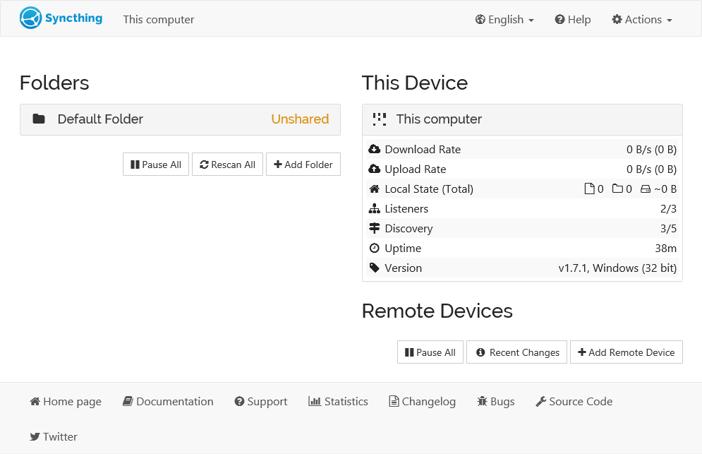
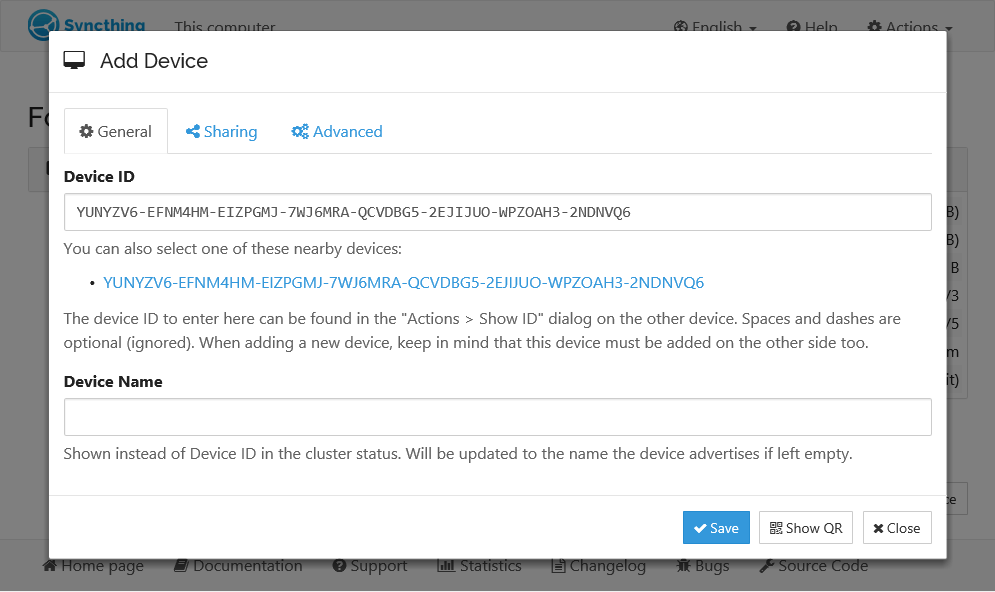
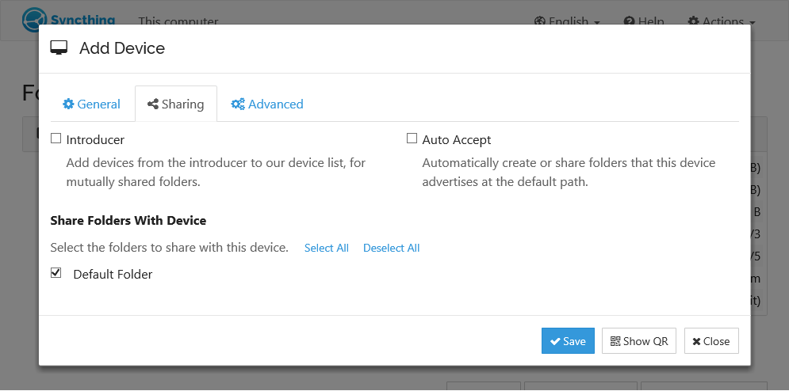
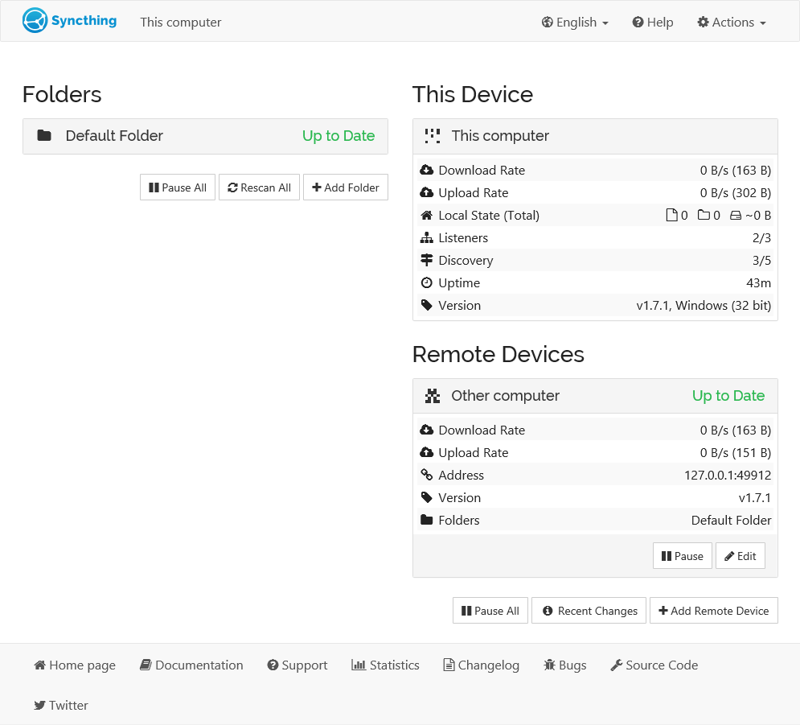

# Syncthing

　　​`Syncthing`​ 是一个连续的文件同步程序，可以在两台或多台计算机之间实时同步文件，安全地防止窥探。选择你的的数据，选择你的存储位置，就可以通过互联网传输了。

## 1. 工具介绍

> **介绍 Syncthing 工具的主要特点和优势。**

　　​`Syncthing`​ 是一个使用 `Go`​ 语言来发的开源文件同步工具，可以在多台计算机之间实时同步文件。它致力于保护用户数据，确保安全、易于使用，并且可以在各种常见的计算机上运行。

* **安全性和隐私**

  * ​`Syncthing`​ 基于 **P2P 技术** 实现设备间的文件同步，所以它的同步是 **去中心化** 的，即你并不需要一个服务器，故不需要担心这个中心的服务器给你带来的种种限制。
  * ​`Syncthing`​ 致力于保护用户数据，确保不会丢失或损坏。它使用 `TLS`​ 加密来保护通信，并采用完美前向保密以防止窥探者获取数据。每个设备都使用强加密证书进行身份验证，只有经过明确允许的设备才能连接到其他设备。
* **易用性和功能**

  * ​`Syncthing`​ 旨在易于使用，可以在各种操作系统上运行，包括 `macOS`​、`Windows`​、`Linux`​ 等。它可以同步多个文件夹，支持局域网和互联网上的同步，无需复杂的 `IP`​ 地址或高级配置。用户只需将设备 `ID`​ 分享给其他设备，即可进行文件夹共享。

## 1. 安装方式

> **提供多种安装方式，以及图形化应用。**

　　​`Syncthing`​ 工具非常好安装，可以通过命令行模式使用。如果你感觉命令行使用非常不好用的话，就可以看看其跨平台的 [`Syncthing GUI`](https://github.com/kozec/syncthing-gtk)​ 应用。

* **二进制** - 基础版本，不带图形界面

  ```bash
  # Debian/Ubuntu
  $ sudo mkdir -p /etc/apt/keyrings
  $ sudo curl -L -o /etc/apt/keyrings/syncthing-archive-keyring.gpg https://syncthing.net/release-key.gpg
  $ echo "deb [signed-by=/etc/apt/keyrings/syncthing-archive-keyring.gpg] https://apt.syncthing.net/ syncthing stable" | sudo tee /etc/apt/sources.list.d/syncthing.list
  $ sudo apt-get update
  $ sudo apt-get install syncthing

  # 直接下载官方软件安装
  $ sudo apt install -y syncthing.xxx.tar.gz
  ```

* **图形化** - 高级版本，带图形界面

  ```bash
  # linux
  https://github.com/kozec/syncthing-gtk/tags
  https://forum.syncthing.net/t/difficulty-installing-running-syncthing-v-11-5-on-ubuntu-14-04/2761/5

  # android
  https://github.com/syncthing/syncthing-android/tags

  # macOS
  https://github.com/syncthing/syncthing-macos/tags

  # iOS
  https://www.mobiussync.com
  ```

* **容器使用** - [参考链接](https://github.com/syncthing/syncthing/blob/main/README-Docker.md)

  ​`Syncthing`​ 的容器镜像托管在 `Docker Hub`​ 中，直接启动的时候指定对应镜像地址就可以了。可以通过指定 `/var/syncthing`​ 对应的目录进行同步，并且默认的 `UID`​ 和 `GID`​ 都是 `1000`​，可以通过环境变量进行指定，还可以通过 `--hostname=syncthing`​ 来改变实例的名称。

  要在不以 `root`​ 身份运行的情况下，需要给 `Syncthing`​ 镜像额外的系统权限。使用 `PCAP`​ 环境变量授权，比如 `PCAP=cap_chown,cap_fowner+ep`​。

  ```bash
  # docker cli
  $ docker pull syncthing/syncthing
  $ docker run --hostname=my-syncthing \
      -p 8384:8384 -p 22000:22000/tcp \
      -p 22000:22000/udp -p 21027:21027/udp \
      -v /wherever/st-sync:/var/syncthing \
      syncthing/syncthing:latest
  ```

  ```yaml
  version: "3"
  services:
    syncthing:
      image: syncthing/syncthing
      container_name: syncthing
      hostname: my-syncthing
      environment:
        - PUID=1000
        - PGID=1000
      volumes:
        - /wherever/st-sync:/var/syncthing
      ports:
        - 8384:8384 # Web UI
        - 22000:22000/tcp # TCP file transfers
        - 22000:22000/udp # QUIC file transfers
        - 21027:21027/udp # Receive local discovery broadcasts
      restart: unless-stopped
  ```

## 3. 使用方式 - 设置文件同步

> **介绍如何快速上手，使用 Syncthing 工具进行文件同步。**

* **1. 启动服务**

  安装完成之后，将会有一个名为 `syncthing`​ 的可执行二进制文件。首次运行命令的话，`Syncthing`​ 将生成一个配置文件、一些加密密钥，然后在浏览器中启动管理 `GUI`​。当然，可以通过图形化程序，双击进行打开。

  ```bash
  # 启动服务
  # https://docs.syncthing.net/users/syncthing.html
  $ syncthing
  INFO: Default folder created and/or linked to new config
  INFO: My ID: 6FOKXKK-xxx
  INFO: TCP listener ([::]:22000) starting
  INFO: GUI and API listening on 127.0.0.1:8384
  INFO: My name is "This computer"
  INFO: Detected 0 NAT services
  ```

　　‍

* **2. 互相添加对方为远程设备**

  左侧的 `Folders`​ 就是需要共享的文件目录列表，目前尚未与任何其他设备共享。右侧的 `This Device`​ 是本机的目录列表，下面的 `Remote Devices`​ 是需要远程备份的列表服务器。

  而同步的操作，需要通过交换 **设备 **​**​`ID`​**​ 来实现的。该设备 `ID`​ 是一个唯一的加密安全标识符，并在你首次启动 `Syncthing`​ 时作为密钥生成的一部分生成。当然，也可以通过在 `GUI`​ 中查看到。只有当两台设备都配置了彼此的设备 `ID`​ 时，它们才会相互连接和通信，其本质上是公钥的一部分。

  ​​

  单击两台设备右下角的 `Add Remote Device`​，然后输入另一侧的设备 `ID`​。设备名称是可选的，改成我们好记忆的就可以了。单击 `Save`​ 后，新设备将出现在 `GUI`​ 的右侧，即使已断开连接的设备。

  ​​

* 3.**设置需要共享的文件夹**  
  此时，默认情况下，两个设备共享一个 `Default Folder`​ 空目录。如果要同步其他文件夹的话，需要事先添加。之后，将文件添加到任一设备上的共享目录都会将这些文件同步到另一端。
  
  

  如果在连接设备时遇到问题，请先查看防火墙设置，然后查看 `GUI`​ 或控制台上的错误消息。不要忘记配置更改不会立即反映出来，尤其是在重新启动后。

　　‍

---

## 4. 使用方式 - 更多高级功能

> **介绍如何快速上手，使用 Syncthing 工具进行文件同步。**

* **1. 版本控制**

  * 是否开启：默认不开启版本控制
  * 打开方式：同步文件夹下面的选项中进行设置
  * 选项说明：可以选择版本控制类型和保留数

　　​`Syncthing`​ 也提供了版本控制功能，它可以记录一个文件的删除和修改历史，你可以根据自己的需要将文件恢复到之前的某一状态。

　　然而需要特别指出的是，**它只记录远程设备对这个文件的修改和删除**，并不记录本机对于文件的修改和删除。此外在设备 `A`​ 开启共享文件夹的版本控制并不会影响到设备 `B`​，即每个设备需要各自开启版本控制。

* **2. 忽略文件**

  有时，我们不希望接收远程设备同步全部文件过来，比如一些隐藏文件等。可以点击文件夹的选项，选择 **忽略模式**，配置该文件的名称，那后续这个文件不会再被同步，不管远程设备对这个文件做了什么样的修改。

* **3. 文件同步冲突**

  共享文件夹中的文件可以被多个设备所修改，所以存在同步发生冲突的可能。`Syncthing`​ 对于文件冲突的解决方法是：**两个修改后的文件都会被保留**，具体需要保留哪个文件由用户自行选择。

* **4. 搭建发现服务器** - [参考博客](https://zhuanlan.zhihu.com/p/89776195)

  ​`Syncthing`​ 能够实现处于不同局域网之中的两台设备之间的同步，这实际上有赖于发现服务器（**Syncthing Discovery Server**）的协助，否则它们不能发现彼此。`Syncthing`​ 默认使用官方提供的全球发现服务器集群，不过你也可以自己搭建一个，在自己的服务器上。你可以设置 `Syncthing`​ 使用某一台发现服务器。

* **5. 使用中继服务器** - [参考博客](https://zhuanlan.zhihu.com/p/89776195)

  当两台设备无法直接相联的时候，`Syncthing`​  可以通过中继服务器进行数据的传输。目前有一批默认的公共中继服务器可供使用，如果你想自己搭建，也是可以的。当然中继传输的速度是不如直连，不过在无法直连的情况，也只能使用中继传输。关于中继服务器的安全隐私问题，你不用担心数据泄露，因为数据是端到端加密的，中继服务器只传递加密后的数据，但是中继服务器是知道连接的用户  `IP`​ 和设备 `ID`​。
