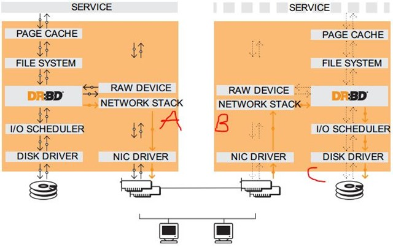

# DRDB 概念

## DRBD介绍

DRBD（distributed replicated block device分布式复制块设备）是一个基于软件实现的、无共享的、服务器之间镜像块设备内容的存储复制解决方案。DRBD是镜像块设备，是按数据位镜像成一样的数据块

DRBD可以部署在如下类的底层设备上：

1、一个磁盘，或者是磁盘的某一个分区；

2、一个soft raid 设备；

3、一个LVM的逻辑卷；

4、一个EVMS（Enterprise Volume Management System，企业卷管理系统）的卷；

5、其他任何的块设备。

### DRBD工作原理

DRBD工作在内核当中，类似于一种驱动模块。DRBD工作的位置在文件系统的buffer  cache和磁盘调度器之间，通过tcp/ip发给另外一台主机到对方的tcp/ip最终发送给对方的drbd，再由对方的drbd存储在本地对应磁盘  上，类似于一个网络RAID-1功能。在高可用(HA)中使用DRBD功能，可以代替使用一个共享盘阵。本地(主节点)与远程主机(备节点)的数据可以保 证实时同步。当本地系统出现故障时,远程主机上还会保留有一份相同的数据,可以继续使用。

DRBD需要运行在各个节点上，且是运行在节点主机的内核中，所以DRBD是内核模块，在Linux2.6.33版本起开始整合进内核。

‍

**DRBD工作的位置在文件系统的buffer Cache和磁盘调度器之间**

如上图左节点为活跃节点实线箭头，有节点为备用节点虚线箭头。  左节点接收到数据法网内核的数据通路，DRBD在数据通路中注册钩子检查数据（类似ipvs）当检测到接收的数据是发往自己管理的存储位置，程序会复制另一份，一份存储到本机的DRBD存储设备，另一份就发给TCP/IP协议栈，通过网络传输到另一台节点上TCP/IP协议栈；另一台节点上运行的DRBD模块同样在数据通路上监测数据，当检测到传输过来的数据时，运行存储机制，存储到本机DRBD存储设备的对应位置。

如果左节点宕机，在高可用集群中右节点成为活跃节点，并且会接收到左节点宕机的信号，接受数据先保存到本地，左节点恢复上线之后，再把左节点宕机后右节点变动的 数据镜像到左节点。 每个设备（drbd  提供了不止一个设备）都有一个状态，可能是‘主’状态或‘从’态。在主节点上，应用程序应能运行和访问drbd设备（/dev/drbd）。每次写入会发往本地磁盘设备和从节点设备中。从节点只能简单地把数据写入它的磁盘设上。  读取数据通常在本地进行。如果主节点发生故障，心跳（heartbeat或corosync）将会把从节点转换到主状态，并启动其上的应用程序。（如果您将它和无日志FS 一起使用，则需要运行fsck）。如果发生故障的节点恢复工作，它就会成为新的从节点，而且必须使自己的内容与主节点的内容保持同步。

### DRBD的复制模式

1. protocol A: 异步写入，只要本地磁盘写入完成，另外一份拷贝的数据包在发送队列中，则认为一个写操作过程完成。
2. protocol B: 半同步写入，只要本地磁盘写入完成，另外一份拷贝的数据包已经到达远程节点，则认为一个写操作过程完成。
3. protocol C: 同步写入，只有本地和远程节点的磁盘都已经确认了写操作完成，则认为一个写操作过程完成。

### DRBD与HA的关系

一个DRBD系统由两个节点构成，与HA集群类似，也有主节点和备用节点之分，在带有主要设备的节点上，应用程序和操作系统可以运行和访问DRBD设备（/dev/drbd\*）。在主节点写入的数据通过DRBD设备存储到主节点的磁盘设备中，同时，这个数据也会自动发送到备用节点对应的DRBD设备，最终写入备用节点的磁盘设备上，在备用节点上，DRBD只是将数据从DRBD设备写入到备用节点的磁盘中。现在大部分的高可用性集群都会使用共享存储，而DRBD也可以作为一个共享存储设备，使用DRBD不需要太多的硬件的投资。因为它在TCP/IP网络中运行，所以，利用DRBD作为共享存储设备，要节约很多成本，因为价格要比专用的存储网络便宜很多；其性能与稳定性方面也不错
