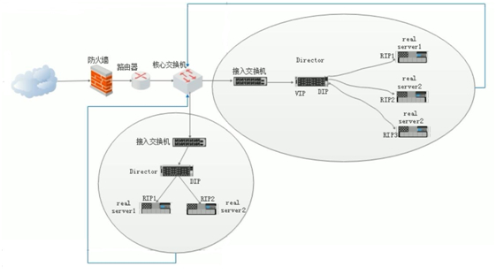
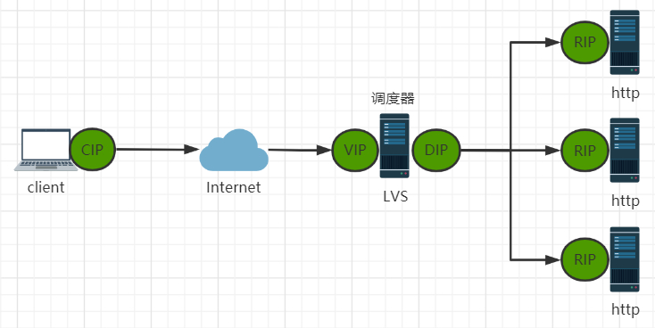

# 1.Linux Virtual Server简介

## 1.1 LVS介绍

　　LVS：Linux Virtual Server，负载调度器，内核集成，章文嵩（花名 正明）, 阿里的四层SLB(ServerLoad Balance)是基于LVS+keepalived实现

　　LVS是全球最流行的四层负载均衡开源软件，由章文嵩博士（当前阿里云产品技术负责人）在1998年5月创立，可以实现LINUX平台下的负载均衡。

　　LVS 官网：[http://www.linuxvirtualserver.org/](http://www.linuxvirtualserver.org/)

　　阿里SLB和LVS：

* [https://yq.aliyun.com/articles/1803](https://yq.aliyun.com/articles/1803)
* [https://github.com/alibaba/LVS](https://github.com/alibaba/LVS)

## 1.2 LVS工作原理

　　VS根据请求报文的目标IP和目标协议及端口将其调度转发至某RS，根据调度算法来挑选RS。LVS是内核级功能，工作在INPUT链的位置，将发往INPUT的流量进行“处理”

　　范例：查看内核支持LVS

```bash
[20:27:28 root@centos8 ~]#grep -i ipvs /boot/config-4.18.0-193.el8.x86_64
CONFIG_NETFILTER_XT_MATCH_IPVS=m
# IPVS transport protocol load balancing support
# IPVS scheduler
# IPVS SH scheduler
# IPVS MH scheduler
# IPVS application helper
```

## 1.3 LVS集群体系架构

​​

## 1.4 LVS 功能及组织架构

　　负载均衡的应用场景为高访问量的业务，提高应用程序的可用性和可靠性。

### 1.4.1 应用于高访问量的业务

　　如果您的应用访问量很高，可以通过配置监听规则将流量分发到不同的云服务器 ECS（ElasticCompute Service 弹性计算服务）实例上。此外，可以使用会话保持功能将同一客户端的请求转发到同一台后端ECS

### 1.4.2 扩展应用程序

　　可以根据业务发展的需要，随时添加和移除ECS实例来扩展应用系统的服务能力，适用于各种Web服务器和App服务器。

### 1.4.3 消除单点故障

　　可以在负载均衡实例下添加多台ECS实例。当其中一部分ECS实例发生故障后，负载均衡会自动屏蔽故障的ECS实例，将请求分发给正常运行的ECS实例，保证应用系统仍能正常工作

## 1.5 LVS集群类型中的术语

　　VS：Virtual Server，Director Server(DS), Dispatcher(调度器)，Load Balancer

　　RS：Real Server(lvs), upstream server(nginx), backend server(haproxy)

　　CIP：Client IP

　　VIP：Virtual serve IP VS外网的IP

　　DIP：Director IP VS内网的IP

　　RIP：Real server IP

　　**访问流程：CIP**  **&lt;--&gt;**  **VIP**  **==**  **DIP**  **&lt;--&gt;**  **RIP**

​​
