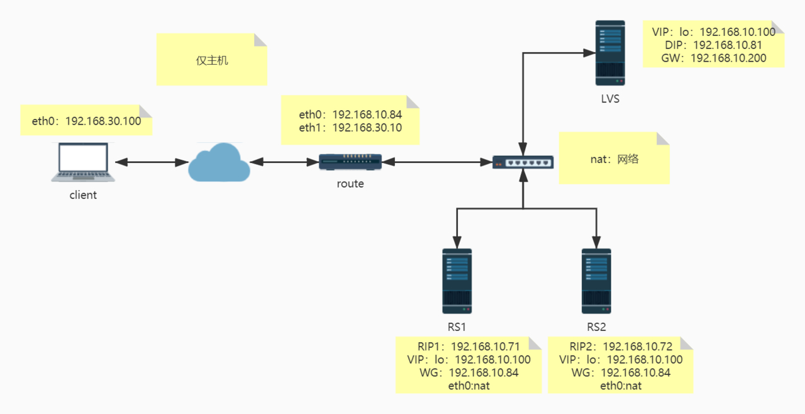
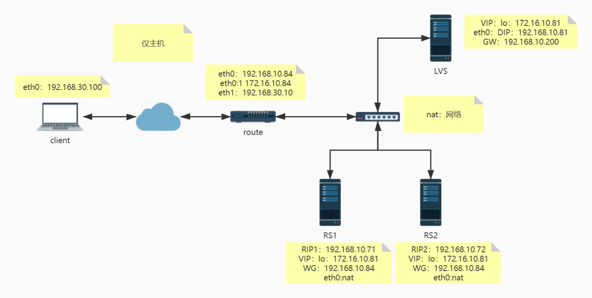

# 4.LVS实战案例

## 4.1 LVS-NAT模式案例


```bash
共四台主机
一台： internet client：172.16.10.100/24   GW:无 仅主机
一台：lvs
eth1 仅主机 172.16.10.81/24
eth0 NAT 192.168.10.81/24
两台RS：
RS1: 192.168.10.71/24 GW：192.168.10.81 NAT
RS2: 192.168.10.71/24 GW：192.168.10.81 NAT
```

**配置过程：**

```bash
#网络环境自行配置
[11:41:42 root@sr1 ~]#curl 127.0.0.1
sr1.zhanzghuo.org
[11:41:45 root@sr2 ~]#curl 127.0.0.1
sr2.zhanzghuo.org

[11:42:48 root@lvs ~]#cat /etc/sysctl.conf
net.ipv4.ip_forward=1
[11:45:10 root@lvs ~]#sysctl -p
#添加集群调度算法加权轮询wrr
[11:44:36 root@lvs ~]#ipvsadm -A -t 172.16.10.81:80 -s wrr
#添加RS工作方式-m,nat模式，-w可以指定权重
[11:44:41 root@lvs ~]#ipvsadm -a -t 172.16.10.81:80 -r 192.168.10.71:80 -m
[11:45:07 root@lvs ~]#ipvsadm -a -t 172.16.10.81:80 -r 192.168.10.72:80 -m

[11:45:10 root@lvs ~]#ipvsadm -Ln
IP Virtual Server version 1.2.1 (size=4096)
Prot LocalAddress:Port Scheduler Flags
-> RemoteAddress:Port           Forward Weight ActiveConn InActConn
TCP  172.16.10.81:80 wrr
-> 192.168.10.71:80             Masq    1      0          0
-> 192.168.10.72:80             Masq    1      0          0

[11:43:17 root@client ~]#while :;do curl 172.16.10.81;sleep 0.5;done
sr2.zhanzghuo.org
sr1.zhanzghuo.org
sr2.zhanzghuo.org
sr1.zhanzghuo.org
sr2.zhanzghuo.org
sr1.zhanzghuo.org
sr2.zhanzghuo.org
[11:47:27 root@lvs ~]#ipvsadm -Ln --stats
IP Virtual Server version 1.2.1 (size=4096)
Prot LocalAddress:Port               Conns   InPkts  OutPkts  InBytes OutBytes
-> RemoteAddress:Port
TCP  172.16.10.81:80                    25      150      100     9900    11875
-> 192.168.10.71:80                   12       72       48     4752     5700
-> 192.168.10.72:80                   13       78       52     5148     6175

[11:47:27 root@lvs ~]#cat /proc/net/ip_vs
IP Virtual Server version 1.2.1 (size=4096)
Prot LocalAddress:Port Scheduler Flags
-> RemoteAddress:Port Forward Weight ActiveConn InActConn
TCP  AC100A51:0050 wrr
-> C0A80A48:0050      Masq    1      0          33
-> C0A80A47:0050      Masq    1      0          33
[11:47:47 root@lvs ~]#ipvsadm -Lnc
IPVS connection entries
pro expire state       source             virtual            destination
TCP 01:32  TIME_WAIT   172.16.10.100:35056 172.16.10.81:80    192.168.10.71:80
TCP 01:23  TIME_WAIT   172.16.10.100:35020 172.16.10.81:80    192.168.10.71:80
TCP 01:59  TIME_WAIT   172.16.10.100:35160 172.16.10.81:80    192.168.10.71:80

#保存规则
[11:50:01 root@lvs ~]#ipvsadm-save >/etc/sysconfig/ipvsadm
[11:50:17 root@lvs ~]#systemctl enable --now ipvsadm.service

#问题:LVS 打开监听VIP相关的端口吗?
[11:50:22 root@lvs ~]#ss -ntl
State     Recv-Q     Send-Q         Local Address:Port         Peer Address:Port
LISTEN    0          128                  0.0.0.0:111               0.0.0.0:*
LISTEN    0          128                  0.0.0.0:22                0.0.0.0:*
LISTEN    0          128                     [::]:111                  [::]:*
LISTEN    0          128                     [::]:22                   [::]:*
```

## 4.2 LVS-DR模式单网段案例

DR模型中各主机上均需要配置VIP，解决地址冲突的方式有三种：

(1) 在前端网关做静态绑定

(2) 在各RS使用arptables

(3) 在各RS修改内核参数，来限制arp响应和通告的级别

**限制响应级别：arp_ignore**

* 0：默认值，表示可使用本地任意接口上配置的任意地址进行响应
* 1：仅在请求的目标IP配置在本地主机的接收到请求报文的接口上时，才给予响应

**限制通告级别：arp_announce**

* 0：默认值，把本机所有接口的所有信息向每个接口的网络进行通告
* 1：尽量避免将接口信息向非直接连接网络进行通告
* 2：必须避免将接口信息向非本网络进行通告

**配置要点**

* 1. Director 服务器采用双IP桥接网络，一个是VIP，一个DIP
* 2. Web服务器采用和DIP相同的网段和Director连接
* 3. 每个Web服务器配置VIP
* 4. 每个web服务器可以出外网

范例:



小知识注意：DR工作模式中LVS并不承担数据回复，所以LVS的网关并没有任何实际作用，但是如果不进行配置，客户端数据包到达LVS时LVS并不会进行转发数据包因为网络环境中当前主机跟其他网段的主机进行通信是通过是否有网关来决定是否转发数据，如果没有网关主机会认为自己到达不了从而直接把数据丢弃，所以这里的网关必须要配置，但配置的地址可以随便填写

```bash
环境：五台主机
一台：客户端 eth0:仅主机 192.168.30.100/24 GW:192.168.30.10

一台：ROUTER
eth0 :NAT  192.168.10.84/24
eth1: 仅主机 192.168.30.10/24
启用 IP_FORWARD

一台：LVS
eth0:NAT:DIP:192.168.10.81/24 GW:192.168.10.200
两台RS：
RS1：eth0:NAT:192.168.10.71/24   GW：192.168.10.84
RS2：eth0:NAT:192.168.10.72/24   GW：192.168.10.84
```

### 4.2.1 LVS的网络配置

```bash
#所有主机禁用iptables和SELinux
[15:02:01 root@sr1 ~]#route -n
Kernel IP routing table
Destination     Gateway         Genmask         Flags Metric Ref    Use Iface
0.0.0.0         192.168.10.84   0.0.0.0         UG    100    0        0 eth0
192.168.10.0    0.0.0.0         255.255.255.0   U     100    0        0 eth0

[15:04:09 root@sr2 ~]#route -n
Kernel IP routing table
Destination     Gateway         Genmask         Flags Metric Ref    Use Iface
0.0.0.0         192.168.10.84   0.0.0.0         UG    100    0        0 eth0
192.168.10.0    0.0.0.0         255.255.255.0   U     100    0        0 eth0

[15:06:18 root@lvs ~]#route -n
Kernel IP routing table
Destination     Gateway         Genmask         Flags Metric Ref    Use Iface
0.0.0.0         192.168.10.200  0.0.0.0         UG    100    0        0 eth0
192.168.10.0    0.0.0.0         255.255.255.0   U     100    0        0 eth0

[15:18:55 root@route ~]#route -n
Kernel IP routing table
Destination     Gateway         Genmask         Flags Metric Ref    Use Iface
192.168.10.0    0.0.0.0         255.255.255.0   U     102    0        0 eth0
192.168.30.0    0.0.0.0         255.255.255.0   U     101    0        0 eth1
[15:18:55 root@route ~]#echo 'net.ipv4.ip_forward=1' >> /etc/sysctl.conf
[15:18:55 root@route ~]#sysctl -p


[15:18:49 root@client ~]#route -n
Kernel IP routing table
Destination     Gateway         Genmask         Flags Metric Ref    Use Iface
0.0.0.0         192.168.30.10   0.0.0.0         UG    100    0        0 eth0
192.168.30.0    0.0.0.0         255.255.255.0   U     100    0        0 eth0
```

### 4.2.2 后端RS的IPVS配置

```bash
#RS1的IPVS配置
#禁止环回地址进行arp广播
[15:04:15 root@sr1 ~]#echo 1 >/proc/sys/net/ipv4/conf/all/arp_ignore 
[15:21:27 root@sr1 ~]#echo 2 >/proc/sys/net/ipv4/conf/all/arp_announce 
[15:21:39 root@sr1 ~]#echo 1 >/proc/sys/net/ipv4/conf/lo/arp_ignore 
[15:22:01 root@sr1 ~]#echo 2 >/proc/sys/net/ipv4/conf/lo/arp_announce 
[15:24:54 root@sr1 ~]#ifconfig lo:1 192.168.10.100/32
[15:25:02 root@sr1 ~]#ip a
1: lo:  mtu 65536 qdisc noqueue state UNKNOWN group default qlen 1000
    link/loopback 00:00:00:00:00:00 brd 00:00:00:00:00:00
    inet 127.0.0.1/8 scope host lo
       valid_lft forever preferred_lft forever
    inet 192.168.10.100/0 scope global lo:1
       valid_lft forever preferred_lft forever
    inet6 ::1/128 scope host 
       valid_lft forever preferred_lft forever
2: eth0:  mtu 1500 qdisc pfifo_fast state UP group default qlen 1000
    link/ether 00:0c:29:c1:8a:39 brd ff:ff:ff:ff:ff:ff
    inet 192.168.10.71/24 brd 192.168.10.255 scope global noprefixroute eth0
       valid_lft forever preferred_lft forever
    inet6 fe80::6387:7c93:e6b8:685/64 scope link noprefixroute 
       valid_lft forever preferred_lft forever
    inet6 fe80::1ea4:9839:df4e:510d/64 scope link tentative noprefixroute dadfailed 
       valid_lft forever preferred_lft forever
#RS2的IPVS配置
[15:04:22 root@sr2 ~]#echo 1 > /proc/sys/net/ipv4/conf/all/arp_ignore 
[15:26:15 root@sr2 ~]#echo 2 > /proc/sys/net/ipv4/conf/all/arp_announce 
[15:26:25 root@sr2 ~]#echo 1 > /proc/sys/net/ipv4/conf/lo/arp_ignore 
[15:26:38 root@sr2 ~]#echo 2 > /proc/sys/net/ipv4/conf/lo/arp_announce
[15:26:55 root@sr2 ~]#ifconfig lo:1 192.168.10.100/32
[15:27:23 root@sr2 ~]#ip a
1: lo:  mtu 65536 qdisc noqueue state UNKNOWN group default qlen 1000
    link/loopback 00:00:00:00:00:00 brd 00:00:00:00:00:00
    inet 127.0.0.1/8 scope host lo
       valid_lft forever preferred_lft forever
    inet 192.168.10.100/0 scope global lo:1
       valid_lft forever preferred_lft forever
    inet6 ::1/128 scope host 
       valid_lft forever preferred_lft forever
2: eth0:  mtu 1500 qdisc pfifo_fast state UP group default qlen 1000
    link/ether 00:0c:29:57:b1:85 brd ff:ff:ff:ff:ff:ff
    inet 192.168.10.72/24 brd 192.168.10.255 scope global noprefixroute eth0
       valid_lft forever preferred_lft forever
    inet6 fe80::6387:7c93:e6b8:685/64 scope link tentative noprefixroute dadfailed 
       valid_lft forever preferred_lft forever
    inet6 fe80::1ea4:9839:df4e:510d/64 scope link noprefixroute 
       valid_lft forever preferred_lft forever
```

### 4.2.3 LVS主机的配置

```bash
#在LVS上添加VIP
[15:30:30 root@lvs ~]#ifconfig lo:1 192.168.10.100/32

[15:28:06 root@lvs ~]#dnf -y install ipvsadm
#实现LVS 规则
[15:28:06 root@lvs ~]#ipvsadm -A -t 192.168.10.100:80 -s rr
[15:29:03 root@lvs ~]#ipvsadm -a -t 192.168.10.100:80 -r 192.168.10.71:80 -g
[15:29:18 root@lvs ~]#ipvsadm -a -t 192.168.10.100:80 -r 192.168.10.72:80 -g
[15:29:21 root@lvs ~]#ipvsadm -Ln
IP Virtual Server version 1.2.1 (size=4096)
Prot LocalAddress:Port Scheduler Flags
  -> RemoteAddress:Port           Forward Weight ActiveConn InActConn
TCP  192.168.10.100:80 rr
  -> 192.168.10.71:80             Route   1      0          0     
  -> 192.168.10.72:80             Route   1      0          0
```

### 4.2.4 测试访问

```bash
[15:31:05 root@client ~]#curl 192.168.10.100
sr1.zhanzghuo.org
[15:31:08 root@client ~]#curl 192.168.10.100
sr2.zhanzghuo.org

[15:25:21 root@sr1 ~]#tail -f /var/log/httpd/access_log 
192.168.30.100 - - [13/Mar/2021:15:30:58 +0800] "GET / HTTP/1.1" 200 18 "-" "curl/7.61.1"
```

## 4.3 LVS-DR模式多网段案例



```bash
#internet主机的网络配置和4.2一样

#router的网络配置在4.2基础上添加172.16.10.84/24的地址
[17:43:25 root@route ~]#ifconfig eth0:1 172.16.10.84
[17:45:21 root@route ~]#hostname -I
192.168.10.84 172.16.10.84 192.168.30.10 
#LVS主机的网络配置和4.2一样
[17:46:28 root@lvs ~]#hostname -I
192.168.10.81
#RS主机的网络配置和4.2一样


[17:47:21 root@lvs ~]#ifconfig lo:1 172.16.10.81/32
[17:47:39 root@sr1 ~]#ifconfig lo:1 172.16.10.81/32
[17:47:35 root@sr2 ~]#ifconfig lo:1 172.16.10.81/32
[17:48:18 root@lvs ~]#ipvsadm -A -t 172.16.10.81:80 -s wrr
[17:50:18 root@lvs ~]#ipvsadm -a -t 172.16.10.81:80 -r 192.168.10.71:80 -g
[17:50:58 root@lvs ~]#ipvsadm -a -t 172.16.10.81:80 -r 192.168.10.72:80 -g
```

‍
