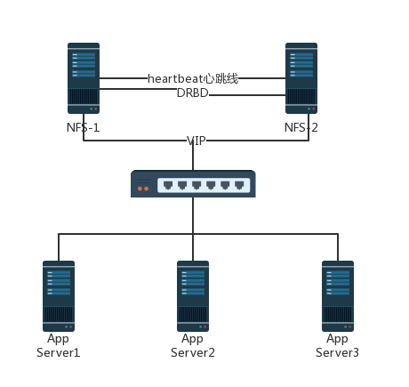

# CentOS 7.6+NFS+Heartbeat+DRBD

### 架构

　　MySQL+heartbeat+drbd+lvs是一套成熟的集群解决方案在现在多数企业里面，通过heartbeat+DRBD完成MySQL的主节点写操作的高可用性，通过MySQL+lvs实现MySQL数据库的主从复制和MySQL读写的负载均衡。这个方案在读写方面进行了分离，融合了写操作的高可用和读操作的负载均衡。

### NFS

　　NFS作为业界常用的共享存储方案，被众多公司采用。使用NFS作为共享存储，为前端WEB server提供服务，主要存储网页代码以及其他文件。

* 常用同步技术

1. rsync+inotify实现文件同步
2. 借助DRBD，实现文件同步 但是以上方案都没有实现高可用，只是实现了两者数据同步。但是业务要求NFS服务器必须是高可用，所以我们在第二种同步方案的基础上，在结合heartbeat来实现高可用。

## 架构部署

　　采用MySQL读写分离的方案；而读写之间的数据同步采用MySQL的单项或者双向复制技术实现。 MySQL写操作采用基于heartbeat+DRBD+MySQL搭建高可用集群；读操作普遍采用基于LVS+keepalived搭建高可用扩展集群方案

　　本案例中暂时没部署MySQL，实现思路：ct74和ct75两台机器，分别安装nfs，heartbeat，ct74，DRBD。

* nfs可以另找一台服务器搭建专门用为共享存储。
* nfs的控制权交给了heartbeat。

　　架构拓扑

​​

　　环境全部都是CentOS7.6 系统

|主机名|IP|担任角色|
| -----------| ----------------| :-------------------------------: |
|ct74|192.168.137.74|drbd主，nfs server，heartbeat主|
|ct75|192.168.137.75|drbd被，heartbeat被|
|VIP|192.168.137.82||
|nfs客户端|192.168.137.61|挂载VIP共享的目录测试|

### 部署DRBD

1. 所有主机配置hosts并且改为对应的主机名
2. 所有主机保持网络状况的良好通信
3. 所有主机安装最新的epel源
4. DRBD这两台各自分别添加了1GB硬盘供DRBD使用
5. 同步时间

```bash
[root@ct74 ~]# vim /etc/hosts
192.168.137.74 ct74
192.168.137.75 ct75

[root@ct74 ~]# ssh-keygen -q -t rsa -N '' -f ~/.ssh/id_rsa
[root@ct74 ~]# ssh-copy-id root@ct75
#ssh免密认证

[root@ct74 ~]# uname -r
3.10.0-957.21.3.el7.x86_64
#要是这个957版本以后的,若不是,请升级(yum update kernel* -y)然后reboot


[root@ct75 ~]# yum install https://www.elrepo.org/elrepo-release-7.0-3.el7.elrepo.noarch.rpm -y

[root@ct75 ~]# yum -y install drbd84-utils kmod-drbd84
#安装DRBD
[root@ct75 ~]# modprobe drbd
#不出意外这样就OK了
echo "modprobe drbd">>/etc/rc.local    # 加入开机自启动
chmod +x /etc/rc.d/rc.local
[root@ct75 ~]# lsmod |grep -i drbd
drbd                  397041  0 
libcrc32c              12644  4 xfs,drbd,nf_nat,nf_conntrack  
```

#### 分区

```bash
[root@ct75 ~]# fdisk /dev/sdb
欢迎使用 fdisk (util-linux 2.23.2)。

更改将停留在内存中，直到您决定将更改写入磁盘。
使用写入命令前请三思。

Device does not contain a recognized partition table
使用磁盘标识符 0x7ce5781e 创建新的 DOS 磁盘标签。

命令(输入 m 获取帮助)：n
Partition type:
   p   primary (0 primary, 0 extended, 4 free)
   e   extended
Select (default p): p
分区号 (1-4，默认 1)：
起始 扇区 (2048-2097151，默认为 2048)：
将使用默认值 2048
Last 扇区, +扇区 or +size{K,M,G} (2048-2097151，默认为 2097151)：
将使用默认值 2097151
分区 1 已设置为 Linux 类型，大小设为 1023 MiB

命令(输入 m 获取帮助)：w
The partition table has been altered!

Calling ioctl() to re-read partition table.
正在同步磁盘。
[root@ct75 ~]# partprobe /dev/sdb
#以上关于DRBD和分区的操作在2台机器上重复操作，master和backup分区大小一致。
```

#### 修改配置文件

```bash
[root@ct74 ~]# vim /etc/drbd.conf
#include "drbd.d/global_common.conf"; 
#注释掉这行，避免和我们自己写的配置产生冲突。
    include "drbd.d/*.res";
    include "drbd.d/*.cfg";
[root@ct74 ~]# vim /etc/drbd.d/drbd_basic.cfg
global {
    usage-count yes;
#是否参与DRBD使用者统计，默认为yes，yes or no都无所谓 
}
common {
    syncer { rate 100M; }
}
#设置主备节点同步的网络速率最大值，默认单位是字节，我们可以设定为兆
resource r0 {
#r0为资源名，我们在初始化磁盘的时候就可以使用资源名来初始化。
    protocol C;
#使用 C 协议。
    handlers {
        pri-on-incon-degr "echo o > /proc/sysrq-trigger ; halt -f ";  
        pri-lost-after-sb "echo o > /proc/sysrq-trigger ; halt ";
        local-io-error "echo o > /proc/sysrq-trigger ; halt -f";
        fence-peer "/usr/lib4/heartbeat/drbd-peer-outdater -t 5";
        pri-lost "echo pri-lst. Have a look at the log file.mail -s 'Drbd Alert' root";
        split-brain "/usr/lib/drbd/notify-split-brain.sh root";
        out-of-sync "/usr/lib/drbd/notify-out-of-sync.sh root";
    }
    net {
        cram-hmac-alg "sha1";
        shared-secret "MySQL-HA";
#drbd同步时使用的验证方式和密码信息
    }
    disk {
        on-io-error detach;
        fencing resource-only;
# 使用DOPD（drbd outdate-peer deamon）功能保证数据不同步的时候不进行切换。
    }
    startup {
        wfc-timeout 120;
        degr-wfc-timeout 120;
    }
    device /dev/drbd0;
#这里/dev/drbd0是用户挂载时的设备名字，由DRBD进程创建
    on ct74 {
#每个主机名的说明以on开头，后面是hostname（必须在/etc/hosts可解析）
        disk /dev/sdb1;
#使用这个磁盘作为drbd的磁盘/dev/drbd0。
        address 192.168.137.74:7788;
#设置DRBD的监听端口，用于与另一台主机通信
        meta-disk internal;
#drbd的元数据存放方式
    }
    on ct75 {
        disk /dev/sdb1;
        address 192.168.137.75:7788;
        meta-disk internal;
    }
}
```

```bash
[root@dbmaster ~]# dd if=/dev/zero of=/dev/sdb1 bs=1M count=1
记录了1+0 的读入
记录了1+0 的写出
1048576字节(1.0 MB)已复制，0.00339429 秒，309 MB/秒
[root@ct74 ~]# drbdadm create-md r0
  --==  Thank you for participating in the global usage survey  ==--
The server's response is:

you are the 14097th user to install this version
WARN:
  You are using the 'drbd-peer-outdater' as fence-peer program.
  If you use that mechanism the dopd heartbeat plugin program needs
  to be able to call drbdsetup and drbdmeta with root privileges.

  You need to fix this with these commands:
  chgrp haclient /lib/drbd/drbdsetup-84
  chmod o-x /lib/drbd/drbdsetup-84
  chmod u+s /lib/drbd/drbdsetup-84

  chgrp haclient /usr/sbin/drbdmeta
  chmod o-x /usr/sbin/drbdmeta
  chmod u+s /usr/sbin/drbdmeta

initializing activity log
initializing bitmap (32 KB) to all zero
Writing meta data...
New drbd meta data block successfully created.
success
#使用dd命令清空，然后再执行
```

#### 进一步配置

```bash
[root@ct74 ~]# drbdadm up all
[root@ct74 ~]# systemctl start drbd.service
[root@ct75 ~]# systemctl enable drbd.service 
#启动服务

#如报错，试试如下，不报错跳过这步
groupadd haclient
chgrp haclient /lib/drbd/drbdsetup-84
chmod o-x /lib/drbd/drbdsetup-84
chmod u+s /lib/drbd/drbdsetup-84
chgrp haclient /usr/sbin/drbdmeta
chmod o-x /usr/sbin/drbdmeta
chmod u+s /usr/sbin/drbdmeta
#以上这几个操作，找了很多资料都没有提到要做，还特意提醒不用做，可能环境不同吧，不做一直报错

[root@ct74 ~]# drbdadm primary --force r0
#仅在主上操作
[root@ct74 ~]# drbdadm role r0
Primary/Secondary
#查看状态
[root@ct74 ~]# watch -n1 -x cat /proc/drbd

[root@ct75 ~]# drbdadm role r0
Secondary/Primary
#backup机器查看状态

[root@ct75 ~]# drbdadm dstate r0
UpToDate/UpToDate
#查看数据同步状态，如上为一致，还有Inconsistent状态为数据不一致正在同步
```

#### 挂载DRBD磁盘

```bash
现在ct74上操作
[root@ct74 ~]# mkfs.ext4 /dev/drbd0 
mke2fs 1.42.9 (28-Dec-2013)
文件系统标签=
OS type: Linux
块大小=4096 (log=2)
分块大小=4096 (log=2)
Stride=0 blocks, Stripe width=0 blocks
65536 inodes, 261871 blocks
13093 blocks (5.00%) reserved for the super user
第一个数据块=0
Maximum filesystem blocks=268435456
8 block groups
32768 blocks per group, 32768 fragments per group
8192 inodes per group
Superblock backups stored on blocks: 
    32768, 98304, 163840, 229376

Allocating group tables: 完成                        
正在写入inode表: 完成                        
Creating journal (4096 blocks): 完成
Writing superblocks and filesystem accounting information: 完成


[root@ct74 ~]# mkdir /nfs
[root@ct74 ~]# mount /dev/drbd0 /nfs
[root@ct74 ~]# df -Th
Filesystem     Type      Size  Used Avail Use% Mounted on
/dev/sda3      ext4       46G  1.7G   42G   4% /
devtmpfs       devtmpfs  749M     0  749M   0% /dev
tmpfs          tmpfs     759M     0  759M   0% /dev/shm
tmpfs          tmpfs     759M  8.8M  750M   2% /run
tmpfs          tmpfs     759M     0  759M   0% /sys/fs/cgroup
/dev/sda1      ext4      477M  124M  325M  28% /boot
tmpfs          tmpfs     152M     0  152M   0% /run/user/0
/dev/drbd0     ext4      991M  2.6M  922M   1% /nfs


现在是ct75上操作，主要是检测备端是否能够正常挂载和使用：

[root@ct74 ~]# umount /nfs
#主上将设备卸载
[root@ct74 ~]# drbdadm secondary all
#切换为被状态

[root@ct75 ~]# drbdadm primary r0
#被设为主状态
[root@ct75 ~]# mkdir /nfs
[root@ct75 ~]# mount /dev/drbd0 /nfs

[root@ct75 ~]# df -Th
Filesystem     Type      Size  Used Avail Use% Mounted on
/dev/sda3      ext4       46G  1.7G   42G   4% /
devtmpfs       devtmpfs  749M     0  749M   0% /dev
tmpfs          tmpfs     759M     0  759M   0% /dev/shm
tmpfs          tmpfs     759M  8.8M  750M   2% /run
tmpfs          tmpfs     759M     0  759M   0% /sys/fs/cgroup
/dev/sda1      ext4      477M  124M  325M  28% /boot
tmpfs          tmpfs     152M     0  152M   0% /run/user/0
/dev/drbd0     ext4      991M  2.6M  922M   1% /nfs

再按相同的方法将状态切换回来
```

　　‍

### 部署heartbeat

#### 安装cluster-glue

```
yum install gcc gcc-c++ flex autoconf automake libtool glib2-devel libxml2-devel bzip2 bzip2-devel e2fsprogs-devel libxslt-devel libtool-ltdl-devel asciidoc -y
#两机同样操作安装依赖

groupadd haclient
useradd -g haclient hacluster -s /sbin/nologin

安装包下载
下载软件包：Reusable-Components-glue、resource-agents、heartbeat
cd /opt
wget http://hg.linux-ha.org/heartbeat-STABLE_3_0/archive/958e11be8686.tar.bz2
wget http://hg.linux-ha.org/glue/archive/0a7add1d9996.tar.bz2
wget https://github.com/ClusterLabs/resource-agents/archive/v3.9.6.tar.gz

tar xf 0a7add1d9996.tar.bz2
cd Reusable-Cluster-Components-glue--0a7add1d9996/
./autogen.sh
./configure --prefix=/usr/local/heartbeat --with-daemon-user=hacluster --with-daemon-group=haclient --enable-fatal-warnings=no LIBS='/lib64/libuuid.so.1'
make && make install
echo $?
cd ..
```

#### 安装resource-agents

```
tar xf v3.9.6.tar.gz
cd resource-agents-3.9.6/
./autogen.sh 
./configure --prefix=/usr/local/heartbeat --with-daemon-user=hacluster --with-daemon-group=haclient --enable-fatal-warnings=no LIBS='/lib64/libuuid.so.1'
make && make install
echo $?
cd ..
```

#### 安装heartbeat

```
tar xf 958e11be8686.tar.bz2
cd Heartbeat-3-0-958e11be8686/
./bootstrap
export CFLAGS="$CFLAGS -I/usr/local/heartbeat/include -L/usr/local/heartbeat/lib" 
./configure --prefix=/usr/local/heartbeat --with-daemon-user=hacluster --with-daemon-group=haclient --enable-fatal-warnings=no LIBS='/lib64/libuuid.so.1'
make && make install
echo $?

mkdir -pv /usr/local/heartbeat/usr/lib/ocf/lib/heartbeat/
cp -R /usr/lib/ocf/lib/heartbeat/ocf-* /usr/local/heartbeat/usr/lib/ocf/lib/heartbeat/
cp -R /opt/Heartbeat-3-0-958e11be8686/doc/{ha.cf,haresources,authkeys} /usr/local/heartbeat/etc/ha.d/
#拷贝配置文件

chmod 600 /usr/local/heartbeat/etc/ha.d/authkeys
#该权限必须为600
#以上安装两台机器一样
```

#### 配置文件

```bash
[root@ct74 ~]# vim /usr/local/heartbeat/etc/ha.d/haresources
#末尾添加如下
ct74 IPaddr::192.168.137.82/24/eth0 drbddisk::r0 Filesystem::/dev/drbd0::/nfs::ext4 killnfsd
#ct74 IPaddr::192.168.137.82/24/eth0主机名 后跟虚拟IP地址、接口
#drbddisk::r0管理drbd资源的名称
#Filesystem::/dev/drbd0::/nfs::ext4 renfsd文件系统::挂载的目录及格式::后跟renfsd资源脚本

cp -R /etc/ha.d/resource.d/drbddisk /usr/local/heartbeat/etc/ha.d/resource.d/
#两台一样

echo "pkill -9 nfs; systemctl restart nfs; exit 0" > /usr/local/heartbeat/etc/ha.d/resource.d/killnfsd
#编辑nfs脚本文件killnfsd ，killnfsd 脚本文件的作用，
#drbd主备切换时，若nfs没有启动，则此脚本会把nfs启动
#drbd主备切换时，若nfs已启动，则此脚本会重启nfs服务，因为NFS服务切换后，必须重新mount一下nfs共享出来的目录，否则会出现stale NFS file handle的错误

chmod +x /usr/local/heartbeat/etc/ha.d/resource.d/drbddisk
chmod +x /usr/local/heartbeat/etc/ha.d/resource.d/killnfsd 


[root@ct74 resource.d]# pwd
/usr/local/heartbeat/etc/ha.d/resource.d
[root@ct74 resource.d]#  ll drbddisk Filesystem killnfsd IPaddr 
-rwxr-xr-x 1 root root 3162 5月  14 15:43 drbddisk
-rwxr-xr-x 1 root root 1923 5月  14 10:15 Filesystem
-rwxr-xr-x 1 root root 2297 5月  14 10:15 IPaddr
-rwxr-xr-x 1 root root   57 5月  14 15:41 killnfsd
#必须要有这四个脚本，有的是自带，有的是复制，有的自己写，上面已经说明而且必须要有执行权限。
[root@ct74 ~]# vim  /usr/local/heartbeat/etc/ha.d/ha.cf
#修改主配置文件（去掉注释或修改值）
debugfile /var/log/ha-debug
logfile /var/log/ha-log
#指定heartbeat日志文件的位置
logfacility     local0
#利用系统日志打印日志
keepalive 1
# 心跳发送时间间隔
deadtime 5
 # 备用节点5s内没有检测到master机的心跳，确认对方故障
warntime 2
# 警告2次
initdead 10
# 守护进程启动30s后，启动服务资源。
udpport 694
#设定集群节点间的通信协议及端口为udp694监听端口（该端口可以修改）
ucast eth0 192.168.137.75
# 另一台主机节点eth0的地址，注意是另一台。
auto_failback off
#当primary节点切换到secondary节点之后，primary节点恢复正常，不进行切回操作，因为切换一次mysql master成本很高。
node    ct74
node    ct75
# 定义两个节点的主机名，一行写一个。
ping 192.168.137.1
#两个IP的网关
respawn hacluster /usr/local/heartbeat/libexec/heartbeat/ipfail 
#使用这个脚本去侦听对方是否还活着（使用的是ICMP报文检测）


[root@ct74 ~]# vim /usr/local/heartbeat/etc/ha.d/authkeys
#认证文件
auth 1
#表示使用id为2的验证 下边需要定义一个2的验证算法
1 sha1 HA_DB
#口令（HISHA1）随便给 主从配置相同即可
```

　　dbdackup也是同样的安装方法，配置文件直接scp过去就可以了，然后修改

```
[root@ct74 ~]# scp -r /usr/local/heartbeat/etc/ha.d/{authkeys,haresources,ha.cf} root@ct75:/usr/local/heartbeat/etc/ha.d/
[root@ct75 ha.d]# vim /usr/local/heartbeat/etc/ha.d/ha.cf 
ucast eth0 192.168.137.74
#把backup节点上ha.cf配置文件中ucast中IP改为对方

[root@ct74 ~]# ln -svf /usr/local/heartbeat/lib64/heartbeat/plugins/RAExec/* /usr/local/heartbeat/lib/heartbeat/plugins/RAExec/

[root@ct74 ~]# ln -svf /usr/local/heartbeat/lib64/heartbeat/plugins/* /usr/local/heartbeat/lib/heartbeat/plugins/
#2机器将这些库文件链接过去，要不启动报错
May 13 13:09:27 ct74 heartbeat: [86183]: ERROR: Illegal directive [ucast] in /usr/local/heartbeat/etc/ha.d/ha.cf
```

### 部署NFS及配合heartbeat

```
[root@ct75 ~]# yum -y install nfs-utils nfs-utils-lib nfs4-acl-tools rpcbind
#ct74和ct75安装
[root@ct74 ~]# vim /etc/exports
/nfs 192.168.137.0/24(rw,sync,no_root_squash)
#设置nfs共享目录，权限，网段
[root@ct74 ~]# systemctl restart rpcbind

#启动顺序一定是rpcbind->nfs，否则有可能出现错误
#在这里nfs不需要启动，它由heartbeat控制

[root@ct74 ~]# systemctl start heartbeat
[root@ct74 ~]# systemctl enable heartbeat
#最多等一两分钟VIP肯定出来，否则查看日志
[root@ct74 ~]# ip a | grep inet
#主上查看
    inet 127.0.0.1/8 scope host lo
    inet6 ::1/128 scope host 
    inet 192.168.137.74/24 brd 192.168.137.255 scope global noprefixroute eth0
    inet 192.168.137.82/24 brd 192.168.137.255 scope global secondary eth0:0
    inet6 fe80::20c:29ff:fec3:1a39/64 scope link
#到了这，VIP肯定要出来，可以稍等会，观察下日志。如果出错，上面可能哪一步没有到位
[root@ct74 ~]# mount | grep drbd
/dev/drbd0 on /nfs type ext4 (rw,relatime,data=ordered)
#这个也已经根据配置自动挂载

[root@ct75 ~]# showmount -e 192.168.137.82
Export list for 192.168.137.82
/nfs 192.168.137.82/24
#查看VIP共享的目录
```

　　配置nfs自动挂载

```
[root@localhost ~]# mkdir /nfs
[root@localhost ~]# mount 192.168.137.82:/nfs/ /nfs/
#客户端测试
[root@localhost ~]# echo "192.168.137.82:/nfs /nfs nfs defaults,soft,intr 0 0" >> /etc/fstab 
[root@localhost ~]# tail -1 /etc/fstab 
192.168.137.82:/nfs /nfs nfs defaults,soft,intr 0 0
#Nfs是类型
#soft参数是为了向用户输出错误信息
#intr参数为了解决当网络出现故障时，我们可以通过按下ctrl+c组合键来终止操作
```

　　验证：接下来我们在主上把nfs服务关掉，模拟故障，看VIP是否切换主机

```
[root@ct74 ~]# systemctl stop nfs
[root@ct74 ~]# systemctl status nfs
● nfs-server.service - NFS server and services
   Loaded: loaded (/usr/lib/systemd/system/nfs-server.service; disabled; vendor preset: disabled)
  Drop-In: /run/systemd/generator/nfs-server.service.d
           └─order-with-mounts.conf
   Active: inactive (dead) since 二 2019-05-14 18:21:09 CST; 6s ago
  Process: 61802 ExecStopPost=/usr/sbin/exportfs -f (code=exited, status=0/SUCCESS)
  Process: 61799 ExecStopPost=/usr/sbin/exportfs -au (code=exited, status=0/SUCCESS)
  Process: 61797 ExecStop=/usr/sbin/rpc.nfsd 0 (code=exited, status=0/SUCCESS)
 Main PID: 60625 (code=exited, status=0/SUCCESS)

5月 14 16:35:58 ct74 systemd[1]: Starting NFS server and services...
5月 14 16:35:58 ct74 systemd[1]: Started NFS server and services.
5月 14 18:21:09 ct74 systemd[1]: Stopping NFS server and services...
5月 14 18:21:09 ct74 systemd[1]: Stopped NFS server and services.
```

　　我在主被两台机器上查看debug日志，没有任何变动

```
[root@ct75 ~]# cd /nfs

#我在挂载了VIP的机器上查看共享目录能否使用，卡死终端
```

　　总结下原因：heartbeat没有监控到nfs的服务状态，它自身想当然的认为，只有heartbeat服务出故障，才切VIP。

　　解决：我们将nfs，和heartbeat服务做一个捆绑，类似于事物性质。即nfs出问题，heartbeat也要宕掉。这里通过脚本实现。

```
[root@ct74 ~]# vim /opt/monitornfs.sh

while true
do
    drbdstatus=`cat /proc/drbd 2> /dev/null  | grep ro | tail -n1 | awk -F':' '{print $4}' | awk -F'/' '{print $1}'`
    nfsstatus=`systemctl status nfs&>/dev/null ; echo $?`

    if [ -z  $drbdstatus ];then
        sleep 10
        continue
    elif [ $drbdstatus == 'Primary' ];then
        if [ $nfsstatus -ne 0 ];then
            systemctl start nfs &> /dev/null
            newnfsstatus=`systemctl status nfs&>/dev/null ; echo $?`
            if [ $newnfsstatus -ne 0 ];then
            systemctl stop heartbeat
            #尝试开启之后若还是不行,则关掉heartbeat
            fi
        fi
    fi
    sleep 5
done

[root@ct74 ~]# chmod +x /opt/monitornfs.sh 
[root@ct74 ~]# nohup /opt/monitornfs.sh &
echo "nohup /opt/monitornfs.sh &" >>/etc/rc.local
#以上关于脚本操作，在ct75上重复
```

　　测试

```
[root@ct74 ~]# systemctl stop nfs
#主节点关掉nfs服务

#但是后台的脚本又给他开启了
[root@ct74 ~]# systemctl stop heartbeat
#VIP切换到备机了
```

　　但是nfs客户端的使用并不影响，切换的时候会有轻微的延迟。

　　nfs切记要挂载到别的机器上不要为了省事，省机器
