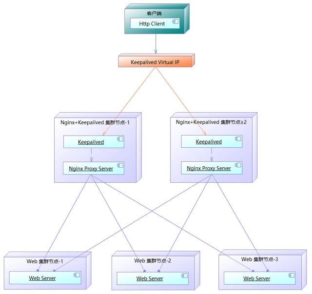

# keepalived

　　​**​`keepalived`​**​ 是基于 `VRRP`​ 协议的软件，其原发起是为了解决 `LVS`​ 的 `HA`​ 问题而衍生的一个软件，所以其对 `LVS`​ 支持比较好，目前和其他软件像 `Nginx`​、`Haproxy`​、`MySQL`​ 等也可以比较好的结合。主要实现的功能是作 `RealServer`​ 的健康状态检查以及 `LoadBalance`​ 主机和 `BackUP`​ 主机之间 `failover`​。其可以实现基于端口、基于 `hash`​ 值、基于页面返回码或自定义方式的后端健康检测。

　　**集群介绍**

* **LB 集群**

  * 轻量级：`nginx`​
  * 重量级：`lvs`​
* **HA 集群**

  * 轻量级：`keepalived`​
  * 重量级：`heartbeat`​、`corosync`​、`cman`​
* **HP 集群**

  * 超算集群企业很少使用

# vrrp协议

　　vrrp协议是为了静态路由环境下防止单点故障而设计的主从灾备协议，在主设备发生故障时业务自动切换至从设备，而这一切对于用户而言是透明的。vrrp将两台或多台设备虚拟成一个设备，对外仅提供一个虚拟的IP地址，这些设备在同一时刻仅有一台设备可有拥有该IP地址，而拥有该IP地址的设备就是主设备,其它的就是备用设备。主设备会不断发送自己的状态信息给备用设备，当备用设备接收不到主设备的状态信息时，多个备用设备会根据自身的优先级选择出新的主设备，并拥有所有的业务功能。vrrp协议需要为每个路由设备定义一个虚拟路由ID（VRID）以及优先，所有主备路由设备的VRID必须一样，这样才会被视为同一组设备，而优先级最高的设备就是主路由设备，VRID和优先级的范围为0-255之间的整数，数值越大优先级越高，如果优先级相等，则会对比IP地址，地址越大优先级越高

　　**keepalived 和 lvs 的关系**

1. keepalived和ipvsadm并行的，都可以直接管理内核ipvs； &#x20;
2. keepalived和LVS亲密无间，keepalived就是为LVS诞生；
3. 在keepalived中配置lvs，可以使用lvs作为负载均衡，同时保证lvs的高可用性。

---

- **lvs的工作模式**：通过ipvsadm软件设置vip，添加rip（多个），数据从vip进来，经过ipvs的调度，分发到具体的rip机器上。
- **keepalived工作模式**：通过配置文件（/etc/keepalived/keepalived.conf）设置vip和主从节点（rip），数据从vip进来，到主节点（rip），当主节点挂掉之后，则到从节点（rip），配置文件可以配置lvs，也可以不配置。

# 一、keepalived 部署

## yum方式安装

```bash
yum -y install keepalived
# 查看安装路径
rpm -ql keepalived
```

## 源码安装

```bash
# 1）安装依赖
yum -y install gcc openssl-devel libnfnetlink-devel
# 2）下载源码
wget https://www.keepalived.org/software/keepalived-1.4.5.tar.gz
# 3）解压
tar -zxvf keepalived-1.4.5.tar.gz -C /usr/src
# 4）编译安装
cd /usr/src/keepalived-1.4.5/
./configure && make -j 4 && make install
```

# 二、keepalived 应用

　　接下来我们演示使用 keepalived 来保证负载均衡服务 nginx 的高可用性



## 1. 修改节点1 配置文件

　　`vim /etc/keepalived/keepalived.conf`

```json
global_defs {
   router_id keep_01
}

vrrp_script chk_nginx {
    script "/etc/keepalived/check_nginx.sh" interval 5 weight -20 }
vrrp_instance VI_1 {
    state MASTER interface eth0
    virtual_router_id 51 priority 150 advert_int 1 authentication {
        auth_type PASS
        auth_pass 1111 }
    virtual_ipaddress { 192.168.1.144/24 dev eth0 label eth0:1 }
track_script {
       chk_nginx
    }
}

```

## 2. 修改节点2 配置文件

```json
global_defs {
   router_id keep_02
}
vrrp_script chk_nginx {
    script "/etc/keepalived/check_nginx.sh" interval 5 weight -20 }

vrrp_instance VI_1 {
    state BACKUP interface eth0
    virtual_router_id 51 priority 100 advert_int 1 authentication {
        auth_type PASS
        auth_pass 1111 }
    virtual_ipaddress { 192.168.1.144/24 dev eth0 label eth0:1 }
track_script {
       chk_nginx
    }
}

```

## 3. Nginx状态监测脚本

　　在节点1和节点2上，根据上面配置的脚本目录配置nginx状态检测脚本

```bash
#!/bin/bash
A=`ps -C nginx --no-header | wc -l` if [ $A -eq 0 ];then /usr/local/nginx/sbin/nginx
    sleep 2
    if [ `ps -C nginx --no-header | wc -l` -eq 0 ];then
        pkill keepalived
    fi
fi

```

* 启动或者重启keepalived服务

  `systemctl restart keepalived`

# 3、验证

1. 通过虚拟IP访问
2. 停掉nginx，脚本会在两秒后自动执行监测nginx，然后启动，如果只停掉主的keepalived服务，就会出现脑裂情况，所以这里为了不出现这些情况，我停掉主服务器来验证
3. 如果还不不相信自己做成功，用抓包工具wireshark来验证

# 三、keepalived 配置文件详解

## global_defs区域

```bash
! Configuration File for keepalived

global_defs {
   notification_email {       # 故障发生时给谁发邮件通知
     acassen@firewall.loc
     failover@firewall.loc
     sysadmin@firewall.loc
   }
   notification_email_from Alexandre.Cassen@firewall.loc   # 通知邮件从哪个地址发出
   smtp_server 192.168.200.1  # 通知邮件的smtp地址
   smtp_connect_timeout 30    # 连接smtp服务器的超时时间
   router_id LVS_DEVEL        # 本节点标志，通常为ip地址，故障发生时邮件会通知到【必须填写】
   vrrp_skip_check_adv_addr   # 所有报文都检查比较消耗性能，此配置为如果收到的报文和上一个报文是同一个路由器则跳过检查报文中的源地址
   vrrp_strict                # 严格遵守VRRP协议
   vrrp_garp_interval 0       # ARP报文发送延迟
   vrrp_gna_interval 0        # 消息发送延迟
   #vrrp_mcast_group4 224.0.0.18 #指定组播IP地址，默认值：224.0.0.18 范围：224.0.0.0到239.255.255.255
   #vrrp_iptables                #避免生成iptables input链 规则，sip any 拒绝 dip an
}

```

## vrrp_script区域

　　keepalived调用外部的辅助脚本进行资源监控，并根据监控的结果状态能实现优先动态调整

```bash
vrrp_script check_haproxy {
   script "/etc/keepalived/check_haproxy_status.sh" # 
   interval 5             # 每5秒执行一次
   timeout <INTEGER>      # 超时时间
   weight <INTEGER:-254..254>  # 此值为负数，表示fall（（脚本返回值为非0）时，会将此值与本节点权重相加可以降低本节点权重，如果是正数，表示 rise （脚本返回值为0）成功后，会将此值与本节点权重相加可以提高本节点权重，通常使用负值较多
   fall <INTEGER>         # 脚本几次失败转换为失败，建议设为2以上
   rise <INTEGER>         # 脚本连续监测成功后，把服务器从失败标记为成功的次数
   user USERNAME [GROUPNAME]   # 执行监测脚本的用户或组
   init_fail              # 设置默认标记为失败状态，监测成功之后再转换为成功状态

}

# /etc/keepalived/check_haproxy_status.sh 内容
-------------------------------------------------------
#!/bin/bash
/usr/bin/curl -I http://localhost &>/dev/null   
if [ $? -ne 0 ];then                                                                     
    systemctl stop keepalived
fi    

```

## vrrp实例配置区域

　　配置vrrp实例（VRRP实例和VRRP同步组）

```bash
vrrp_instance VI_1 {      # 虚拟路由器名称，在一个keepalived可以启多个虚拟路由器，每个虚拟路由器的名字都不一样
    state MASTER          # 当前节点在此虚拟路由器上的初始状态，状态为MASTER或者BACKUP，一般都是配置backup，该值无法决定身份，最终还是通过比较priority
    interface eth0        # 绑定为当前虚拟路由器使用的物理接口，如：ens32,eth0,bond0,br0
    virtual_router_id 51  # 每个虚拟路由器惟一标识，范围：0-255，同一组虚拟路由器的vrid必须一致
    priority 100          # 当前物理节点在此虚拟路由器的优先级，范围：1-254，每个keepalived主机节点此值不同
    advert_int 1          # vrrp通告的时间间隔，默认1s
 
    authentication {      # 认证机制 
        auth_type PASS    # AH（不推荐）或PASS
        auth_pass 1111    # 预共享密钥，仅前8位有效，同一个虚拟路由器的多个keepalived节点必须一样
    }
 
    virtual_ipaddress {                       # 虚拟IP
        10.0.0.100                            # 指定VIP，不指定网卡，默认为eth0,注意：不指定/prefix,默认为/32
        10.0.0.101/24 dev ens33               # 指定VIP的网卡
        10.0.0.102/24 dev ens33 label ens33:1 # 指定VIP的网卡label
    }
 
}
```

## LVS配置

```bash

# 定义虚拟主机IP地址及其端口
virtual_server 10.0.0.100 80 {
    delay_loop 6   # 检查后端服务器的时间间隔
    lb_algo rr     # 定义调度方法，可选rr|wrr|lc|wlc|lblc|sh|dh
    lb_kind NAT    # 集群的类型,注意要大写，可选NAT|DR|TUN
    persistence_timeout 50 # 持久连接时长，LVS在多少时间内没有与后端服务进行数据传输，就会断
    protocol TCP   # 指定服务协议，可选TCP|UDP|SCTP

    sorry_server 10.0.0.200 80 # 所有RS故障时，备用服务器地址（报错服务器）

    real_server 192.168.200.2 1358 {  # RS的IP和PORT
        weight 1                      # RS权重
        HTTP_GET {   # 定义当前主机的健康状态 检测方法
            url { 
              path /testurl/test.jsp  # 定义要监控的URL
              digest 200   # 判断上述检测机制为健康状态的响应码，一般为 200
            }
            url { 
              path /testurl2/test.jsp
              digest 200
            }
            url { 
              path /testurl3/test.jsp
              digest 200
            }
            connect_timeout 3    # 客户端请求的超时时长
            nb_get_retry 3       # 重试次数
            delay_before_retry 3 # 重试之前的延迟时长
        }
    }

    real_server 192.168.200.3 1358 {
        weight 1
        HTTP_GET {
            url { 
              path /testurl/test.jsp
              digest 200
            }
            url { 
              path /testurl2/test.jsp
              digest 200
            }
            connect_timeout 3
            nb_get_retry 3
            delay_before_retry 3
        }
    }
}
```

　　使用ipvsadm查看keepalived配置的LVS规则

　　`ipvsadm -Ln`

# 四、其他概念

## 脑裂

　　Keepalived的BACKUP主机在收到不MASTER主机报文后就会切换成为master，如果是它们之间的通信线路出现问题，无法接收到彼此的组播通知，但是两个节点实际都处于正常工作状态，这时两个节点均为master强行绑定虚拟IP，导致不可预料的后果，这就是脑裂。

　　**解决方式:**

1. 添加更多的检测手段，比如冗余的心跳线（两块网卡做健康监测），ping对方等等。尽量减少"裂脑"发生机会。(指标不治本，只是提高了检测到的概率)；
2. 做好对裂脑的监控报警（如邮件及手机短信等或值班）.在问题发生时人为第一时间介入仲裁，降低损失；
3. 爆头，将master停掉。然后检查机器之间的防火墙。网络之间的通信。
