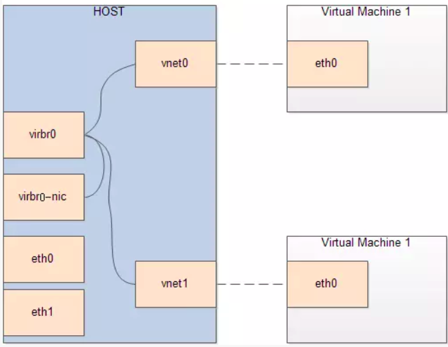
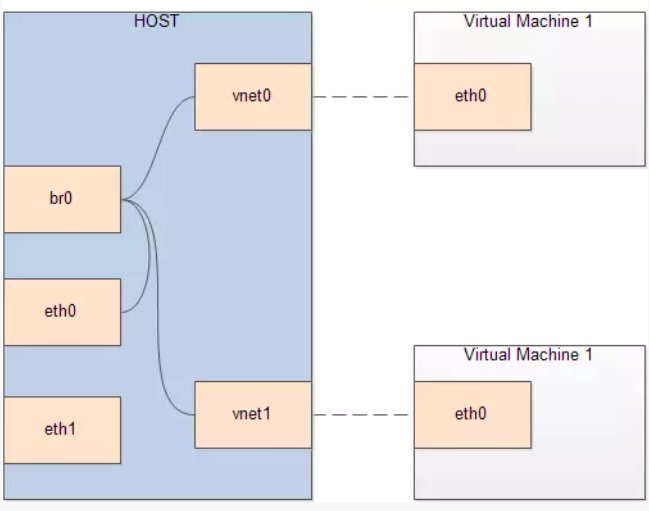

# KVM 虚拟机网络设置

* Redhat网卡配置是放在/etc/sysconfig/network-scripts目录下面的一大堆文件里面，修改网络时需要依次修改。
* Debian系的则是存在/etc/network/interfaces文件里面，无论有多少块网卡，统统扔在这个文件里。

## NAT

NAT方式是kvm安装后的默认方式。它支持主机与虚拟机的互访，同时也支持虚拟机访问互联网，但不支持外界访问虚拟机。

​

使用命令

```bash
# 列出所有虚拟机网络
$ sudo virsh net-list --all
 Name      State      Autostart   Persistent
----------------------------------------------
 default   inactive   no          yes

# 启动默认网络
$ virsh net-start default
Network default started

# 将 default 网络设为自启动
$ virsh net-autostart --network default
Network default marked as autostarted

# 再次检查网络状况，已经是 active 了
$ sudo virsh net-list --all
 Name      State    Autostart   Persistent
--------------------------------------------
 default   active   yes         yes
```

其中的default是宿主机安装虚拟机支持模块的时候自动安装的。default的配置文件在/etc/libvirt/qemu/networks/default.xml中，

如果想要修改默认的virbr0网址，可以修改/etc/libvirt/qemu/networks/目录下的default.xml或者autostart/default.xml文件，其他内容不用动，virbr0网址可修改“ip address”一行，并可指定子网掩码，另外要设置新的地址池范围。修改完毕重启libvirtd服务，如果没有显示新的IP，需要重启服务器生效。

```xml
<network>
  <name>default</name>
  <uuid>22e9a5a3-29dc-4ab9-a2cd-3308479705e2</uuid>
  <forward mode='nat'/>
  <bridge name='virnet' stp='on' delay='0'/>
  <mac address='52:54:00:68:26:e3'/>
  <ip address='10.0.0.1' netmask='255.255.255.0'>
    <dhcp>
      <range start='10.0.0.2' end='10.0.0.254'/>
    </dhcp>
  </ip>
</network>

```

是使用ifconf命令查看网络设置，其中virbr0是由宿主机虚拟机支持模块安装时产生的虚拟网络接口。

修改虚拟机配置加入以下内容

```xml
  <interface type='network'>
      <mac address='52:54:00:4f:1b:07'/>
      <source network='default'/>
      <model type='virtio'/>
      <address type='pci' domain='0x0000' bus='0x00' slot='0x03' function='0x0'/>
    </interface>
```

开启ip_forward功能

由于所有后期创建的虚拟机网关必须指向virbr0网址，即172.16.0.1，然后经过NAT转换后才能访问外网，宿主机需要开启ip_forward功能。

```bash
vim /etc/sysctl.conf
----------------------------
net.ipv4.ip_forward = 1

sysctl -p
```

### 创建步骤

```bash
virsh net-define /usr/share/libvirt/networks/default.xml
```

此命令定义一个虚拟网络，default.xml的内容：

```xml
<network>
  <name>default</name>
  <bridge name="virbr0" />
  <forward/>
  <ip address="192.168.122.1" netmask="255.255.255.0">
    <dhcp>
      <range start="192.168.122.2" end="192.168.122.254" />
    </dhcp>
  </ip>
</network>
```

也可以修改xml，创建自己的虚拟网络。

标记为自动启动：

```bash
virsh net-autostart default
Network default marked as autostarted
```

启动网络：

```bash
virsh net-start default
Network default started
```

网络启动后可以用命令brctl show 查看和验证。

修改/etc/sysctl.conf中参数，允许ip转发：

```bash
net.ipv4.ip_forward=1
```

‍

### 查看vrish所有网络相关命令

```bash
# virsh -h | grep net-
    net-autostart                  autostart a network
    net-create                     create a network from an XML file
    net-define                     define an inactive persistent virtual network or modify an existing persistent one from an XML file
    net-destroy                    destroy (stop) a network
    net-dhcp-leases                print lease info for a given network
    net-dumpxml                    network information in XML
    net-edit                       edit XML configuration for a network
    net-event                      Network Events
    net-info                       network information
    net-list                       list networks
    net-name                       convert a network UUID to network name
    net-start                      start a (previously defined) inactive network
    net-undefine                   undefine a persistent network
    net-update                     update parts of an existing network's configuration
    net-uuid                       convert a network name to network UUID
    net-port-list                  list network ports
    net-port-create                create a network port from an XML file
    net-port-dumpxml               network port information in XML
    net-port-delete                delete the specified network port
```

‍

‍

## bridge

Bridge方式即虚拟网桥的网络连接方式，是客户机和子网里面的机器能够互相通信。可以使虚拟机成为网络中具有独立IP的主机。
桥接网络（也叫物理设备共享）被用作把一个物理设备复制到一台虚拟机。网桥多用作高级设置，特别是主机多个网络接口的情况。

​​

‍

### 创建步骤

首先在宿主机中配置网桥虚拟网卡

* 方式一：

  ```bash
  ################# Centos #######################
  # 1. 编辑网桥设备，在/etc/sysconfig/network-scripts/目录下创建ifcgg-br0文件，并写入以下内容
  vi /etc/sysconfig/network-scripts/ifcfg-br0  
  -------------------------------------------
  DEVICE="br0"  
  ONBOOT="yes"  
  TYPE="Bridge"  
  BOOTPROTO=static  
  IPADDR=192.168.0.101
  NETMASK=255.255.255.0  
  GATEWAY=192.168.0.1
  DEFROUTE=yes
  -------------------------------------------

  ################# debian #######################
  vim /etc/network/interfaces
  -------------------------------------------
  # 添加如下内容
  auto br0
  iface br0 inet static
  	address 192.168.0.110
  	netmask 255.255.255.0
  	broadcast 192.168.0.255
  	gateway 192.168.0.1
  	bridge_ports enp2s0
  	bridge_stp off
  	bridge_fd 0
  -------------------------------------------

  #对于已经使用netplan来管理网络的ubuntu服务器需要修改netplan而非/etc/network/interfaces
  vim /etc/netplan/01-network-manager-all.yaml
  ----------------------------------------------------------
  # Let NetworkManager manage all devices on this system
  network:
    ethernets:
      enp2s0:
        dhcp4: false
    bridges:
      kvmbr0:
        interfaces: [enp2s0]
        dhcp4: no
        addresses: [192.168.2.222/24]
        gateway4: 192.168.2.1
        nameservers:
          addresses: [192.168.2.1,8.8.8.8,114.114.114.114]
    version: 2
  # systemctl restart NetworkManager
  ```

* 方式二

  创建网桥

‍

重启网络服务

`systemctl restart network`

校验桥接接口

`brctl show`

使用方式-新建虚拟机的时候使用方式

```bash
virt-install ---network bridge=br0
```

使用方式-已有虚拟机可以通过修改配置文件方式
编辑修改虚拟机配置文件 /etc/libvirt/qemu/v1.xml，增加如下内容

```xml
<interface type='bridge'>  
<mac address='52:54:00:da:c3:dc'/>  
<source bridge='br0'/>  
<model type='virtio'/>  
<address type='pci' domain='0x0000' bus='0x00' slot='0x03' function='0x0'/>  
</interface>  
```

### 问题发现

**问题1：虚拟机能ping通宿主机，但ping不通局域网和网关**  
可能是启用了网络过滤器，调整解决。

```bash
cat <<EOF >> /etc/sysctl.conf
net.ipv4.ip_forward = 1
net.bridge.bridge-nf-call-ip6tables = 0
net.bridge.bridge-nf-call-iptables = 0
net.bridge.bridge-nf-call-arptables = 0
<<EOF
sysctl -p
```

‍

**问题2：安装windows虚拟机的时候，windows虚拟机没有网卡，不能配置网络**

解决：下载kvm-windows虚拟机专用网络驱动镜像【Stable virtio-win ISO】

https://github.com/virtio-win/virtio-win-pkg-scripts/blob/master/README.md

```bash
Downloads

Static URLs are available for fetching latest or stable virtio-win output. These links will redirect to versioned filenames when downloaded.

The stable builds of virtio-win roughly correlate to what was shipped with the most recent Red Hat Enterprise Linux release. The latest builds of virtio-win are the latest available builds, which may be pre-release quality.

    Stable virtio-win ISO
    Stable virtio-win RPM
    Latest virtio-win ISO
    Latest virtio-win RPM
    Latest virtio-win-guest-tools.exe
    virtio-win direct-downloads full archive with links to other bits like qemu-ga, a changelog, etc.
```

然后通过virsh-manager将该镜像挂载到windows虚拟机进行安装

‍

‍

## bridge和nat模式共存

用virt install 完成虚拟机的安装后，发现里面只有一块网卡，有些时候我们需要两块或多块网卡怎么办？ 可以通过virsh attach-iterface来实现

例如原来的虚拟机是这样的， 只有一块网卡：

```bash
root@localhost:~ # virsh domiflist test_01
 Interface   Type     Source   Model    MAC
-----------------------------------------------------------
 vnet0       bridge   br0      virtio   52:54:00:c1:ee:41

[root@localhost ~]# ip a
1: lo: <LOOPBACK,UP,LOWER_UP> mtu 65536 qdisc noqueue state UNKNOWN group default qlen 1000
    link/loopback 00:00:00:00:00:00 brd 00:00:00:00:00:00
    inet 127.0.0.1/8 scope host lo
       valid_lft forever preferred_lft forever
    inet6 ::1/128 scope host 
       valid_lft forever preferred_lft forever
2: eth0: <BROADCAST,MULTICAST,UP,LOWER_UP> mtu 1500 qdisc pfifo_fast state UP group default qlen 1000
    link/ether 52:54:00:c1:ee:41 brd ff:ff:ff:ff:ff:ff
    inet 192.168.31.201/24 brd 192.168.31.255 scope global noprefixroute eth0
       valid_lft forever preferred_lft forever
    inet6 fe80::e441:c021:9953:a11f/64 scope link noprefixroute 
       valid_lft forever preferred_lft forever
[root@localhost ~]# 

```

添加网卡有两种途径：

```bash
root@localhost:/data/backup/script # nmcli c show
NAME               UUID                                  TYPE      DEVICE  
p2p1               5cfa2de7-78cb-37e1-a9f4-c84495a44bde  ethernet  p2p1   
docker0            ce28838f-3fa7-418e-b013-a9fbd8ba20e3  bridge    docker0  
tailscale0         0ed43a95-8736-4761-9f70-58faf9f30e7f  tun       tailscale
bridge-p2p1-br0    634599bc-fed9-4fbb-b472-4d48c7959005  bridge    p2p1-br0 
virbr0             fe265fb0-3e38-46ce-8f46-cf75e035d229  bridge    virbr0   
vnet2              53eca2a5-e0ef-44f1-a922-33a21e42eabb  tun       vnet2  
vnet4              af3e49d1-c3c9-4346-ad4a-fddd2309aec2  tun       vnet4  
vnet6              55a4a328-06f3-460d-afc4-69896ab1faa8  tun       vnet6  
bridge-slave-p2p1  6db748b8-864c-4eda-b480-736f1b7c7ca3  ethernet  --     

# 临时增加
root@localhost:/data/backup/script # virsh attach-interface rac-data --type bridge --source virbr0 
Interface attached successfully


# 永久增加
root@localhost:/data/backup/script # virsh attach-interface rac-data --type bridge --source virbr0   --model virtio --persistent

# 查看
virsh domiflist test_01
# 虽然这时没有virsh domiflist没有列出来新增加的interface，登陆进虚拟机也没看到ip， 
# 但是 virsh edit ubuntu1604-test-vm1 可以看到多了一个网卡,经过重启后，可以看到网卡已被永久加上

# 如果网卡不用了想删掉，就用下面命令， 重启后就可生效
virsh detach-interface test_01 --type bridge --mac 52:54:00:ab:2d:39 --config
```

‍

注：添加网卡时候出现的报错

```bash
root@localhost:/tmp/downloads # virsh attach-interface oracle_rac02 --type bridge --source virbr0 
error: Failed to attach interface
error: 内部错误：没有更多可用 PCI 插槽
```

可尝试使用以下方法添加，添加完成后，重启虚拟机即可

```bash

virsh attach-interface oracle_rac02 --type bridge --source virbr0  --model virtio --config
```
