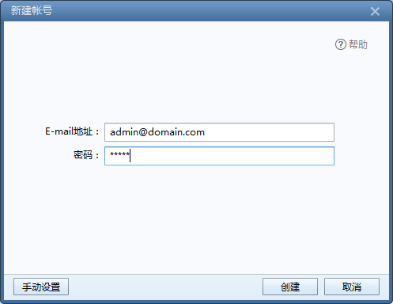
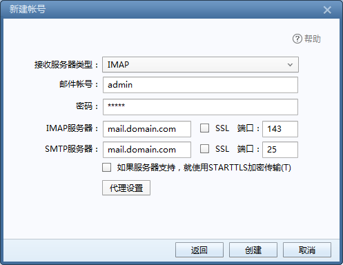

# Centos 7.x 环境部署postfix

‍

## 1.安装Postfix

```
yum -y install postfix
```

安装完成还需要替换系统自带的sendmail：

```
rpm -e sendmail
或者
yum remove sendmail
```

修改MTA（默认邮件传输代理）

```
alternatives --config mta
```

然后直接回车即可。

检查一下是不是已经设置成功了。

```
alternatives --display mta
```

第一行可以看到mta的状态。 例如：`mat - status is manual.`​

## 2.安装Dovecot

```
yum -y install dovecot
```

## 3.配置Postfix

编辑`/etc/postfix/main.cf`​，可以下载下来修改，也可以使用vi进行编辑：

```
vi /etc/postfix/main.cf
```

**修改如下：**

```
# 75行: 取消注释，设置hostname
myhostname = mail.lomu.me
# 83行: 取消注释，设置域名
mydomain = lomu.me
# 99行: 取消注释
myorigin = $mydomain
# 116行: 修改
inet_interfaces = all
# 119行: 推荐ipv4，如果支持ipv6，则可以为all
inet_protocols = ipv4
# 164行: 添加
mydestination = $myhostname, localhost.$mydomain, localhost, $mydomain
# 264行: 取消注释，指定内网和本地的IP地址范围
mynetworks = 127.0.0.0/8, 10.0.0.0/24
# 419行: 取消注释，邮件保存目录
home_mailbox = Maildir/
# 571行: 添加
smtpd_banner = $myhostname ESMTP

# 添加到最后
# 规定邮件最大尺寸为10M
message_size_limit = 10485760
# 规定收件箱最大容量为1G
mailbox_size_limit = 1073741824
# SMTP认证
smtpd_sasl_type = dovecot
smtpd_sasl_path = private/auth
smtpd_sasl_auth_enable = yes
smtpd_sasl_security_options = noanonymous
smtpd_sasl_local_domain = $myhostname
smtpd_recipient_restrictions = permit_mynetworks,permit_auth_destination,permit_sasl_authenticated,reject
```

修改好了之后使用`/etc/rc.d/init.d/postfix start`​开启postfix，使用`chkconfig postfix on`​将postfix开机启动。

## 4.配置Dovecot

**修改如下：**

```
[root@mail ~]# vi /etc/dovecot/dovecot.conf
# 26行: 如果不使用IPv6，请修改为*
listen = *

[root@mail ~]# vi /etc/dovecot/conf.d/10-auth.conf
# 9行: 取消注释并修改
disable_plaintext_auth = no
# 97行: 添加
auth_mechanisms = plain login

[root@mail ~]# vi /etc/dovecot/conf.d/10-mail.conf
# 30行: 取消注释并添加
mail_location = maildir:~/Maildir

[root@mail ~]# vi /etc/dovecot/conf.d/10-master.conf
# 88-90行: 取消注释并添加
# Postfix smtp验证
unix_listener /var/spool/postfix/private/auth {
    mode = 0666
    user = postfix
    group = postfix
}

[root@mail ~]# /etc/rc.d/init.d/dovecot start
Starting Dovecot Imap:     [ OK ]

[root@mail ~]# chkconfig dovecot on 
```

到这里，我们的邮件服务器就已经搭建成功了。

## 5.域名解析

最后别忘了还需要进行域名解析工作。

添加一个子域名`mail`​，A记录解析到服务器IP。

再添加一个MX记录，主机记录为空，记录值为上面解析的二级域名`mail.lomu.me`​，优先级10。

注意：解析生效可能需要一段时间。

## 6.邮箱使用

一切都弄好以后，就可以使用Foxmail等第三方软件来收发邮件了。在这里需要说一下，系统用户就是邮件的用户，例如root，就是一个邮箱用户，邮箱是root@domain.com，密码就是root的密码，所以需要创建用户，只要使用`useradd`​创建用户，再使用passwd设置密码。

好了，假如我们创建一个admin的用户：

```
# 创建用户
useradd admin
#设置密码，会要求输入两次密码
passwd admin
```

接下来登录Foxmail，如图：

​​

点击创建，进入：

​​

**这里需要注意，邮件账号是admin，并不是邮箱**，另外我们没有配置SSL，所以也不要勾选。 接下来点击创建，如果一切正常的话，你已经成功了。

‍
