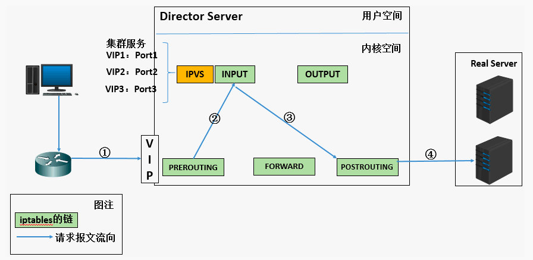

# LVS 概述

负载均衡(Load Balance)的职责是将网络请求，或者其他形式的负载“均摊”到不同的机器上，让每台服务器获取到适合自己处理能力的负载。在为高负载服务器分流的同时，还可以避免资源浪费。负载均衡的原理就是当用户的请求到达前端负载均衡器(Director Server)时，通过设置好的调度算法，智能均衡的将请求分发到后端真正服务器上(Real Server)。根据请求类型的不同可以将负载均衡分为四层负载均衡(L4)和七层负载均衡(L7)， 常见的负载均衡器包括LVS，Nginx, HAProxy等。

LVS是Linux Virtual Server的简称， 也就是 Linux 虚拟服务器，工作在 OSI 模型的传输层，即四层负载均衡。LVS主要由两部分组成，包括ipvs和ipvsadm。

- ipvs(ip virtual server)：工作在内核空间，是真正生效实现调度的代码。
- ipvsadm：工作在用户空间，叫 ipvsadm，负责为 ipvs 内核框架编写规则，定义谁是集群服务，而谁是后端真实的服务器(Real Server)

## LVS 基本工作原理



1. 当用户向负载均衡调度器（Director Server）发起请求，调度器将请求发往至内核空间
2. PREROUTING 链首先会接收到用户请求，判断目标 IP 确定是本机 IP，将数据包发往 INPUT 链
3. IPVS 是工作在 INPUT 链上的，当用户请求到达 INPUT 时，IPVS 会将用户请求和自己已定义好的集群服务进行比对，如果用户请求的就是定义的集群服务，那么此时 IPVS 会强行修改数据包里的目标 IP 地址及端口，并将新的数据包发往 POSTROUTING 链
4. POSTROUTING 链接收数据包后发现目标 IP 地址刚好是自己的后端服务器，那么此时通过选路，将数据包最终发送给后端的服务器

## IPVS的三种转发模式

### 1. DR 模式

DR模式下，客户端的请求包到达负载均衡器的虚拟服务IP端口后，负载均衡器不会改写请求包的IP和端口，但是会改写请求包的MAC地址为后端RS的MAC地址，然后将数据包转发；真实服务器处理请求后，响应包直接回给客户端，不再经过负载均衡器。所以DR模式的转发效率是最高的，特别适合下行流量较大的业务场景，比如请求视频等大文件。

**DR模式的特点**：

1. ==数据包在LB转发过程中，源/目的IP端口都不会变化==

   LB只是将数据包的MAC地址改写为RS的MAC地址，然后转发给相应的RS。
2. ==每台RS上都必须在环回网卡上绑定LB的虚拟服务IP==

   因为LB转发时并不会改写数据包的目的IP，所以RS收到的数据包的目的IP仍是LB的虚拟服务IP。为了保证RS能够正确处理该数据包，而不是丢弃，必须在RS的环回网卡上绑定LB的虚拟服务IP。这样RS会认为这个虚拟服务IP是自己的IP，自己是能够处理这个数据包的。否则RS会直接丢弃该数据包！
3. ==RS上的业务进程必须监听在环回网卡的虚拟服务IP上，且端口必须和LB上的虚拟服务端口一致==

   因为LB不会改写数据包的目的端口，所以RS服务的监听端口必须和虚拟服务端口一致，否则RS会直接拒绝该数据包。
4. ==RS处理完请求后，响应直接回给客户端，不再经过LB==

   因为RS收到的请求数据包的源IP是客户端的IP，所以理所当然RS的响应会直接回给客户端，而不会再经过LB。这时候要求RS和客户端之间的网络是可达的。
5. ==LB和RS须位于同一个子网==

   因为LB在转发过程中需要改写数据包的MAC为RS的MAC地址，所以要能够查询到RS的MAC。而要获取到RS的MAC，则需要保证二者位于一个子网，否则LB只能获取到RS网关的MAC地址。

### 2. NAT 模式

NAT模式下，请求包和响应包都需要经过LB处理。当客户端的请求到达虚拟服务后，LB会对请求包做目的地址转换（DNAT），将请求包的目的IP改写为RS的IP。当收到RS的响应后，LB会对响应包做源地址转换（SNAT），将响应包的源IP改写为LB的IP。

**NAT模式的特点：**

1. ==LB会修改数据包的地址==

   对于请求包，会进行DNAT；对于响应包，会进行SNAT。
2. ==LB会透传客户端IP到RS（DR模式也会透传==

   虽然LB在转发过程中做了NAT转换，但是因为只是做了部分地址转发，所以RS收到的请求包里是能看到客户端IP的。
3. ==需要将RS的默认网关地址配置为LB的浮动IP地址==

   因为RS收到的请求包源IP是客户端的IP，为了保证响应包在返回时能走到LB上面，所以需要将RS的默认网关地址配置为LB的虚拟服务IP地址。当然，如果客户端的IP是固定的，也可以在RS上添加明细路由指向LB的虚拟服务IP，不用改默认网关。
4. ==LB和RS须位于同一个子网，并且客户端不能和LB/RS位于同一子网

   因为需要将RS的默认网关配置为LB的虚拟服务IP地址，所以需要保证LB和RS位于同一子网。

   又因为需要保证RS的响应包能走回到LB上，则客户端不能和RS位于同一子网。否则RS直接就能获取到客户端的MAC，响应包就直接回给客户端了，不会走网关，也就走不到LB上面了。这时候由于没有LB做SNAT，客户端收到的响应包源IP是RS的IP，而客户端的请求包目的IP是LB的虚拟服务IP，这时候客户端无法识别响应包，会直接丢弃。

### 3. FULLNAT 模式

FULLNAT模式下，LB会对请求包和响应包都做SNAT+DNAT。

**FULLNAT模式的特点：**

1. ==LB完全作为一个代理服务器==

   FULLNAT下，客户端感知不到RS，RS也感知不到客户端，它们都只能看到LB。此种模式和七层负载均衡有点相似，只不过不会去解析应用层协议，而是在TCP层将消息转发
2. ==LB和RS对于组网结构没有要求==

   不同于NAT和DR要求LB和RS位于一个子网，FULLNAT对于组网结构没有要求。只需要保证客户端和LB、LB和RS之间网络互通即可。

**三种转发模式性能从高到低：DR &gt; NAT &gt; FULLNAT**

虽然FULLNAT模式的性能比不上DR和NAT，但是FULLNAT模式没有组网要求，允许LB和RS部署在不同的子网中，这给运维带来了便利。并且 FULLNAT模式具有更好的可拓展性，可以通过增加更多的LB节点，提升系统整体的负载均衡能力。

## 三、IPVS支持的调度算法

对于后端的RS集群，LB是如何决策应该把消息调度到哪个RS节点呢？这是由负载均衡调度算法决定的。IPVS常用的调度算法有：

==轮询（Round Robin）==
LB认为集群内每台RS都是相同的，会轮流进行调度分发。从数据统计上看，RR模式是调度最均衡的。

==加权轮询（Weighted Round Robin）==
LB会根据RS上配置的权重，将消息按权重比分发到不同的RS上。可以给性能更好的RS节点配置更高的权重，提升集群整体的性能。

==最小连接数（Least Connections）==
LB会根据和集群内每台RS的连接数统计情况，将消息调度到连接数最少的RS节点上。在长连接业务场景下，LC算法对于系统整体负载均衡的情况较好；但是在短连接业务场景下，由于连接会迅速释放，可能会导致消息每次都调度到同一个RS节点，造成严重的负载不均衡。

==加权最小连接数（Weighted Least Connections）==
最小连接数算法的加权版

==地址哈希（Address Hash）==
LB上会保存一张哈希表，通过哈希映射将客户端和RS节点关联起来。

## 四、LVS-DR 演示

### 1. 环境准备

```bash
systemctl stop firewalld
setenforce 0

# LVS负载调度器 ip:   vip:
# web服务器1 ip:
# web服务器2 ip:
```

### 2. 配置网卡

在LVS调度器上配置VIP，这里我们采用**虚拟网卡**，当然也可以使用独立网卡配置

```bash
#配置虚拟IP
cd /etc/sysconfig/network-scripts/
cp ifcfg-ens33 ifcfg-ens33:0
vim ifcfg-ens33:0
#编辑虚拟网卡ip为192.168.0.1
=============================================
TYPE=Ethernet
DEVICE=ens33:0
ONBOOT=yes
IPADDR=192.168.0.1
NETMASK=255.255.255.0
==============================================
ifup ens33:0
```

### 3. LVS调度器配置

上面我们说过lvs依赖于ipvs内核模块，和ipvsadm用户态工具。因为centos 7已经默认加载ipvs模块，我们只需要**安装ipvsadm工具**即可。
`yum install -y ipvsadm`

```bash
# 新建lvs规则
ipvsadm -C   # 清空所有规则;
ipvsadm -A -t 192.168.0.1:80 -s rr  # 定义LVS服务，并指定负责均衡策略为rr，即轮询
ipvsadm -a -t 192.168.0.1:80 -r 192.168.137.104:80 -g  # 添加一台后端web服务器，并指定为DR模式
ipvsadm -a -t 192.168.0.1:80 -r 192.168.137.105:80 -g  

# 保存规则
ipvsadm -S > /etc/sysconf/ipvsadm

# 加载规则
ipvsadm -R < /etc/sysconf/ipvsadm

# 启动ipvsadm
systemctl start ipvsadm

# 添加完后端RS，我们可以查看此LVS对应的均衡规则
ipvsadm -Ln

# 关闭icmp重定向(icmp会优化路由，导致lvs失效)
vim /etc/sysctl.conf
#--------------------------------------------------
net.ipv4.conf.all.send_redirects= 0
net.ipv4.conf.default.send_redirects= 0
net.ipv4.conf.ens33.send_redirects= 0
#--------------------------------------------------
sysctl -p
```

由于network和NetworkManager服务会出现冲突，而且NetworkManager通常会比较先启动，所以为了防止NetworkManager的启动导致我们直接配置的网络环境失效，我们需要禁用它！

`systemctl stop NetworkManager`
`systemctl disable NetworkManager`

### 4. 后端RS配置

参考 [nginx 部署](../../中间件/nginx/nginx%20部署.md) 安装nginx；

同时为了后面测试，我们修改web服务器的index.html内容；

接着开始进行LVS相关配置，

**首先将VIP配置在lo接口上，(注意掩码要配置成32位，不然RS通信会出问题)**

```bash
vim /etc/sysconfig/network-scripts/ifcfg-lo:0
===============================================
DEVICE=lo:0
IPADDR=192.168.0.1
NETMASK=255.255.255.255
ONBOOT=yes
=============================================
ifup lo:0
```

**接着配置对应路由**

```bash
#去主机192.168.0.1的数据包走lo接口
route add -host 192.168.0.1 dev lo
```

然后设置相关系统参数(DR和TUN模式都需要在真实服务器上对[arp_ignore]和[arp_announce]参数进行配置，主要是实现禁止响应对VIP的ARP请求。)

```bash
#修改/etc/sysctl.conf 配置文件
net.ipv4.conf.all.arp_ignore = 1
net.ipv4.conf.default.arp_ignore = 1
net.ipv4.conf.lo.arp_ignore = 1
net.ipv4.conf.all.arp_announce = 2
net.ipv4.conf.default.arp_announce = 2
net.ipv4.conf.lo.arp_announce = 2
#修改sysctl.conf文件后需要执行指令sysctl -p 后新的配置才会生效。

```

### 5. 测试

Client客户端使用curl命令对vip进行访问

```bash
[root@localhost ~]# curl 192.168.0.1:80
curl: (7) Failed connect to 192.168.0.1:80; 没有到主机的路由
#解决：<配置路由route add –host 192.168.0.1 dev ens33>
```

可见结果符合我们设置的轮询策略。

## 五、ipvsadm 命令

**ipvsadm命令**是LVS在应用层的管理命令，我们可以通过这个命令去管理LVS的配置。在笔者使用的fedora系统中，已经集成了LVS相关模块，但是ipvsadm命令仍然需要使用yum单独安装。

**参数：**

```bash
-A --add-service
　　# 在内核的虚拟服务器表中添加一条新的虚拟服务器记录。也就是增加一台新的虚拟服务器。
-E --edit-service
　　# 编辑内核虚拟服务器表中的一条虚拟服务器记录。
-D --delete-service
　　# 删除内核虚拟服务器表中的一条虚拟服务器记录。
-C --clear
　　# 清除内核虚拟服务器表中的所有记录。
-R --restore
　　# 恢复虚拟服务器规则
-S --save
　　# 保存虚拟服务器规则，输出为-R 选项可读的格式
-a --add-server
　　# 在内核虚拟服务器表的一条记录里添加一条新的真实服务器记录。也就是在一个虚拟服务器中增加一台新的真实服务器
-e --edit-server
　　# 编辑一条虚拟服务器记录中的某条真实服务器记录
-d --delete-server
　　# 删除一条虚拟服务器记录中的某条真实服务器记录
-L|-l --list
　　# 显示内核虚拟服务器表
-Z --zero
　　# 虚拟服务表计数器清零（清空当前的连接数量等）
--set tcp tcpfin udp
　　# 设置连接超时值
--start-daemon
　　# 启动同步守护进程。他后面可以是master 或backup，用来说明LVS Router 是aster 或是backup。在这个功能上也可以采用keepalived 的VRRP 功能。
--stop-daemon
　　# 停止同步守护进程


```

## 六、nginx和lvs作对比的结果

||LVS|Nginx|
| --------------| --------------------------------------------------------------------------------------------------| --------------------------------------------------------------------------------------------------------------------------------------------|
||四层|四层/七层|
|抗负载能力|强|弱|
|配置性|可配置性低&#xA;同时也减少了人为出错的概率|可配置性高&#xA;可以配置一些高级功能|
|稳定性|稳定性高&#xA;有完整的双机热备方案|稳定性低，有单机故障&#xA;无现成的双机热备方案|
|网络架构依赖|强依赖&#xA;非常依赖网络架构设计&#xA;当然可以采用比较简单的NAT方式解决此问题|无依赖|
|网络稳定性依赖|依赖&#xA;数据包分发到坏的后端，不会重新分发，会直接返回错误|不依赖&#xA;数据包分发到坏的后端并返回错误后，会尝试重新分发到健康的后端|
|网络流量|仅请求流量经过lvs的网络，响应流量由后端服务器的网络返回。&#xA;FULL\_NAT同Nginx。|所有的请求和响应流量都会经过nginx|
|宿主机性能要求|要求较低&#xA;lvs仅仅做分发请求，流量并不从它本身出去，所以瓶颈仅仅受限于网络带宽和网卡性能|要求较高&#xA;因为nginx需要对源端和目的端都单独建立连接，中间还涉及到一些数据包的解析处理，所以依赖宿主机的I/O性能和CPU内存|
|转发方式|同步转发&#xA;lvs服务器接收到请求之后，立即redirect到一个后端服务器，由客户端直接和后端服务器建立连接。|异步转发&#xA;在保持客户端连接的同时，发起一个相同内容的新请求到后端，等后端返回结果后，由nginx返回给客户端|
|其他||支持rewrite重写规则：能够根据域名、url的不同，将http请求分到不同的后端服务器群组。&#xA;节省带宽：支持gzip压缩，可以添加浏览器本地缓存的header头.|
||||
||||
