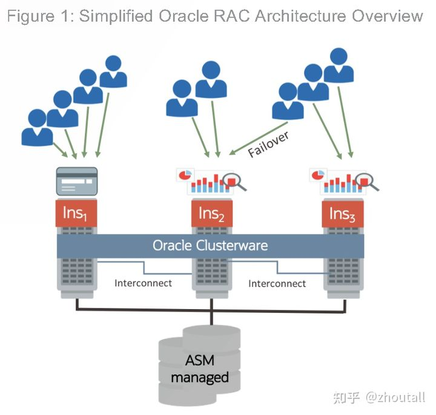
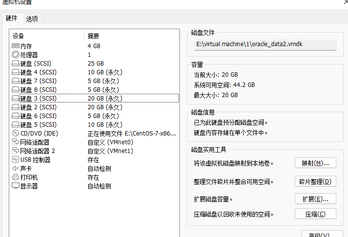

# Oracle RAC

Oracle RAC，全称是Oracle Real Application Cluster，即真正的应用集群，是oracle提供的一个并行集群系统，整个集群系统由 **Oracle Clusterware （集群就绪软件）**​***和***​ ** Real Application Clusters（RAC)**  两大部分组成。

oracle RAC 的实质是位于不同操作系统的Oracle实例节点同时访问同一个Oracle数据库，每个节点间通过私有网络进行通信，互相监控节点的运行状态，oracle数据库所有的数据文件、联机日志文件、控制文件等均放在集群的共享存储设备上，而共享存储设备可以是RAW、ASM、OCFS2等，所有集群节点可以同时读写共享存储。Oracle RAC的基本拓扑结构如下所示：  
​​​​

‍

**DG 侧重于容灾，独立存储，但两者数据不能做到实时同步（单活）。**  **RAC侧重于负载均衡，但共享存储不能容灾（双活）** 。

# oracle RAC 搭建

## 部署规划

#### 1.软件安装版本

[LINUX.X64_193000_db_home.zip](https://www.oracle.com/database/technologies/oracle19c-linux-downloads.html#license-lightbox)
[LINUX.X64_193000_grid_home.zip](https://www.oracle.com/database/technologies/oracle19c-linux-downloads.html#license-lightbox)
共享存储：ASM

#### 2.网络规划

|网络配置|node 1|node 2|备注|
| --------------------------------------------------------------------------------------------------------| -------------| -------------| ----|
|主机名|rac01|rac02||
|public ip|192.168.0.104|192.168.0.105||
|private ip|10.0.0.104|10.0.0.105||
|vip|192.168.0.111|192.168.0.222||
|scan ip|192.168.0.120|192.168.0.120||
|Oracle RAC中每个节点都有一个虚拟IP，简称VIP， 与公网PUBLIC  IP在同一个网段。vip 附属在public网口接口。||||

public网卡有二个IP地址：public ip是固定的，vip是浮动的。

Private私有IP用于心跳同步，这个对于用户层面，可以直接忽略，它和public ip不属于同一个接口。

SCAN  IP是作为一个新增IP出现的, scan ip其实是oracle在客户端与数据库之间，新加的一个连接层，当有客户端访问时，连接到 SCAN IP LISTENER， 而SCAN IP LISTENER接收到连接请求时，会根据 LBA 算法将该客户端的连接请求，转发给对应的instance上的VIP LISTENER，从而完成了整个客户端与服务器的连接过程。简化如下：
client -> scan listener -> local listener -> local instance
也可以把scan理解为一个虚拟主机名，它对应的是整个RAC集群。客户端主机只需通过这个scan name即可访问数据库集群的任意节点。当然访问的节点是随机的，oracle强烈建议通过DNS Server的round robin模式配置解析SCAN，实现负载均衡（即轮换连接SCAN对应的IP地址）。这有点类似通过vip和listener loadbalance配置实现负载均衡的原理。

#### 3.ASM 磁盘组规划

|ASM磁盘组|用途|大小|AMS冗余|
| --------------------------------------------------------------| -----------------| --------| --------|
|SYSDG|ORC Vote 19C Grid|5G+5G+5G|NORMAL|
|DATADG|数据文件|20G+20G|EXTERNAL|
|FRADG|闪回，归档，备份|10G+10G|EXTERNAL|
|||||
|磁盘创建完成之后我们添加到两台主机上||||

_修改虚拟机vmx文件_在虚拟机的vmx文件中添加配置信息。

```bash
scsi0.sharedBus= "virtual"
disk.locking= "false"
diskLib.dataCacheMaxSize= "0"
diskLib.dataCacheMaxReadAheadSize= "0"
diskLib.DataCacheMinReadAheadSize= "0"
diskLib.dataCachePageSize= "4096"
diskLib.maxUnsyncedWrites= "0"
```

#### 4.Oracle组件

|组件名称|Grid|Oracle|
| ----------------| ----------------------------------| -----------------------------------------------------|
|所属用户|grid|oracle|
|所属组|asmadmin,asmdba,asmoper,dba grid|dba,asmdba,backupdba,dgdba,kmdba,racdba,oper oracle|
|家目录|/home/grid|/home/oracle|
|Oracle基础目录|/data/u01/app/grid|/data/u01/app/oracle|
|Oracle主目录|/data/u01/app/19.0.0/grid|/data/u01/app/oracle/product/19.0.0/dbhome_1|

## 环境准备

```bash
#修改主机名
hostnamectl set-hostname oracle19crac01
hostnamectl set-hostname oracle19crac02
# hosts文件（将主机名和ip对应）
cat >> /etc/hosts <<EOF
# Public ip ens33
192.168.0.104   oracle19crac01
192.168.0.105   oracle19crac02

# Private ip ens34
10.0.0.104   oracle19crac01-priv
10.0.0.104   oracle19crac02-priv

# VIP ens33:0
192.168.0.111   oracle19crac01-vip
192.168.0.222   oracle19crac02-vip

# Scan ip ens33:1
192.168.0.120   oracle19crac-scan
EOF


#修改Linux字符集为zh_CN.utf8
echo "LANG="zh_CN.UTF-8"" > /etc/locale.conf  
source /etc/locale.conf

# SELinux 主要作用就是最大限度地减小系统中服务进程可访问的资源，建议关闭
sed -i 's/SELINUX=enforcing/SELINUX=disabled/g' /etc/selinux/config
setenforce 0
#opensuse 默认不启用selinux

# firewalld防火墙取代了iptables防火墙
systemctl stop firewalld && systemctl disable firewalld

# 查看是否启用了  Transparent Hugepages
cat /sys/kernel/mm/transparent_hugepage/enabled
[always] madvise never  # 启用状态

# 永久禁用THP(Transparent HugePages )--直接执行立即生效
vim /etc/rc.d/rc.local
------------------------------------------------------
echo never > /sys/kernel/mm/transparent_hugepage/enabled 
echo never > /sys/kernel/mm/transparent_hugepage/defrag

#创建数据库用户&组
groupadd -g 200 oinstall
groupadd -g 201 dba
groupadd -g 202 oper
groupadd -g 203 backupdba
groupadd -g 204 dgdba
groupadd -g 205 kmdba
groupadd -g 206 racdba
groupadd -g 207 asmdba
groupadd -g 208 asmoper
groupadd -g 209 asmadmin
useradd -u 200 -g oinstall -G dba,oper,backupdba,dgdba,kmdba,racdba oracle && echo Ninestar123 | passwd --stdin oracle
useradd -u 201 -g oinstall -G asmadmin,asmdba,asmoper,dba grid && echo Ninestar123 | passwd --stdin grid

#useradd -u 200 -g oinstall -G dba,oper,backupdba,dgdba,kmdba,racdba oracle && echo "oracle:Ninestar123" | chpasswd 

#创建目录
mkdir -p /data/u01/app/oracle/product/19.3.0/db_1
mkdir -p /data/u01/app/oraInventory/
mkdir -p /data/oradata/
chmod -R 755 /data/u01/
chown -R oeacle:oinstall /data/u01/
chown -R oracle:oinstall /data/oradata/
mkdir -p /data/u01/app/grid
chown -R grid:oinstall /data/u01/app/grid

#内核优化sysctl.conf
cat >>/etc/sysctl.conf <<EOF

#/系统级别最大可以打开文件句柄的数量
fs.file-max = 6815744
#共享内存总量
kernel.shmall = 1073741824
#单个共享内存段的最大值
kernel.shmmax = 4398046511104
#共享内存段的最大数量
kernel.shmmni = 4096
#semaphores，进程间通信信号量
kernel.sem = 250 32000 100 128
#接收套接字缓冲区大小的默认值(以字节为单位)。
net.core.rmem_default = 262144
#接收套接字缓冲区大小的最大值(以字节为单位)。
net.core.rmem_max = 4194304
#发送套接字缓冲区大小的默认值(以字节为单位)。
net.core.wmem_default = 262144
#发送套接字缓冲区大小的最大值(以字节为单位)。
net.core.wmem_max = 1048576
#同时可以拥有的的异步IO请求数目
fs.aio-max-nr = 1048576
#配置向外连接端口范围
net.ipv4.ip_local_port_range = 9000 65500
EOF

sysctl -p


#linux资源限制配置文件是/etc/security/limits.conf；限制用户进程的数量对于linux系统的稳定性非常重要。
cat  >> /etc/security/limits.conf <<EOF
oracle soft nproc 65536
oracle hard nproc 65536
oracle soft nofile 65536
oracle hard nofile 65536
oracle soft stack 16384
oracle hard stack 32768
oracle hard memlock 134217728
oracle soft memlock 134217728

grid soft nproc 65536
grid hard nproc 65536
grid soft nofile 65536
grid hard nofile 65536
grid soft stack 16384
grid hard stack 32768
EOF

cp /etc/pam.d/login{,.orainstallbak}   #备份原始文件
echo "session    required     pam_limits.so" >> /etc/pam.d/login

# 环境变量配置
cat  >>/etc/profile.local <<EOF
if [ $USER = "oracle" ]; then
   if [ $SHELL = "/bin/ksh" ]; then
       ulimit -p 16384
       ulimit -n 65536
    else
       ulimit -u 16384 -n 65536
   fi
fi
EOF

#cat  >> /home/oracle/.profile <<EOF  #opensuse
cat  >> /home/oracle/.bash_profile <<EOF
export EDITOR=vi
export ORACLE_SID=racdb01
ORACLE_UNQNAME=racdb
export ORACLE_BASE=/data/u01/app/oracle
export ORACLE_HOME=/data/u01/app/oracle/product/19.3.0/db_1
export LD_LIBRARY_PATH=/data/u01/app/oracle/product/19.3.0/db_1/lib
export PATH=/data/u01/app/oracle/product/19.3.0/db_1/bin:$PATH
export ORACLE_TERM=xterm
export TEMP=/tmp
export TMPDIR=/tmp
export NLS_LANG="AMERICAN_AMERICA.ZHS16GBK"
export DMPDIR=$ORACLE_BASE/admin/$ORACLE_SID/dpdump
#export CV_ASSUME_DISTID=RHEL7.6 # Centos8或opensuse安装oracle需要打开注释
export LANG="zh_CN.UTF-8"
EOF

source /etc/profile
source /home/oracle/.bash_profile

cat  >> /home/grid/.bash_profile <<EOF
export ORACLE_HOME=/data/u01/app/grid
export PATH=$PATH:$HOME/bin:$ORACLE_HOME/bin
EOF

source /home/grid/.bash_profile

# 安装oracle所需依赖
# Centos7.x
yum install -y  vim make gcc gcc-c++ unzip zip net-tools libnsl bc binutils elfutils-libelf elfutils-libelf-devel fontconfig-devel glibc glibc-devel unixODBC-devel ksh libaio libaio-devel libX11 libXau libXi libXtst libXrender libXrender-devel libgcc libstdc++ libstdc++-devel libxcb  nfs-utils targetcli smartmontools sysstat

# OpenSuSE15.3
zypper in -y vim unzip net-tools gcc bc binutils glibc glibc-devel insserv-compat libaio-devel libaio1 libX11-6 libXau6 libXext-devel libXext6 libXi-devel libXi6 libXrender-devel libXrender1 libXtst6 libcap-ng-utils libcap-ng0 libcap-progs libcap1 libcap2 libelf1 libgcc_s1 libjpeg8 libpcap1 libpcre1 libpcre16-0 libpng16-16 libstdc++6 libtiff5 libgfortran4 mksh make pixz rdma-core rdma-core-devel smartmontools sysstat xorg-x11-libs xz compat-libpthread-nonshared readline-devel


## opensuse挂载系统镜像源
## 1.上传opensuse镜像至/opt
## 2.挂载到/mnt     mount -o loop /opt/opensuse.xxx.iso  /mnt/
## 3.配置zypper源   zypper ar -f /mnt/ opensuse
## 4.刷新 zypper lr ; zypper clean;
```

asm是oracle 10g r2中为了简化oracle数据库的管理而推出来的一项新功能，这是oracle自己提供的卷管理器，主要用于替代操作系统所提供的lvm，它不仅支持单实例，同时对rac的支持也是非常好。asm可以自动管理磁盘组并提供有效的数据冗余功能。使用asm（自动存储管理）后，数据库管理员不再需要对oracle中成千上万的数据文件进行管理和分类，从而简化了dba的工作量，可以使得工作效率大大提高。
