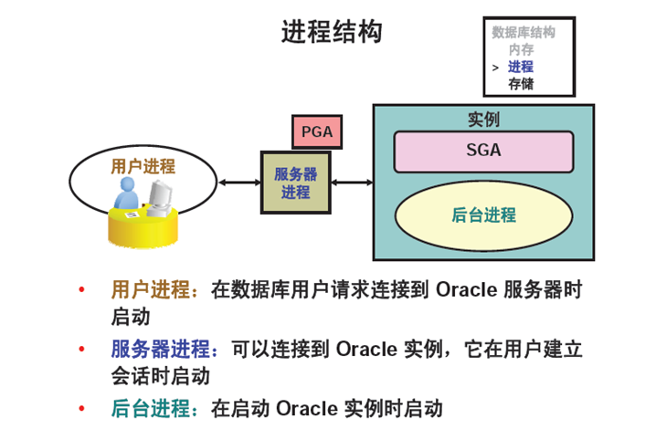
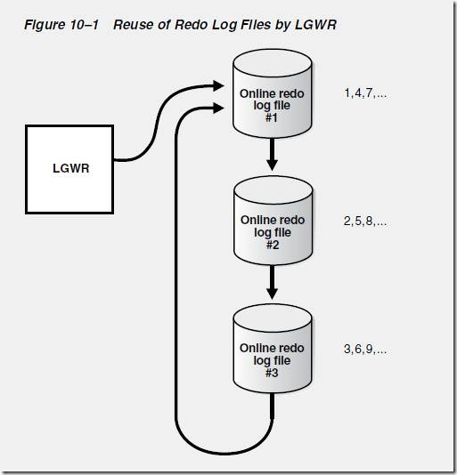

# Oracle 日志归档

# oracle 数据写入过程



**用户进程**：当用户运行应用程序时，操作系统会为用户运行的应用建立一个进程。那么这个进程就是我们所说的用户进程；
**服务器进程**：服务器进程用于处理连接到该实例的用户进程的请求；
**后台进程**：后台进程是在实例启动时启动，启动Oracle数据库的实例时会自动启动后台进程；

Oracle 写数据过程：

1、事务开始；
2、在buffer cache中找到需要的数据块，如果没有找到，则从数据文件中载入buffer cache中；
3、事务修改buffer cache的数据块，该数据被标识为“脏数据”，并被写入log buffer中；
4、事务提交，触发LGWR进程将log buffer中的“脏数据”写入redo log file（联机重做日志组）中（同时DBWN进程会将buffer cache中脏数据块对应的原始数据，复制到undo表空间）
5、期间ckpt进程根据3秒的原则，作检查点，触发WBDN进程，将buffer cache中的脏数据写入到datafile中；

# redo log

Redo Log 被称为重做日志，这个日志是记录对数据库所做的修改，比如插入，删除，更新数据等，对这些操作都会记录在联机重做日志里，这样做是为了数据安全。

Redo Log 主要包含两部分：一部分是内存中的日志缓冲，称作 Log Buffer, 这部分日志比较容易丢失；另一部分是存在磁盘上的重做日志文件，称作 Redo Log File, 这部分日志是持久化到磁盘上的，不容易丢失。

## 查看redolog

```bash
select g.member, v.status from v$log v , v$logfile g where v.GROUP#=g.GROUP#;

# CURRENT
# redo日志为当前活跃的日志，就是LGWR进程写的日志文件，处于该状态下的日志为数据库当前正在写入的日志组。活跃中的日志组无法进行删除。删除前需要将日志组切换到 INACTIVE状态。

# ACTIVE
# 是指活动的非当前日志，在进行实例恢复时会被用到。Active状态意味着Checkpoint尚未完成，脏数据未写入到硬盘，因此该日志文件不能被覆盖。

# INACTIVE
# 是非活动日志，在实例恢复时不再需要，但在介质恢复时可能需要。

# UNUSED
# 通常指从未被使用的日志组，即新添加的日志组。
```

## 日志组

由于联机重做日志文件的重要性，因此以组的方式管理日志文件，每个数据库至少有两个日志文件组，每组至少包含1个或者多个日志成员，这里要多个日志成员的原因是防止日志文件组内某个日志文件损坏后及时提供备份，所以同一组的日志成员一般内容信息相同，但是存放位置不同。
联机重做日志文件是循环使用的（见下图）。当第一个日志文件达到一定数量时,就会停止写入,而转向第二个日志文件,第二个满转向第三个日志文件.第三个满就向第一个日志文件写入.



```sql
-- 查看Redolog 的文件的位置所在（默认datafile目录下）
select member from v$logfile;

-- 查看Redolog 位置\大小\状态.
select g.member, v.bytes/1024/1024, v.status from v$log v , v$logfile g where v.GROUP#=g.GROUP#;

-- 1、创建4个新的日志组
ALTER DATABASE ADD LOGFILE GROUP 7 ('/data/oradata/FMSDB/redo07.log') SIZE 200m;
ALTER DATABASE ADD LOGFILE GROUP 8 ('/data/oradata/FMSDB/redo08.log') SIZE 200m;
ALTER DATABASE ADD LOGFILE GROUP 9 ('/data/oradata/FMSDB/redo09.log') SIZE 200m;
-- 2、归档当前联机重做日志并切换到新的联机重做日志组
alter system archive log current;
alter system switch logfile;

-- 3、删除旧的日志组
-- 通过select * from v$log;
-- 查看group 1/2/3/4 上的redo状态为inactive后，方可执行如下命令。

alter database drop logfile group 1;
alter database drop logfile group 2;
alter database drop logfile group 3;

-- 查看日志组的状态看一下哪个是当前组，哪个是inactive状态的，删除掉inactive的那个组；如果状态为current和active 在删除的时候会报错。

-- 4、操作系统下删除原日志组1、2、3中的文件
-- 注意：每一步删除drop操作，都需手工删除操作系统中的实体文件。

-- 5、重建日志组1、2、3、4
ALTER DATABASE ADD LOGFILE GROUP 1 ('/data/oradata/jzdb/redo01.log') SIZE 1G;
ALTER DATABASE ADD LOGFILE GROUP 2 ('/data/oradata/jzdb/redo02.log') SIZE 1G;
ALTER DATABASE ADD LOGFILE GROUP 4 ('/data/oradata/jzdb/redo04.log') SIZE 1G;

-- 6、切换日志组
-- 多执行几次如下命令，同时通过select * from gv$log来观察5/6/7/8下的redo日志状态是不是为inactive；
-- 查看日志组的状态看一下哪个是当前组，哪个是inactive状态的，删除掉inactive的那个组。如果状态为current和active 在删除的时候会报错。

alter system switch logfile;

-- 7、删除中间过渡用的日志组5、6、7、8
alter database drop logfile group 5;
alter database drop logfile group 6;
alter database drop logfile group 7;
alter database drop logfile group 8;

-- 到操作系统下删除原日志组4、5、6中的文件

-- 9、备份当前的最新的控制文件
-- 因日志组发生变化，建议备份一次controlfile文件。
SQL> alter database backup controlfile to trace resetlogs;

```

## 日志归档

我们知道，Oracle 数据库需要至少两组联机日志，每当一组 联机日志写满后会发生日志切换，继续向下一组联机日志写入。
如果是归档模式，日志切换会触发归档进程 （ARCn）进行归档，生成归档日志。Oracle 保证归档完成前，联机日志不会被覆盖，如果是非归档模式， 则不会触发归档动作。

不管数据库是否是归档模式，重做日志是肯定要写的。而只有数据库在归档模式下，重做日志才会备份，形成归档日志。
一般来说，归档日志结合全备份，用于数据库出现问题后的恢复使用

**开启归档模式**

```sql
-- 查看是否开启归档模式
SQL> archive log list;
-- 设置归档文件格式   
SQL> alter system set log_archive_format='%t_%s_%r.dbf' scope=spfile;
-- 设置归档文件保存路径,路径中最好包含实例名，确保目录存在，且拥有者为oracle用户
SQL> alter system set log_archive_dest_1 ='location=/data/arch/fmsdb' scope=spfile;
-- 重启数据库至mount模式
SQL> shutdown immediate
SQL> startup mount
-- 开启归档
SQL> alter database archivelog;
-- 打开数据库
SQL> alter database open;
-- 手动归档
SQL> alter system archive log current;
```

**配置参数详解**

log\_archive\_dest\_n   # 设置归档日志路径

```bash
LOG_ARCHIVE_DEST_n   # 参数可以设置最多10个不同的归档路径，通过设置关键词location或service，该参数指向的路径可以是本地或远程的。
LOG_ARCHIVE_DEST_1 = 'LOCATION = /disk1/archive' 
LOG_ARCHIVE_DEST_2 = 'LOCATION = /disk2/archive' 
LOG_ARCHIVE_DEST_3 = 'LOCATION = /disk3/archive' 
# 如果要归档到远程的standby数据库，可以设置service：
LOG_ARCHIVE_DEST_4 = 'SERVICE = standby1'
```

scope（范围）说明：

```bash
# Oracle 里面有个叫做spfile的东西，就是动态参数文件，里面设置了Oracle 的各种参数。
# 所谓的动态，就是说你可以在不关闭数据库的情况下，更改数据库参数，记录在spfile里面。
scope=spfile  # 仅仅更改spfile里面的记载，不更改内存，也就是不立即生效，而是等下次数据库启动生效。有一些参数只允许用这种方法更改
scope=memory  # 仅仅更改内存，不改spfile。也就是下次启动就失效了
scope=both    # 内存和spfile都更改
不指定scope参数 # 等同于scope=both.

```

# undo log

Undo Log 被称为撤销日志、回滚日志。为了保证读一致性，在更新数据到提交之前，Oracle会先**把旧数据写入到undo log中**，以便回滚，且其他用户读取的数据也是和undo log中的数据一致，直到提交事务才更改数据，undo log是为了撤销所作更改。数据放在undo表空间中。

# 数据库闪回

📌**开启闪回功能必须是在归档模式下，请参考上面的操作**

当启用闪回就必须使用**log**​**archive**​**dest**​**n**参数来指定归档日志目录。

Oracle的闪回技术提供了一组功能，可以访问过去某一时间的数据并从人为错误中恢复。闪回技术是Oracle 数据库独有的，支持任何级别的恢复，包括行、事务、表和数据库范围。使用闪回特性，可以查询以前的数据版本，还可以执行更改分析和自助式修复，以便在保持数据库联机的同时从逻辑损坏中恢复。

Flashback技术是以Undo Segment中的内容为基础的， 因此受限于`UNDO_RETENTON`参数。要使用flashback 的特性，必须启用自动撤销管理表空间。闪回参数如下：

```sql
SQL> show parameter undo;

NAME                     TYPE     VALUE
------------------------------------ ----------- ------------------------------
undo_management        string     AUTO        # undo_management参数值是否为AUTO，如果是“MANUAL”手动，需要修改为“AUTO”
undo_retention         integer    7200        # 1d是1440 即24*60,7200是5d
undo_tablespace        string     UNDO1

```

**单实例：**

```sql
# 设置闪回恢复区
SQL> show parameter recover;
SQL> alter system set db_recovery_file_dest_size=10g scope=spfile;
# 设置闪回区位置，路径中不用指定实例名，会自动生成，确保目录存在，且拥有者为oracle用户
SQL> alter system set db_recovery_file_dest='/data/arch' scope=spfile;
# 设置闪回目标为5天，以分钟为单位，每天为1440分钟，默认为1天
SQL> alter system set db_flashback_retention_target=2880 scope=spfile;
# 保存一致性,先关闭数据库
SQL> shutdown immediate;
# 启动到mount阶段
SQL> startup mount;
# 启动闪回功能
SQL> alter database flashback on; 
# 也可启用表空间闪回
SQL> alter tablespace abc flashback on;     -- 开启表空间闪回
SQL> alter tablespace abc flashback off;    -- 关闭表空间闪回
# 切换到open阶段
SQL> alter database open;
```

**RAC：**

```bash
```

**闪回区和归档目录**

```bash
# 使用闪回区需先设置其大小和路径：
alter system set db_recovery_file_dest_size=5G scope=both;
alter system set db_recovery_file_dest='/archivelog' scope=spfile;

# 设置归档路径和闪回区同时保留归档日志：
alter system set log_archive_dest_1='location=/data/arch' scope=spfile;
alter system set log_archive_dest_10='LOCATION=USE_DB_RECOVERY_FILE_DEST' scope=spfile;

# 设置归档路径保留归档日志，闪回区不保留：
alter system set log_archive_dest_1='location=/data/arch' scope=spfile;
alter system set log_archive_dest_10='' scope=spfile;

# 设置归档路径不保留归档日志，闪回区保留：
alter system set log_archive_dest_1='' scope=spfile;
alter system set log_archive_dest_10='LOCATION=USE_DB_RECOVERY_FILE_DEST' scope=spfile;

```

# 其他知识点

## crash Recovery 过程

当数据库突然崩溃，而还没有来得及将buffer cache里的脏数据块刷新到数据文件里，同时在实例崩溃时正在运行着的事务被突然中断，则事务为中间状态，也就是既没有提交也没有回滚。这时数据文件里的内容不能体现实例崩溃时的状态。这样关闭的数据库是不一致的。
下次**启动实例**时，Oracle会由SMON进程自动进行实例恢复。实例启动时，SMON进程会去检查**控制文件**中所记录的、每个在线的、可读写的数据文件的END SCN号。
数据库正常运行过程中，该END SCN号始终为NULL，而当数据库正常关闭时，会进行完全检查点，并将检查点SCN号更新该字段。而崩溃时，Oracle还来不及更新该字段，则该字段仍然为NULL。当SMON进程发现该字段为空时，就知道实例在上次没有正常关闭，于是由SMON进程就开始进行实例恢复了。

SMON进程进行实例恢复时，会从控制文件中获得**检查点**位置。于是，SMON进程到**redo log文件**中，找到该检查点位置，然后从该检查点位置开始往下，应用所有的重做条目，从而在**buffer cache里又恢复了实例崩溃那个时间点的状态**。这个过程叫做**前滚**，前滚完毕以后，buffer cache里既有崩溃时已经提交还没有写入数据文件的脏数据块，也还有事务被突然终止，而导致的既没有提交又没有回滚的事务所弄脏的数据块。
前滚一旦完毕，SMON进程立即打开数据库。但是，这时的数据库中还含有那些中间状态的、既没有提交又没有回滚的脏块，这种脏块是不能存在于数据库中的，因为它们并没有被提交，必须被回滚。打开数据库以后，SMON进程会在后台进行**回滚**。
有时，数据库打开以后，SMON进程还没来得及回滚这些中间状态的数据块时，就有用户进程发出读取这些数据块的请求。这时，服务器进程在将这些块返回给用户之前，由服务器进程负责进行回滚，回滚完毕后，将数据块的内容返回给用户。

总之，Crash Recovery时，数据库打开会占用比正常关闭更长的时间。

## 恢复机制分类

崩溃恢复 Crash recovery
媒介恢复 Media recovery 参考[Oracle 数据异机恢复](Oracle%20数据异机恢复.md)
这两种的区别是：
1）Crash Recovery 是在启动时DB 自动完成，而MediaRecovery 需要DBA 手工的完成。
2）Crash Recovery 使用online redo log，Media Recovery 使用archived log 和 online redo log。
3）Media Recovery 可能还需要从备份中Restore datafile。

## 启动实例过程

oracle数据库的启动涉及一系列的文件读取和数据一致性检查等操作，但首先启动数据库实例（lnstance），在这个过程数据库获取一些内存空间(PGA+SGA)，并启动必需的后台监控进程。启动流程涉及3个状态。
1）NOMOUNT状态：打开数据库实例（lnstance），读取**参数文件**（一些缓冲大小、内存等参数）
2）MOUNT状态：根据**参数文件**找到**控制文件**位置，读取控制文件中的参数（数据文件、日志文件位置等）
3）OPEN状态：打开数据文件 并 进行一系列检查工作，这些检查工作用于数据恢复

## 控制文件

oracle数据库控制文件是一个重要的二进制文件，记录了数据库的**重做日志和数据文件的名字和位置、归档重做日志**的历史等。控制文件在数据库启动到MOUNT状态时被读取。由于其重要性建议多重存储到不同磁盘（3个以上实现冗余可用性）

## 检查点

检查点（checkpoint) 是数据库的一个内部事件，检查点激活时会触发数据库写进程(DBWR)，**将数据缓冲区里的脏数据块写到数据文件中**。checkpoint主要2个作用：&#x20;
1）保证数据库的一致性，这是指将脏数据写出到硬盘，保证内存和硬盘上的数据是一样的。&#x20;
2）缩短实例恢复的时间，实例恢复要把实例异常关闭前没有写到硬盘的脏数据通过日志进行恢复。如果脏块过多，实例恢复的时间也会过长，检查点的发生可以减少脏块的数量，从而减少实例恢复的时间。

## 脏数据

脏数据就是已经写入到内存里，但是还没有写入到硬盘上的数据。 一般当事物没有提交的时候会产生，当事物提交以后，脏数据就会被写进硬盘的数据块，这时他就不叫脏数据了。
