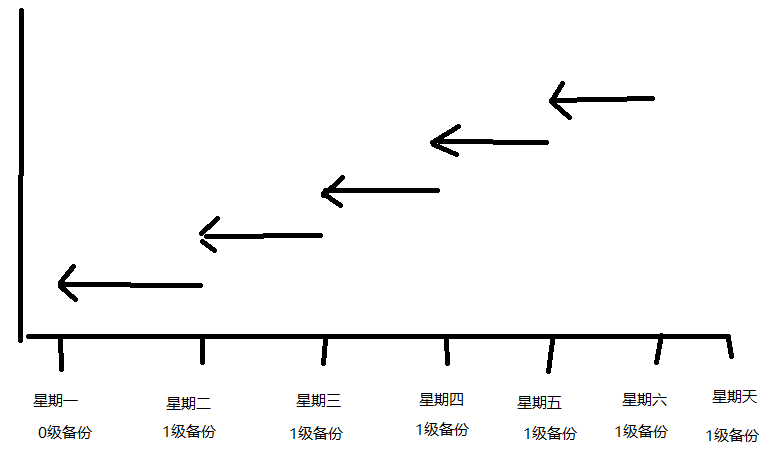
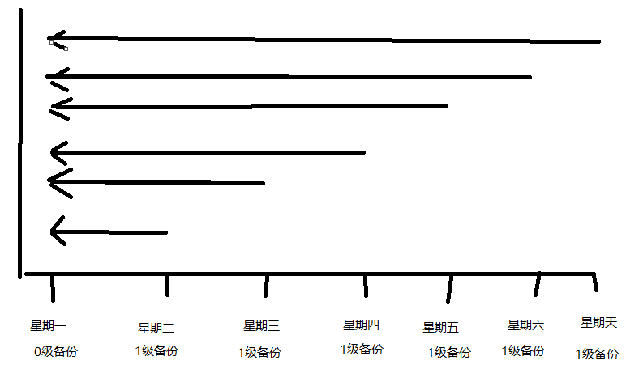

# RMAN 备份策略

DBA生存之四大守则的第一条就是：备份重于一切

RMAN是Oracle数据库软件自带的备份/恢复工具。RMAN只能用于9i或更高的版本中。它能够备份整个数据库或数据库部件，如表空间、数据文件、控制文件、归档文件以及Spfile参数文件。通过RMAN的方式无论是要备份还是要恢复，都必须先启动实例并加载数据库。

# 一、RMAN BACKUP

rman比较适合于跨文件系统的迁移，如同平台下的不同文件系统
热备：数据库使用过程中进行备份，必须打开归档模式。
冷备：关闭实例，使数据库处于mount状态下，执行备份命令。

## 1. 数据文件备份

```sql
sqlplus sys/ as sysdba                             
create user oraback identified by Ninestar2022; 
grant connect,sysbackup to oraback ; 
-- 登录rman
rman target oraback/Ninestar2021@orcl as sysbackup
-- 全量备份
RMAN> backup database format '/data/oraback/fmsdb/full_%d_%T_%t.bak';
-- 0级增量备份=全备，可以做级增量备份的基础
RMAN> backup incremental level 0 database format '/data/oraback/fmsdb/lv0_%d_%T_%t.bak';
-- 表空间级别数据文件备份
RMAN> backup tablespace jy2web format '/data/oraback/fmsdb/jy2web_%d_%T_%t.bak'; 
```

### 1.1 差异增量备份

自上一次同级别的差异备份或者是上一次更高级别的备份完成之后的数据库发生改变的数据块.

**说明**：通俗些 其0级备份是对数据空间的完整备份（包括数据库逻辑日志），其备份量较大，在此基础上的1级备份，是增量备份，备份量较小,只备份0级备份之后的数据。0级备份是全备 1级备份是增量备份



```sql
-- 0级增量备份=全备，可以做级增量备份的基础
RMAN> backup incremental level 0 database format '/data/oraback/fmsdb/inc0_%d_%T_%t.bak';
-- 1级差异增量备份
RMAN> backup incremental level 1 database format '/data/oraback/fmsdb/inc1_%d_%T_%t.bak';
```

### 1.2 累积增量备份

自上一次上0级备份完成以来数据库所有的改变信息。



```sql
-- 1级累积增量备份
RMAN> backup incremental level 1 cumulative database format '/data/oraback/fmsdb/cum1_%d_%T_%t.bak';
```

**注意**:差异增量备份跟累积增量备份不要混用，只用一种就行，通常差异增量备份用得多

## 2. 归档日志备份

归档就是由oracle数据库后台进程ARCn进程将redo日志文件中的内容复制到归档文件中。

```sql
-- 备份所有归档日志
RMAN> backup archivelog all;
-- 备份归档日志，指定路径
RMAN> backup archivelog all format '/data/oraback/fmsdb/arch_%t_%s_%r.dbf';
-- 备份归档日志，指定路径，并删掉以前的归档日志备份
RMAN> backup archivelog all format '/data/oraback/fmsdb/arch_%t_%s_%r.dbf' delete input ;

-- 在备份数据库的同时自动对所有归档文件进行备份
RMAN> backup database plus archivelog;

/*BACKUP.....PLUS ARCHIVELOG命令在备份过程中会依次执行下列步骤：
1>.运行ALTER SYSTEM ARCHIVE LOG CURRENT语句对当前redolog进行归档。
2>.执行BACKUP ARCHIVELOG ALL命令备份所有已归档日志。
3>.执行BACKUP命令对指定项进行备份。
4>.再次运行ALTER SYSTEM ARCHIVE LOG CURRENT对当前redolog归档。
5>.对新生成的尚未备份的归档文件进行备份。*/

-- RMAN提供了DELETE ALL INPUT参数，加在BACKUP命令后，则会在完成备份后自动删除归档目录中已备份的归档日志。
RMAN> backup database plus archivelog delete all input;
```

## 3. 控制文件备份

控制文件是Oracle的物理文件之一，它记录了数据库的名字、数据文件的位置等信息。 控制文件的重要性在于，一旦控制文件损坏，数据库将会宕机。 如果没有数据库的备份和归档日志文件，数据库将无法恢复。**同时控制文件是可以用来恢复spfile文件的！**

```sql
-- 手动备份控制文件
RMAN> backup current controlfile format '/data/oraback/fmsdb/ctl_%d_%T_%t.bak';

```

**控制文件自动备份**

每次进行备份是，无论是数据文件、归档日志还是控制文件，都会自动备份**控制文件**

```sql
-- 启用控制文件自动备份特性,默认是开启的
RMAN> CONFIGURE CONTROLFILE AUTOBACKUP ON; 
-- 更改控制文件自动备份的路径
RMAN> CONFIGURE CONTROLFILE AUTOBACKUP FORMAT FOR DEVICE TYPE DISK TO  '/data/oraback/fmsdb/ctl_%F.bak';
```

## 4. spfile文件备份

参数文件是一个包含一系列参数以及参数对应值的操作系统文件。它们是在数据库实例启动时候加载的，决定了数据库的物理 结构、内存、数据库的限制及系统大量的默认值、数据库的各种物理属性、指定数据库控制文件名和路径等信息，是进行数据库设计和性能调优的重要文件。

**pfile**: 可以用任何文本编辑工具打开
**spfile**: 只能通过SQL命令在线修改

```sql
RMAN> backup spfile format '/data/oraback/fmsdb/spfile_%d_%T_%t.bak'; 
--将恢复的spfile转化成pfile
RMAN> create pfile='/tmp/pfile.ora' from spfile='/tmp/spfile.bak';
```

# 二、RMAN RESTORE

还原、恢复

```sql
RMAN> restore database;           --还原数据库
RMAN> restore tablespace users;   --还原表空间
RMAN> restore datafile n;         --还原数据文件
RMAN> restore archivelog sequence between 10 and 20; --还原归档日志
RMAN> restore controlfile from autobackup;   --还原控制文件
RMAN> restore controlfile from '/data/oraback/fmsdb/ctl_SCCDB_3568_20221107_lv0.bak';
RMAN> restore spfile to '/tmp/spfile.ora' from autobackup; --还原参数文件
RMAN> restore spfile to '/tmp/spfile.ora' from '/data/oraback/fmsdb/ctl_SCCDB_3568_20221107_lv0.bak';

RMAN> restore validate database;     --验证数据库可恢复性
RMAN> restore validate controlfile;  --验证控制文件可恢复性
RMAN> restore validate spfile;      --验证参数文件可恢复性
```

# 三、RMAN RECOVER

```sql
RMAN> recover database;        --恢复数据库
RMAN> recover tablespace users;   --恢复表空间
RMAN> recover datafile n;       --恢复数据文件
```

# 四、 RMAN LIST

查看备份集信息

```sql
RMAN> list backup;                      --列出数据库中所有的备份集
RMAN> list backup of database;          --查看数据库备份集
RMAN> list backup of tablespace users;  --查看表空间备份集
RMAN> list backup of datafile n;        --查看备份的数据文件
RMAN> list backup of controlfile;       --查看控制文件备份集
RMAN> list backup of archivelog all;    --查看归档日志备份集
RMAN> list archivelog all;              --查看当前所有归档日志
RMAN> list expired backup;              --列出所有无效备份
```

# 五、RMAN CROSSCHECK

用于检验存储仓库中的备份集或镜像副本，执行改命令后，将更新存储仓库中的刚刚校验的对象状态，便于后续操作处理。

RMAN备份校验是的几种状态：
**Expired**：对象不存在于磁盘或磁带。当一个备份集处于expired状态，则该备份集中所有的备份片同样处于expired状态；
**Available**    ：对象处于可用状态。当一个备份集可用，则改备份集内的所有备份片同样可用；
**Unavailable**：对象处于不可用状态。当一个备份可不用，则改备份集内的所有备份片同样不可用；

```sql
-- 检查所有备份集
RMAN> crosscheck backupset;
RMAN> crosscheck backup of database;  -- 查看数据文件备份
RMAN> crosscheck backup of controlfile; -- 查看控制文件备份
RMAN> crosscheck backup of archivelog all; -- 查看归档日志备份
RMAN> crosscheck archivelog all;
```

# 六、RMAN DETELE

如果手动删除了物理备份文件，则先需要通过 RMAN CROSSCHECK 效验完成后才可以使用 rman delete 删除过期信息。

```sql
RMAN> delete backup;                  -- 删除备份集
RMAN> delete [noprompt ] obsolete ;   -- 删除旧于备份保留策略定义的备份数据同时也更新RMAN资料库以及控制文件。
RMAN> delete expired backup;          -- 删除无效备份
RMAN> delete obsolete redundancy 2;   -- 删除备份2次以上的数据，也就是只保留最新两次的备份数据。
RMAN> delete obsolete recovery window of 7 days; -- 删除rman7天前的备份

RMAN> delete archivelog all;          -- 删除所有归档
RMAN> delete expired archivelog all;  -- 删除过期的归档
RMAN> delete archivelog until time 'sysdate-7'; -- 指定日期删除归档日志删除截止到前7天的所有archivelog


RMAN> change backupset 3 unavailable; -- 更改备份集3为无效
RMAN> change backupset 3 available;   -- 更改备份集3为有效
RMAN> change backup of controlfile unavailable; -- 更改控制文件为无效
RMAN> change backup of controlfile available;   -- 更改控制文件为有效
RMAN> report schema;                 -- 查看数据库备份结构
RMAN> report need backup;            -- 查看所以需要备份的文件
RMAN> report need backup tablespace system;  -- 查看指定表空间是否需要备份
RMAN> report obsolete;    -- 查看过期备份
```

# 七、RMAN CONFIGURE

```sql
[oracle@fmsrvdb ~]$ rman target /

Recovery Manager: Release 19.0.0.0.0 - Production on Fri Nov 11 21:53:25 2022
Version 19.3.0.0.0

Copyright (c) 1982, 2019, Oracle and/or its affiliates.  All rights reserved.

connected to target database: FMSDB (DBID=1440741466)

-- 查看 rman 相关配置
RMAN> show all;
using target database control file instead of recovery catalog
RMAN configuration parameters for database with db_unique_name FMSDB are:
CONFIGURE RETENTION POLICY TO REDUNDANCY 1; # default
CONFIGURE BACKUP OPTIMIZATION OFF; # default
CONFIGURE DEFAULT DEVICE TYPE TO DISK; # default
CONFIGURE CONTROLFILE AUTOBACKUP ON; # default
CONFIGURE CONTROLFILE AUTOBACKUP FORMAT FOR DEVICE TYPE DISK TO '%F'; # default
CONFIGURE DEVICE TYPE DISK PARALLELISM 1 BACKUP TYPE TO BACKUPSET; # default 
CONFIGURE DATAFILE BACKUP COPIES FOR DEVICE TYPE DISK TO 1; # default --备份副本数
CONFIGURE ARCHIVELOG BACKUP COPIES FOR DEVICE TYPE DISK TO 1; # default --备份副本数
CONFIGURE MAXSETSIZE TO UNLIMITED; # default
CONFIGURE ENCRYPTION FOR DATABASE OFF; # default
CONFIGURE ENCRYPTION ALGORITHM 'AES128'; # default
CONFIGURE COMPRESSION ALGORITHM 'BASIC' AS OF RELEASE 'DEFAULT' OPTIMIZE FOR LOAD TRUE ; # default
CONFIGURE RMAN OUTPUT TO KEEP FOR 7 DAYS; # default -- RMAN输出结果的保留天数。
CONFIGURE ARCHIVELOG DELETION POLICY TO NONE; # default
CONFIGURE SNAPSHOT CONTROLFILE NAME TO '/data/u01/app/oracle/product/19.3.0/db_1/dbs/snapcf_fmsdb.f'; # default
RMAN> 
```

 注释：#default 表示该配置仍然是初始的默认值。回到默认配置 configure..clear

## 1. RETENTION

用来决定哪些备份不在需要，共有三个可选项：

```sql
-- 可以按时间策略进行保留，设置7天的窗口，7天后就会被标记为obsolete。
configure retention policy to recovery  window of 7 days;  
-- 可以按冗余数进行保留，设置3份，超过3份就会被标记为obsolete。
configure retention policy to redundancy 3;
-- 表示不需要采用保留策略
configure retention policy to none;
-- 清除保存策略,恢复默认
configure retention policy clear;
```

## 2. BACKUP

```sql
-- rman自动采用优化算法进行备份，判断哪些需要备份，哪些可以跳过，防止备份冗余，节省空间。
CONFIGURE BACKUP OPTIMIZATION OFF;  -- 生产环境不建议打开
-- 配置加密备份集。
CONFIGURE ENCRYPTION FOR DATABASE OFF
-- 指定加密算法，还有一个是 ‘AES256'
CONFIGURE ENCRYPTION ALGORITHM 'AES128'

```

## 3. ARCHIVELOG

```sql
-- 备份过一次后可以删除
configure archivelog deletion policy to backed up 1 times to device type disk; 
-- DG专用,会检查删除的log在备库是不是已经_apply_,只有_apply_的才能删除,固然会影响性能
CONFIGURE ARCHIVELOG DELETION POLICY TO APPLIED ON ALL STANDBY;
-- 当归档传送到备库就可以删除
configure archivelog deletion policy to shipped on standby;

```

## 4. CONTROLFILE

```sql
-- 当数据库发起备份，或者数据库结构发生变化，将会自动备份控制文件,12c之后默认为开启状态。
configure controlfile autobackup on;  
-- 控制文件自动备份的路径和格式
configure controlfile autobackup format for device type disk to '/data/oraback/fmsdb/ctl_%F.bak';
-- 配置控制文件的快照文件的存放路径和文件名，这个快照文件是在备份期间产生的，用于控制文件的读一致性，一般默认即可
CONFIGURE SNAPSHOT CONTROLFILE NAME TO '/data/u01/app/oracle/product/19.3.0/db_1/dbs/snapcf_fmsdb.f'; # default
```

## 5. DEVICE

```sql
-- 是指定所有I/O操作的设备类型是硬盘或者磁带，默认值是硬盘
configure default device type to disk; -- 硬盘
configure default device type to stb;  -- 磁带

```

## 6. CHANNEL

```sql
/* rman备份的路径应该是这样的优先级
	1. 备份语句中指定的format 
	2. show all 中显现的configure channel device type disk format '/oracle/orclarch/%U_%d'的路径 
	3. 闪回恢复区>$ORACLE_HOME/dbs
	*/
	
-- 配置通道的路径，即数据的备份路径, 一般一个通道对应一个磁盘
CONFIGURE CHANNEL C1 DEVICE TYPE DISK;
CONFIGURE CHANNEL C2 DEVICE TYPE DISK;
CONFIGURE CHANNEL C1 DEVICE TYPE DISK FORMAT '/data/oraback/fmsdb/%U_%T.bak';
CONFIGURE CHANNEL C2 DEVICE TYPE DISK FORMAT '/data/oraback/fmsdb/%U_%T.bak';
```

## 7. PARALLELISM

通过parallelism参数来指定同时"自动"创建多少个通道，可以加快备份恢复的速度。

默认情况下，自动分配通道的并行度为1，如果你通过设置 PARALLELISM 设置了并行通道  为2，那么在 run 块中，如果你没有单独通过 ALLOCATE CHANNEL 命令指定通道，它会默认  使用2条并行通道，如果你在run命令块中指定了数个 ALLOCATE CHANNEL，那么 rman 在执行备份命令时会以你设置的 channel 为准，而不管 configure 中配置了多少个并行通道。

注意：如果使用多个通道，在指定 backup  ....  format xxx 备份文件格式时，最好带上%U,唯一文件名，不然会可能报错，提示文件已存在。

```sql

-- 配置备份通道数
CONFIGURE DEVICE TYPE DISK PARALLELISM 1 BACKUP TYPE TO BACKUPSET
-- 配置备份通道为2，并且压缩备份
CONFIGURE DEVICE TYPE DISK PARALLELISM 2 BACKUP TYPE TO COMPRESSED BACKUPSET;
```

# 八、备份文件格式

|符号|说明|
| ----| ---------------------------------------------------|
|%c|备份片的拷贝数|
|%d|数据库名称|
|%T|年月日格式(YYYYMMDD)|
|%t|备份集时间戳|
|%u|一个八个字符的名称代表备份集与创建时间|
|%p|该备份集中的备份片号，从1开始到创建的文件数|
|%U|一个唯一的文件名，代表%u_%p_%c|
|%s|备份集的号|
|%F|一个基于DBID唯一的名称,仅适用于控制文件自动备份格式|

# 附：RMAN备份脚本

```bash
# 首先登录rman配置备份策略 
#1.保留三次备份
#2.备份自动压缩
#3.自动备份控制文件和spfile 以及指定备份的目录
rman target /
CONFIGURE RETENTION POLICY TO REDUNDANCY 3;
CONFIGURE DEVICE TYPE DISK PARALLELISM 2 BACKUP TYPE TO COMPRESSED BACKUPSET;
CONFIGURE CONTROLFILE AUTOBACKUP ON;
CONFIGURE CONTROLFILE AUTOBACKUP FORMAT FOR DEVICE TYPE DISK TO  '/data/oraback/fmsdb/ctl_%F_spfile.bak';
```

```bash
#!/bin/bash
#1.指定数据文件备份路径，plus archivelog 归档日志备份目录， delete all input 删除备份后的归档日志
source /home/oracle/.bash_profile
rman target / <<ORMF
run {
backup spfile format '/data/oraback/fmsdb/spfile_%d_%T_%U'; 
backup current controlfile format '/data/oraback/fmsdb/ctl_%d_%T_%U';
backup incremental level 0 database  format '/data/oraback/fmsdb/data_%d_%T_%U' plus archivelog format '/data/oraback/fmsdb/arch_%d_%T_%U' delete all input;
delete noprompt obsolete;
}
ORMF
```

crontab : `10 01 * * * /data/script/rmanbackup.sh >> /tmp/rmanback.log 2>&1`

# 附：RMAN备份脚本（OMF）

参考：[Oracle OMF](Oracle%20OMF.md)

```bash
# 首先登录rman配置备份策略 
#1.保留三次备份
#2.备份自动压缩
#3.自动备份控制文件（控制文件中包含spfile）
rman target /
CONFIGURE RETENTION POLICY TO REDUNDANCY 3;
CONFIGURE CONTROLFILE AUTOBACKUP ON;
CONFIGURE DEVICE TYPE DISK PARALLELISM 2 BACKUP TYPE TO COMPRESSED BACKUPSET;
```

```bash
#!/bin/bash
#1.备份数据文件，plus archivelog 归档日志备份， delete all input 删除备份后的归档日志
source /home/oracle/.bash_profile
rman target / <<ORMF
run {
backup incremental level 0 database plus archivelog delete all input;
backup spfile;
delete noprompt obsolete;
}
ORMF
```

crontab : `10 01 * * * /data/script/rmanbackup.sh >> /tmp/rmanback.log 2>&1`
