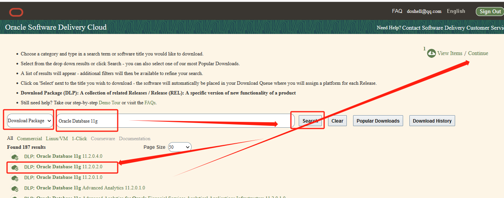
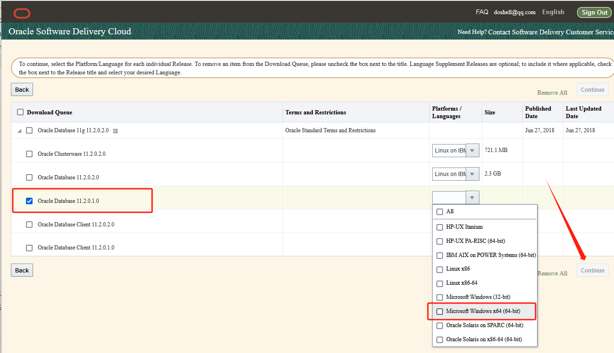
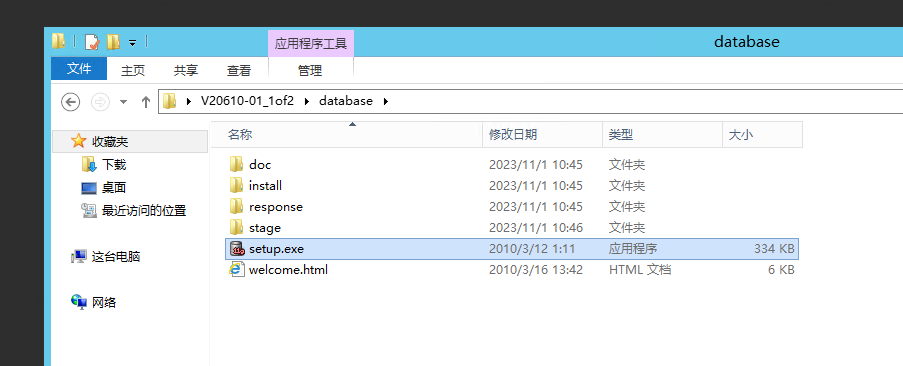

# windows server 2012 r2 安装oracle 11g

下载地址：  
[https://edelivery.oracle.com/osdc/faces/SoftwareDelivery](https://edelivery.oracle.com/osdc/faces/SoftwareDelivery)

​​​

​​

​

将两个压缩文件解压并合并，执行setup.exe

​​

Windows下部署完成ORACLE 11g R2以后，一共产生7项服务，分别为：

* OracleServiceSID(必须启动)  
  该服务启动系统标识符为SID的数据库实例，其中SID是安装Oracle时输入的数据库名称。  
  数据库服务(数据库实例)，是Oracle核心服务该服务，是数据库启动的基础，只有该服务启动，Oracle数据库才能正常启动。

* OracleHOME_NAMETNSListener  
  该服务启动数据库服务器的监听器，监听器接受来自客户端应用程序的连接请求。服务只有在数据库需要远程访问的时候才需要。(非必须启动)。  
  若监听器未启动，则客户端将无法连接到数据库服务器

* OracleDBConsoleSID(非必须启动)  
  Oracle数据库控制台服务，SID是Oracle的实例标识，默认的实例为orcl。在运行Enterprise Manager(企业管理器OEM，浏览器管理界面)的时候，需要启动这个服务。(非必须启动)

* Oracle ORCL VSS Writer Service  
  Oracle卷映射拷贝写入服务，VSS(Volume Shadow Copy Service)能够让存储基础设备(比如磁盘，阵列等)创建高保真的时间点映像，即映射拷贝(shadow copy)。它可以在多卷或者单个卷上创建映射拷贝，同时不会影响到系统的系统能。(非必须启动)

* OracleJobSchedulerORCL  
  Oracle作业调度(定时器)服务，ORCL是Oracle实例标识。(非必须启动)

* OracleMTSRecoveryService  
  服务端控制。该服务允许数据库充当一个微软事务服务器MTS、COM/COM+对象和分布式环境下的事务的资源管理器。(非必须启动)

* OracleOraDb11g_home1ClrAgent  
  Oracle数据库.NET扩展服务的一部分。 (非必须启动)

‍
