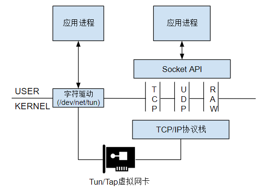
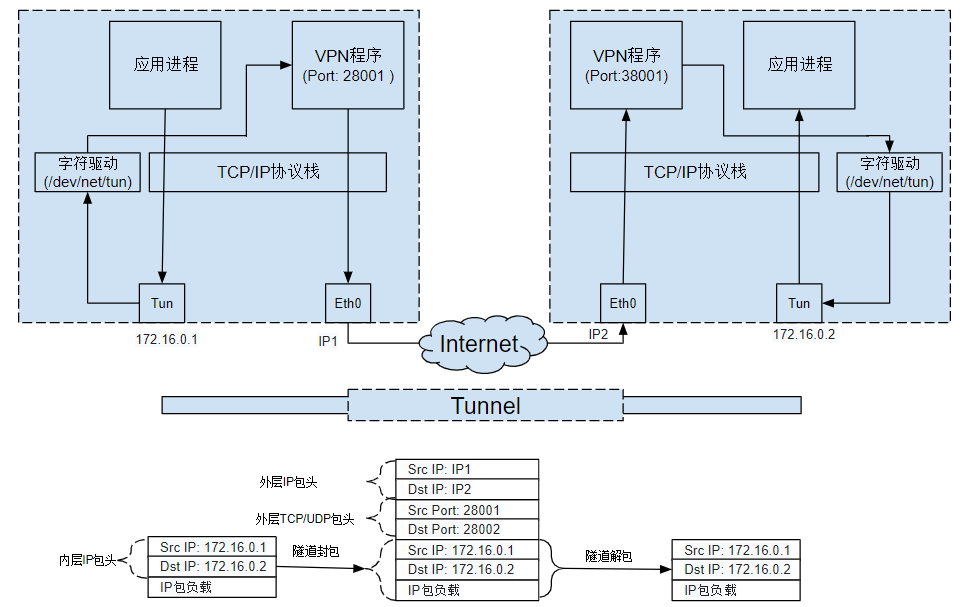
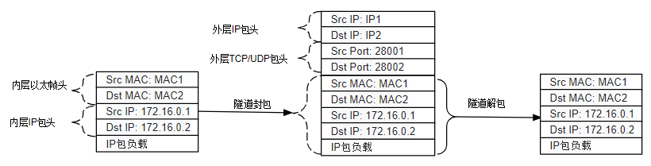
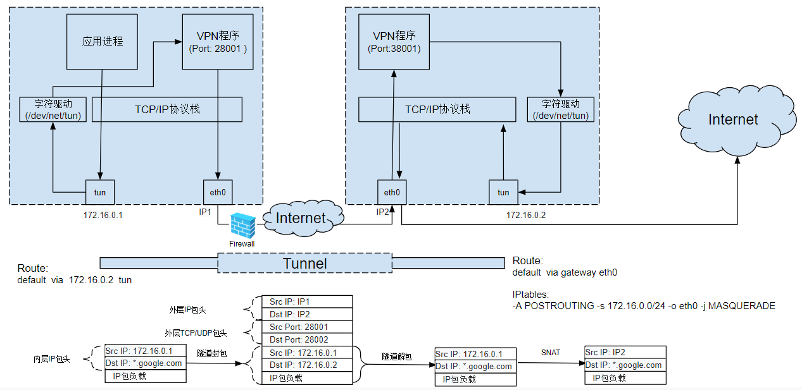
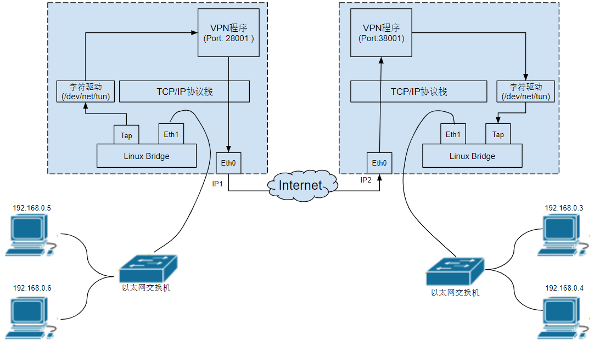
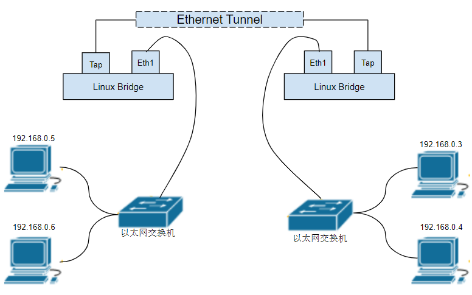

# TUN-TAP

# 什么是Tun/Tap

在计算机网络中，TUN与TAP是操作系统内核中的虚拟网络设备。不同于普通靠硬件网路板卡实现的设备，这些虚拟的网络设备全部用软件实现，并向运行于操作系统上的软件提供与硬件的网络设备完全相同的功能。

TAP等同于一个以太网设备，它操作第二层数据包如以太网数据帧。TUN模拟了网络层设备，操作第三层数据包比如IP数据封包。

操作系统通过TUN/TAP设备向绑定该设备的用户空间的程序发送数据，反之，用户空间的程序也可以像操作硬件网络设备那样，通过TUN/TAP设备发送数据。在后种情况下，TUN/TAP设备向操作系统的网络栈投递（或“注入”）数据包，从而模拟从外部接受数据的过程。

# 虚拟网卡和物理网卡的对比

和物理网卡对比一下，物理网卡是硬件网卡，它位于硬件层，虚拟网卡则可以看作是用户空间的网卡，就像用户空间的文件系统 (fuse) 一样。  
物理网卡和虚拟网卡唯一的不同点在于物理网卡本身的硬件功能：物理网卡以比特流的方式传输数据。  
也就是说，内核会公平对待物理网卡和虚拟网卡，物理网卡能做的配置，虚拟网卡也能做。比如可以为虚拟网卡接口配置 IP 地址、设置子网掩码，可以将虚拟网卡接入网桥等等。  
只有在数据流经物理网卡和虚拟网卡的那一刻，才会体现出它们的不同，即传输数据的方式不同：物理网卡以比特流的方式传输数据，虚拟网卡则直接在内存中拷贝数据 (即，在内核之间和读写虚拟网卡的程序之间传输)。  
正因为虚拟网卡不具备物理网卡以比特流方式传输数据的硬件功能，所以，绝不可能通过虚拟网卡向外界发送数据，外界数据也不可能直接发送到虚拟网卡上。能够直接收发外界数据的，只能是物理设备。

虽然虚拟网卡无法将数据传输到外界网络，但却：

1. 可以将数据传输到本机的另一个网卡 (虚拟网卡或物理网卡) 或其它虚拟设备 (如虚拟交换机) 上
2. 可以在用户空间运行一个可读写虚拟网卡的程序，该程序可将流经虚拟网卡的数据包进行处理，这个用户程序就像是物理网卡的硬件功能一样，可以收发数据 (可将物理网卡的硬件功能看作是嵌入在网卡上的程序)，比如 OpenVPN 就是这样的工具

很多人会误解这样的用户空间程序，认为它们可以对数据进行封装。比如认为 OpenVPN 可以在数据包的基础上再封装一层隧道 IP 首部，但这种理解是错的。

一定请注意，用户空间的程序是无法对数据包做任何封装和解封操作的，所有的封装和解封都只能由内核的网络协议栈来完成。

# tun 或 tap 的区别

tun 和 tap 都是虚拟网卡设备，但是：

* tun 是三层设备，其封装的外层是 IP 头
* tap 是二层设备，其封装的外层是以太网帧 (frame) 头
* tun 是 PPP 点对点设备，没有 MAC 地址
* tap 是以太网设备，有 MAC 地址
* tap 比 tun 更接近于物理网卡，可以认为，tap 设备等价于去掉了硬件功能的物理网卡

这意味着，如果提供了用户空间的程序去收发 tun/tap 虚拟网卡的数据，所收发的内容是不同的：

* 收发 tun 设备的用户程序，只能间接提供封装和解封数据包的 IP 头的功能
* 收发 tap 设备的用户程序，只能间接提供封装和解封数据包的帧头的功能
* 注意，此处用词是【收发数据】而非【处理数据】，是【间接提供】而非【直接提供】，因为在不绕过内核网络协议栈的情况下，读写虚拟网卡的用户程序是不能封装和解封数据的，只有内核的网络协议栈才能封装和解封数据。如果不理解，请看通过 openvpn 分析 tun 实现隧道的数据流程

前面说过，虚拟网卡的两个主要功能是：

* 连接其它设备 (虚拟网卡或物理网卡) 和虚拟交换机 (bridge)
* 提供用户空间程序去收发虚拟网卡上的数据

基于这两个功能，tap 设备通常用来连接其它网络设备 (它更像网卡)，tun 设备通常用来结合用户空间程序实现再次封装。换句话说，tap 设备通常接入到虚拟交换机 (bridge) 上作为局域网的一个节点，tun 设备通常用来实现三层的 ip 隧道。

‍

# 创建并使用 tun/tap 设备

使用命令创建 tun、tap 设备的方式有多种，比如 openvpn --mktun、ip tuntap、tunctl 等。

```bash
$ openvpn --mktun --dev tun0
$ openvpn --mktun --dev tap0

$ ip tuntap add dev tun0 mode tun
$ ip tuntap add dev tap0 mode tap

$ tunctl -t tap0      # 默认创建tap设备
$ tunctl -n -t tap0
```

可使用 ifconfig 等工具查看这些虚拟网络设备。

```bash
$ ifconfig -a
# 注意tap0是以太网设备，具有MAC地址
tap0: flags=4098<BROADCAST,MULTICAST>  mtu 1500
   ether 0e:38:5b:10:e9:1c  txqueuelen 1000  (Ethernet)
......

# 注意tun0是POINTOPOINT设备，没有MAC地址
tun0: flags=4241<UP,POINTOPOINT,NOARP,MULTICAST>  mtu 1500
   inet 10.10.10.10  netmask 255.255.255.255  destination 10.10.10.10
   unspec 00-00-00-00-00-00-00-00-00-00-00-00-00-00-00-00  txqueuelen 500  (UNSPEC)
......
```

可以为 tun/tap 分配 IP 地址或配置其它属性，例如：

```bash
ifconfig tun0 10.0.0.33 up

# 或者
ip link set tun0 up
ip addr add 10.0.0.33/24 dev tun0
```

# 应用程序如何操作Tun/Tap

Linux Tun/Tap驱动程序为应用程序提供了两种交互方式：虚拟网络接口和字符设备/dev/net/tun。写入字符设备/dev/net/tun的数据会发送到虚拟网络接口中；发送到虚拟网络接口中的数据也会出现在该字符设备上。

应用程序可以通过标准的Socket  API向Tun/Tap接口发送IP数据包，就好像对一个真实的网卡进行操作一样。除了应用程序以外，操作系统也会根据TCP/IP协议栈的处理向Tun/Tap接口发送IP数据包或者以太网数据包，例如ARP或者ICMP数据包。Tun/Tap驱动程序会将Tun/Tap接口收到的数据包原样写入到/dev/net/tun字符设备上，处理Tun/Tap数据的应用程序如VPN程序可以从该设备上读取到数据包，以进行相应处理。

应用程序也可以通过/dev/net/tun字符设备写入数据包，这种情况下该字符设备上写入的数据包会被发送到Tun/Tap虚拟接口上，进入操作系统的TCP/IP协议栈进行相应处理，就像从物理网卡进入操作系统的数据一样。

Tun虚拟设备和物理网卡的区别是Tun虚拟设备是IP层设备，从/dev/net/tun字符设备上读取的是IP数据包，写入的也只能是IP数据包，因此不能进行二层操作，如发送ARP请求和以太网广播。与之相对的是，Tap虚拟设备是以太网设备，处理的是二层以太网数据帧，从/dev/net/tun字符设备上读取的是以太网数据帧，写入的也只能是以太网数据帧。从这点来看，Tap虚拟设备和真实的物理网卡的能力更接近。

下图描述了Tap/Tun的工作原理：    ​

# 使用Tun/Tap创建点对点隧道

通过应用程序从/dev/net/tun字符设备中读取或者写入数据看上去并没有太大用处，但通过将Tun/Tap结合物理网络设备使用,我们可以创建一个点对点的隧道。如下图所示，左边主机上应用程序发送到Tun虚拟设备上的IP数据包被VPN程序通过字符设备接收，然后再通过一个TCP或者UDP隧道发送到右端的VPN服务器上，VPN服务器将隧道负载中的原始IP数据包写入字符设备，这些IP包就会出现在右侧的Tun虚拟设备上，最后通过操作系统协议栈和socket接口发送到右侧的应用程序上。

​​

上图中的隧道也可以采用Tap虚拟设备实现。使用Tap的话，隧道的负载将是以太数据帧而不是IP数据包，而且还会传递ARP等广播数据包。    ​

# 使用Tun/Tap隧道绕过防火墙

结合路由规则和IPTables规则，可以将VPN服务器端的主机作为连接外部网络的网关，以绕过防火墙对客户端的一些外部网络访问限制。如下图所示，防火墙规则允许客户端访问主机IP2，而禁止访问其他Internet上的节点。通过采用Tun隧道，从防火墙角度只能看到被封装后的数据包，因此防火墙认为客户端只是在访问IP2，会对数据进行放行。而VPN服务端在解包得到真实的访问目的后，会通过路由规则和IPTables规则将请求转发到真正的访问目的地上，然后再将真实目的地的响应IP数据包封装进隧道后原路返回给客户端，从而达到绕过防火墙限制的目的。    ​

# 使用Tap隧道桥接两个远程站点

如下图所示，可以使用tap建立二层隧道将两个远程站点桥接起来，组成一个局域网。对于两边站点中的主机来说，访问对方站点的主机和本地站点的主机的方式没有区别，都处于一个局域网192.168.0.0/24中。

VPN主机上有两个物理网卡，其中Eth0用于和对方站点的VPN主机进行通信，建立隧道。Eth1在通过网线连接到以太网交换机的同时也被则加入了Linux  Bridge，这相当于用一条网线将Linux  Bridge上的一个端口（Eth1）连接到了本地站点的以太网交换机上，Eth1上收到的所有数据包都会被发送到Linux  Bridge上，Linux Bridge发给Eth1的数据包也会被发送到以太网交换机上。Linux  Bridge上还有一个Tap虚拟网卡，用于VPN程序接收从Linux Bridge上收到的数据包。

​​

假设192.168.0.5发出了一个对192.168.0.3的ARP请求，该ARP请求在网络中经过的路径如下：

1. 192.168.0.5发出ARP请求，询问192.168.0.3的MAC地址。
2. 该ARP请求将被发送到以太网交换机上。
3. 以太网交换机对该请求进行泛洪，发送到其包括Eth1在内的所有端口上。
4. 由于Eth1被加入了VPN主机上的Linux Bridge，因此Linux Bridge收到该ARP请求。
5. Linux Bridge对该ARP请求进行泛洪，发送到连到其上面的Tap虚拟网卡上。
6. VPN程序通过/dev/net/tun字符设备读取到该ARP请求，然后封装到TCP/UDP包中，发送到对端站点的VPN主机。
7. 对端站点的VPN程序通过监听TCP/UDP端口接收到封装的ARP请求，将ARP请求通过/dev/net/tun字符设备写入到Tap设备中。
8. Linux Bridge泛洪，将ARP请求发送往Eth1，由于Eth1连接到了以太网交换机上，以太网交换机接收到了该ARP请求。
9. 以太网交换机进行泛洪，将ARP请求发送给了包括192.168.0.3的所有主机。
10. 192.168.0.3收到了APR请求，判断iP地址和自己相同，对此请求进行响应。
11. 同理，ARP响应包也可以按照该路径返回到图左边包括192.168.0.5在内的站点中。

从站点主机的角度来看，上面图中两个VPN主机之间的远程连接可以看作一条虚拟的网线，这条网线将两个Linux Bridge连接起来。这两个Linux Bridge和两个以太网交换机一起将左右两个站点的主机连接在一起，形成了一个局域网。    ​

‍
