# Vxlan技术

## 一、Vxlan介绍

VXLAN（Virtual eXtensible Local Area Network，虚拟扩展局域网）， [RFC7348](http://link.zhihu.com/?target=https%3A//datatracker.ietf.org/doc/rfc7348/)是由IETF定义的NVO3（Network Virtualization over Layer 3）标准技术之一，（还有NVGRE、STT等技术） 是对传统VLAN协议的一种扩展。VXLAN的特点是将L2的以太帧封装到UDP报文（即L2 over L4）中，并在L3网络中传输。

VXLAN本质上是一种隧道技术，在源网络设备与目的网络设备之间的IP网络上，建立一条逻辑隧道，将用户侧报文经过特定的封装后通过这条隧道转发。从用户的角度来看，接入网络的服务器就像是连接到了一个虚拟的二层交换机的不同端口上，可以方便地进行二层通信。

已经是事实上的网络虚拟化标准，公有云（阿里云、华为云、AWS等）的VPC大多数都是用VXLAN来作为数据转发层面。不止在虚拟化环境，还有园区网络、运营商网络也开始使用。(灵活的二层接入、二层VPN隧道)。

VXLAN已经成为当前构建数据中心的主流技术，是因为它能很好地满足数据中心里虚拟机动态迁移和多租户等需求。

## 1.1 为什么需要Vxlan

- **vlan的数量限制**

VLAN作为传统的网络隔离技术，在标准定义中VLAN的数量只有4096个，无法满足大型数据中心的需求。VXLAN完美地弥补了VLAN的上述不足，一方面通过VXLAN中的24比特VNI字段提供多达**16M**租户的标识能力，远大于VLAN的4096；另一方面，VXLAN本质上在两台交换机之间构建了一条穿越数据中心基础IP网络的虚拟隧道，将数据中心网络虚拟成一个巨型二层交换机.

- **物理网络基础设施的限制**

VXLAN允许虚拟机在不同的子网中进行通信。它通过使用UDP封装虚拟机数据包来实现跨子网的通信，因此可以在不同的物理网络之间进行通信。

- **多租户场景**

VXLAN通过将不同虚拟网络的流量隔离，从而实现多租户隔离。每个虚拟网络都有一个唯一的VNI，这样可以确保虚拟机之间的流量不会相互干扰。

## 1.2 VXLAN报文格式

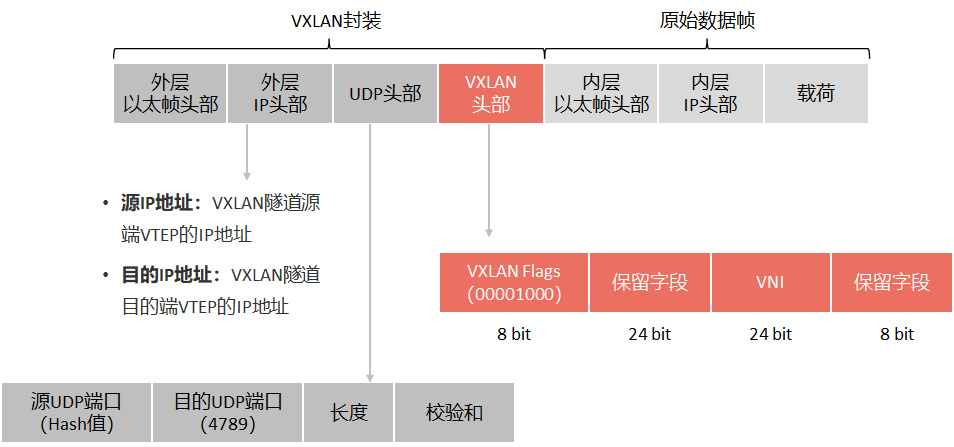

- VXLAN报文的封装格式为在原始二层数据帧外添加如下信息共计50字节

  - 14字节外层以太帧头部
  - 20字节外层IP头
  - 8字节UDP头，其中UDP头的目的端口号为VXLAN的UDP端口号（缺省为4789）
  - 8字节的Vxlan头部

  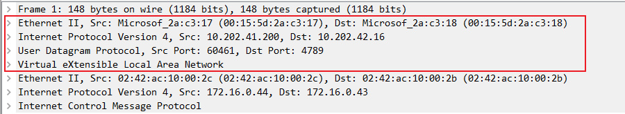
- 具体来说，原始报文在封装过程中先被添加一个VXLAN帧头，再被封装在UDP报头中，并使用承载网络的IP、MAC地址作为外层头进行封装。VXLAN帧头中包括，8字节为64比特，一比特为1位二进制码

  - VXLAN Flags（标记位，8比特，取值为00001000）
  - Group ID（用户组ID，16比特）
  - VNI（VXLAN网络标识，用于区分VXLAN段，由24比特组成，支持多达16M的租户）
  - Reserved（保留未用，分别由8比特和8比特组成，设置为0）等字段。

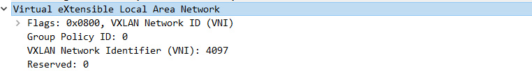

## 1.3 基本概念

### 1.NVE

NVE（Network Virtualization Edge，网络虚拟边缘）在VXLAN网络中，NVE是指支持VXLAN封装和解封装的设备，主要用于将虚拟机的数据包封装成VXLAN格式的数据包并发送到VXLAN网络中，同时还可以解封装来自VXLAN网络的数据包并转发到相应的虚拟机中。NVE可以是物理交换机、路由器、虚拟交换机等设备，其主要作用是实现虚拟化网络的隔离和互通。

- NVE在三层网络上构建二层虚拟网络，是运行VXLAN的设备。图中SW1和SW2都是NVE。

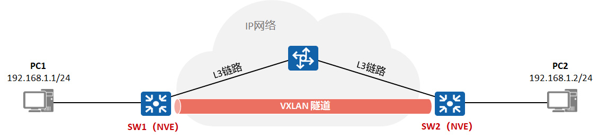

### 2.VTEP

VTEP（VXLAN Tunnel Endpoints，VXLAN隧道端点）：

- VTEP是VXLAN隧道端点，位于NVE中，用于VXLAN报文的封装和解封装。
- VXLAN报文（其外层IP头部）中源IP地址为源端VTEP的IP地址，目的IP地址为目的端VTEP的IP地址。

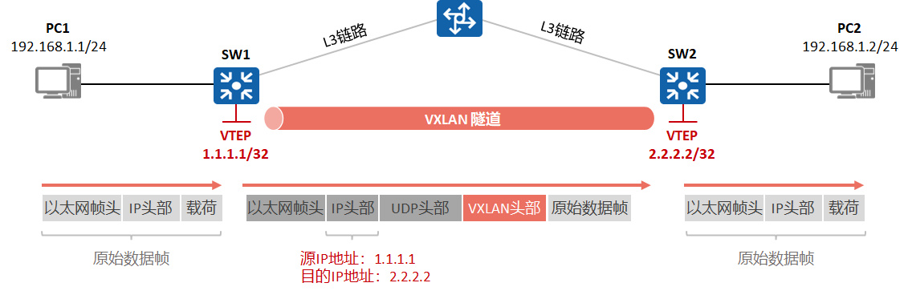

1. 一对VTEP地址就对应着一条VXLAN隧道。
2. 在源端封装报文后通过隧道向目的端VTEP发送封装报文，目的端VTEP对接收到的封装报文进行解封装。
3. 通常情况下使用设备的Loopback接口地址作为VTEP地址。

**NVE与VTEP的区别**

- NVE（Network Virtualization Edge）是网络虚拟边缘节点，实现网络虚拟化功能的网络实体。它负责封装和解封装VXLAN报文。设备和服务器上的虚拟交换机VSwitch都可以作为NVE。
- VTEP（VXLAN Tunnel Endpoints）是VXLAN隧道端点，封装在NVE中，用于VXLAN报文的封装和解封装。VTEP与物理网络相连，分配有物理网络的IP地址，该地址与虚拟网络无关。VXLAN报文中源IP地址为本节点的VTEP地址，VXLAN报文中目的IP地址为对端节点的VTEP地址，一对VTEP地址就对应着一个VXLAN隧道。

**简单来说，NVE是一个更广泛的概念，它指实现网络虚拟化功能的网络实体。而VTEP是NVE中的一个组件，负责封装和解封装VXLAN报文。**

### 3.VNI与BD

VNI（VXLAN Network Identifier，VXLAN网络标识）：

- 类似VLAN ID，用于区分VXLAN段。不同VXLAN段的虚拟机不能直接二层相互通信。
- 一个租户可以有一个或多个VNI，VNI长度为24bit，支持多达16M的租户。

BD（Bridge Domain，桥域）：

- 类似传统网络中采用VLAN划分广播域，在VXLAN网络中一个BD就标识一个大二层广播域。
- VNI以1:1方式映射到广播域BD，同一个BD内的终端可以进行二层互通。

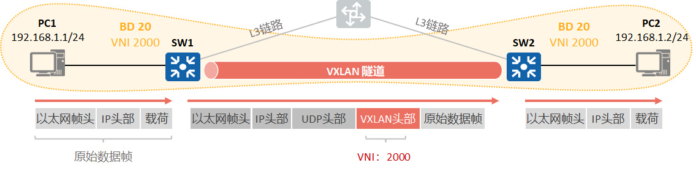

### 4.VAP

VAP（Virtual Access Point，虚拟接入点）：

- 实现VXLAN的业务接入。
- VAP有两种配置方式，二层子接口方式或者VLAN绑定方式：

> 二层子接口方式接入，例如在SW1创建二层子接口关联BD 10，则这个子接口下的特定流量会被注入到BD 10。
>
> VLAN绑定方式接入，例如在SW2配置VLAN 10与广播域BD 10关联，则所有VLAN10的流量会被注入到BD 10。

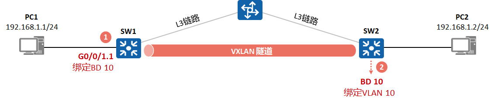

传统网络的流量进入VXLAN网络之后，通过二层子接口或者VLAN绑定的方式，与BD进行绑定，在BD中会指定VXLAN VNI，实现从传统的VLAN网络到VXLAN网络的映射。

### 5.Border与Edge

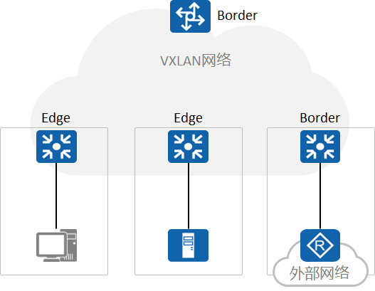

- Edge：VXLAN网络的边缘接入设备，传统网络的流量由此进入VXLAN网络。
- Border：VXLAN网络和外部网络通信的节点，用于外部流量进入VXLAN网络或VXLAN内部流量访问外部，一般连接具有三层转发能力的设备（如Router、Firewall）。

### 6.VXLAN二层网关、三层网关

**二层网关**

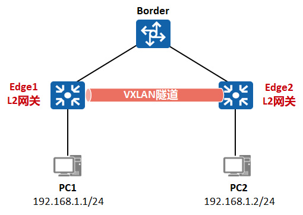

- 二层（L2）网关：实现流量进入VXLAN网络，也可用于同一VXLAN网络内终端的同子网通信。

**三层网关**

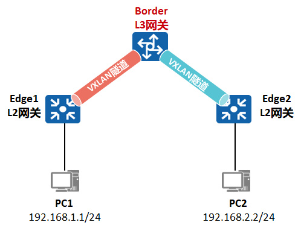

- 三层（L3）网关：用于VXLAN网络内终端的跨子网通信以及终端对外部网络（非VXLAN网络）的访问。
- 也用于跨VXLAN VNI访问

### 7.VBDIF

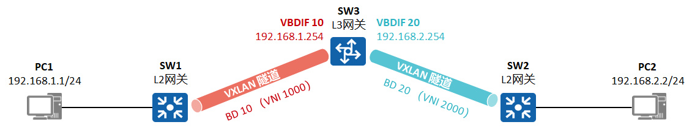

- 类似于传统网络中采用VLANIF实现不同广播域互通，在VXLAN中引入了VBDIF的概念。
- VBDIF接口在VXLAN三层网关上配置，是基于BD创建的三层逻辑接口。
- 通过VBDIF接口可实现不同网段的用户通过VXLAN网络通信，及VXLAN网络和非VXLAN网络间的通信，也可实现二层网络接入三层网络。

### 8.分布式与集中式网关

**集中式网关**

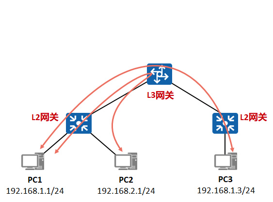

L3网关部署在一台设备上，所有跨子网的流量都通过该设备转发，实现流量的集中管理。

- 优点：跨子网流量集中管理，简化网关部署和管理。
- 缺点：转发路径并非最优。ARP表项规格瓶颈：由于采用集中式网关，网关上需要维护大量通过VXLAN接入网络的终端其ARP。

**分布式网关**

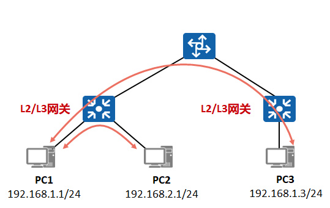

VTEP设备既是L2网关，又是L3网关。非网关节点对VXLAN隧道不感知，仅作为VXLAN报文的转发节点。

- 优点：VTEP节点只学习连接在本节点下终端的ARP表项，解决了集中式三层网关带来的ARP表项瓶颈问题，网络规模扩展能力强。
- 缺点：相对集中式部署配置、实现复杂，部署工程量大。

## 二、Vxlan示例

## 2.1 centos实现跨主机vxlan

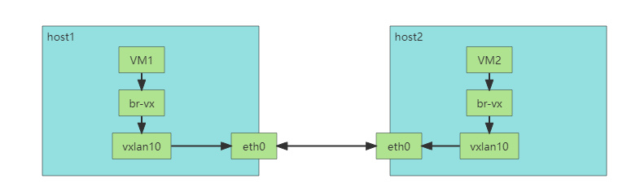

**环境说明：**

有2台服务器，eth0为这2台服务器的网卡，vxlan10是创建的虚拟vxlan接口，br-vx是一个桥接网卡这个网卡会接入vxlan10接口，每台服务器创建一个虚拟网卡接入连接桥接网卡

**配置过程说明：**

host1

```bash
#创建桥接网卡并使其up
brctl addbr br-vx
ip link set br-vx up
#增加一个类型为vxlan,vni-id为100的，名字为vxlan10的虚拟网卡，指明对端地址
ip link add vxlan10 type vxlan id 100 remote 10.202.42.16 dstport 4789 dev eth0
ip link set vxlan10 up 
#把网桥桥接到vxlan10
brctl addif br-vx vxlan10
#添加虚拟网卡
ip link add type veth  
ifconfig veth0 192.168.10.1/24 up  
ifconfig veth0 mtu 1450  
ifconfig veth1 up  
ifconfig veth1 mtu 1450  
brctl addif br-vx veth1
#测试
ping 192.168.10.2
#抓包
tcpdump udp port 4789
```

host2

```bash
#创建桥接网卡并使其up
brctl addbr br-vx
ip link set br-vx up
#增加一个类型为vxlan,vni-id为100的，名字为vxlan10的虚拟网卡，指明对端地址
ip link add vxlan10 type vxlan id 100 remote 10.202.41.200 dstport 4789 dev eth0
ip link set vxlan10 up 
#把网桥桥接到vxlan10
brctl addif br-vx vxlan10
#添加虚拟网卡
ip link add type veth  
ifconfig veth0 192.168.10.2/24 up  
ifconfig veth0 mtu 1450  
ifconfig veth1 up  
ifconfig veth1 mtu 1450  
brctl addif br-vx veth1
#测试
ping 192.168.10.1
#抓包
tcpdump udp port 4789
```

标题：Vxlan技术  
作者：[Carey](HTTPS://zhangzhuo.ltd)  
地址：[HTTPS://zhangzhuo.ltd/articles/2023/08/01/1690868960648.html](HTTPS://zhangzhuo.ltd/articles/2023/08/01/1690868960648.html)
