# IP-网际互连协议

## **一、IP地址的概念**

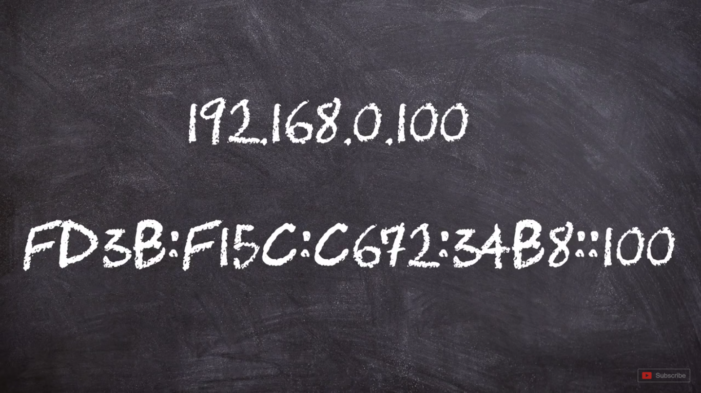​

IPv4与IPv6

IP 地址可以分成两种不同的形式，分别为 IPv4 和 IPv6。它们看起来截然不同，**同时 IPv6 属于比较新的 IP 技术，** 暂未普及。而 IPv4 是我们最常见的地址形式，因此，本章节主要围绕 IPv4 展开讲解。

### 1.IPv4

首先，IPv4 地址是一段由四组数字组成的整体，每组数字中间使用**点**来隔开，每组数字我们又称其为八位字节，原因是，我们把每组数字都以八位形式的二进制来表示，例如 0 = 0000 0000、255 = 1111 1111 等而因为它由四组数字组成，因此我们可以将其分成四组独立的八位字节。例如下面这个IP地址，如果使用八位二进制数来表示，则为：

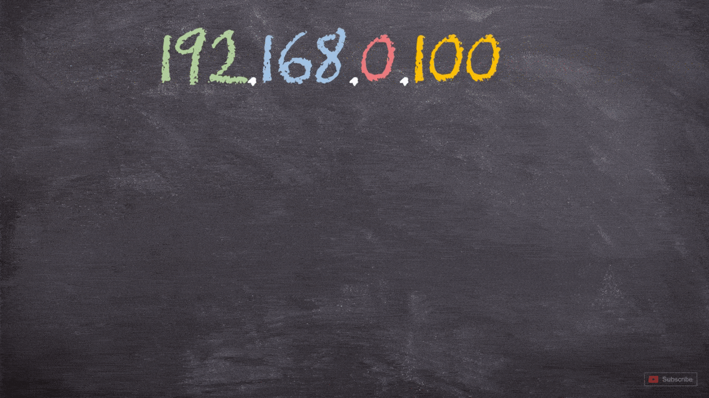​

IP 地址的四组数字均是由从 0~255 的数字组成，不可超过这个范围，其二进制数表示形式为：00000000~11111111。因此一个正确的 IP 地址除了可以使用阿拉伯数字表示，同样可以采用二进制数表示。

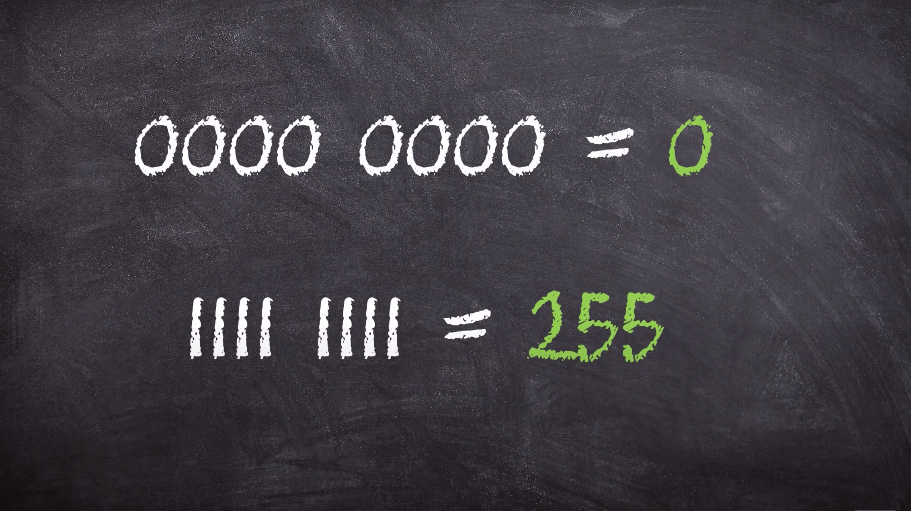​

而 00000000~11111111 或 0~255 这个地址范围，我们称其为 IP 空间。由此可见，二进制数据对于 IP 地址寻址的重要性，我们要学会简单的十进制与二进制数字的转换，这是为了方便后续的学习。

​

IP 地址可以代表 「两个地址」 ，一个是 Host Address 也就是主机地址，另一个是 Network Address 也就是网络地址，这是怎么回事儿呢？

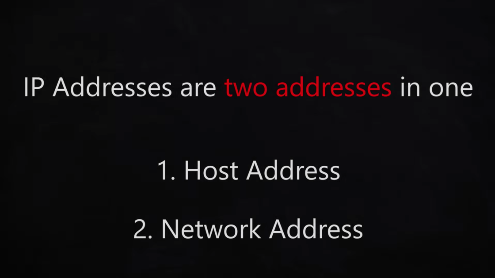​

这里，我们拿 172.16.0.1 这个IP地址举例：其中 172.16 是网络地址，而后面的 0.1 是主机地址，参考下图可以理解各个部分的含义。

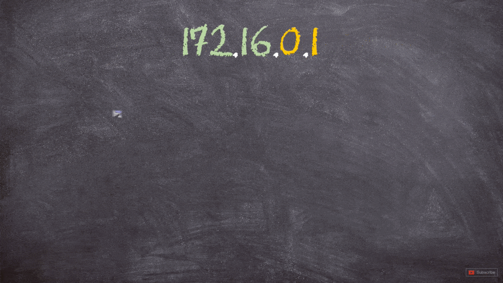​

观察上图，我们可以发现，左侧以 172.16 开头的主机在同一个网络中，右侧以 172.17 开头的主机在另一个网络中。这是两个不同的网络，它们之间不能直接进行沟通！但是在同一网络中的设备可以进行通信，如果你有新的设备加入，只需要将地址设置为 172.16 或 172.17 即可。如果想要实现两个网段之间的通信，则需要借助路由器来实现。

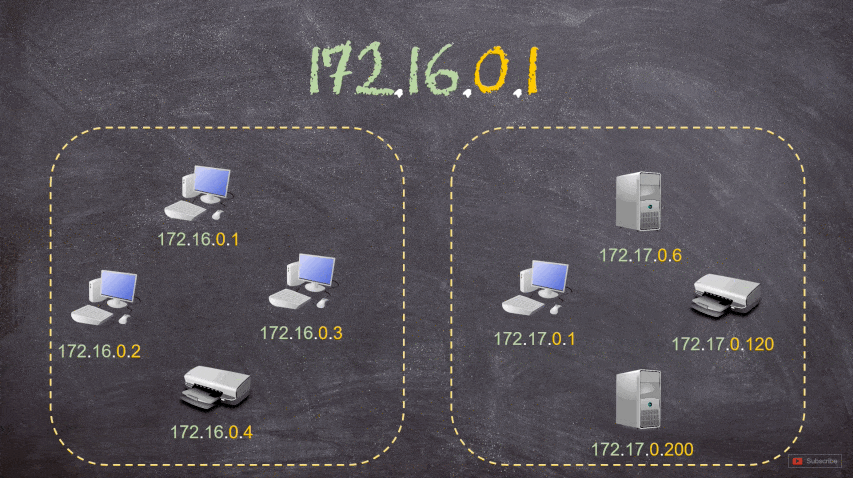​

## 二、 类网络 Classful Networks

你可能想知道，IP 地址的前两个位置的数字是否总是代表网络地址呢？答案是否定的，那么问题来了，我们该怎么知道哪一部分是网络地址，哪一部分是主机地址呢？这个问题答案并不是固定的，它会根据实际情况进行变化。所以，要想深入了解这两个地址，我们就要从 IP 地址的历史开始进行追溯。

我们从 Internet 协议创立之初说起，在那个时候，IP地址的第一组数字第一个八位位组，始终代表网络地址；而随后的三个数字后三个八位位组，用于主机。

​

这意味着，我们最多只能拥有 0~255 即 256 个网络空间，每个网络空间可以拥有 1600 万台主机，这种形式的划分非常不合理！但因为 Internet 刚开始出现时并不是国际性的，只有很少的组织使用它，因此这样划分也没有什么不妥。

随着互联网的飞速发展，各个国家、各个地区都需要使用到网络空间，此时，256 个网络空间显然是不够的。因此在 1981 年时，Internet 就引入了一种全新的方法，那就是将整个 IP 空间从 A 到 E 划分成了五个类别。

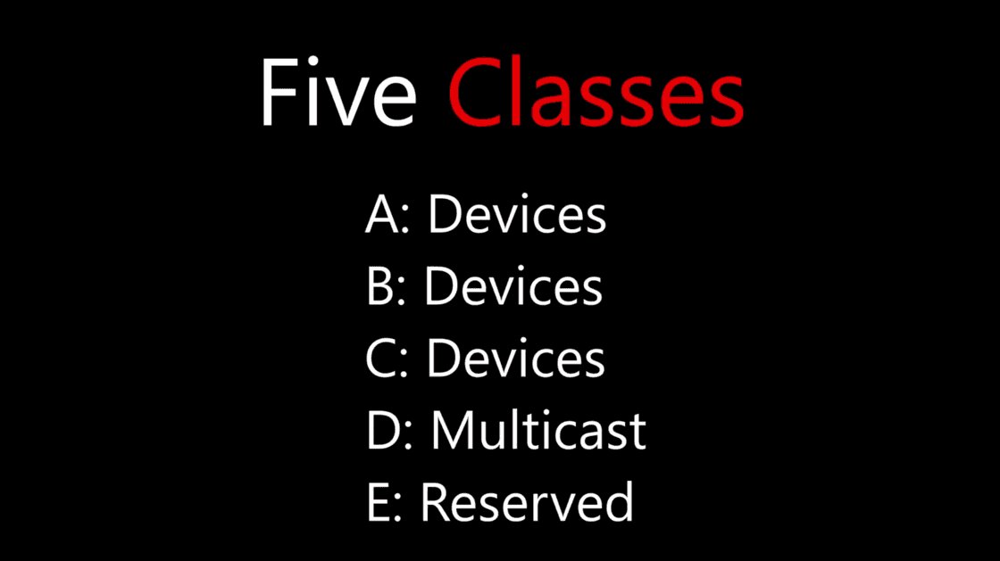​

这其中 A、B 和 C 类应用于**设备寻址**（也就是我们的电脑、打印机等设备可通过这类地址发现彼此）；D 类用于组播（源主机分发信息到多台其他机器）；E 类属于保留地址（特殊使用）。因此，A、B 和 C 类地址属于我们现在需要考虑的部分。

### 1. A类

A 类 IP 地址第一个八位位组是网络空间，后三个八位位组是地址空间；虽然拥有很少的网络空间，但是却拥有庞大的主机空间。这里需要注意的是，A 类地址八位位组中的第一位始终为 0 固定位，剩下的 7 位可供给我们进行分配，因此，我们只有 0~127 即 128 个网络空间可供分配，网络空间从 0.0.0.0 ~ 127.0.0.0。

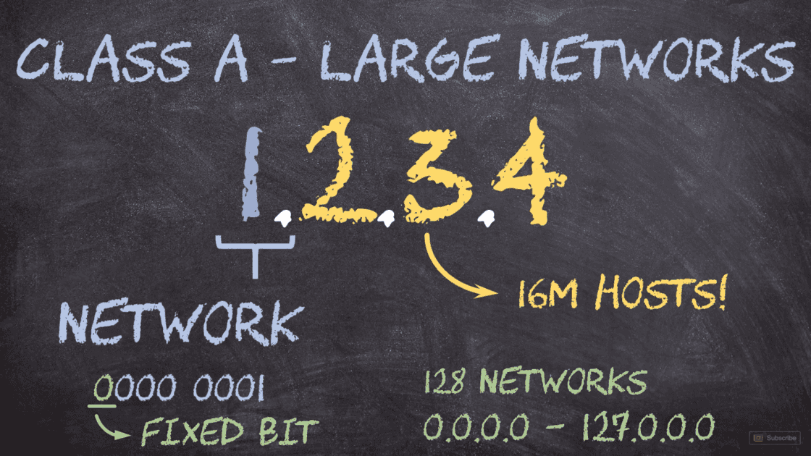​

另外，由于第一个八位位组以 0 和 127 开头的网络空间是要用作保留的，所以实际可供分配网络空间为 126 个，其网络空间IP地址为 1.0.0.0 ~ 126.0.0.0。每个空间可供分配主机为16777216 台（2的24次方=16777216）。

### 2. B类

B 类网络适用于中等数量主机的情况，前两个八位位组用于网络空间划分，后面两个则用于主机地址划分，网络的前两个位始终为 1 和 0（**10**000000）即 128，可供我们设置的有 14 位，也就是 16384 个网络空间（2 的 14 次方=16384），其网络空间 IP 为 128.0.0.0 ~ 191.255.0.0，每个网络空间可以拥有 65536 台主机（2 的 16 次方=65536）。

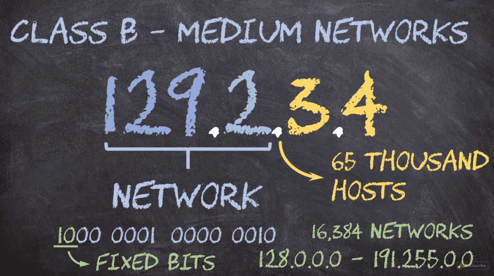​

### 3. C类

C 类网络属于小型网络，这类网络IP地址的前三个数字为网络地址，最后一个是主机地址，且第一个八位位组的前三位固定位110（**110**00000）即 192，可供我们设置的有 21 位，也就是 2097152 个网络空间（2的21次方），其网络空间 IP 为 192.0.0.0~223.255.255.0，每个网络空间可以有 256 ( 2 的 8 次方）台主机。

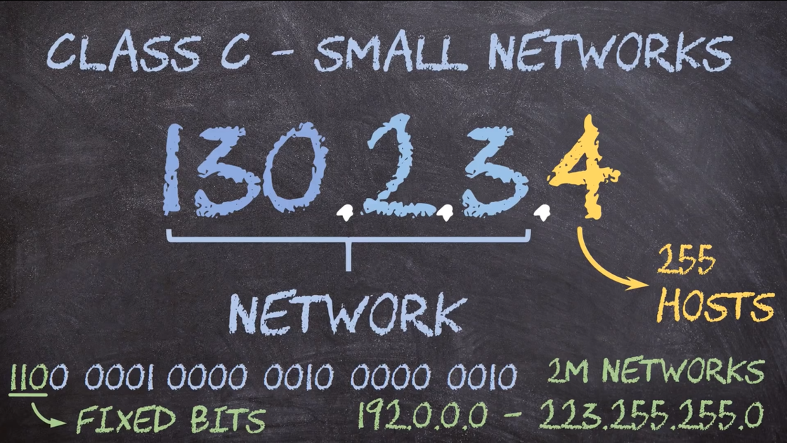​

### 4. 总结

1. A、B 和 C 类 IP 地址的网络空间范围：

    1. A 类 IP 地址：0.0.0.0 ~ 127.0.0.0
    2. B 类 IP 地址：128.0.0.0 ~ 191.255.0.0
    3. C 类 IP 地址：192.0.0.0 ~ 223.255.255.0

### 5. 小提示

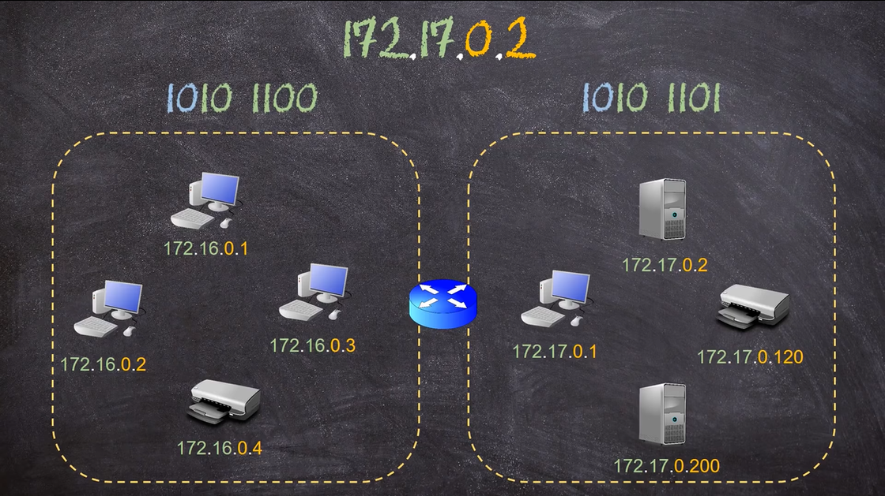​

观察上图，若 172.16 网段中的 0.1 主机想要发送信息给同网段中的 0.2 主机，0.1 主机首先就会查看 0.2 主机是否与自己在同一网段下，靠什么查看呢？

两种方式，一种是查看八位位组是否一致；另一种是查看IP地址的前两组数是否一致，若一致，则代表在同一网段，因此可以直接发送信息；

若**172.16** 网段中的 **0.1** 主机想要发送信息给 **172.17** 网段中的 **0.2** 主机，同样是根据上述方法检测，此时发现 **0.2** 主机在另一网段，因此需要借助路由器来实现信息的交互。

## 三、无类网络和子网划分

随着互联网的飞速发展，我们消耗 IP 的速度越来越快，IP 地址渐渐的又不够用了，因此，在 1993 年，引入了一种新的方法，称为无类别域间路由（Classless Inter-Domain Routing）简称 CIDR。

以前我们通过查看IP的前几位来识别 IP 地址类别，知道该 IP 类别后，我们就直到了 IP 中的哪一部分用于网络，哪一部分用于主机；但是现在，我们需要引入一种全新的概念——**子网划分**。

### 1. 子网掩码

子网掩码同样由 4 个八位位组组成，与 IP 地址如出一辙；如图，255.255.0.0 就是 172.16.3.4 的子网掩码。

​

子网掩码的每一位都与 IP 地址对齐，例如 172 与第一个 255 对齐，16 与第二个 255 对齐，通过图中我们可以发现，子网掩码设置为 255 的位，即为网络地址，设置位 0 的位，即为主机地址。

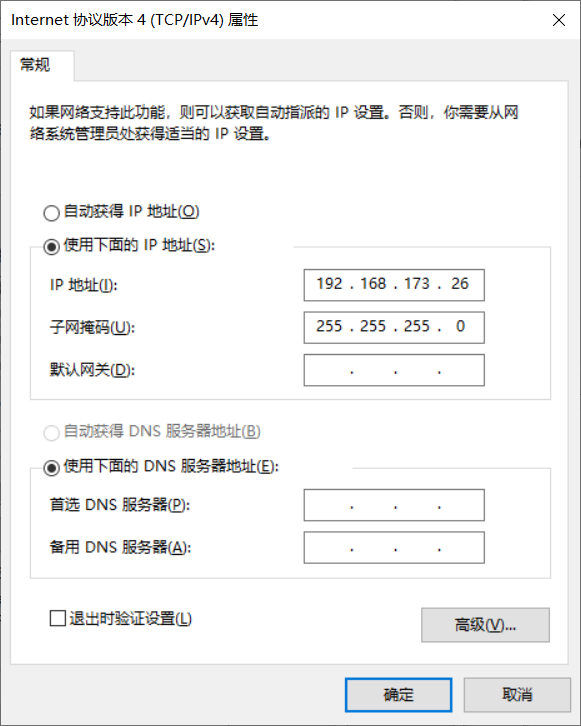

此时，我相信很多读者突然恍然大明白了，原来我们在自己电脑上设置IP地址信息时的子网掩码是这个意思呀，有了这样一个概念，我们就可以通过子网掩码很快的得知 IP 地址属于哪一类网络。

若子网掩码设置为 255.0.0.0 则为 A 类网络；255.255.0.0 则为 B 类网络；255.255.255.0 则为 C 类网络，So Easy~

此时，大家可能会说，就这？我们的问题是IP地址不够用的问题，你这不是说了个寂寞吗？仅仅能分辨 IP 地址类别有个卵用？

别急，接下来，咱们就看一下 CIDR 的真正强大之处。

### 2. 子网划分

((20240410181354-grhn3wh '一篇全文让你彻底理清IP地址、子网掩码、网关'))

‍
