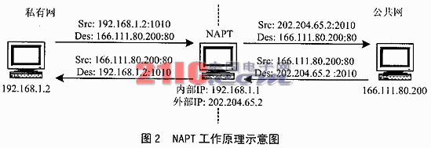
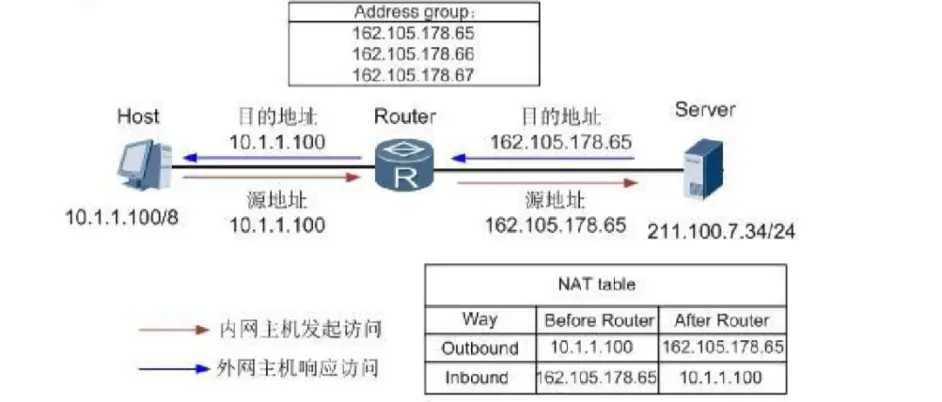

# NAT-地址转化协议

　　NAT  Network Address Translation，网络地址转换

　　众所周知，IPv4的公网IP地址已经枯竭，但是需要接入互联网的设备还在不断增加，这其中NAT就发挥了很大的作用（此处不讨论IPv6）。NAT服务器提供了一组私有的IP地址池（10.0.0.0/8、172.16.0.0/12、192.168.0.0/16），使得连接该NAT服务器的设备能够获得一个私有的IP地址（也称局域网IP/内网IP），当设备需要连接互联网的时候，NAT服务器将该设备的私有IP转换成可以在互联网上路由的公网IP（全球唯一）。NAT的实现方式有很多种，这里我们主要介绍三种：**静态NAT**、**动态NAT**和网络地址端口转换（**NAPT**）。

* 静态 NAT

　　静态NAT：LVS的官方文档中也称为(N-to-N mapping)  ，前面的 N 指的是局域网中需要联网的设备数量，后面的 N 指的是该 NAT 服务器所拥有的公网IP的数量。既然数量相等，那么就可以实现静态转换，即一个设备对应一个公网IP，这时候的NAT服务器只需要维护一张静态的NAT映射转换表。

​​

* 动态 NAT

　　动态NAT：LVS的官方文档中也称为(M-to-N mapping)  ，注意这时候的 M>N，也就是说局域网中需要联网的设备数量多于 NAT 服务器拥有的公网IP数量，这时候就需要由NAT服务器来实现动态的转换，这样每个内网设备访问公网的时候使用的公网IP就不一定是同一个IP。

​​

* NAPT 重载

　　NAT虽然名为网络地址转换，但是常见的工作模式实际上是NAPT(网络地址端口转换)。这种方式支持端口的映射，并允许多台主机共享一个公网IP地址。 支持端口转换的NAT又可以分为两类：源地址转换和目的地址转换。前一种情形下发起连接的计算机的IP地址将会被重写，使得内网主机发出的数据包能够到达外网主机。后一种情况下被连接计算机的IP地址将被重写，使得外网主机发出的数据包能够到达内网主机。实际上，以上两种方式通常会一起被使用以支持双向通信。NAPT维护一个带有IP以及端口号的NAT表

​​

## 不同类型的NAT

### 完全圆锥形NAT

　　Full cone NAT(即一对一NAT): 一旦一个内部地址(iAddr:iPort)映射到外部地址(eAddr:ePort)，所有发自(iAddr:iPort)的包都经由(eAddr:ePort)向外发送。任意外部主机都能通过给(eAddr:ePort)发包到达(iAddr:iPort)。

​​

　　总结：同一个内部地址(iAddr:iPort)只会映射相同的外部地址(eAddr:ePort)，映射完成后，目标IP端口都无限制。

### 受限圆锥形NAT

　　Address-Restricted cone NAT：内部客户端必须首先发送数据包到对方(IP=X.X.X.X)，然后才能接收来自(IP=X.X.X.X)的数据包。在限制方面，唯一的要求是数据包是来自(IP=X.X.X.X)。内部地址(iAddr:iPort)映射到外部地址(eAddr:ePort)，所有发自(iAddr:iPort)的包都经由(eAddr:ePort)向外发送。外部主机(hostAddr:any)能通过给(eAddr:ePort)发包到达(iAddr:iPort)。注：any指外部主机源端口不受限制，只有发给NAT转换地址(eAddr:ePort)的数据包才被放行

​​

　　总结：同一个内部地址(iAddr:iPort)只会映射相同的外部地址(eAddr:ePort)，映射完成后，必须先发一个包给目标，然后才能收到目标回发的包，目标端口无限制。

### 端口受限圆锥形NAT

　　Port-Restricted cone NAT：类似受限制锥形NAT(Restricted cone NAT)，但是还有端口限制。一旦一个内部地址(iAddr:iPort)映射到外部地址(eAddr:ePort)，所有发自(iAddr:iPort)的包都经由(eAddr:ePort)向外发送。在受限圆锥型NAT基础上增加了外部主机源端口必须是固定的。

​​

　　总结：同一个内部地址(iAddr:iPort)只会映射相同的外部地址(eAddr:ePort)，映射完成后，必须先发一个包给目标(tAddr:tPort)，然后才能收到目标(tAddr:tPort)回发的包，有目标端口限制。

### 对称NAT

　　Symmetric NAT：每一个来自相同内部IP与端口，到一个特定目的地地址和端口的请求，都映射到一个独特的外部IP地址和端口。同一内部IP与端口发到不同的目的地和端口的信息包，都使用不同的映射。只有曾经收到过内部主机数据的外部主机，才能够把数据包发回。

　　总结：同一个内部地址(iAddr:iPort)对不同目标(tAddr1:tPort1)(tAddr2:tPort2)会映射出不同的外部地址(eAddr1:ePort1)(eAddr2:ePort2)，必须先发一个包给目标(iAddr:iPort)->(eAddr1:ePort1)->(tAddr1:tPort1)，才能收到回发的包(tAddr1:tPort1)->(eAddr1:ePort1)->(iAddr:iPort1)。

## 简单的NAT穿透思路

　　NAT穿透，简单地讲就是要让处于不同NAT网络下的两个节点(Peer)建立直接连接，只知道自己的内网地址是肯定不行的，他们需要知道对方的公网IP和端口，然后双方互相向对方发送数据包，从而建立起连接。整个流程可以看做两个关键步骤：

1. 发现自己的公网IP和Port
2. 将自己的IP和Port共享给对方

　　其中，第二步，我们可以简单地通过一个第三方服务器来交换双方的IP和Port，但是第一步就比较困难，我们不妨根据不同类型的NAT的特点，分别看看在不同的NAT类型下，怎样才能拿到一个可供通讯的公网IP和Port。

## 不同NAT类型下的方案

　　注意：下面方案介绍时，都假设要通讯的双方处于同一NAT类型下，不同类型下的NAT穿透方案，我相信各位读者在理解各个方案之后，自然就能类推出来。

### 完全圆锥形 NAT

　　前面提过，完全锥形NAT下的节点(Client)只要建立起(iAddr:iPort)<->(eAddr:ePort)的映射关系之后，就能收到任何IP和端口发送的数据。所以基本思路如下：

1. 搭建一个具有公网IP和Port的服务(Server 1)
2. (Client)发送一个数据包给这个公网服务(Server1)
3. (Service1)通过解析IP协议包，就能得知(Client)的公网地址(eAddr:ePort)
4. (Server1)将该公网地址(eAddr:ePort)回传给(Client)
5. 两个不同的节点Client1和Client2通过第三方服务器交换公网地址(eAddr1:ePort1)(eAddr2:ePort2)
6. 自由地进行通讯

​​

### 受限圆锥形 NAT

　　受限圆锥形NAT获取自己公网地址的方式和上一步完全一致，但是因为受限圆锥形NAT需要先发送一个数据包之后才能收到目标传来的包。所以基本思路如下：

1. 搭建一个具有公网IP和Port的服务(Server 1)
2. (Client)发送一个数据包给这个公网服务(Server1)
3. (Service1)通过解析IP协议包，就能得知(Client)的公网地址(eAddr:ePort)
4. (Server1)将该公网地址(eAddr:ePort)回传给(Client)
5. 两个不同的节点Client1和Client2通过第三方服务器交换公网地址(eAddr1:ePort1)(eAddr2:ePort2)
6. 连接双方Client1和Client2先向对方地址发送一个数据包
7. 自由地进行通讯

​​

### 端口受限圆锥形 NAT

　　和受限圆锥形NAT完全一致。

### 对称 NAT

　　因为对称型NAT对不同的目标(Server1)(Server2)会映射出不同的外网地址(eAddr1:ePort1)(eAddr2:ePort2)，也就是说，我们通过前面用到的公网服务(Server1),获取的公网地址(eAddr1:ePort1)，没办法共享给别人使用，他只能用来和(Server1)通讯。那我们不妨，将(Server1)作为一个代理，如果其他人想和(Client)进行通讯，可以通过(Server1)转发。基于这个思路，我们的做法如下：

1. 搭建一个具有公网IP和Port的服务(Server 1)
2. (Client)发送一个数据包给这个公网服务(Server1)
3. (Service1)通过解析IP协议包，就能得知(Client)的公网地址(eAddr:ePort)
4. (Server1)保存(Client)的公网地址(eAddr:ePort)，并生成一个代理地址(pAddr:pPort)
5. 凡是代理地址(pAddr:pPort)收到的数据都转发给Client的公网地址(eAddr:ePort)
6. (Service1)将Client的代理地址(pAddr:pPort)告知Client
7. 两个不同的节点Client1和Client2通过第三方服务器交换代理地址(pAddr1:pPort1)(pAddr2:pPort2)
8. 连接双方Client1和Client2先向对方的代理地址(pAddr1:pPort1)(pAddr2:pPort2)发送一个数据包
9. 双方通过代理地址(pAddr1:pPort1)(pAddr2:pPort2)进行通讯

​​

　　理解了各个NAT类型下的解决简单方案之后，再来看STUN，TURN和ICE，你就会发现这三个协议负责的内容和上述的简单方案非常相似。

　　‍

## STUN/TURN

## 关于TCP打洞和UDP打洞

　　为什么网上讲到的P2P打洞基本上都是基于UDP协议的打洞？难道TCP不可能打洞？还是TCP打洞难于实现？假设现在有内网客户端A和内网客户端B，有公网服务端S。如果A和B想要进行UDP通信，则必须穿透双方的NAT路由。假设为NAT-A和NAT-B。

　　A 发送数据包到公网S,B发送数据包到公网S,则S分别得到了A和B的公网IP，S也和A B 分别建立了会话，由S发到NAT-A的数据包会被NAT-A直接转发给A，由S发到NAT-B的数据包会被NAT-B直接转发给B，除了S发出的数据包之 外的则会被丢弃。所以：现在A B 都能分别和S进行全双工通讯了，但是A B之间还不能直接通讯。

　　解决办法是：A向B的公网IP发送一个数据包，则NAT-A能接收来自NAT-B的数据包并转发给A了（即B现在能访问A了）；再由S命令B向A的公网IP发送一个数据包，则NAT-B能接收来自NAT-A的数据包并转发给B了（即A现在能访问B了）。以上就是“打洞”的原理。但是TCP和UDP在打洞上却有点不同。这是因为伯克利socket（标准socket规范）的API造成的。UDP的socket允许多个socket绑定到同一个本地端口，而TCP的socket则不允许。

　　这 是这样一个意思：A B要连接到S，肯定首先A B双方都会在本地创建一个socket，去连接S上的socket。创建一个socket必然会绑定一个本地端口（就算应用程序里面没写端口，实际上也是 绑定了的，至少java确实如此），假设为8888，这样A和B才分别建立了到S的通信信道。接下来就需要打洞了，打洞则需要A和B分别发送数据包到对方 的公网IP。但是问题就在这里：因为NAT设备是根据端口号来确定session，如果是UDP的socket，A B可以分别再创建socket，然后将socket绑定到8888，这样打洞就成功了。但是如果TCPsocket，则不能再创建socket并绑定到 8888了，这样打洞就无法成功。
