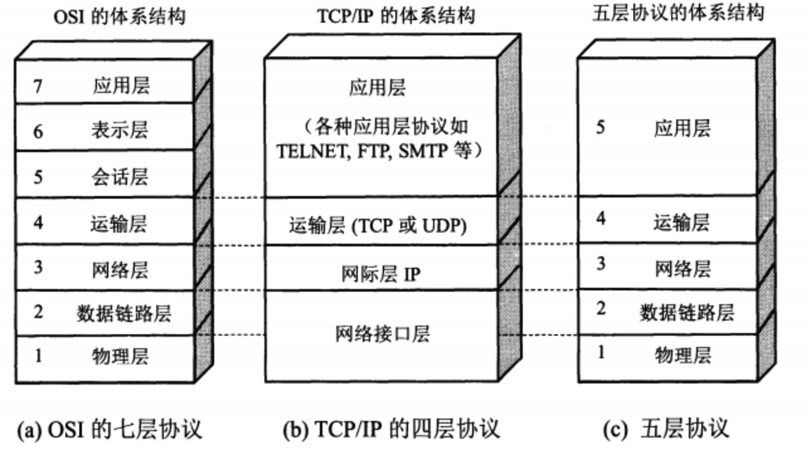

# OSI七层和TCPIP四层、五层协议

　　**OSI** （Open System Interconnect），开放式系统互联，它是一个国际标准化组织制定的一个用于计算机或通信系统间互联的标准体系。

　　OSI 七层协议是一种国际规范，将网络协议分成了 7 层，分别是：物理层、数据链路层、网络层、传输层、会话层、表示层、应用层。

　　TCP/IP 四层协议是围绕 TCP/IP 展开的一系列通信协议，是参考 OSI 七层协议进行的分层

　　TCP/IP 五层协议是为了方便学习计算机网络原理而采用的，综合了OSI七层模型和TCP/IP的四层模型而得到的五层模型  
OSI七层协议和 TCP/IP 四层、五层协议结构对应关系如下图所示：

​​

* 应用层

  * 作用：为操作系统或网络应用程序提供访问网络服务的接口
  * 协议：FTP、DNS、Telnet、SMTP、HTTP、WWW、NFS 等
  * 数据单元：APDU
* 表示层

  * 作用：提供格式化的表示和转换数据服务，数据的翻译、加密和压缩
  * 协议：JPEG、MPEG、ASII
  * 数据单元：PPDU
* 会话层

  * 作用：建立、管理和终止会话
  * 协议：NFS、SQL、NETBIOS、RPC
  * 数据单元：SPDU
* 传输层

  * 作用：提供端到端的可靠报文传递和错误恢复
  * 协议：TCP、UDP、SPX
  * 数据单元：段 Segment
* 网络层

  * 作用：负责数据包从源到宿的传递和网际互连
  * 协议：IP、ICMP、IGMP、ARP、RARP、OSPF、IPX、RIP、IGRP、 （路由器）
  * 数据单元：数据包 PackeT
* 数据链路层

  * 作用：将比特组装成帧和点到点的传递，作用包括：物理地址寻址、数据的成帧、流量控制、数据的检错、重发等
  * 协议：PPP、FR、HDLC、VLAN、MAC （网桥，交换机）
  * 数据单元：帧 Frame
* 物理层

  * 作用：通过媒介传输比特，确定机械及电气规范
  * 协议：RJ45、CLOCK、IEEE802.3 （中继器，集线器）
  * 数据单元：比特 Bit

　　‍
